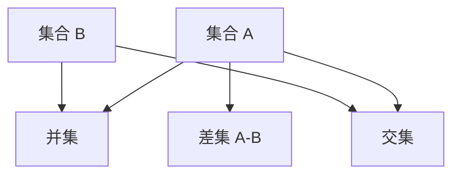
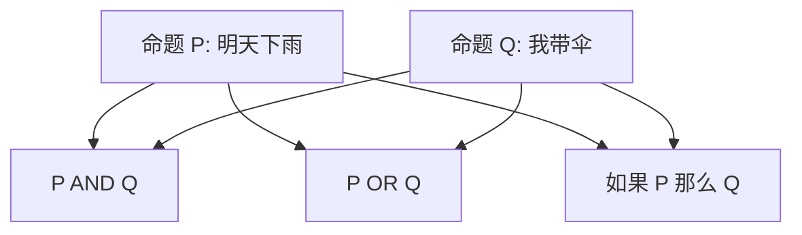
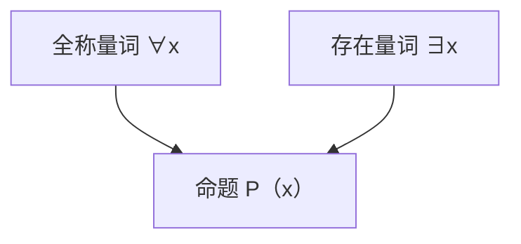

在正式进入机器学习与大模型的数学核心之前，我们需要先打好“语言”和“逻辑”的基础。
 这一章会从 **集合与逻辑** 入手，它们就像是编程中的语法规则：

- 集合告诉我们“对象属于不属于某个范围”；
- 逻辑告诉我们“命题对不对、能不能推出新的结论”。

这些看似抽象的概念，在 AI 里非常重要：神经网络的输入数据本质上就是集合的元素，训练过程中的条件判断与优化也依赖逻辑和推理。

------

## 0-1 集合与逻辑基础

### 集合运算

**集合是什么？**
 集合（Set）就是一堆对象的“容器”。

- 数学里：集合 $A = {1, 2, 3}$
- 生活里：水果篮子 = {苹果，香蕉，橘子}

集合的运算很直观：

1. **并集（Union）**：把两个篮子的水果合并，去重。
    $A \cup B$ = 属于 $A$ 或属于 $B$ 的元素。
2. **交集（Intersection）**：两个篮子里都有的水果。
    $A \cap B$ = 同时属于 $A$ 和 $B$ 的元素。
3. **差集（Difference）**：只在 $A$，不在 $B$。
    $A \setminus B$ = 属于 $A$ 但不属于 $B$ 的元素。

**图示说明**：上图表示集合 $A$ 与 $B$ 的三种常见运算：并集、交集和差集。

**在机器学习中的例子**：

- 训练数据集（Train）与测试数据集（Test）不能有交集，否则会导致“作弊式”高准确率。
- 语料库的去重就是在做集合运算（去掉重复的句子 = 差集）。

------

### 命题逻辑

**命题是什么？**
 命题（Proposition）就是一句 **有真假值** 的陈述。

- “明天会下雨” ✅ （要么真要么假）
- “你吃饭了吗？” ❌ （没有真假值，不是命题）

命题之间可以组合运算：

1. **否定（NOT）**：如果 $P$ 是“明天会下雨”，那 $\neg P$ 就是“明天不会下雨”。
2. **合取（AND）**：$P \land Q$ 表示“明天下雨 **并且** 我带伞”。
3. **析取（OR）**：$P \lor Q$ 表示“明天下雨 **或者** 我带伞”。
4. **蕴含（Implication）**：$P \Rightarrow Q$ 表示“如果明天下雨，那么我会带伞”。

**图示说明**：命题 $P$ 和 $Q$ 可以通过逻辑运算组合成新命题。

**在机器学习中的例子**：

- **决策树** 就是命题逻辑的“机械版”。例如：
  - 如果（身高 > 1.8m）并且（体重 > 80kg），那么分类为“篮球运动员”。
- **神经网络激活条件** 也可以看作逻辑的“模糊版”：ReLU 就像是“如果大于0则输出，否则为0”。

------

### 量词

**量词** 是在命题逻辑的基础上，表示范围的工具。常见的有：

1. **全称量词（∀，for all）**
   - “对于所有学生，都要考试”
   - 数学符号：$\forall x, ; P(x)$
   - 机器学习例子：$\forall$ 样本 $x$，我们都希望模型能预测正确。
2. **存在量词（∃，there exists）**
   - “有些人喜欢咖啡”
   - 数学符号：$\exists x, ; P(x)$
   - 机器学习例子：$\exists$ 一些超参数配置能让模型收敛。

**图示说明**：量词规定了命题作用的范围，全称量词要求“所有情况”，存在量词只要求“至少一个”。

**在机器学习中的例子**：

- 在验证模型时：
  - **全称量词**：理想情况是“∀ 测试样本，预测正确”。
  - **存在量词**：现实情况是“∃ 一些样本被错误分类”。

------

## 小结

- **集合**：帮助我们组织数据，避免数据泄露或混淆。
- **命题逻辑**：是条件判断和推理的基石，决策树、规则模型都离不开它。
- **量词**：为逻辑加上范围，用来表达“全部成立”还是“存在某些例外”。

**联系 AI 的意义**：
 集合与逻辑是机器学习数学的“语法”。理解这些，就能更自然地看懂模型定义（输入集合、输出集合）、损失函数约束（逻辑条件）、以及训练目标（全称 vs 存在）。