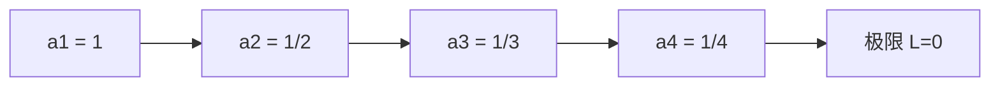
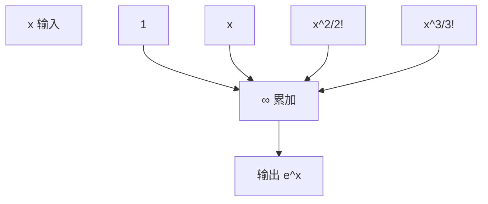

在前一节我们聊过集合与逻辑，它们像是数学的“语法规则”。
 这一节我们要进入“数列与级数”——这是数学中描述“无限”的重要工具。

为什么它们重要？

- 机器学习中的 **迭代优化算法**（比如梯度下降），其实就是在研究数列是否“收敛”。
- 神经网络里的 **激活函数展开**（如 $e^x$ 的泰勒展开），背后依赖幂级数。

------

## 0-2 数列与级数

### 1. 什么是数列？

数列就是一个 **有序的数的排列**。

- 数学符号：
   $a_1, a_2, a_3, \dots, a_n, \dots$

- 生活类比：
   就像每天的天气温度记录：第 1 天 30℃，第 2 天 29℃，第 3 天 28℃……这就是一个数列。

- Python 里：

  ```python
  a = [1, 1/2, 1/3, 1/4, 1/5]  # 1/n 数列
  ```

数列的关键问题：**当 $n \to \infty$ 时，它会不会趋近于某个固定的值？**
 如果有，那就是“收敛”；如果没有，那就是“发散”。

------

### 2. 收敛性

**定义**
 如果存在一个实数 $L$，使得随着 $n$ 的增大，$a_n$ 无限接近 $L$，
 那么称数列 ${a_n}$ 收敛于 $L$，记作：

$\lim_{n \to \infty} a_n = L$

**例子**

- $a_n = \frac{1}{n}$，随着 $n$ 越来越大，值越来越接近 0，因此收敛到 0。
- $a_n = (-1)^n$，序列是 $1, -1, 1, -1, \dots$，它没有固定极限，因此发散。



**图示说明**：数列 $1/n$ 的收敛过程，它逐渐靠近 0。

**在机器学习中的应用**：

- 梯度下降法的迭代点 $x_{k+1} = x_k - \eta \nabla f(x_k)$ 其实就是一个数列，目标是“收敛”到最优点。
- 如果学习率 $\eta$ 太大，数列可能“发散”，模型训练就会失败。

------

### 3. 级数

当我们把一个数列的所有项加起来，就得到了级数：

$S_n = a_1 + a_2 + a_3 + \dots + a_n$

如果部分和 $S_n$ 随着 $n \to \infty$ 收敛到某个数 $S$，
 那么称这个级数 **收敛**，极限 $S$ 称为它的和。

**例子**

- **调和级数**：
   $1 + \frac{1}{2} + \frac{1}{3} + \frac{1}{4} + \dots$
   它发散（越加越大）。
- **几何级数**：
   $1 + r + r^2 + r^3 + \dots = \frac{1}{1-r}, \quad (|r|<1)$
   这是机器学习里常见的收敛公式。

**类比**：

- 发工资：每个月都存 1000 元，这是“级数累加”的例子。
- 如果利息递减，就像几何级数；如果每次存的钱越来越少，就要判断能不能收敛到一个有限数额。

------

### 4. 幂级数

幂级数是形如：

$\sum_{n=0}^{\infty} c_n (x-a)^n$

它可以看作一个“无限次多项式”。

- $a$ 是展开点；
- $c_n$ 是系数；
- $x$ 是变量。

**例子**（Maclaurin 展开）：

- $e^x = 1 + \frac{x}{1!} + \frac{x^2}{2!} + \frac{x^3}{3!} + \dots$
- $\sin(x) = x - \frac{x^3}{3!} + \frac{x^5}{5!} - \dots$



**图示说明**：$e^x$ 的幂级数展开，就是不断把 $x^n / n!$ 加起来。

**在机器学习中的应用**：

- 激活函数（如 $\tanh(x)$、$\exp(x)$）在数值计算中常用幂级数展开来近似。
- Transformer 中的 **注意力机制** 里，softmax 需要计算 $e^x$，底层可能用幂级数近似加速。
- 在概率论中，生成函数和特征函数都与幂级数紧密相关，它们是研究分布的重要工具。

------

## 小结

- **数列**：是一串有序的数字，核心问题是“收敛还是发散”。
- **级数**：是数列的累加，也关心收敛性。
- **幂级数**：是把函数展开成无限次多项式，在数值计算和 AI 里很常见。

**联系 AI 的意义**：
 收敛性帮助我们理解 **优化算法的稳定性**；
 级数与幂级数帮助我们 **近似复杂函数**，这正是深度学习中各种激活函数、概率分布计算的基础。