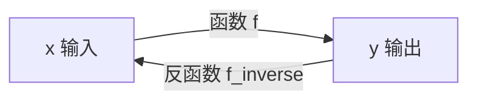

在数学和机器学习中，**函数**是最重要的概念之一。直观上，函数就像是一台“机器”，输入一个数，经过一系列规则加工，输出另一个数。比如你把苹果放进榨汁机，出来的是苹果汁——这就是“输入”和“输出”的关系。

在机器学习里，模型本质上就是一个复杂的函数：输入数据（图像、文本、音频），输出预测结果（分类、生成、翻译）。所以打好函数的基础，对理解 AI 模型至关重要。

------

### 1. 多项式函数

最常见的函数就是 **多项式函数**，形式为：

$f(x) = a_n x^n + a_{n-1} x^{n-1} + \dots + a_1 x + a_0$

比如：

- 一次函数：$f(x)=2x+3$（直线）
- 二次函数：$f(x)=x^2-4x+3$（抛物线）

**直观类比**：多项式函数就像是“配方”，把原料 $x$ 按照不同的比例（系数）和加工方式（幂次方）混合起来。

**在机器学习中**：线性回归模型就是最简单的一次多项式；更复杂的模型（比如神经网络）可以看作是多项式函数的组合。

------

### 2. 指数函数

指数函数的基本形式是：

$f(x) = a^x \quad (a>0, a \neq 1)$

- 当 $a > 1$ 时，函数呈 **指数增长**（比如病毒传播、互联网用户数增长）。
- 当 $0 时，函数呈 **指数衰减**（比如药物浓度随时间下降）。

**在机器学习中**：

- 学习率衰减常用指数函数。
- 概率分布（如 softmax 函数）中也有指数运算。

------

### 3. 对数函数

对数函数是指数函数的反函数：

$f(x) = \log_a(x) \quad (a>0, a \neq 1)$

含义：回答“某个数是底数 $a$ 的几次幂？”
 例如：$\log_2(8)=3$，因为 $2^3=8$。

**直观类比**：
 指数函数是“复利滚雪球”，对数函数是“问雪球有多大时，它是滚了几次”。

**在机器学习中**：

- 信息论中的 **信息熵**、交叉熵损失函数用到对数。
- 对数常用来缩放数据，解决数值过大问题。

------

### 4. 三角函数

三角函数与角度和周期现象相关，比如：

$\sin(x), \quad \cos(x), \quad \tan(x)$

它们的特点是 **周期性**，经常用来描述波动。

**直观类比**：海浪的起伏、四季的变化、电台的信号，都是周期性的，可以用三角函数建模。

**在机器学习中**：

- Transformer 的位置编码（Positional Encoding）就使用了正弦和余弦函数，帮助模型理解序列的顺序。

------

### 5. 反函数

一个函数如果可以“逆转过程”，就有 **反函数**。

比如：

- 指数函数 $y=2^x$ 的反函数是对数函数 $y=\log_2(x)$。
- 平方函数 $y=x^2$ 的反函数（在非负数范围内）是平方根函数 $y=\sqrt{x}$。

我们可以用一个 Mermaid 图来展示函数与反函数的关系：

**说明**：

- 函数 $f$ 把输入 $x$ 变成输出 $y$。
- 反函数 $f^{-1}$ 把 $y$ 再还原成 $x$。
- 两者是互逆的，就像“加法”和“减法”，“加密”和“解密”。

从几何角度来看，函数与反函数的图像是 **关于直线 $y=x$ 对称的**。

------

## 总结

- **多项式**：机器学习的基本模型（线性回归就是一次多项式）。
- **指数与对数**：描述增长与衰减，在概率和损失函数中常见。
- **三角函数**：处理周期性问题，比如 Transformer 的位置编码。
- **反函数**：理解“可逆映射”，帮助我们把“结果”还原成“输入”。

函数世界是整个数学和机器学习的基础。后续的微积分、线性代数、概率论，几乎都离不开函数的概念。