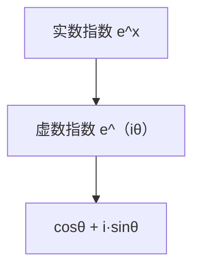

在学习机器学习和大模型之前，除了集合、逻辑、数列，我们还要认识一个“神秘的朋友”——**复数（Complex number）**。
 复数不仅仅是数学里的“虚数”，它还在信号处理、神经网络中的傅里叶变换、Transformer 里的注意力机制等地方频繁出现。

------

## 0-3 复数与指数形式

### 1. 什么是复数？

我们先从实数说起：

- 实数轴：包含整数、有理数、小数……
- 但是有些方程在实数范围解不出来，比如：
   $x^2 + 1 = 0$
   在实数里没有解。

这时数学家“发明”了一个新单位：

$i = \sqrt{-1}$

于是我们得到 **复数**：

$z = a + bi, \quad (a, b \in \mathbb{R})$

这里：

- $a$ 是实部（real part）；
- $b$ 是虚部（imag part）。

**生活类比**：

- 可以把复数想象成二维坐标：$(a, b)$。
- 实部是“东西方向”，虚部是“南北方向”。

在平面直角坐标系上，复数就是一个点。

------

### 2. 复数的几何表示

复数 $z = a + bi$ 可以在平面上画成一个点 $(a, b)$。
 如果把原点作为起点，这个点也可以看作一根向量。

我们可以用**极坐标**来描述它：

- 长度（模）：
   $r = |z| = \sqrt{a^2 + b^2}$
- 角度（辐角）：
   $\theta = \arctan\left(\frac{b}{a}\right)$

于是：
 $z = r(\cos \theta + i \sin \theta)$

这个表示方式就是 **复数的指数形式** 的基础。

------

### 3. 欧拉公式

欧拉公式是数学里最美的桥梁之一：

$e^{i\theta} = \cos \theta + i \sin \theta$

它把指数函数、三角函数、虚数联系到了一起。

**为什么成立？**
 回忆幂级数展开：

- 指数函数：
   $e^x = 1 + \frac{x}{1!} + \frac{x^2}{2!} + \frac{x^3}{3!} + \dots$

- 代入 $x = i\theta$：

$$
eiθ=1+iθ1!+(iθ)22!+(iθ)33!+…e^{i\theta} = 1 + \frac{i\theta}{1!} + \frac{(i\theta)^2}{2!} + \frac{(i\theta)^3}{3!} + \dots
$$

- 拆开：

  - 实部 = $\cos \theta$
  - 虚部 = $i\sin \theta$

于是得到：
 $e^{i\theta} = \cos \theta + i \sin \theta$ 

------

**图示说明**：欧拉公式展示了指数函数如何自然地延伸到复数域，把“旋转角度”与“指数增长”联系起来。

------

### 4. 复数的指数形式

利用欧拉公式，我们可以写：

$z = r e^{i\theta}$

这就是复数的指数形式。

它非常方便：

- 乘法：模相乘，角度相加
   $z_1 z_2 = r_1 r_2 e^{i(\theta_1+\theta_2)}$
- 幂运算：
   $z^n = r^n e^{i n \theta}$
   （这就是著名的 **棣莫弗公式**）

**直观理解**：
 复数相乘 ≈ 向量旋转并缩放。

------

### 5. 在机器学习中的应用

复数和欧拉公式并不是“纯理论”的，它们在 AI 里有不少影子：

1. **傅里叶变换**
   - 信号处理、语音识别、图像压缩，核心都是把信号分解成“正弦和余弦”的组合。
   - 这正是欧拉公式的威力：$e^{i\theta}$ 本质上就是旋转波。
2. **神经网络中的卷积**
   - 卷积定理表明：卷积在时域对应频域的乘法。
   - 而频域就是通过复数和欧拉公式得到的傅里叶空间。
3. **Transformer 与注意力机制**
   - 近年来有研究把注意力机制用傅里叶变换加速。
   - 背后同样离不开复数的指数形式。

------

## 小结

- **复数**：扩展了实数，形如 $a+bi$。
- **几何表示**：复数可以看作平面上的点或向量。
- **欧拉公式**：$e^{i\theta} = \cos \theta + i\sin \theta$，连接了指数和三角函数。
- **指数形式**：$z = re^{i\theta}$，让乘法与旋转结合，非常简洁。
- **AI 应用**：复数与傅里叶变换、卷积、注意力机制紧密相关，是大模型背后的数学基石之一。

