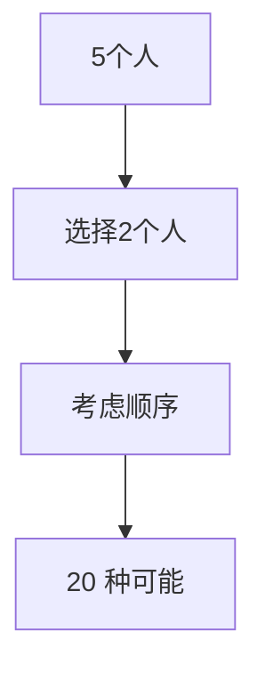
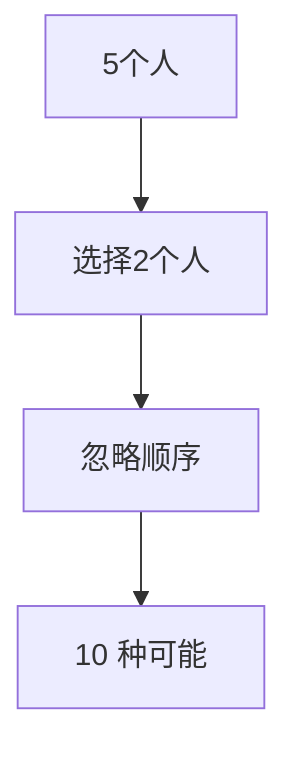
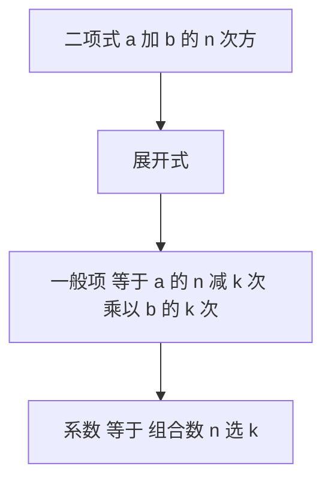

机器学习和大模型开发中，很多算法都和“可能性”相关：

- 一个模型有多少种参数配置？
- 一个输入可以有多少种不同的表示？
- 一个训练样本可以被多少种方式组合成批次？

这些问题背后的数学工具就是 **组合数学**。它回答的问题是：**“从一堆元素里选或排，能有多少种可能？”**

------

### 1. 排列（Permutation）

#### 生活类比

想象一下你有 **3 个水果：苹果、香蕉、橙子**，要把它们排成一排。
 可能的顺序有多少种？

- 苹果-香蕉-橙子
- 苹果-橙子-香蕉
- ……

每一种不同的排法就是一个 **排列**。

#### 数学定义

如果有 $n$ 个不同元素，从中选出 $r$ 个排成一列，记作：

$P(n, r) = \frac{n!}{(n-r)!}$

其中 $n!$ 表示阶乘，$n! = n \times (n-1) \times \cdots \times 1$。

- **全排列**（全部元素都排）：$P(n,n) = n!$
- **部分排列**（只取一部分来排）：$P(n,r)$

#### 小例子

- 全排列：3 个水果 → $3! = 6$ 种排法
- 部分排列：从 5 个人里选 2 个排成一队 → $P(5,2) = \frac{5!}{(5-2)!} = 20$ 种

说明：先选人，再考虑顺序，总数就是排列数。

#### 在机器学习中的应用

- **超参数搜索**：调参时，学习率、激活函数、优化器等的排列组合，决定了多少种实验可能性。
- **序列建模**：自然语言处理里，句子的单词顺序不同，意义也不同，这其实就是排列的重要性。

------

### 2. 组合（Combination）

#### 生活类比

假设你要从 **5 个水果里挑 2 个做水果沙拉**，不关心顺序，只关心挑了哪些水果。
 比如：苹果+香蕉 和 香蕉+苹果 是同一种结果。
 这就是 **组合**。

#### 数学定义

如果有 $n$ 个元素，从中选 $r$ 个，**不考虑顺序**，记作：

$C(n, r) = \binom{n}{r} = \frac{n!}{r!(n-r)!}$

#### 小例子

- 从 5 个人里选 2 个 → $\binom{5}{2} = 10$ 种组合

说明：和排列不同，组合不关心顺序。

#### 在机器学习中的应用

- **特征选择**：从大量特征中选出子集训练模型，就是一个组合问题。
- **集成学习**：从多个基学习器中选择不同的组合，形成随机森林或 Bagging 模型。
- **数据采样**：从大数据集中选出小批次（batch）训练，也涉及组合。

------

### 3. 二项式定理（Binomial Theorem）

#### 生活类比

假设你有一个“魔法果篮”，每次抓水果时：

- 可能抓到苹果（记作 $a$）
- 可能抓到香蕉（记作 $b$）

如果你抓 **2 次**，可能结果是：

- $a^2$ （两次都苹果）
- $ab$ （第一次苹果，第二次香蕉）
- $ba$ （第一次香蕉，第二次苹果）
- $b^2$ （两次都香蕉）

这正是二项展开式的由来。

#### 数学形式

二项式定理告诉我们：

$(a+b)^n = \sum_{k=0}^{n} \binom{n}{k} a^{n-k} b^k$

也就是说，展开后每一项的系数就是组合数。

#### 小例子

$(a+b)^3 = a^3 + 3a^2b + 3ab^2 + b^3$

其中系数 $1, 3, 3, 1$ 来自 $\binom{3}{0}, \binom{3}{1}, \binom{3}{2}, \binom{3}{3}$。

#### 在机器学习中的应用

- **概率论基础**：二项分布（抛硬币的次数和结果）就来自二项式定理。
- **模型预测不确定性**：比如在集成模型里，每个模型像一次“投票”，最终结果概率由二项式分布刻画。
- **梯度推导**：很多损失函数的展开与简化，都涉及二项式展开。

说明：二项式展开本质上就是“在 n 次实验里，选出 k 次成功的组合数”。

------

### 4. 小结

- **排列**：关心顺序，多少种排法。
- **组合**：不关心顺序，多少种选法。
- **二项式定理**：展开式与组合数直接相关，是概率论的重要基础。

在机器学习和大模型开发中：

- 排列 → 输入序列的顺序敏感性（比如 Transformer 里的位置编码）
- 组合 → 特征选择、模型集成
- 二项式定理 → 概率分布与模型不确定性建模

学会这些“数学的可能性”，你会更容易理解机器学习中各种“为什么有这么多种情况”的问题。