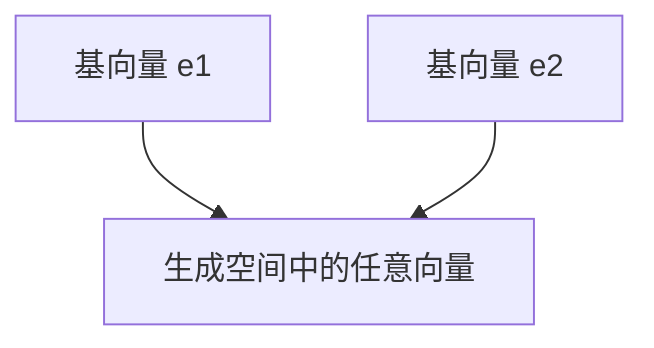
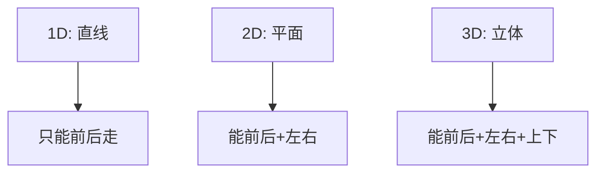

在进入机器学习和大模型的数学世界之前，我们需要先搞懂一个最核心的概念：**向量（Vector）**。

如果说标量（Scalar）像是一维的“数字”，那么向量就像是能在空间里指方向、定位置的“箭头”。

你可以把向量想象成：

- **生活类比**：在地图上走路时，“往东走 3 步，再往北走 4 步”，这个“方向+大小”的信息就是一个向量。
- **机器学习类比**：在训练神经网络时，一次梯度更新其实就是“在参数空间里往某个方向挪动一步”，这个方向就是一个向量。

------

### 1. 线性组合（Linear Combination）

**概念**
 所谓线性组合，就是“用一堆向量加权相加，得到一个新的向量”。

公式形式：

$\mathbf{v} = a_1 \mathbf{u}_1 + a_2 \mathbf{u}_2 + \cdots + a_n \mathbf{u}_n$

这里：

- $\mathbf{u}_1, \mathbf{u}_2, \dots, \mathbf{u}_n$ 是一组已知向量；
- $a_1, a_2, \dots, a_n$ 是实数系数（像调料的分量）；
- $\mathbf{v}$ 是通过它们“混合”出来的新向量。

**生活类比**
 就像调饮料时，你有「可乐、雪碧、果汁」三种基底（向量），通过不同的比例（系数）混合，可以调出各种新饮品（新向量）。

**在机器学习中的作用**

- 在 **词向量（Word Embedding）** 里，我们可以通过“king - man + woman ≈ queen”这样的运算，本质就是在做向量的线性组合。
- 在 **神经网络** 中，每一层的输入 $\mathbf{x}$ 和权重矩阵 $W$ 的乘积，其实就是一堆线性组合的结果。

------

### 2. 基（Basis）

**概念**
 基（Basis）是能“生成整个空间”的一组最小向量。

- 在二维平面上，只要有两个不在一条直线上的向量（比如 $(1,0)$ 和 $(0,1)$），它们就能通过线性组合生成平面上的任意点。
- 在三维空间里，只要有三个不在同一平面上的向量，就能“撑起”整个三维空间。

**生活类比**
 想象你有三种原色：红、绿、蓝（RGB）。通过不同的配比，你可以调出任意颜色。同样，基向量就是生成整个空间的“原料”。

**机器学习中的作用**

- 在 **特征工程** 中，选择一组合适的基，就相当于选择了数据的表示方式。比如 PCA（主成分分析）其实就是找一组新的“基”，让数据分布更容易理解。
- 在 **大模型开发** 中，词向量空间往往选择一个固定的维度（比如 768 维），每个维度可以理解为“一个基”，所有单词都能在这个空间里被表示。

**图示说明**：二维平面的两个基向量 $\mathbf{e}_1, \mathbf{e}_2$ 可以组合生成平面上的任意点。

------

### 3. 维数（Dimension）

**概念**
 维数就是空间里“独立方向的数量”。

- 一条直线：1 维（只能前后走）
- 一个平面：2 维（能前后 + 左右走）
- 一个立体空间：3 维（前后 + 左右 + 上下走）

如果你有 $n$ 个线性无关的基向量，就说这是一个 **n 维空间**。

**生活类比**
 维数就像“自由度”。

- 在地铁里，你只能沿着轨道走，这是 1 维。
- 在城市街道里，你能走南北或东西，这是 2 维。
- 在现实世界中，你还可以爬楼梯，这是 3 维。

**机器学习中的作用**

- 在 **词向量空间** 里，一个单词的向量可能有 300 或 768 个维度，每个维度就像一个“语义方向”。
- 在 **图像表示** 中，一张 28×28 的灰度图其实就在 784 维空间里（每个像素就是一个维度）。
- 在 **大模型开发** 中，选择合适的维度大小，直接决定了模型的容量和计算量。

**图示说明**：维数决定了我们能在空间里自由运动的方向数量。

------

## 小结

- **线性组合**：通过加权组合生成新向量。
- **基**：生成整个空间的“最小原料”。
- **维数**：空间里独立方向的数量。

这些概念看似抽象，但在机器学习和大模型里无处不在：

- 模型的参数更新，本质是向量空间里的移动。
- 特征提取，本质是选择合适的基和维度。
- 高维表示（embedding），让抽象的语义、图像都能映射到数学世界里。