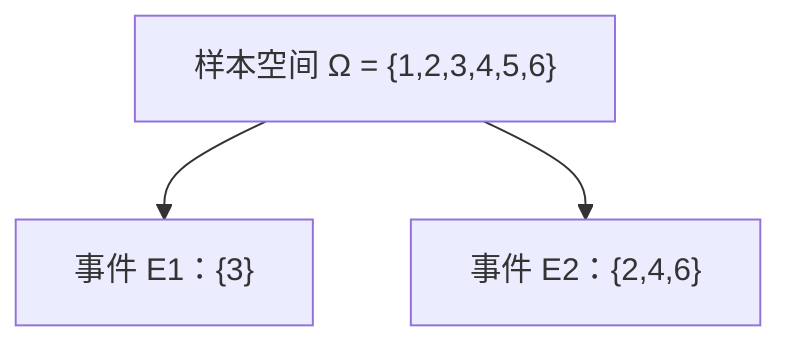
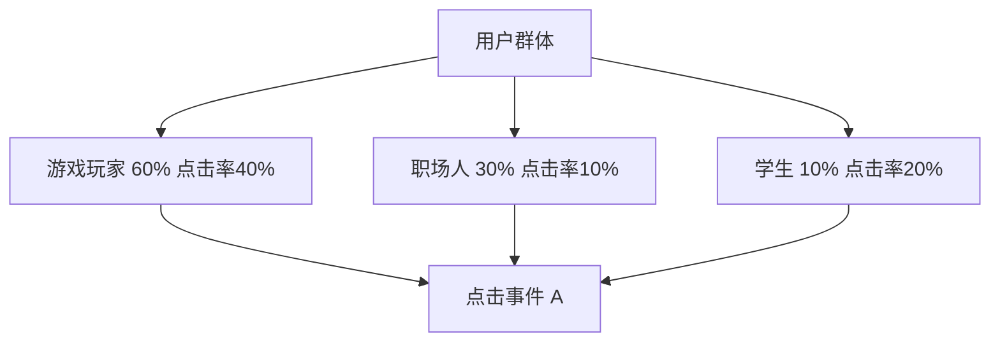

机器学习的本质是“在不确定性中做出最优决策”。而概率论，就是处理不确定性的数学语言。很多 AI 模型（比如贝叶斯分类器、生成式模型、甚至深度学习的 dropout 技术）都离不开概率。

这一小节，我们会从最基础的概率概念开始，逐步理解条件概率、全概率公式和独立性，并联系到机器学习的实际场景。

------

### 1. 事件（Event）

#### 日常类比

可以把“事件”想象成一个可能发生的结果：

- 掷骰子得到“3” —— 这是一个事件。
- 明天下雨 —— 这是一个事件。
- 用户点击广告 —— 也是一个事件。

**事件的集合**（也叫样本空间，记作 Ω）就像“所有可能发生的结果的清单”。
 比如掷一个骰子：

$Ω = \{1, 2, 3, 4, 5, 6\}$

事件可以是单个结果（如 {3}），也可以是多个结果（如 {2,4,6} 表示“掷出偶数”）。

 图示说明：上图表示“事件”是样本空间 Ω 的子集。

------

### 2. 条件概率（Conditional Probability）

#### 动机

有时候我们需要在**额外信息已知**的情况下，重新评估一个事件发生的可能性。

例子：

- 在所有用户中，10% 点击广告。
- 但如果用户来自“游戏论坛”，点击率提高到 40%。

这里“来自游戏论坛”就是条件。

#### 定义公式

设事件 A、B 在样本空间 Ω 中，且 P(B) > 0，那么

$P(A|B) = \frac{P(A \cap B)}{P(B)}$

意思是：“在 B 已经发生的前提下，A 发生的概率”。

#### 类比

好比在一个水果篮子里：

- 总共有 10 个水果，其中 4 个苹果，6 个橙子。
- 如果你 **随便拿一个水果**，抽中苹果的概率是 0.4。
- 但如果我告诉你“你只能从左边的 5 个水果里选”，而左边刚好有 3 个苹果、2 个橙子。
- 那么“条件概率”就变成 3/5 = 0.6。

条件概率就是在缩小范围后，重新计算的概率。

------

### 3. 全概率公式（Law of Total Probability）

#### 场景

很多时候，一个事件的发生可以来自多个“路径”。比如：

- 用户点击广告（事件 A），可能取决于他属于不同的“人群类别”（事件 B1: 游戏玩家，B2: 职场人，B3: 学生）。

那么：

$P(A) = \sum_i P(A|B_i) \cdot P(B_i)$

这里的 {B1, B2, …, Bn} 是一组互不重叠、覆盖全部情况的“划分”。

#### 例子

假设：

- 60% 用户是游戏玩家，点击率 40%。
- 30% 用户是职场人，点击率 10%。
- 10% 用户是学生，点击率 20%。

那么用户整体点击率就是：

$P(\text{点击}) = 0.6 \times 0.4 + 0.3 \times 0.1 + 0.1 \times 0.2 = 0.29$

图示说明：点击事件的总体概率，是各类人群“路径”的加权和。

------

### 4. 独立性直觉（Independence）

#### 定义

两个事件 A 和 B 如果满足：

$P(A \cap B) = P(A) \cdot P(B)$

则称 A 与 B **相互独立**。

#### 直观理解

独立性意味着：

- 事件 A 的发生 **不会影响** 事件 B 的概率。

例子：

- 掷骰子和抛硬币是独立的。
- 明天下雨和“我今天吃不吃汉堡”大体上是独立的。
- 但“是否下雨”和“路上是否打伞”显然不是独立事件。

#### 机器学习联系

在 **朴素贝叶斯分类器** 中，就假设输入特征之间相互独立：

$P(x_1, x_2, ..., x_n | y) \approx \prod_{i=1}^n P(x_i | y)$

虽然这个假设在现实中并不完全成立，但计算量极大简化，效果在很多应用中依然不错（比如垃圾邮件分类）。

------

### 小结

- **事件**是样本空间的子集，是概率的基本对象。
- **条件概率**让我们在已知部分信息的情况下，更新概率。
- **全概率公式**用于处理“分情况计算”的概率。
- **独立性**刻画了事件之间是否互相影响，在机器学习中有重要应用。