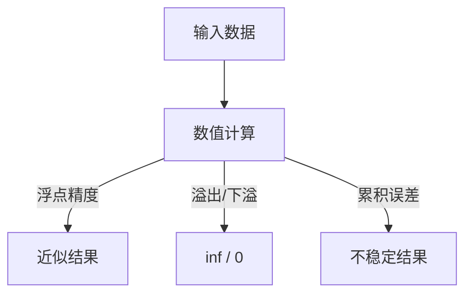

前几节我们复习了集合、逻辑、数列、复数，这些是**数学语言**。
 但当我们真正写代码跑模型时，还需要掌握**数值计算的“底层规则”**。

这一节我们来聊三个非常关键但常被忽视的点：

- **浮点数精度**
- **溢出**
- **数值稳定性**

它们看似是编程细节，其实直接影响到模型训练的效果，甚至可能导致“损失函数 NaN”的惨剧。

------

## 0-4 编程与数值计算基础

### 1. 浮点数精度

在计算机里，数字并不是连续的，而是有限的二进制表示。
 这就带来一个问题：**很多小数没法被精确表示**。

**例子**

```python
print(0.1 + 0.2)  # 输出？
```

结果不是 0.3，而是：

```
0.30000000000000004
```

为什么？
 因为二进制小数不能精确表示 0.1 和 0.2，它们只能存储为近似值。

**生活类比**：
 就像你用“分米”为单位来丈量房间，有些长度（比如 2.75 米）就量不准，只能近似到 2.8 米。

------

**在机器学习中的影响**：

- **参数更新**：当学习率非常小（如 $1e^{-9}$），更新值可能因为精度问题被“吞掉”，参数不变。
- **比较大小**：判断两个浮点数是否相等时要小心，推荐用 `math.isclose()` 或设置一个容差。

------

### 2. 溢出（Overflow / Underflow）

**溢出（overflow）**：数太大，超过计算机能表示的范围。

- 例如：`math.exp(1000)` → 会得到 `inf`（无穷大）。

**下溢（underflow）**：数太小，被当作 0。

- 例如：`math.exp(-1000)` → 会得到 `0.0`。

```python
import math
print(math.exp(1000))   # inf
print(math.exp(-1000))  # 0.0
```

**生活类比**：

- 溢出像是往一个 500ml 杯子里倒 1000ml 水 → 溢出来了。
- 下溢像是往杯子里倒一滴水 → 看起来就像没水。

------

**在机器学习中的影响**：

- **softmax 函数**：
   $\text{softmax}(x_i) = \frac{e^{x_i}}{\sum_j e^{x_j}}$
   如果 $x_i$ 特别大，$e^{x_i}$ 会溢出成 `inf`，导致结果变成 `NaN`。

**常见解决方案**：

- 在 softmax 前减去最大值：

  ```python
  x = x - np.max(x)
  exp_x = np.exp(x)
  softmax = exp_x / np.sum(exp_x)
  ```

  这样避免指数爆炸。

------

### 3. 数值稳定性

数值稳定性（Numerical Stability）指的是：**计算过程中是否会因为精度误差或溢出而导致结果不可靠**。

**典型问题**：

- **大数相减（灾难性消除）**
  - 例如：$(10^6 + 0.001) - 10^6 = 0.001$
  - 但在计算机里，由于 $10^6$ 太大，0.001 可能被“忽略”，导致结果变成 0。
- **累加误差**
  - 例如对一个大数组求和：先加小数再加大数 vs 先加大数再加小数，结果可能不同。
  - 这就是浮点数的加法不满足严格结合律：$(a+b)+c \neq a+(b+c)$。



**图示说明**：数值计算中可能产生多种不稳定情况，最终影响结果。

------

**在机器学习中的解决方法**：

1. **对数技巧（log-trick）**
   - 在计算概率时，经常用 log 形式：
      $\log(a \cdot b) = \log a + \log b$
   - 避免了直接相乘导致的 underflow。
2. **正规化**
   - 在 softmax、batch normalization 中，通过缩放数据，避免极端值。
3. **高精度计算**
   - 有些框架支持 `float64` 或混合精度训练（mixed precision），在效率和稳定性之间取平衡。

------

## 小结

- **浮点数精度**：计算机只能存近似小数，可能导致 $0.1+0.2 \neq 0.3$。
- **溢出/下溢**：数太大变成无穷大，数太小变成 0。
- **数值稳定性**：累积误差、灾难性消除会让计算结果不可靠。

**联系 AI 的意义**：

- 在深度学习中，训练失败的常见原因就是“数值不稳定”，比如梯度爆炸、loss 变 NaN。
- 掌握这些基础，能帮助我们写出更健壮的训练代码。