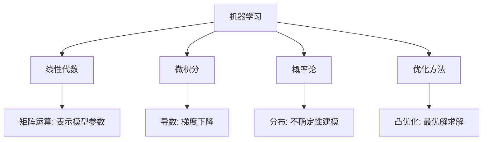

在很多同学心里，数学往往是冰冷的公式与推导。但是在机器学习与大模型开发中，数学并不是孤立存在的，而是**理解模型原理、优化算法性能、解释结果可靠性**的钥匙。

- 如果把 **机器学习模型** 看作是一辆赛车，那么：
  - **数据** 就是燃料；
  - **代码** 就是引擎；
  - **数学** 就是设计原理图，让我们知道为什么这辆车能跑得快、怎么改进它的加速和操控。

换句话说，你可以用现成的深度学习框架“跑起来”，但只有掌握背后的数学，你才真正能“造车”和“调车”。

------

### 数学在机器学习中的三大作用

1. **概念抽象：帮助我们精确描述问题**
   - 例子：集合论让我们描述数据的范围（样本空间），概率论让我们刻画不确定性。
   - 类比：数学就像“法律条文”，帮助我们用清晰的语言界定规则。
2. **公式推导：帮助我们找到高效的解法**
   - 例子：梯度下降算法的核心就是**导数**，它告诉我们函数在某个点的“下降方向”。
   - 类比：走山路下山，导数就像手电筒，照亮“哪边更陡峭”——于是我们顺着坡度最快下山。
3. **模型解释：帮助我们理解和改进模型**
   - 例子：线性代数的特征值分解，解释了为什么 PCA（主成分分析）能找到数据的主方向。
   - 类比：把一堆水果摆在桌子上，PCA 就像告诉你“水果在桌子上的摆放方向中，哪一个方向最能区分它们的差别”。

------

### 机器学习和数学的对应关系

我们可以简单梳理一下 **机器学习常见任务** 与 **所需数学工具** 的关系：

**图示说明**：

- **线性代数** 是机器学习的语言（参数存放在向量/矩阵里）。
- **微积分** 提供变化和最优解的工具（导数 → 梯度下降）。
- **概率论** 让我们能在不确定性中做出决策。
- **优化方法** 则是算法的“心脏”，驱动模型学习到最优解。

------

### 为什么本章从“微分”开始？

在数学的整个知识体系中，**微积分是理解机器学习的第一块基石**。

- **单变量微分**：告诉我们如何度量“变化率”。
  - 在机器学习中，这就是**损失函数对参数的敏感度**。
- **多变量微分**（后续章节）：进一步扩展到多个参数的情况，这直接对应了**神经网络的梯度计算**。
- **积分**：与微分相对，它用于累积和面积计算，在概率分布与期望值的计算中有重要作用。

换句话说，**如果你想理解梯度下降、反向传播、概率密度函数**，就必须掌握微积分。

------

### 一个小例子：梯度下降的直观感受

假设我们在训练一个模型，损失函数 $L(\theta)$ 表示参数 $\theta$ 的好坏。我们要找到能让损失最小的 $\theta$。

- 如果不用微积分，我们只能“盲猜”参数。

- 有了导数，我们能知道：

  $$
  \theta_{t+1} = \theta_t - \eta \cdot \frac{dL}{d\theta}
  $$
  
  这里 $\eta$ 是学习率，$\frac{dL}{d\theta}$ 就是导数（梯度）。

类比现实生活：

- 想象你站在一座大山上，要走到山谷最低点。
- 如果你不知道坡度，你只能乱走；
- 如果你能感受到坡度（导数），你就能一直往最陡的方向走，快速下山。

这就是 **梯度下降** 的核心思想。

------

### 本章小结

- 数学不是“额外的负担”，而是机器学习的底层逻辑。
- 本书从 **微分** 开始，是因为它直接对应了模型训练中的**参数优化**。
- 学会用数学语言描述问题后，我们才能真正理解“为什么模型能学会”，而不仅仅是“怎么用模型”。
