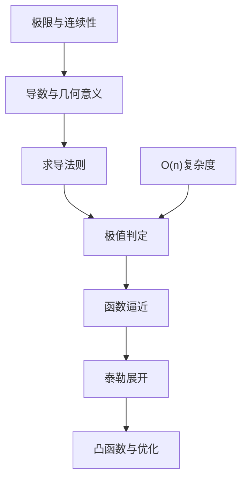

这一章我们系统地复习了 **单变量微积分** 的基本内容，并将它们和 **机器学习中的应用** 联系起来。总结一下关键知识点：

1. **数学与机器学习的联系（1-1）**
   - 数学不是“象牙塔”里的抽象符号，而是机器学习算法的底层语言。
   - 比如梯度下降、损失函数优化，都离不开微积分。
2. **时间复杂度与 O(n) 表示（1-2）**
   - 我们用 **大 O 符号**来衡量算法的运行效率。
   - 在机器学习里，比如计算一个矩阵乘法是 $O(n^3)$，这直接决定了大模型训练是否可行。
3. **极限与连续性（1-3）**
   - 极限描述“无限接近”的思想，连续性保证了函数没有“断点”。
   - 在深度学习中，激活函数是否连续直接影响网络的可训练性（例如 ReLU 的连续但不可导点）。
4. **导数与几何意义（1-4）**
   - 导数代表变化率，几何上是切线斜率。
   - 在梯度下降中，导数告诉我们“模型参数该往哪个方向走”。
5. **常用求导法（1-5）**
   - 积、商、链式法则，隐函数和分部求导。
   - 在深度神经网络的 **反向传播（backpropagation）** 中，链式法则是核心。
6. **费马定理与极值（1-6）**
   - 如果函数在某点取极值，那么导数为 0。
   - 这就是为什么我们在训练模型时要找到“梯度为 0”的点。
7. **函数逼近（1-7）**
   - 用简单函数去近似复杂函数。
   - 深度学习的本质之一就是“复杂函数逼近”，比如神经网络近似任意连续函数（万能逼近定理）。
8. **泰勒展开与高阶近似（1-8）**
   - 任何光滑函数在某点都可以展开成一个多项式近似。
   - 在优化算法里，我们常用二阶泰勒展开来构造 **牛顿法**。
9. **凸函数与凸优化（1-9）**
   - 凸函数有唯一全局最小值，优化问题更容易求解。
   - 在机器学习中，逻辑回归和支持向量机都是凸优化问题。

------

## 知识脉络图

图示说明：
 这张图展示了本章知识的逻辑关系：从 **极限** 到 **导数**，再到 **优化与凸函数**，形成了一个完整的学习链条。同时，**时间复杂度**（O(n)）为理解实际算法效率提供了补充视角。

------

## 习题

下面设计一些小练习，帮助巩固：

### 基础题

1. （计算）求函数 $f(x)=3x^2+2x+1$ 的导数。
2. （判断）函数 $f(x)=|x|$ 在 $x=0$ 处是否可导？为什么？
3. （应用）如果某算法的运行时间是 $T(n) = 5n^2+3n+2$，它的时间复杂度是多少？

### 提高题

1. （思考）为什么在训练神经网络时，ReLU 激活函数虽然在 0 点不可导，但仍然被广泛使用？
2. （计算）利用泰勒展开，近似计算 $\sin(x)$ 在 $x=0$ 附近的多项式表达式（取到三阶项）。
3. （应用）为什么凸优化问题比非凸优化问题更容易求解？请结合机器学习中的例子说明。

------

## 参考答案

1. $f'(x) = 6x+2$
2. 不可导，因为左右导数不相等。
   - 左导数：$-1$，右导数：$1$。
3. 时间复杂度是 **$O(n^2)$**，因为最高阶项是 $n^2$。
4. ReLU 在 0 点不可导，但在深度学习中：
   - 不可导点是“极少数”的，几乎不影响梯度下降。
   - ReLU 的稀疏性和高效性让它表现优异。
5. $\sin(x) \approx x - \frac{x^3}{6}$ （在 $x=0$ 附近）。
6. 凸优化问题只有一个全局最优解，不会陷入局部最优。
   - 例子：逻辑回归的损失函数是凸的，因此用梯度下降一定能收敛到全局最优解。
