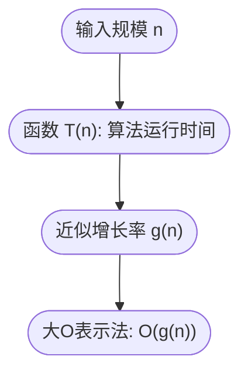

在机器学习和大模型开发中，很多时候我们会写出一个训练算法或者推理过程。代码能运行是第一步，但更重要的问题是：

- 这个算法在小数据集上跑得很快，但在 **百万级、甚至上亿数据** 时还能行吗？
- 一个 Transformer 模型在一块 GPU 上能训练，但换成 1000 块 GPU 时，能否高效并行？

这些问题的答案，往往隐藏在一个核心概念里——**算法复杂度（Complexity）**。

复杂度不是用来吓唬人的公式，而是告诉我们：**随着输入规模变大，程序的执行时间和资源消耗会怎么变化**。

------

### O(n) 表示法的由来

我们常见的时间复杂度有：

- $O(1)$：常数时间，不随输入规模变化（比如直接读取数组某一项）。
- $O(n)$：线性时间，随输入规模成比例增长（比如遍历数组）。
- $O(n^2)$：平方时间，典型的双层循环（比如朴素矩阵乘法）。
- $O(\log n)$：对数时间（比如二分查找）。
- $O(n \log n)$：常见于排序算法。

数学上，**O 表示法（大 O 记号）**描述了函数在输入规模趋近无穷大时的增长趋势。
 形式定义是：如果存在常数 $C > 0$，以及 $n_0 > 0$，当 $n > n_0$ 时，有

$f(n) \leq C \cdot g(n),$

那么我们就记作：

$f(n) = O(g(n)).$

这里：

- $f(n)$ 是算法的实际运行时间；
- $g(n)$ 是一个更简单的“上界函数”；
- $O(g(n))$ 表示“f 的增长速度不会超过 g 太多”。

------

### 一个生活类比：排队买奶茶

- 如果店里有 1 个窗口，每来一个顾客就要单独服务，那时间复杂度就是 $O(n)$。
- 如果店里同时开了 n 个窗口（大家都能同时买），那时间复杂度接近 $O(1)$。
- 如果店员每服务一个顾客都要先“和上一个顾客做双重确认”，那复杂度可能变成 $O(n^2)$。

复杂度的意义就是：**当顾客越来越多（数据规模越来越大）时，等待时间会怎么增长**。

------

### 复杂度与函数增长的联系

在本章的主题“微分”里，函数的增长率是一个核心。复杂度分析其实就是在问：

- 输入规模 $n$ 增大时，算法运行时间 $T(n)$ 的增长速度是多少？
- 我们是否可以找到一个简单的函数 $g(n)$ 来近似刻画 $T(n)$ 的增长？

**图示说明**：输入规模 $n$ 决定运行时间 $T(n)$，而大 O 表示法就是用一个更简单的函数 $g(n)$ 来描述它的“增长速度”。

------

### 机器学习中的复杂度案例

1. **线性回归**
   - 训练时需要计算矩阵乘法（维度 $n \times d$，其中 $n$ 是样本数，$d$ 是特征数）。
   - 矩阵乘法的复杂度约为 $O(nd^2)$ 或 $O(d^3)$（取决于实现）。
   - 当数据量非常大时，优化矩阵运算库（BLAS、CUDA）就变得至关重要。
2. **神经网络前向传播**
   - 单层神经网络计算：输入向量长 $d$，权重矩阵大小 $d \times h$，输出维度 $h$。
   - 时间复杂度约为 $O(dh)$。
   - 如果层数是 $L$，那么总复杂度是 $O(Ldh)$。
3. **Transformer 注意力机制**
   - 经典自注意力（Self-Attention）要计算所有序列位置的两两相似度。
   - 序列长度为 $n$ 时，复杂度为 $O(n^2)$。
   - 这也是为什么 **长文本处理** 成为大模型的重要挑战。很多论文都在研究如何把 $O(n^2)$ 降到 $O(n \log n)$ 或更低。

------

### 技术延伸：为什么微积分和 O(n) 有关系？

- 微积分研究的是**函数的变化趋势**；
- O(n) 表示法研究的是**函数的增长趋势**。

在算法复杂度里，我们常常会用到极限的思想：

$\lim_{n \to \infty} \frac{f(n)}{g(n)}$

如果这个极限是有限值，那么我们说 $f(n) = O(g(n))$。
 所以，**复杂度分析其实就是在用极限比较函数的增长率**。

这也说明：即使 O(n) 表示法看似是“算法”的概念，但它的数学根基依然来自**微积分**。

------

### 本节小结

- **大 O 表示法** 用来描述算法在输入规模很大时的增长趋势。
- 它和微积分的联系在于：都关注“函数在无穷大时的增长速度”。
- 在机器学习和大模型中：
  - 线性回归矩阵运算 → $O(nd^2)$
  - 神经网络前向传播 → $O(Ldh)$
  - Transformer 自注意力 → $O(n^2)$
- 理解复杂度，能帮助我们从“代码能跑”提升到“代码能高效跑”。
