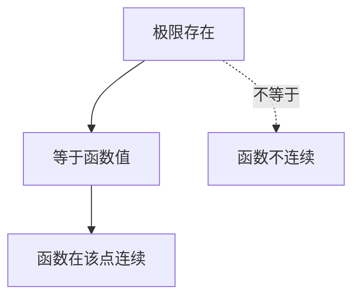

在数学史上，牛顿和莱布尼茨在研究“变化率”时，发现一个问题：如果直接用“瞬时变化”来定义速度，公式会出问题。于是，他们引入了 **极限（limit）** 的思想。

在机器学习中，我们也经常遇到类似的问题：

- 梯度下降法里，要计算某一点的“斜率”，其实就是在算一个极限。
- 神经网络的损失函数必须是“连续”的，否则优化会卡住。
- 在概率分布中，积分和期望的定义本质上也依赖于极限。

换句话说，**极限是所有连续变化的起点**。

------

### 极限的直观理解

我们先来看一个生活类比：

- 你走向一扇自动门，距离越来越小。
- 当你无限接近门口时，你和门之间的距离“趋近于 0”。

这就是极限思想：不一定真的等于某个值，而是**无限接近**某个值。

数学上，如果函数 $f(x)$ 在 $x$ 趋近于某个点 $a$ 时，也越来越接近某个数 $L$，那么就记作：

$\lim_{x \to a} f(x) = L$

比如：

$\lim_{x \to 0} \frac{\sin x}{x} = 1$

------

### 极限与函数连续性

极限思想直接引出了函数的“连续性”。

直观理解：

- 如果你在画一条曲线，中间**不用抬笔**，那么这个函数就是连续的。
- 如果需要“跳跃”或者“断开”，那就是不连续。

形式化地说：
 函数 $f(x)$ 在点 $a$ 处连续，当且仅当：

$\lim_{x \to a} f(x) = f(a)$

------

### Mermaid 图示：函数连续与不连续

**说明**：

- 如果极限存在，且等于函数值，则函数连续。
- 如果极限不存在，或存在但不等于函数值，则函数不连续。

------

### 机器学习中的“连续性”为什么重要？

1. **损失函数的连续性**

   - 在训练中，我们最关心的是损失函数（Loss Function）。
   - 如果损失函数是连续的，那么模型参数的微小变化，只会带来损失的微小变化，这样优化才“平滑可控”。
   - 如果损失函数不连续，那么优化会“卡壳”，梯度下降也无从谈起。

   例子：

   - **均方误差（MSE）** 是连续的 → 很适合梯度下降。
   - **0-1 损失函数**（预测错了记 1，否则 0）是不连续的 → 无法直接用梯度优化。
   - 这也是为什么深度学习里常用“交叉熵损失”替代“0-1 损失”。

2. **激活函数的连续性**

   - Sigmoid、Tanh、ReLU 等激活函数，之所以能被广泛使用，关键是它们连续（甚至分段连续）。
   - 如果激活函数不连续，神经网络的输出会跳跃，导致训练不稳定。

3. **大模型训练的稳定性**

   - 在大规模模型（如 Transformer）中，优化器（Adam、AdaGrad 等）依赖于连续可导的损失函数。
   - 一旦损失函数出现不连续点，参数更新可能会“震荡”，无法收敛。

------

### 技术延伸：极限与“渐近复杂度”的联系

在上一节 **O(n) 表示法** 中，我们研究了算法在大输入规模下的表现。
 其实，大 O 表示法就是在用极限思想：

$\lim_{n \to \infty} \frac{f(n)}{g(n)} = C$

这说明：复杂度分析和极限的数学基础是一脉相承的。

------

### 小结

- **极限**：刻画函数在某个点附近的“趋近行为”。
- **连续性**：要求函数在某点的极限存在，且等于函数值。
- 在机器学习中：
  - 连续的损失函数保证了可优化性。
  - 连续的激活函数保证了模型的稳定性。
  - 极限思想也支撑了算法复杂度的分析。
