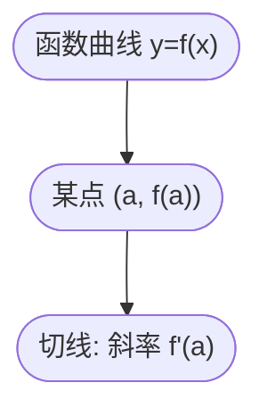

在机器学习里，**导数（Derivative）** 几乎无处不在：

- **优化算法**：梯度下降靠导数来确定“往哪边走”。
- **神经网络训练**：反向传播就是在大规模应用链式法则计算导数。
- **损失函数分析**：通过导数能知道函数是否有极小值。

换句话说：**不会导数 → 不懂梯度下降 → 无法理解深度学习是怎么“学”的**。

------

### 从生活例子看“导数”

想象你开车：

- 平均速度 = 总路程 ÷ 总时间。
- 但你真正关心的是某一瞬间的速度（比如雷达测速仪测你开多快）。

数学上，这个“瞬时速度”就是一个极限：

$v = \lim_{\Delta t \to 0} \frac{\Delta s}{\Delta t}$

这就是 **导数的定义**：函数的“瞬时变化率”。

------

### 导数的正式定义

如果函数 $f(x)$ 在点 $x=a$ 附近存在极限：

$f'(a) = \lim_{h \to 0} \frac{f(a+h) - f(a)}{h}$

那么我们称 **$f(x)$ 在 $x=a$ 处可导，导数为 $f'(a)$**。

直观意义：

- 分母 $h$：横向的微小变化（自变量）。
- 分子 $f(a+h)-f(a)$：纵向的微小变化（函数值）。
- 比值：变化率（斜率）。

------

### 几何意义：切线的斜率

在几何上，导数就是曲线在某点的切线斜率。

- 如果导数是正的：曲线在该点上升。
- 如果导数是负的：曲线在该点下降。
- 如果导数是 0：曲线在该点“水平”，可能是极值点。

**说明**：曲线 $y=f(x)$ 在点 $(a,f(a))$ 处的导数，就是切线的斜率。

------

### 机器学习中的导数应用

1. **梯度下降（Gradient Descent）**

   - 我们希望找到使损失函数 $L(\theta)$ 最小的参数 $\theta$。

   - 更新规则：

     θt+1=θt−η⋅dLdθ\theta_{t+1} = \theta_t - \eta \cdot \frac{dL}{d\theta}

   - 其中 $\frac{dL}{d\theta}$ 就是损失函数的导数（梯度）。

   类比：站在山坡上，斜率告诉你“哪边更陡”，顺着下坡方向走，就能更快到山谷。

------

1. **损失函数的最小值**

   - 在单变量函数中，极值点满足：

     f′(x)=0f'(x) = 0

   - 在机器学习中，训练过程就是在寻找损失函数的“极小点”。

   例子：

   - 在线性回归中，损失函数（平方误差）是个“碗形”的二次函数，导数为 0 的地方就是最优解。

------

1. **神经网络的反向传播**

   - 神经网络本质上是函数的嵌套：

     y=f(g(h(x)))y = f(g(h(x)))

   - 要计算参数的更新量，就必须用 **链式法则**：

     dydx=dydh⋅dhdg⋅dgdx\frac{dy}{dx} = \frac{dy}{dh} \cdot \frac{dh}{dg} \cdot \frac{dg}{dx}

   - 这就是反向传播（Backpropagation）的数学基础。

------

### 技术延伸：导数与可解释性

- 在可解释 AI 中，导数还能用来衡量“输入的微小变化对输出的影响”。
- 比如在图像分类中，如果一个像素的导数很大，说明模型对这个像素特别敏感。
- 这就是 **Saliency Map（显著性图）** 的原理。

------

### 小结

- **导数的定义**：极限形式的瞬时变化率。
- **几何意义**：函数在某点的切线斜率。
- **在机器学习中的作用**：
  - 梯度下降依赖导数确定更新方向。
  - 损失函数极小值对应导数为 0。
  - 反向传播用链式法则批量计算导数。
  - 可解释 AI 利用导数分析输入对输出的影响。

