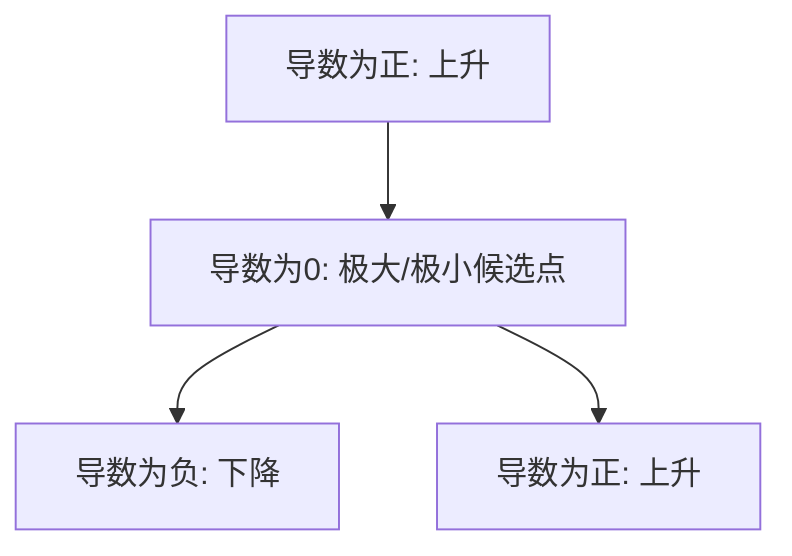

在机器学习中，我们常常听到“找到损失函数的最小值”或者“模型在验证集上表现最好”。这里的“最好”其实就是数学中的 **极值** 问题。而极值的判定离不开 **费马定理（Fermat’s Theorem）** 以及随之而来的判别方法。

------

## 1. 生活类比：上下坡与停车点

想象你骑自行车上坡，下坡，最终到达山谷或者山顶。

- 在山顶（极大值点），你的速度一瞬间降为零，再开始下滑。
- 在山谷（极小值点），你的速度也会归零，然后才开始爬坡。

**结论：在极值点，切线斜率通常为 0。**
 这就是费马定理的核心思想。

------

## 2. 费马定理（Fermat’s Theorem）

**定理内容**：
 如果函数 $f(x)$ 在点 $x_0$ 处取得局部极值，且 $f(x)$ 在 $x_0$ 处可导，那么：

$f'(x_0) = 0$

换句话说：

- 局部极大值点或极小值点的导数必须为 **0**（或导数不存在）。
- 但是！导数为 0 不一定就是极值，比如 $f(x) = x^3$ 在 $x=0$ 处 $f'(0)=0$，但这不是极值点。

------

## 3. 几何意义

导数代表切线斜率。

- 在极大值点：函数先增后减，切线斜率从正变负，必然经过 **0**。
- 在极小值点：函数先减后增，切线斜率从负变正，也必然经过 **0**。

**图示说明**：上图表示导数变化的过程。函数在导数为零的点，可能成为极大值或极小值的候选点。

------

## 4. 极值判定方法

找到候选点 $f'(x)=0$ 后，我们还要进一步判定：

### （1）一阶导数判别法

- 若 $f'(x)$ 在 $x_0$ 附近由 **正 → 负**，则 $x_0$ 是极大值。
- 若 $f'(x)$ 在 $x_0$ 附近由 **负 → 正**，则 $x_0$ 是极小值。
- 若符号不变，则不是极值点。

### （2）二阶导数判别法

- 若 $f''(x_0) > 0$，函数在此处“开口向上”，则为极小值。
- 若 $f''(x_0) < 0$，函数在此处“开口向下”，则为极大值。
- 若 $f''(x_0) = 0$，判定不了，需要更高阶分析。

------

## 5. 例子讲解

**例子 1**：

$f(x) = x^2$

- 一阶导：$f'(x) = 2x$，解得候选点 $x=0$。
- 二阶导：$f''(x) = 2 > 0$，所以 $x=0$ 是极小值点。

**例子 2**：

$f(x) = -x^2$

- 一阶导：$f'(x) = -2x$，解得候选点 $x=0$。
- 二阶导：$f''(x) = -2 < 0$，所以 $x=0$ 是极大值点。

------

## 6. 在机器学习中的应用

在训练机器学习模型时，我们常常需要 **最小化损失函数**。

- **损失函数极小化** 就是寻找函数的极小值点。

- 梯度下降法的核心：

  $$

    \theta \leftarrow \theta - \eta \cdot \nabla f(\theta)

  $$

  其中 $\nabla f(\theta)$ 就是导数/梯度。算法的目标就是找到让导数为 **0** 的点。

在大模型开发中，比如训练 GPT 这样的模型时：

- 模型的参数量可能有上亿甚至上千亿。
- 我们依然遵循相同的原则：通过不断更新参数，让损失函数逼近“极小值点”。
- 这就是数学上费马定理在 AI 中的直接应用。

------

## 7. 小结

- **费马定理**：极值点必定满足导数为零（或不可导）。
- **极值判定**：结合一阶导数符号变化或二阶导数正负来判断。
- **技术延伸**：机器学习优化问题的核心，就是不停地寻找这些极小值点。

所以，下次看到“梯度为零”时，可以立刻联想到：
 这背后其实就是费马定理在起作用！ 
