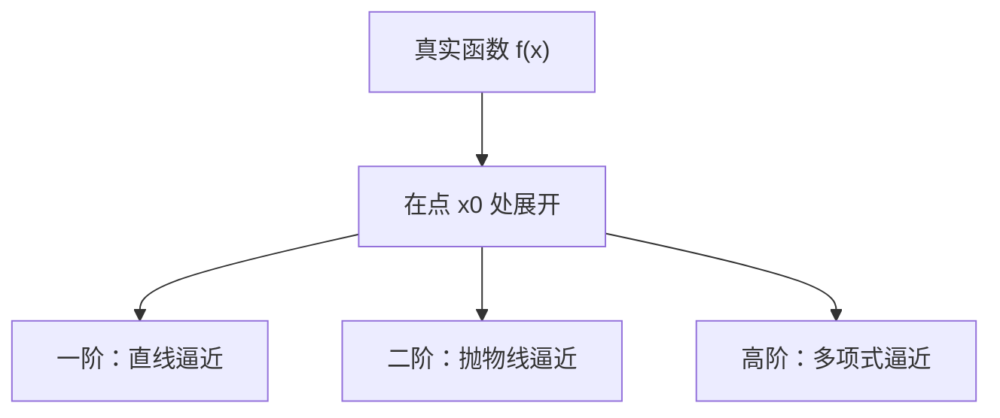

在机器学习的语境下，我们经常听到一句话：**“模型就是逼近函数的工具。”**
 无论是线性回归、神经网络还是大模型，它们的共同点都是：**用一个相对“简单”的函数去近似真实的、复杂的目标函数**。

而这种思想，其实早在微积分的学习中就已经埋下了种子：**函数逼近**。

------

## 1. 什么是函数逼近？

想象一下，你要画一条弯弯曲曲的山路（真实函数），但是你的工具很有限——比如你只有一根直尺。你没法一下子画出整个曲线，于是你会采用“**局部直线代替曲线**”的方式：在某个点画出切线，这根直线在附近区域就能很好地“逼近”原来的曲线。

这就是最简单的函数逼近：

- 真实函数：复杂、难以直接求解
- 近似函数：简单、好计算，但能在局部或整体上模仿真实函数

------

## 2. 切线逼近：最初级的函数逼近

假设函数 $f(x)$ 在点 $x_0$ 可导，根据微分定义，
 在 $x_0$ 附近可以用切线近似原函数：

$f(x) \approx f(x_0) + f'(x_0)(x - x_0)$

这就是**一阶泰勒展开**，也是函数逼近的起点。

类比：就像你在地图上看一段蜿蜒的公路时，可以在某个点“放大”并认为它接近一条直线。

------

## 3. 更高阶的逼近：泰勒展开

如果只用直线逼近，很多情况下误差太大。于是我们可以加上更多项：

$f(x) \approx f(x_0) + f'(x_0)(x - x_0) + \frac{f''(x_0)}{2!}(x - x_0)^2 + \cdots$

这就是**泰勒展开式**。

- 一阶：切线近似
- 二阶：抛物线近似
- 高阶：越来越像原函数

例如，指数函数 $e^x$ 在 $x=0$ 处的展开式为：

$e^x \approx 1 + x + \frac{x^2}{2!} + \frac{x^3}{3!} + \cdots$

这其实就是我们常用的 **数值计算和机器学习中的多项式逼近** 的原型。

------

## 4. 图示：函数逼近的直观理解

**说明**：这张图展示了如何从原函数出发，通过逐步增加展开阶数，实现越来越精细的近似。

------

## 5. 技术延伸：机器学习中的函数逼近

到这里，读者可能会问：**函数逼近和机器学习有什么关系？**

其实关系非常紧密：

1. **线性回归**
    就是用一条直线去逼近真实的目标函数。

   $$
       y \approx w x + b
   $$

2. **多项式回归**
    就是模仿泰勒展开，允许我们用二次、三次多项式来更好地逼近非线性关系。

3. **神经网络**
    神经网络的本质就是“通用逼近器（Universal Approximator）”。数学上已经证明：只要层数和参数足够，一个神经网络可以逼近任意连续函数。

4. **大模型（LLM）**
    GPT 这类大模型，本质上也是在“函数逼近”：

   - 输入：一个序列的词向量
   - 输出：下一个词的概率分布
   - 真实目标函数：自然语言的分布规律（复杂到难以精确建模）
   - 模型做的事：用参数化的神经网络逼近这种分布

------

## 6. 小结

- **函数逼近思想**是从微积分到机器学习的一条主线。
- **泰勒展开**是最早的函数逼近方法，它告诉我们：复杂的东西可以用简单的函数逐步近似。
- 在机器学习中，几乎所有模型都在做逼近的事：线性模型、非线性模型、神经网络……甚至大模型。

可以说，理解“函数逼近”这个数学思想，就能更好地理解：**为什么我们需要模型、为什么模型有效、以及为什么要不断加深加宽模型结构。
