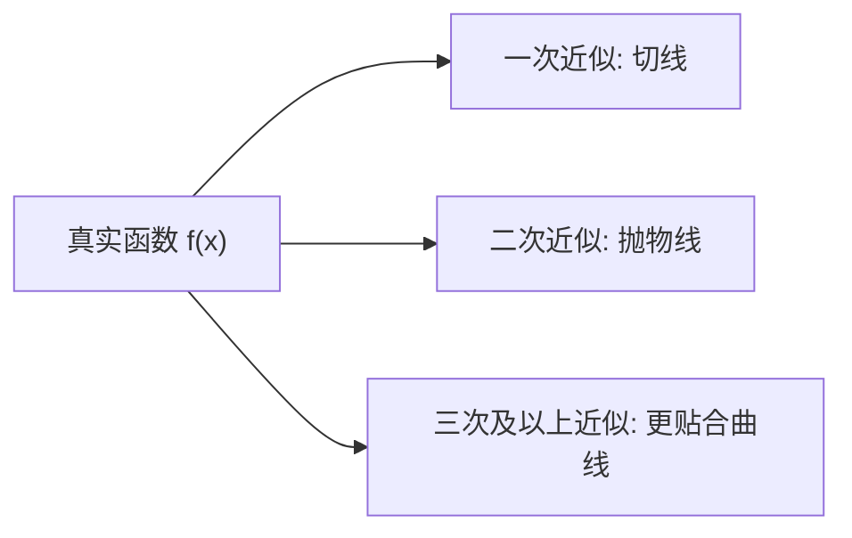

在前面我们讲过函数的逼近思想：用简单的直线（一次函数）来代替曲线，在某个点附近做近似。这个想法非常重要，但一次函数的“直线近似”往往不够精准。
 接下来，我们就要升级武器：不仅用切线（一次近似），还要用二次项、三次项……甚至无穷项来更精确地还原函数的形状。这就是 **泰勒展开（Taylor Expansion）** 的核心思想。

------

## 1. 从切线到曲线：高阶近似的直观理解

想象一下你在画地图：

- **一次近似（切线）**：就像在一条弯弯曲曲的路上，用一根直尺去贴近某一点。虽然在那个点上很贴合，但稍微走远就会偏差很大。
- **二次近似（抛物线）**：换成一条小弯弯的曲线（比如二次函数），它在那个点附近更能贴合道路的弯曲。
- **三次、四次……更高阶近似**：每多加一项，就像在道路模型里补充更多细节，让模型在更大的范围内保持贴合。

这就是泰勒展开的本质：**用多项式来模拟复杂函数**。

------

## 2. 泰勒展开的数学定义

假设函数 $f(x)$ 在某点 $a$ 附近足够光滑（可多次微分），那么它可以展开为：

$f(x) \approx f(a) + f'(a)(x-a) + \frac{f''(a)}{2!}(x-a)^2 + \frac{f^{(3)}(a)}{3!}(x-a)^3 + \cdots$

这就是 **泰勒展开式（Taylor Series）**。

- 第一项 $f(a)$：函数在 $a$ 点的值
- 第二项 $f'(a)(x-a)$：切线近似
- 第三项 $\frac{f''(a)}{2!}(x-a)^2$：调整弯曲程度
- 后面高阶项：进一步补偿误差

------

## 3. 举个例子：$\sin(x)$ 的展开

以 $a = 0$ 为例（也叫 **Maclaurin 展开**，即在 0 点展开）。

$\sin(x) = x - \frac{x^3}{3!} + \frac{x^5}{5!} - \frac{x^7}{7!} + \cdots$

如果只取第一项（一次近似）：$\sin(x) \approx x$，
 在小角度（比如弧度制下的 5°，约等于 0.087）范围内非常好用，这就是我们常听说的“小角度近似”。

------

## 4. 直观图示

**说明**：图示展示了从一次到高阶近似，函数拟合效果逐步提升的过程。

------

## 5. 生活类比：泰勒展开就像修复马赛克照片

想象你在看一张模糊的照片：

- **只看第一项（一次近似）**：你只能勉强看出轮廓。
- **多加几项（二次、三次近似）**：照片逐渐清晰，能看清五官。
- **更多项（高阶展开）**：照片几乎恢复原貌。

所以，泰勒展开就是一种“逐步补细节”的过程。

------

## 6. 技术延伸：机器学习中的泰勒展开

在机器学习和大模型中，泰勒展开思想非常重要，体现在：

1. **优化算法中的近似**
   - 在梯度下降中，我们常用一阶近似（切线）来更新参数。
   - 在牛顿法优化中，会用到二阶导数（Hessian 矩阵），本质上就是利用二阶泰勒展开来改进搜索方向。
2. **激活函数近似**
    在一些硬件受限的环境里（如移动端推理），复杂的激活函数（如 $\tanh$、$\exp$）会被泰勒展开成多项式，减少计算成本。
3. **大模型中的近似计算**
    训练 GPT 这类大模型时，很多时候需要在海量数据上快速近似损失函数的变化趋势，泰勒展开就是背后的数学支撑。

------

## 7. 小练习（思考题）

- 用二阶泰勒展开近似 $\cos(x)$ 在 0 附近的形式。
- 思考：在训练深度神经网络时，如果只用一阶近似（梯度下降），会遇到什么问题？二阶信息能带来哪些好处？

------

 **总结**：
 泰勒展开是把函数拆解成“在某点附近的多项式近似”。它不仅是数学分析里的重要工具，也是机器学习优化方法的数学基石。理解它，就像掌握了一把“放大镜”，能看到函数在局部的细节，从而更好地建模和优化。
