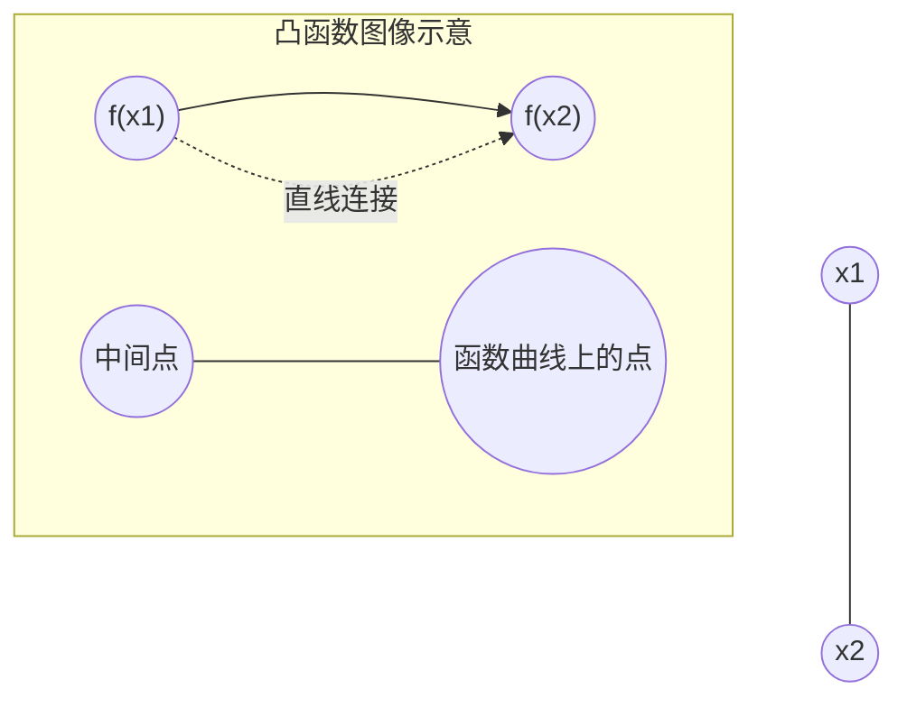
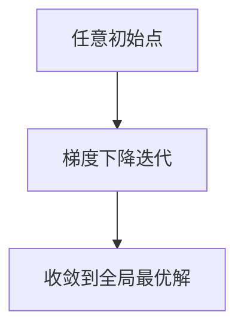

在机器学习和大模型开发中，“优化”无处不在。训练一个深度神经网络，本质上就是在寻找一个最优的参数组合，让模型在数据上表现最好。而“凸函数”和“凸优化”是我们能否快速、高效找到解的关键。

------

## 1. 什么是凸函数？

直观上，如果一条曲线像一只“碗”一样向上开口，那么它就是一个凸函数。更正式地说：

**定义：**
 函数 $f(x)$ 是凸函数，如果对于任意两个点 $x_1, x_2$ 以及 $\lambda \in [0,1]$，都有：

$f(\lambda x_1 + (1-\lambda)x_2) \leq \lambda f(x_1) + (1-\lambda)f(x_2)$

这句话的意思是：**连线在函数图像的上方或重合**。

- **类比**：想象你在一个大碗里放两颗小球，连接两球的直线一定在碗壁上方。
- 如果是“凹函数”（像山峰），直线就会跑到曲线下方。

**图示说明**：直线始终在曲线之上，这是凸函数的核心特征。

------

## 2. 一些常见的凸函数

- **平方函数**： $f(x) = x^2$
- **指数函数**： $f(x) = e^x$
- **范数函数**： $f(x) = \|x\|_2$

这些函数在优化问题中经常出现。比如，**最小二乘回归**的损失函数就是凸的，这意味着我们可以高效找到最优解。

------

## 3. 凸函数的数学特征

### 3.1 一阶条件（斜率单调递增）

如果 $f$ 可导，那么 $f$ 是凸函数等价于：

$f(y) \geq f(x) + f'(x)(y-x)$

这表示：函数在某点的切线永远在函数图像下方。

**直观解释**：碗形曲线的切线永远不会穿过碗底。

------

### 3.2 二阶条件（曲率非负）

如果 $f$ 二阶可导，那么：

$f''(x) \geq 0 \quad \forall x$

这意味着曲线“开口向上”。

- 在机器学习中，常见的 **平方损失函数** $(y-\hat{y})^2$ 的二阶导数恒为 2，因此它是凸函数。

------

## 4. 为什么凸优化重要？

在机器学习里，我们经常需要解一个优化问题：

$\min_x f(x)$

如果 $f(x)$ 是凸函数，情况就很美妙了：

1. **只有一个全局最优解**
   - 不用担心掉进局部最小值。
2. **梯度下降必然收敛**
   - 在凸函数上，梯度下降法能保证找到最优解（只要学习率合适）。

**图示说明**：在凸函数中，梯度下降不会陷入局部最小点，总能找到最优解。

------

## 5. 凸优化在机器学习中的应用

- **线性回归**：平方损失函数是凸的 → 可用解析解或梯度下降高效求解。
- **逻辑回归**：对数似然损失是凸的 → 全局最优，避免局部最优困扰。
- **支持向量机（SVM）**：优化目标是凸二次规划 → 能保证找到最优分类面。
- **大模型训练**：虽然深度神经网络整体不是凸的，但许多子问题（如参数正则化、局部近似优化）利用凸优化的思想加速收敛。

------

## 6. 日常生活中的类比

- **碗 vs. 山峰**：
  - 碗 = 凸函数 → 球往碗底滚，最后一定落到最优点。
  - 山峰 = 非凸函数 → 球可能卡在半山腰（局部最小值）。
- **走楼梯找低点**（梯度下降）
  - 凸函数 = 楼梯只有一个最低点。
  - 非凸函数 = 楼梯有很多“台阶坑”，可能被困住。

------

## 7. 小结

- **凸函数** 是优化的“好人”：结构简单，没有陷阱。
- **凸优化问题** 保证全局最优解，可以用梯度下降等方法高效解决。
- 在机器学习和大模型开发中，凸优化是我们理解和解决复杂问题的基石，即使深度学习整体是非凸的，很多算法的理论仍依赖凸优化的思想。

------

读完这一节，你应该能用一句话总结：
 **“凸函数就像碗，凸优化就像找碗底的最低点，机器学习里很多算法都是在‘找碗底’。”**

