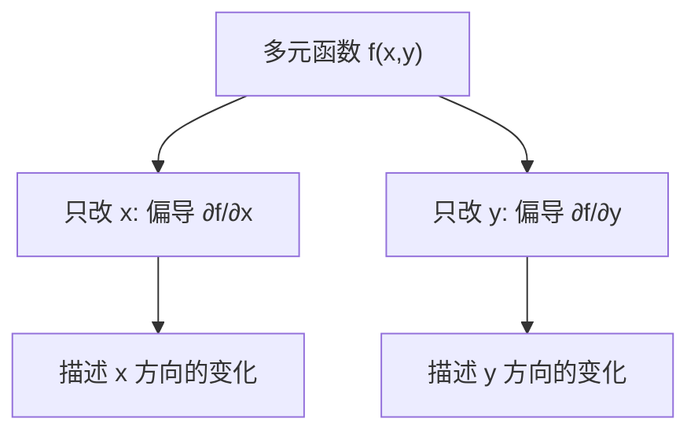

在前一章中，我们学习了**单变量函数的微分**。那时，函数的输入是一个变量 $x$，输出可能是 $y = f(x)$。
 但在机器学习中，几乎所有模型都涉及**多元函数**：输入不仅仅是一个数，而是一个**向量**。比如：

- 一个房价预测模型可能输入：$\text{面积}, \text{位置}, \text{楼层}, \text{装修情况}$。
- 一个神经网络的输入可能是：数千维的图像像素，或几万维的词向量。

这时，我们研究的函数就是：

$f(x_1, x_2, \dots, x_n)$

也就是说，函数的自变量有多个。

------

### 多元函数的定义

多元函数就是**多个变量共同决定一个结果的函数**。
 比如，平面上的函数：

$z = f(x, y) = x^2 + y^2$

这表示输入是二维坐标 $(x,y)$，输出是一个高度 $z$。直观上，这是一个**抛物面**。

------

### 为什么需要偏导数？

在单变量函数中，导数告诉我们函数在某个点的**变化趋势**：

- $f'(x) > 0$ → 递增
- $f'(x) < 0$ → 递减

但是多元函数有多个方向可以变化。比如函数 $f(x, y)$，我们可以问：

- 如果只改 $x$，保持 $y$ 不变，函数怎么变？
- 如果只改 $y$，保持 $x$ 不变，函数怎么变？

这就是**偏导数**的意义。

------

### 偏导数的定义

假设有函数 $z = f(x,y)$，则：

- **对 $x$ 的偏导数**：

$\frac{\partial f}{\partial x} = \lim_{h \to 0} \frac{f(x+h, y) - f(x,y)}{h}$

（把 $y$ 当常数，只看 $x$ 的变化）

- **对 $y$ 的偏导数**：

$\frac{\partial f}{\partial y} = \lim_{h \to 0} \frac{f(x, y+h) - f(x,y)}{h}$

（把 $x$ 当常数，只看 $y$ 的变化）

------

### 一个直观例子

假设函数：

$f(x, y) = 3x^2 + 2y$

- 对 $x$ 求偏导：

$\frac{\partial f}{\partial x} = 6x$

- 对 $y$ 求偏导：

$\frac{\partial f}{\partial y} = 2$

**解释**：

- 当 $x$ 增大时，函数值随之以 $6x$ 的速度变化。
- 当 $y$ 增大时，函数值总是以速度 2 增加。

------

### 几何理解：切平面

单变量导数给出的是**切线的斜率**；
 多元函数的偏导数描述的是某个方向上的**切平面斜率**。

比如 $z=f(x,y)$，在点 $(x_0,y_0)$，切平面可以近似写为：

$z \approx f(x_0, y_0) + \frac{\partial f}{\partial x}(x_0,y_0)(x-x_0) + \frac{\partial f}{\partial y}(x_0,y_0)(y-y_0)$

也就是说，函数在某个点附近的形状，可以用“切平面”来近似。

------

**图示说明**：函数有多个输入时，偏导数表示**在某个方向上单独的变化趋势**。

------

### 在机器学习中的应用

1. **梯度下降法（Gradient Descent）**

   - 偏导数是优化的核心。

   - 我们计算函数对每个参数的偏导，得到**梯度向量**：

     ∇f(x,y)=(∂f∂x,∂f∂y)\nabla f(x,y) = \left( \frac{\partial f}{\partial x}, \frac{\partial f}{\partial y} \right)

   - 梯度告诉我们：**函数在哪个方向上下降最快**。

   在神经网络训练中，我们不断根据偏导数更新参数，让损失函数越来越小。

2. **特征敏感性分析**

   - 如果某个变量的偏导特别大，说明模型对它很敏感。
   - 在实际应用中，可以帮助我们解释模型的重要特征。

3. **凸优化与二阶导数**

   - 偏导数的一阶和二阶形式构成**Hessian矩阵**，用来判断函数的凸性和极值点。
   - 在深度学习里，很多优化算法（如牛顿法、二阶方法）都依赖这些信息。

------

### 小结

- 多元函数的输入是向量，不再是单个变量。
- 偏导数表示函数在某一方向的变化率。
- 几何上，偏导数对应切平面的斜率。
- 在机器学习中，偏导数直接应用于**梯度下降**和**模型优化**。
