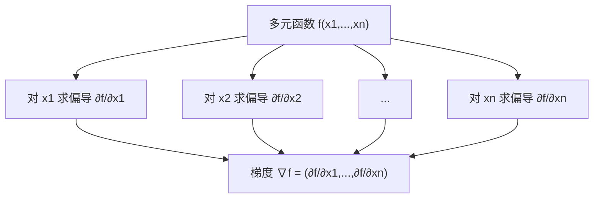
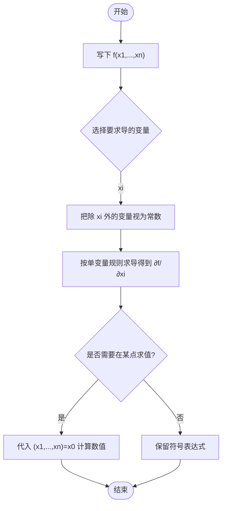

这一节把单变量“斜率”的直觉，扩展到多维世界。你可以把**多元函数**想成一座多维的“山”，而**偏导数**就是沿某一条坐标轴方向的“坡度”。

------

## 1. 多元函数到底是啥？

在单变量里，我们研究 $f:\mathbb{R}\to\mathbb{R}$，比如 $f(x)=x^2$。
 在多变量里，最常见的是：

- **标量值函数**：$f:\mathbb{R}^n \to \mathbb{R}$
   例：线性回归的损失函数、神经网络的训练损失。输入是一个 $n$ 维向量，输出是一个数。
- **向量值函数**：$\mathbf{g}:\mathbb{R}^n \to \mathbb{R}^m$
   例：神经网络的前向输出（多类概率），或特征工程里的多维变换。

在几何上，$f(x,y)$ 可以看成 $\mathbb{R}^2$ 平面上的每个点都“竖”起一个高度 $z=f(x,y)$，形成一张曲面。
 **等高线（level sets）**是看这座山的“等海拔地图”，比如 $f(x,y)=c$ 的所有点组成的曲线。

**类比**：

- 多元函数 = “山地地形图”；
- 等高线 = “同一高度的等高线”；
- 输入坐标 $(x,y)$ = “经度、纬度”；
- 输出 $z$ = “海拔高度”。

------

## 2. 直观入门：从切片看“局部变化”

对 $f(x,y)$，如果把 $y$ 固定在 $y=y_0$，只让 $x$ 变化，你就在曲面上“沿 $x$ 方向切一刀”，得到一条曲线 $x\mapsto f(x,y_0)$。这就是“**只看 x 的变化**”。

**偏导数**就是：在其它变量保持不变时，沿某个变量方向的瞬时变化率（斜率）。

- 对 $x$ 的偏导：
  $$
  ∂f∂x(x0,y0)=lim⁡h→0f(x0+h,y0)−f(x0,y0)h\frac{\partial f}{\partial x}(x_0,y_0) =\lim_{h\to 0}\frac{f(x_0+h,y_0)-f(x_0,y_0)}{h}
  $$
  

- 对 $y$ 的偏导同理。

> 记号：$\partial$ 读作“偏导符号”。把它理解成“只动一个、其他不动”的提醒很有用。

------

## 3. 一个“碗形”示例：二次函数

设 $f(x,y)=x^2+y^2$。

- $\displaystyle \frac{\partial f}{\partial x}=2x,\quad \frac{\partial f}{\partial y}=2y$。
- 在点 $(1,2)$，沿 $x$ 的坡度是 $2$，沿 $y$ 的坡度是 $4$。这表示向 $x$ 方向挪一点，函数值上升速度比向 $y$ 方向小。

**等高线**是 $x^2+y^2=c$ 的圆。圆越大，等高线对应的高度越高。
 这就是机器学习里常说的“**碗形损失面**”，在很多凸优化问题中都会出现。

------

## 4. 更复杂一点的例子

令

$f(x,y)=x^2y+e^{xy}+\sin x.$

- $\displaystyle \frac{\partial f}{\partial x}=2xy+y\,e^{xy}+\cos x$
- $\displaystyle \frac{\partial f}{\partial y}=x^2+x\,e^{xy}$

> 规律：
>
> - 对 $x$ 求偏导时，把 $y$ 当常数处理；
> - 指数、三角等照常求导，但链式法则里只考虑“当前变量”的依赖。

------

## 5. 偏导存在 ≠ 处处“平滑”

来看一个常被忽视的细节：

$f(x,y)=\sqrt{x^2+y^2}.$

在 $(0,0)$ 点，对 $x$ 的偏导需计算

$\frac{\partial f}{\partial x}(0,0) =\lim_{h\to 0}\frac{\sqrt{h^2+0}-0}{h} =\lim_{h\to 0}\frac{|h|}{h}.$

这个极限左右不相等（右极限为 $1$，左极限为 $-1$），所以 **偏导不存在**。
 这告诉我们：**偏导数会暴露“尖点”“拐角”这类不光滑之处**。在优化时，这些点可能导致梯度方法不稳定或难以下降。

------

## 6. 高阶偏导 & 混合偏导

有了 $\partial f/\partial x$，还可以继续对 $x$ 或 $y$ 求导，得到**二阶偏导**、**混合偏导**：

$f_{xx}=\frac{\partial^2 f}{\partial x^2},\quad f_{yy}=\frac{\partial^2 f}{\partial y^2},\quad f_{xy}=\frac{\partial^2 f}{\partial x\,\partial y},\quad f_{yx}=\frac{\partial^2 f}{\partial y\,\partial x}.$

在较弱的光滑性条件（例如 $f$ 的二阶偏导在邻域内连续）下，**克莱罗-施瓦茨定理**告诉我们：

$f_{xy}=f_{yx}.$

这条等价关系在后面的 **Hessian 矩阵**（第 2-5 节）与二阶优化分析里至关重要。

------

## 7. 梯度是什么？（提前剧透）

把所有一阶偏导按变量排列成向量：

$\nabla f(\mathbf{x})= \begin{bmatrix} \frac{\partial f}{\partial x_1} & \frac{\partial f}{\partial x_2} & \cdots & \frac{\partial f}{\partial x_n} \end{bmatrix}^{\!\top}.$

**梯度**指向函数增长最快的方向，长度等于该方向上的最大上升率。
 虽然梯度的系统内容在 2-2 节展开，这里先记住：**偏导是“分量”，梯度是“合力”**。

------

## 8. Mermaid 图：偏导与梯度的关系（概念图）



**说明**：图中展示了“先按坐标分别求偏导”，再把各分量合在一起形成梯度向量的过程。

------

## 9. 机器学习里的直接应用

### 9.1 线性回归的损失偏导

给定样本 $(\mathbf{x}_i,y_i)$（$\mathbf{x}_i\in\mathbb{R}^d$），模型 $\hat{y}_i=\mathbf{w}^\top\mathbf{x}_i+b$。
 均方误差（MSE）：

$L(\mathbf{w},b)=\frac{1}{m}\sum_{i=1}^m \big(\mathbf{w}^\top\mathbf{x}_i+b-y_i\big)^2.$

- 对 $w_j$ 的偏导：

  ∂L∂wj=2m∑i=1m(w⊤xi+b−yi) xi,j.\frac{\partial L}{\partial w_j} =\frac{2}{m}\sum_{i=1}^m \big(\mathbf{w}^\top\mathbf{x}_i+b-y_i\big)\,x_{i,j}.

- 对 $b$ 的偏导：

  ∂L∂b=2m∑i=1m(w⊤xi+b−yi).\frac{\partial L}{\partial b} =\frac{2}{m}\sum_{i=1}^m \big(\mathbf{w}^\top\mathbf{x}_i+b-y_i\big).

这正是**梯度下降**更新参数时用到的“坡度”。

> 直觉：误差越大、特征量级越大，对应维度的“推力”越大，更新就越猛烈。

### 9.2 神经网络训练

在深度学习里，自动微分框架（PyTorch、JAX、TensorFlow）会根据计算图自动给出**偏导/梯度**。
 但理解偏导本质依然很重要：

- 有助于你**手工检查**梯度是否合理（比如数值梯度对比），
- 设计**自定义算子/损失**时，能避免不可导或梯度爆炸/消失的陷阱。

------

## 10. 从“切片斜率”到“最陡上升”：生活类比

- **装水果的篮子**：篮子里有苹果数 $x$、香蕉数 $y$。总重量 $f(x,y)$ 随 $x$ 增加的变化（手感更重的速度）就是 $\partial f/\partial x$，此时香蕉数 $y$ 不变。
- **爬山**：站在山上看两条方向（东西是 $x$、南北是 $y$），分别有两个斜率（两个偏导）。而“往哪里最陡”是把两个斜率合成的方向（梯度）。

------

## 11. 计算注意事项与常见坑

1. **变量独立 ≠ 统计独立**
    偏导时“把其他变量当常数”只是计算规则，不代表这些特征在数据分布里独立。
2. **不可导点**
    $|x|$、$\sqrt{x^2+y^2}$ 在某些点不可导。在优化里要关注不可导对收敛的影响（如 ReLU 的拐点）。
3. **混合偏导次序**
    一般情况下 $f_{xy}=f_{yx}$，但需要基本的连续性条件，生造的“怪函数”可能不满足。
4. **数值梯度 vs. 自动微分**
    数值差分容易受步长影响，过大不准、过小有舍入误差；可作为单元测试的参考，但不替代自动微分。

------

## 12. 代码小练习（NumPy/PyTorch，对照理解）

> 演示如何用**有限差分**近似偏导，并与 PyTorch 的自动微分对比。

```python
# 需要: numpy, torch
import numpy as np
import torch

# 目标函数 f(x,y) = x^2 y + exp(xy) + sin x
def f_numpy(x, y):
    return x*x*y + np.exp(x*y) + np.sin(x)

def partial_x_numeric(x0, y0, h=1e-5):
    return (f_numpy(x0+h, y0) - f_numpy(x0-h, y0)) / (2*h)

def partial_y_numeric(x0, y0, h=1e-5):
    return (f_numpy(x0, y0+h) - f_numpy(x0, y0-h)) / (2*h)

x0, y0 = 0.7, -0.3
print("数值近似 ∂f/∂x:", partial_x_numeric(x0, y0))
print("数值近似 ∂f/∂y:", partial_y_numeric(x0, y0))

# 用 PyTorch 自动微分核对
x = torch.tensor(x0, requires_grad=True)
y = torch.tensor(y0, requires_grad=True)
f = x*x*y + torch.exp(x*y) + torch.sin(x)
f.backward()
print("Autograd ∂f/∂x:", x.grad.item())
print("Autograd ∂f/∂y:", y.grad.item())
```

------

## 13. Mermaid 图：如何“操作化”地求偏导（流程图）



**说明**：这是把“偏导”落地为机械步骤的流程：选变量 → 其它视常数 → 单变量求导法则 →（可选）代入点。

------

## 14. 练习与参考答案（可自测）

**练习 1**：
 $f(x,y)=3x^2y+2xy^2+\cos(xy)$，求 $\partial f/\partial x$、$\partial f/\partial y$。

**参考**：

$\frac{\partial f}{\partial x}=6xy+2y^2 - \sin(xy)\cdot y,\quad \frac{\partial f}{\partial y}=3x^2+4xy - \sin(xy)\cdot x.$

**练习 2**：
 判断 $f(x,y)=\sqrt{x^2+y^2}$ 在 $(0,0)$ 是否存在 $\partial f/\partial x$。

**参考**：不存在（左右极限不同）。

**练习 3（连接机器学习）**：
 逻辑回归的单样本损失 $\ell(\mathbf{w},b)=-\big[y\log \sigma(z)+(1-y)\log(1-\sigma(z))\big]$，其中 $z=\mathbf{w}^\top\mathbf{x}+b$、$\sigma(z)=1/(1+e^{-z})$。求 $\partial \ell/\partial \mathbf{w}$、$\partial \ell/\partial b$。

**参考**：

$\frac{\partial \ell}{\partial \mathbf{w}}=(\sigma(z)-y)\,\mathbf{x},\quad \frac{\partial \ell}{\partial b}=\sigma(z)-y.$

（这就是广为人知的“**预测概率减真实标签**”形式。）

------

## 15. 小结

- 多元函数把“高度”从一条线的曲线，推广到多维的“地形”。
- **偏导**是“只动一个变量”的斜率，揭示了沿坐标轴方向的局部变化。
- **高阶与混合偏导**为后续的曲率（Hessian）、极值判定打基础。
- 在机器学习中，**偏导就是梯度的分量**，决定了参数更新的方向与力度：从线性回归到深度网络，训练无处不在地用到了它。
