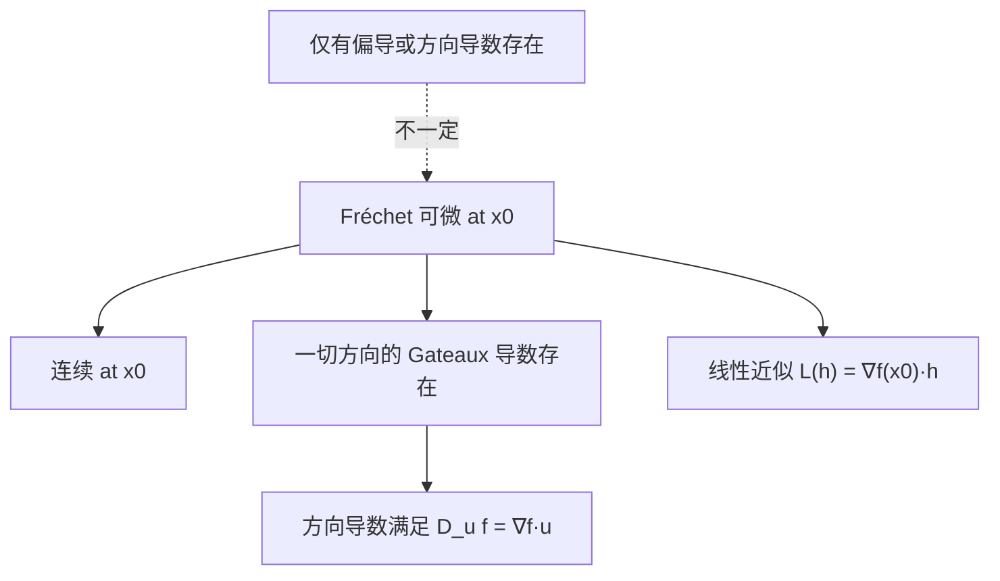

把“只沿坐标轴看的偏导”升级为“沿**任意方向**看的瞬时变化率”，这就是**方向导数**。而**可微性**告诉我们：函数在某点附近能否被“线性函数+小误差”很好地近似。

------

## 1. 从爬坡直觉到数学定义

想象你站在一座二维山的某点 $\mathbf{x}_0=(x_0,y_0)$。往东南西北都能走，每个方向都有一个**即时上升/下降速度**。
 若把“方向”记为单位向量 $\mathbf{u}\in\mathbb{R}^n$（$\|\mathbf{u}\|=1$），**方向导数**定义为

$D_{\mathbf{u}} f(\mathbf{x}_0) := \lim_{t\to 0}\frac{f(\mathbf{x}_0+t\mathbf{u})-f(\mathbf{x}_0)}{t}.$

- 当 $\mathbf{u}=\mathbf{e}_i$（第 $i$ 个坐标轴方向）时，$D_{\mathbf{u}} f$ 就是偏导 $\partial f/\partial x_i$。
- 把 $g(t)=f(\mathbf{x}_0+t\mathbf{u})$ 看作一元函数，它的导数 $g'(0)$ 就是 $D_{\mathbf{u}} f(\mathbf{x}_0)$。

**生活类比**：你推一辆手推车（函数值），朝向 $\mathbf{u}$ 用一点点力，车子速度（变化率）就是方向导数。

------

## 2. 方向导数与梯度：投影关系

如果 $f$ 在 $\mathbf{x}_0$ **可微**（定义见下），则

$D_{\mathbf{u}} f(\mathbf{x}_0)=\nabla f(\mathbf{x}_0)\cdot \mathbf{u}.$

这意味着方向导数等于**梯度在方向 $\mathbf{u}$ 上的投影**。梯度方向是最陡上升的方向，大小是最大上升率。

> 小推导：设 $g(t)=f(\mathbf{x}_0+t\mathbf{u})$。若 $f$ 可微，链式法则给出
>  $g'(0)=\nabla f(\mathbf{x}_0)\cdot \mathbf{u}$。

------

## 3. 可微性的本质：线性近似 + 小误差

**可微（Fréchet 可微）**：
 $f:\mathbb{R}^n\to\mathbb{R}$ 在 $\mathbf{x}_0$ 可微，指存在一个线性映射 $L(\mathbf{h})$（对标“一阶近似”），使得

$f(\mathbf{x}_0+\mathbf{h})=f(\mathbf{x}_0)+L(\mathbf{h})+o(\|\mathbf{h}\|),\quad \mathbf{h}\to \mathbf{0}.$

当 $f$ 可微时，这个 $L$ 必然是与梯度对应的线性形式：

$L(\mathbf{h})=\nabla f(\mathbf{x}_0)\cdot \mathbf{h}.$

因此

$f(\mathbf{x}_0+\mathbf{h})\approx f(\mathbf{x}_0)+\nabla f(\mathbf{x}_0)\cdot \mathbf{h}.$

这就是常说的**总微分**或**线性化近似**。

> 重要结论：
>
> - **可微 ⇒ 连续**（反之不成立）。
> - **可微 ⇒ 一切方向导数存在**，且满足投影公式 $D_{\mathbf{u}} f=\nabla f\cdot \mathbf{u}$。

------

## 4. Gateaux 与 Fréchet：两个“可导”

- **Gateaux 导数**：固定方向 $\mathbf{u}$，若上面的极限存在就算“沿 $\mathbf{u}$ 可导”。
- **Fréchet 可微**：要求存在一个**统一的线性映射** $L$ 同时近似**所有方向**的小变动。

> 直观：
>  Gateaux 更像“方向逐个测”；Fréchet 是“整体一次性线性近似”。
>  **Fréchet 可微 ⇒ 所有 Gateaux 导数都存在且线性一致**。反之未必。

------

## 5. 反例收藏：为什么“有方向导数/偏导”还不够

### 5.1 所有方向导数都存在，但不可微

$f(x,y)=|x|+|y|,\quad \text{在 } (0,0).$

任取单位方向 $\mathbf{u}=(u_1,u_2)$，有

$D_{\mathbf{u}}f(0,0)=|u_1|+|u_2|,$

方向导数**处处存在**，但作为 $\mathbf{u}$ 的函数它不是**线性**的（不满足 $|u_1|+|u_2|$ 的可加/齐次性），因此不存在统一的线性近似 $L$。
 $\Rightarrow$ **不 Fréchet 可微**。

### 5.2 偏导数都存在，但函数不可微

定义

$f(x,y)= \begin{cases} \dfrac{x^3}{x^2+y^2}, & (x,y)\neq(0,0),\\[6pt] 0, & (x,y)=(0,0). \end{cases}$

可算得在 $(0,0)$ 两个偏导都存在且为 $0$，但沿方向 $\mathbf{u}=(\cos\theta,\sin\theta)$ 有

$D_{\mathbf{u}}f(0,0)=\cos^3\theta,$

这个关于 $\mathbf{u}$ 的映射不是线性形式（对比应为 $\nabla f\cdot \mathbf{u}$ 的形状），说明**不可微**。
 （同时它也暴露了：**“偏导存在”并不保证“可微”**。）

### 5.3 偏导连续的充分条件

若 $f$ 在 $\mathbf{x}_0$ 的邻域有偏导且偏导**连续**，则 $f$ 在 $\mathbf{x}_0$ **可微**。
 （常用实战判定：检查梯度是否在邻域连续。）

------

## 6. 二阶方向导数与曲率（预告 Hessian）

当 $f$ 二阶可微时，沿单位方向 $\mathbf{u}$ 的**二阶方向导**为

$D^2_{\mathbf{u}} f(\mathbf{x}_0)=\mathbf{u}^\top \nabla^2 f(\mathbf{x}_0)\,\mathbf{u},$

即 **Hessian 的二次型**。它告诉你沿 $\mathbf{u}$ 方向的“弯曲程度”。这在牛顿法、二阶优化、曲率自适应学习率里很关键（详见 2-5）。

------

## 7. Mermaid 概念图：可微与方向导数的关系



**说明**：可微性是更强的条件，它蕴含连续、方向导数存在且呈现统一线性结构；仅有偏导/方向导数存在并不足以推出可微。

------

## 8. 与机器学习/大模型训练的连接

1. **线搜索与下降方向**：
    设搜索方向 $\mathbf{d}$，线搜索考察 $\phi(\alpha)=f(\mathbf{x}+\alpha\mathbf{d})$。
    $\phi'(0)=D_{\mathbf{d}/\|\mathbf{d}\|} f(\mathbf{x})\cdot \|\mathbf{d}\|=\nabla f(\mathbf{x})\cdot \mathbf{d}$。
    Armijo/Wolfe 条件都直接用到了这条公式。

2. **不可微点的优化**：
    L1 正则、ReLU 在拐点不可微，实际用**次梯度**或把不可微集视为可忽略的零测集；
    这解释了为何 SGD 在 ReLU 网络上仍能工作。

3. **数值梯度检查（Directional Check）**：
    随机取单位向量 $\mathbf{u}$，用中心差分近似

    $$
      D_{\mathbf{u}} f(\mathbf{x})\approx \frac{f(\mathbf{x}+h\mathbf{u})-f(\mathbf{x}-h\mathbf{u})}{2h}
    $$

    与 $\nabla f(\mathbf{x})\cdot \mathbf{u}$ 比较，可快速发现实现错误。

4. **平滑性与学习率**：
    若 $\nabla f$ $L$-Lipschitz（“$\beta$-平滑”），有
    $f(\mathbf{x}+\alpha\mathbf{d})\le f(\mathbf{x})+\alpha\nabla f\cdot \mathbf{d}+ \tfrac{L}{2}\alpha^2\|\mathbf{d}\|^2$。
    这给出安全步长与收敛分析的基础。

------

## 9. 例子与练习

### 例 1（投影公式验证）

$f(x,y)=x^2y+e^{xy}$。求 $D_{\mathbf{u}} f$ 在 $(1,0)$ 的值，其中 $\mathbf{u}=(\tfrac{3}{5},\tfrac{4}{5})$。

- $\nabla f=[2xy+ye^{xy}+0,\;x^2+xe^{xy}]^\top$。
   在 $(1,0)$：$\nabla f(1,0)=[0,\;1]^\top$。
   故 $D_{\mathbf{u}}f=\nabla f\cdot \mathbf{u}=0\cdot \tfrac{3}{5}+1\cdot \tfrac{4}{5}=\tfrac{4}{5}$。

### 例 2（是否可微）

$f(x,y)=\sqrt{|xy|},\quad \text{在 }(0,0).$

沿任意方向 $\mathbf{u}=(\cos\theta,\sin\theta)$，有

$\frac{f(t\mathbf{u})}{t}=\frac{\sqrt{|t^2\cos\theta\sin\theta|}}{t}=\sqrt{|\cos\theta\sin\theta|},$

方向导数存在，但它并不是 $\mathbf{u}$ 的线性函数，因此**不可微**。

------

## 10. 实战代码：方向差分 vs. Autograd

```python
# 需要: numpy, torch
import numpy as np
import torch

def f_torch(xy):
    x, y = xy[...,0], xy[...,1]
    return x**2 * y + torch.exp(x*y)  # 一个常见的光滑例子

x0 = torch.tensor([0.7, -0.3], dtype=torch.float64, requires_grad=True)
f = f_torch(x0)
f.backward()
grad = x0.grad.detach().numpy()

# 随机单位方向
rng = np.random.default_rng(0)
u = rng.normal(size=2)
u = u / np.linalg.norm(u)

# 中心差分方向导数近似
def dir_diff_num(x0_np, u, h=1e-6):
    x0p = torch.tensor(x0_np + h*u, dtype=torch.float64)
    x0m = torch.tensor(x0_np - h*u, dtype=torch.float64)
    return (f_torch(x0p) - f_torch(x0m)).item() / (2*h)

du_num = dir_diff_num(x0.detach().numpy(), u)
du_dot = grad.dot(u)

print("数值方向导数 ~", du_num)
print("∇f·u =", du_dot)
```

> 你应看到两者非常接近（误差随 $h$ 与数值精度而变）。

------

## 11. 排错清单（工程常见坑）

- **把方向向量单位化**：多数定义默认 $\|\mathbf{u}\|=1$。若没单位化，差分与 $\nabla f\cdot \mathbf{u}$ 对不上。
- **差分步长 $h$ 选取**：太大 → 截断误差大；太小 → 舍入误差大。双对数试探 $10^{-3}\sim10^{-7}$。
- **误把“有偏导/方向导数”当“可微”**：做线性近似、用 Jacobian/Hessian 前先确认**可微性**。
- **非光滑点**：L1、ReLU 等需用**次梯度**或平滑近似（如 Softplus、Huber）。

------

## 12. 小结

- **方向导数**衡量函数沿任意方向的瞬时变化率。
- 若 $f$ 在点 **可微**，则 $D_{\mathbf{u}} f=\nabla f\cdot \mathbf{u}$，并可用线性化 $f(\mathbf{x}+\mathbf{h})\approx f(\mathbf{x})+\nabla f\cdot \mathbf{h}$。
- **可微性 > 方向导数/偏导存在**：需要一个统一的线性近似。
- 在优化与深度学习中，方向导数连接了**线搜索、下降方向、数值梯度检查、平滑性假设**等核心工程实践。
