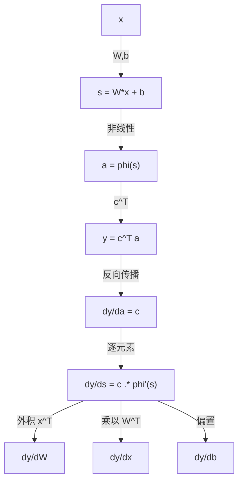

一句话版：**复杂函数 = 小积木层层嵌套**。链式法则告诉我们：整体的导数 = 每块积木的“局部导数”按**形状匹配**后依次相乘。

在深度学习里，前向是“把数据一层层喂进去”，反向就是“把误差一层层乘回来”。这“乘回来”的规则，正是链式法则的矩阵/向量形态。

------

## 1. 从单变量到多变量：直觉热身

**单变量回顾**
 若 $y=f(g(x))$，则

$\frac{dy}{dx} = f'(g(x))\cdot g'(x).$

类比：你开车（$x\to g\to f$），“速度相乘”得到整体速度的变化。

**多变量直觉**
 当 $x\in\mathbb{R}^n$、中间量 $u=g(x)\in\mathbb{R}^m$、输出 $y=f(u)\in\mathbb{R}^k$ 时，**导数变成“线性映射”与“矩阵”**，相乘要**注意形状对齐**：

- $J_g(x)\in\mathbb{R}^{m\times n}$：$g$ 的雅可比矩阵；

- $J_f(u)\in\mathbb{R}^{k\times m}$：$f$ 的雅可比矩阵；

- 组合 $f\circ g$ 的雅可比：

  Jf∘g(x)=Jf(g(x))  Jg(x)(形状 k×m  ×  m×n=k×n).J_{f\circ g}(x)=J_f(g(x))\;J_g(x)\quad(\text{形状 } k\times m \;\times\; m\times n = k\times n).

> 记忆口令：**“靠近输出的雅可比写在左边，靠近输入的写在右边”**。

------

## 2. 标量输出的链式法则（最常用）

设 $g:\mathbb{R}^n\to\mathbb{R}^m$，$f:\mathbb{R}^m\to\mathbb{R}$。令 $u=g(x)$，$L=f(u)$。
 则

$\nabla_x L \;=\; J_g(x)^\top \nabla_u f(u).$

- $\nabla_u f(u)\in\mathbb{R}^{m}$（列向量）：对中间变量 $u$ 的梯度；
- $J_g(x)^\top\in\mathbb{R}^{n\times m}$：把“对 $u$”的梯度**拉回**到“对 $x$”的梯度。

这就是深度学习里常说的 **VJP（Vector–Jacobian Product）**：向量 $\nabla_u f$ 左乘 $J_g^\top$。

### 小例子（手算 + 直觉）

令

$g(x)=\begin{bmatrix} x_1^2 + x_2\\ \sin x_1 \end{bmatrix},\quad f(u)=u_1^2+3u_2, \quad x=(x_1,x_2).$

有

$\nabla_u f = \begin{bmatrix}2u_1\\3\end{bmatrix},\quad J_g= \begin{bmatrix} 2x_1 & 1\\ \cos x_1 & 0 \end{bmatrix}.$

于是

$\nabla_x L = J_g^\top \nabla_u f = \begin{bmatrix} 2x_1 & \cos x_1\\ 1 & 0 \end{bmatrix} \begin{bmatrix} 2(x_1^2+x_2)\\[4pt] 3 \end{bmatrix} = \begin{bmatrix} 4x_1(x_1^2+x_2)+3\cos x_1\\ 2(x_1^2+x_2) \end{bmatrix}.$

把它想象成：“先算出中间层的**灵敏度**（$\nabla_u f$），再乘以前层的**局部线性近似**（$J_g^\top$）”。

------

## 3. 向量→向量的链式法则（雅可比相乘）

若 $g:\mathbb{R}^n\to\mathbb{R}^m$、$f:\mathbb{R}^m\to\mathbb{R}^k$，则

$J_{f\circ g}(x)=J_f(g(x))\,J_g(x).$

**示例**：
 $g(x)=\begin{bmatrix}x_1+x_2\\x_1x_2\end{bmatrix}$,
 $f(u)=\begin{bmatrix}u_1^2\\ e^{u_2}\end{bmatrix}$。
 则

$J_g= \begin{bmatrix} 1 & 1\\ x_2 & x_1 \end{bmatrix},\quad J_f= \begin{bmatrix} 2u_1 & 0\\ 0 & e^{u_2} \end{bmatrix}.$

合成 $J_{f\circ g}(x)=J_f|_{u=g(x)}\cdot J_g(x)$。

------

## 4. 用微分记法看链式法则（更稳！）

把“导数”看作“**一阶线性近似**”：
 对标量 $L=f(u)$，有

$dL = \nabla_u f(u)^\top\,du,\qquad du = J_g(x)\,dx.$

串起来：

$dL = \nabla_u f(u)^\top J_g(x)\,dx  = \underbrace{\big(J_g(x)^\top\nabla_u f(u)\big)}_{\nabla_x L}^\top dx.$

**优点**：微分记法能自然处理形状，并且和自动微分里“把梯度往回传”的直觉一致。

------

## 5. 矩阵情形：形状为王（采用“分子布局”）

我们采用常见的**分子布局（numerator layout）**：

- 向量梯度 $\nabla_x L$ 视为**列向量**；
- 对矩阵 $W$，$\frac{\partial L}{\partial W}$ 与 $W$ 形状一致。

### 5.1 线性层 + 标量读出（单层 MLP 原型）

令

$s = Wx + b \in \mathbb{R}^m,\quad a = \sigma(s) \in \mathbb{R}^m\quad(\sigma\text{ 为逐元素非线性}),\quad y = c^\top a \in \mathbb{R}.$

**反向（逐层链式）**：

- $\displaystyle \frac{\partial y}{\partial a}=c$；
- $\displaystyle \frac{\partial y}{\partial s}=\frac{\partial y}{\partial a}\odot \sigma'(s)=c\odot \sigma'(s)$（$\odot$ 为逐元素乘）；
- $\displaystyle \frac{\partial y}{\partial W}=\Big(\frac{\partial y}{\partial s}\Big)\,x^\top$（外积，形状 $m\times n$）；
- $\displaystyle \frac{\partial y}{\partial x}=W^\top \Big(\frac{\partial y}{\partial s}\Big)$；
- $\displaystyle \frac{\partial y}{\partial b}=\frac{\partial y}{\partial s}$。

> 口诀：**上一层的“误差向量”乘以前一层的局部导数**；遇到仿射层 $s=Wx+b$，对 $W$ 是**误差外积输入**，对 $x$ 是**权重转置乘误差**。

### 5.2 二次型（凸优化常客）

$y=x^\top A x\quad(\text{标量}).$

若 $A$ 不一定对称，

$\nabla_x y = (A+A^\top)x.$

（当 $A$ 对称，$\nabla_x y = 2Ax$。）

### 5.3 “迹技巧”（trace trick）常用导数

- $\displaystyle \frac{\partial}{\partial X}\,\mathrm{tr}(A^\top X)=A$；
- $\displaystyle \frac{\partial}{\partial X}\,\mathrm{tr}(AXB)=A^\top B^\top$；
- $\displaystyle \frac{\partial}{\partial X}\,\mathrm{tr}(X^\top X)=2X$。

把标量目标写成 $\mathrm{tr}(\cdot)$ 往往能简化矩阵求导与链式法则的形状对齐。

------

## 6. Softmax + 交叉熵：深度学习里的“链式明星”

设

$z = Wx + b\in\mathbb{R}^K,\quad p=\mathrm{softmax}(z),\quad L=-\log p_{y}.$

有

$\frac{\partial L}{\partial z} = p - \mathrm{onehot}(y),\qquad \frac{\partial L}{\partial W} = \Big(p - \mathrm{onehot}(y)\Big)\,x^\top,\qquad \frac{\partial L}{\partial x} = W^\top\Big(p - \mathrm{onehot}(y)\Big).$

这整套推导就是链式法则把“softmax 的雅可比 + 交叉熵的梯度”与“仿射层的雅可比”依次相乘的结果。

------

## 7. 计算图与反向传播的链式乘法



**说明**：图示了从前向计算 $x \rightarrow s \rightarrow a \rightarrow y$ 到反向传播的梯度传递：先得到 $\mathrm{d}y/\mathrm{d}a$，再逐元素乘非线性导数得到 $\mathrm{d}y/\mathrm{d}s$，随后按链式法则分别得到对 $W$（外积）、对 $x$（乘 $W^\top$）与对 $b$（偏置项）的梯度。

------

## 8. 工程视角：VJP / JVP 与自动微分

- **VJP（Vector–Jacobian Product）**：给定向量 $v$（来自上游的梯度），计算 $J^\top v$。反向模式（PyTorch/TF 默认）**一次回传拿到所有参数的梯度**，适合**标量损失**。
- **JVP（Jacobian–Vector Product）**：给定向量 $v$（输入方向），计算 $Jv$。前向模式适合**输入维度小、输出维度大**或**方向导数/灵敏度**计算。

**经验**：理解这两种“乘法”就是理解“链式法则在代码层怎么落地”。

------

## 9. 代码校验（PyTorch）：看形状 & 看链式

```python
# 需要: torch
import torch

torch.manual_seed(0)
n, m = 4, 3
x = torch.randn(n, requires_grad=True)       # 输入 x ∈ R^n
W = torch.randn(m, n, requires_grad=True)    # 权重 W ∈ R^{m×n}
b = torch.randn(m, requires_grad=True)
c = torch.randn(m, requires_grad=True)

# 前向：y = c^T σ(Wx+b)
s = W @ x + b
a = torch.tanh(s)                 # 用 tanh 代替 σ，σ'(s)=1 - tanh^2(s)
y = c @ a                         # 标量

# 反向：自动微分
y.backward()

# 理论梯度（链式）
sigma_prime = 1 - a**2            # tanh'(s) = 1 - tanh(s)^2
dy_ds = c * sigma_prime           # ∂y/∂s
grad_W_theory = dy_ds.unsqueeze(1) @ x.unsqueeze(0)    # 外积: m×1 @ 1×n → m×n
grad_x_theory = W.t() @ dy_ds
grad_b_theory = dy_ds

print("∥grad_W - theory∥:", (W.grad - grad_W_theory).norm().item())
print("∥grad_x - theory∥:", (x.grad - grad_x_theory).norm().item())
print("∥grad_b - theory∥:", (b.grad - grad_b_theory).norm().item())
```

> 输出应非常接近 0，说明我们的链式/形状推导和 Autograd 一致。

------

## 10. 易错点清单（踩坑少一半）

1. **形状不对齐**：最常见错误。多画一眼 $J$ 的形状，确保“左乘/右乘”方向正确。
2. **转置丢失**：$\nabla_x L = J_g^\top \nabla_u f$ 里的 **$^{\top}$** 容易写漏。
3. **逐元素 vs. 矩阵运算**：$\sigma'(s)$ 是向量，要用逐元素乘 $\odot$，不是矩阵乘。
4. **Softmax 雅可比**：$J=\mathrm{diag}(p)-pp^\top$，但配上交叉熵后简化成 $p-\mathrm{onehot}(y)$。
5. **非光滑点**：ReLU 在 0 处不可导，实际采用**次梯度**（实现里通常取 0 或 1 的某个约定）。
6. **广播陷阱**：Python/Numpy/PyTorch 的广播让代码能跑，但不代表数学上形状推导对。先推形状，再写代码。

------

## 11. 小结

- **标量→向量→矩阵**的链式法则，本质都是“把局部线性近似按形状串起来”。
- 标量损失场景下，$\nabla_x L = J_g^\top \nabla_u f$ 是工作马——反向模式自动微分就是不断做 **VJP**。
- 在线性层 + 非线性 + 损失 的组合里，链式法则给出了**清晰、可实现、可单测**的反向公式。
- 记住口诀：**靠近输出的导数写左边，靠近输入的写右边；形状对齐，处处为王。**
