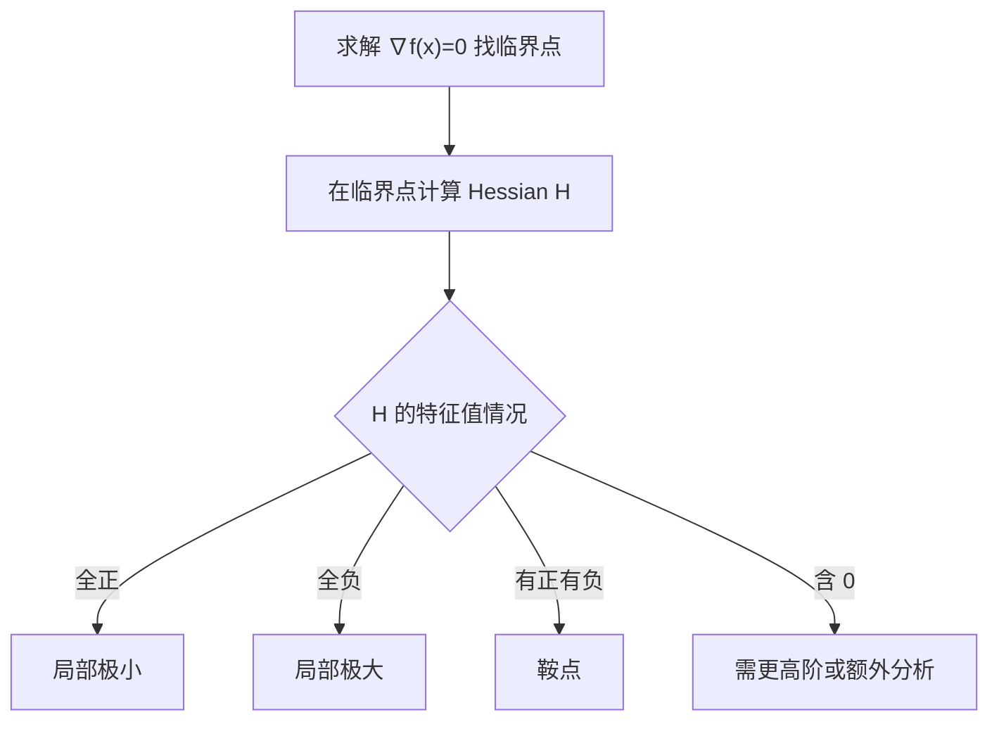

一句话版：**Hessian = 二阶偏导的大集合**。它告诉我们“在某点附近，函数往各个方向弯曲得有多厉害”。在优化里，Hessian 决定了**曲率**，进而影响**步长、收敛速度与是否是极值还是鞍点**。

------

## 1. 从二阶泰勒展开出发

对可二阶可微的标量函数 $f:\mathbb{R}^n\to\mathbb{R}$，在点 $x_0$ 的二阶泰勒近似：

$f(x_0+h)\;\approx\; f(x_0)\;+\;\nabla f(x_0)^\top h\;+\;\tfrac12\, h^\top \nabla^2 f(x_0)\, h.$

- $\nabla f(x_0)$ 是一阶项（线性近似）。
- $\nabla^2 f(x_0)$ 就是 **Hessian 矩阵**（二阶项，刻画弯曲）。
- $h$ 是一个很小的位移。

**Hessian 定义**（对光滑函数，混合偏导交换）：

$\nabla^2 f(x)=\begin{bmatrix} \frac{\partial^2 f}{\partial x_1^2} & \cdots & \frac{\partial^2 f}{\partial x_1\partial x_n}\\ \vdots & \ddots & \vdots\\ \frac{\partial^2 f}{\partial x_n\partial x_1} & \cdots & \frac{\partial^2 f}{\partial x_n^2} \end{bmatrix}.$

**生活类比**：

- 一阶项像“当前的坡度”；
- 二阶项像“坡度的变化率”，决定你是走到“平缓盆地”还是“马鞍”。

------

## 2. 几何直觉：方向二阶导与主曲率

沿单位方向 $u$ 的二阶方向导：

$D^2_{u} f(x_0) \;=\; u^\top \nabla^2 f(x_0)\, u.$

- 这是**方向 $u$** 上的弯曲程度。
- 如果把等高线在 $x_0$ 附近近似成一个二次型椭圆，Hessian 的**特征向量**给出主轴方向，**特征值**给出主轴上的曲率大小。

**快速判断**：

- 全部特征值 $>0$ → 局部是“碗形” → **局部极小**；
- 全部特征值 $<0$ → 局部“倒碗” → **局部极大**；
- 有正有负 → **鞍点**；
- 存在 0 → **不定**，需看更高阶项或额外分析。

------

## 3. 极值判定：特征值 vs. 主子式（Sylvester 判据）

- **特征值判定**：看 $\nabla^2 f(x^\*)$ 的特征值符号，如上所述。
- **Sylvester 判据（对称矩阵）**：
   主子式行列式 $\Delta_k=\det(H_{1:k,1:k})$（左上 $k\times k$ 子块）：
  - 全部 $\Delta_k>0$ → 正定 → 极小；
  - $(-1)^k\Delta_k>0$（符号交替）→ 负定 → 极大；
  - 否则不定。

> 工程上常用**特征值**或**Cholesky**（看能否分解）来检测正定性。

------

## 4. 例子：二次型与鞍点

设 $f(x,y)=x^2+3xy+5y^2$。

$\nabla f=[2x+3y,\;3x+10y]^\top,\quad \nabla^2 f=\begin{bmatrix}2&3\\3&10\end{bmatrix}.$

- $\nabla^2 f$ 的特征值均 $>0$（或检查主子式 $2>0,\;2\cdot10-3\cdot3=11>0$），故正定→**严格凸**→全局唯一极小值在 $\nabla f=0$ 处（即 $x=y=0$）。

再看 $g(x,y)=x^2-y^2$，

$\nabla^2 g=\begin{bmatrix}2&0\\0&-2\end{bmatrix},$

有正有负→**鞍点**（原点附近某方向上向上弯，另一方向向下弯）。

------

## 5. 牛顿法：用曲率修正步长方向

**单变量**：
 对 $f'(x)=0$，牛顿步：

$x_{k+1}=x_k-\frac{f'(x_k)}{f''(x_k)}.$

**多变量**：

$x_{k+1}=x_k - \big(\nabla^2 f(x_k)\big)^{-1}\nabla f(x_k).$

等价于解线性方程

$\nabla^2 f(x_k)\,p_k = -\nabla f(x_k),\qquad x_{k+1}=x_k+p_k.$

- 当 $H=\nabla^2 f$ 正定且离最优点足够近时，牛顿法**二次收敛**（很快）。
- 当 $H$ 非正定，步子可能朝“上坡”方向走；常用**阻尼/线搜索**或**信赖域**修正；也可做**修正牛顿**把 $H$ 投成正定（如加 $\lambda I$）。

**生活类比**：只用梯度像“盲目下坡”；加 Hessian 像“拿了地形图”，知道前方弯曲多陡，就能**更聪明地拐弯与定步长**。

------

## 6. 极值判定流程（二维直观版）



**说明**：图示了“先找临界点，再用 Hessian 的谱（特征值）判定临界点性质”的常见流程。

------

## 7. 深度学习里的 Hessian：为什么关心它？

1. **收敛速度与预条件**：
    在损失很“扁/陡”相间的高维谷里（病态条件数），一阶法会“之字形”。利用 Hessian 信息（或近似）做**预条件**能加快收敛。
2. **泛化与曲率**（直观讨论）：
    经验上“更平坦”的极小点往往有更好泛化；衡量平坦性可看 Hessian 的谱（如最大特征值、迹）。工程上也会用 **SAM** 这类方法显式考虑曲率邻域的损失变化（不必纠结理论争议，记住“曲率大→更尖”这一直觉）。
3. **Fisher ≈ Hessian（对数似然场景）**：
    对负对数似然，Fisher 信息矩阵在期望意义上可近似 Hessian；很多二阶近似（如自然梯度、K-FAC）基于这一联系。
4. **Hessian 向量积（HVP）**：
    直接存 Hessian 需要 $O(n^2)$ 内存，计算也贵。**HVP** 可以在不显式形成矩阵下，计算 $Hv$。这对二阶方法（共轭梯度、信赖域）至关重要，自动微分可 $O(n)$ 成本实现。

------

## 8. 二阶近似的工程变体

- **Gauss–Newton**（最小二乘问题）：把 Hessian 近似为 $J^\top J$，避免显式二阶导，**天然正定**，常用于非线性最小二乘与一些网络训练阶段。
- **Levenberg–Marquardt**：在 Gauss–Newton 基础上加阻尼 $\lambda I$，介于梯度下降与高斯–牛顿之间，避免数值不稳。
- **BFGS / L-BFGS**：**拟牛顿**方法，用一阶信息迭代构造 $H^{-1}$ 的近似，L-BFGS 只存少量向量，适合中等规模问题。
- **信赖域**：在“可信半径”内最小化二次模型（可借助 HVP 和共轭梯度近似解子问题），对不良曲率更鲁棒。

------

## 9. 代码上手：用 PyTorch 计算梯度、Hessian 和 HVP

> 目标函数示例（可换成你的损失函数）
>  $f(x)=\tfrac12\,x^\top A x + b^\top x + \lambda \|x\|^4$（加了弱非线性项）

```python
# 需要: torch
import torch

torch.manual_seed(0)
n = 5
A = torch.randn(n, n)
A = A.T @ A + 0.1*torch.eye(n)  # 保证对称正定
b = torch.randn(n)
lam = 1e-2

def f(x):
    quad = 0.5 * x @ (A @ x) + b @ x
    nonlin = lam * (x @ x)**2
    return quad + nonlin

x = torch.randn(n, dtype=torch.float64, requires_grad=True)

# 梯度
y = f(x)
(y).backward(create_graph=True)             # 保留图以便二阶
g = x.grad.clone()                          # ∇f
x.grad.zero_()

# Hessian 向量积（Pearlmutter 技巧）
def hvp(func, x, v):
    y = func(x)
    grads = torch.autograd.grad(y, x, create_graph=True)[0]
    hv = torch.autograd.grad(grads, x, grad_outputs=v)[0]
    return hv

v = torch.randn(n, dtype=torch.float64)
Hv = hvp(f, x, v)

# 显式 Hessian（小维度可做）
H_cols = []
for i in range(n):
    ei = torch.zeros(n, dtype=torch.float64); ei[i] = 1.0
    H_cols.append(hvp(f, x, ei).detach())
H = torch.stack(H_cols, dim=1)              # n×n

print("||grad|| =", g.norm().item())
print("v^T H v =", v @ (H @ v))
```

**要点**：

- `create_graph=True` 让梯度可继续求导（用于二阶）。
- `hvp` 利用“梯度再求一次方向导”，无需显式构造 Hessian。
- 实际训练中，常把 HVP 嵌入**共轭梯度**或**信赖域子问题**求解器中。

------

## 10. 数值与实现的常见坑

1. **非正定 Hessian**：牛顿步可能往上走；用**线搜索/信赖域/阻尼**修正，或把 $H$ 做近似正定化（加 $\lambda I$）。
2. **尺度问题**：特征值差距大（病态）会导致震荡；做**特征缩放/预条件**或选用 **L-BFGS** 等。
3. **显式 Hessian 太大**：用 **HVP**，并配合迭代解法；或者使用 **Gauss–Newton**、**K-FAC** 等结构化近似。
4. **自动微分的二阶图太重**：必要时对子图做**停止梯度**（避免无谓二阶），或“分块/分批”估计谱量（如最大特征值用幂迭代+HVP）。
5. **非光滑损失**：Hessian 不存在或不稳定（如 ReLU 拐点）；可用**次梯度**、**平滑替代**（Softplus、Huber）或统计近似（Fisher）。

------

## 11. 练习与参考

**练习 1**：
 $f(x,y)=x^4+2x^2y^2+y^4$。
 求 $\nabla f$、$\nabla^2 f$，并判断 $(0,0)$ 的临界点性质。
 **提示**：$\nabla f=[4x^3+4xy^2,\;4x^2y+4y^3]^\top$；$\nabla^2 f=\begin{bmatrix}12x^2+4y^2&8xy\\8xy&4x^2+12y^2\end{bmatrix}$。在原点 $H=0$，需用高阶项；任意方向四次项非负 → 原点是**（非严格）极小**。

**练习 2（牛顿步）**：
 对 $f(x,y)=x^2+3xy+5y^2$，从 $(1,-1)$ 出发，算牛顿步 $p$ 并更新点。
 **提示**：解 $Hp=-g$，其中 $H=\begin{bmatrix}2&3\\3&10\end{bmatrix},\;g=[-1,\,7]^\top$。

**练习 3（HVP 实操）**：
 把第 9 节代码改为你的模型损失，随机取向量 $v$，计算 $v^\top H v$ 并用幂迭代估计最大特征值。

------

## 12. 小结

- Hessian 把“各方向的二阶变化”系统化：**方向二阶导 = $u^\top H u$**。
- 通过 **特征值/主子式** 可判定临界点性质；二阶泰勒近似给出局部地形。
- 在优化中，牛顿法与其变体用 Hessian（或近似）提速；HVP 让二阶方法在高维上可行。
- 深度学习里，曲率影响训练稳定性与泛化；Fisher、K-FAC、SAM 等都与“二阶信息”密切相关。

> 
