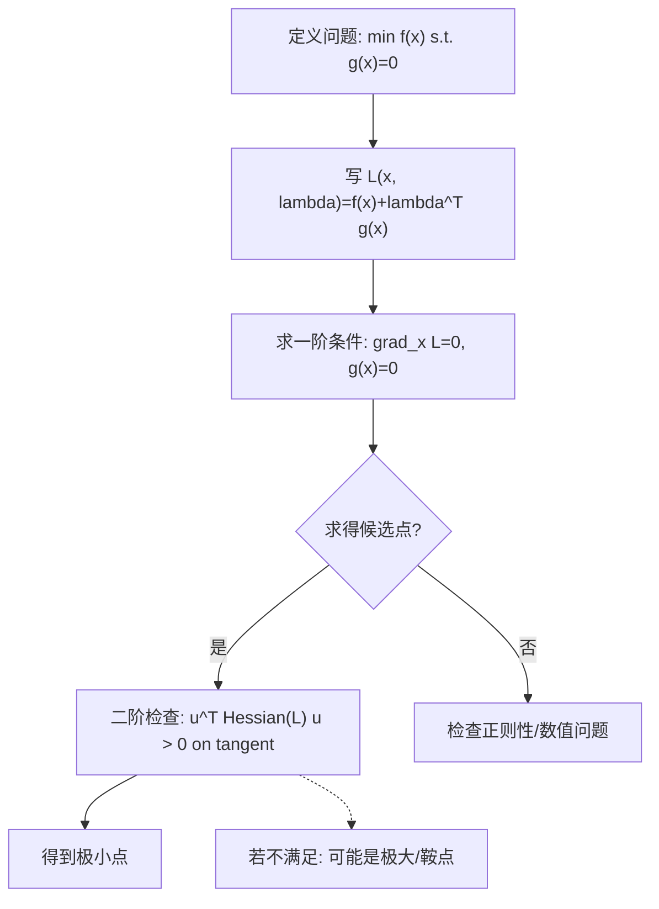

一句话版：**把“只能在约束曲面上走”的极值问题，变成无约束的临界点问题**。在几何上，最优点处目标函数的等高线**与约束曲面“刚好贴住”**——二者的法向量共线（或共张成空间）。

---

## 1. 场景与直觉

我们经常遇到：

$$
\min_{x\in\mathbb{R}^n} f(x)\quad \text{s.t. } g_i(x)=0,\; i=1,\dots,m.
$$

* **生活类比**：想在操场跑步（目标是尽快到终点），但**必须沿着白线**（约束曲线）跑。最优点处，**你想前进的方向**（目标函数最快下降方向）与**白线的法向**形成了特定关系：你再也不能沿白线“朝更低的方向挪动”。

* **几何图像**：

  * 无约束极小值：$\nabla f(x^*)=0$。
  * **有等式约束**：$\nabla f(x^*)$ 不必为零，但**一定在约束的法向空间内**（被约束“顶住”），即

  $$
   \nabla f(x^*) \in \mathrm{span}\{\nabla g_1(x^*),\dots,\nabla g_m(x^*)\}.
  $$

---

## 2. 拉格朗日函数与一阶条件（KKT 的等式部分）

**拉格朗日函数**：

$$
\mathcal{L}(x,\lambda)=f(x)+\sum_{i=1}^m \lambda_i\, g_i(x).
$$

**一阶必要条件（等式约束）**：若 $x^*$ 为局部极值，且约束满足一定的正则条件（例如约束梯度线性无关），则**存在**乘子 $\lambda^*$ 使

$$
\begin{cases}
\nabla_x \mathcal{L}(x^*,\lambda^*)= \nabla f(x^*)+\sum_i \lambda_i^* \nabla g_i(x^*)=0,\\
g_i(x^*)=0,\quad i=1,\dots,m.
\end{cases}
$$

这就是\*\*“目标梯度 = 约束梯度的线性组合”\*\*。
单个约束时可写成：$\nabla f(x^*) = -\lambda^* \nabla g(x^*)$（两个法向共线）。

**经济/工程解释**：$\lambda_i^*$ 常被称为**影子价格（shadow price）**：放宽第 $i$ 个约束一点点，最优目标值会如何变化。

---

## 3. 二阶条件：最小 vs. 最大 vs. 鞍点

一阶条件只保证“驻点”，要区分极小/极大/鞍点需看**二阶**。定义**拉格朗日 Hessian**：

$$
\nabla_{xx}^2 \mathcal{L}(x^*,\lambda^*)=\nabla^2 f(x^*)+\sum_i \lambda_i^* \nabla^2 g_i(x^*).
$$

* 极小的**充要判据（等式约束的二阶充分条件，简化版）**：
  对所有满足**切空间约束** $\nabla g_i(x^*)^\top u=0$ 的方向 $u\neq 0$，若

$$
u^\top \nabla_{xx}^2 \mathcal{L}(x^*,\lambda^*)\,u>0,
$$

  则 $x^*$ 为**严格局部极小**。
  直观：在**允许移动的方向**（切空间）上，二阶曲率都向上。

---

## 4. 单约束的“手算”推导（几何最经典）

**问题**：$\min f(x,y)$ s.t. $g(x,y)=0$。

1. 构造 $\mathcal{L}(x,y,\lambda)=f(x,y)+\lambda\, g(x,y)$。
2. 解方程组：

$$
\begin{cases}
f_x+\lambda g_x=0,\\
f_y+\lambda g_y=0,\\
g(x,y)=0.
\end{cases}
$$
3. 候选解带回 $f$ 比较大小或用二阶条件判别。

**几何画面**：最优点处，$f$ 的等高线与 $g=0$ 曲线**相切**（法向共线）。
这也是为什么“梯度方向只在法向空间里”，切向方向的分量为零（否则还能沿约束进一步下降）。

---

## 5. 多约束的矩阵写法（更工程）

把约束写成向量 $g(x)=[g_1(x),\dots,g_m(x)]^\top$。

* 约束雅可比 $J_g(x)\in\mathbb{R}^{m\times n}$，第 $i$ 行为 $\nabla g_i(x)^\top$。
* 一阶条件：

$$
\nabla f(x^*) + J_g(x^*)^\top \lambda^* = 0,\quad g(x^*)=0.
$$

* 切空间：$\{u:\;J_g(x^*)\,u=0\}$。
* 二阶条件：对所有 $u\in\ker J_g(x^*)\setminus\{0\}$，有

$$
u^\top\nabla_{xx}^2\mathcal{L}(x^*,\lambda^*)u>0.
$$

---

## 6. 例子 1：最短距离到直线

$$
\min_{x,y}\; f(x,y)=(x-2)^2+(y+1)^2\quad \text{s.t. } x+y=1.
$$

* $\mathcal{L}=(x-2)^2+(y+1)^2+\lambda(x+y-1)$。
* 一阶条件：

  $$
  \begin{cases}
  2(x-2)+\lambda=0\\
  2(y+1)+\lambda=0\\
  x+y-1=0
  \end{cases}
  \Rightarrow
  \begin{cases}
  x=2-\lambda/2\\
  y=-1-\lambda/2\\
  (2-\lambda/2)+(-1-\lambda/2)=1
  \end{cases}
  \Rightarrow \lambda=0,\; (x^*,y^*)=(2,-1).
  $$
* 该点在直线上，且是到 $(2,-1)$ 的垂足（平凡但直观）。
* 二阶：$\nabla_{xx}^2\mathcal{L}=2I$，切空间上当然正定 → 极小。

---

## 7. 例子 2：**最大熵分布（只含等式约束的版本）**

在离散有限集合上选概率 $p_i$，最大化熵

$$
\max_{p}\; H(p)=-\sum_i p_i\log p_i\quad
\text{s.t.}\;\sum_i p_i=1,\;\sum_i p_i\,c_i=\mu.
$$

构造

$$
\mathcal{L}(p,\lambda,\nu)=-\sum_i p_i\log p_i\;+\;\lambda\Big(\sum_i p_i-1\Big)\;+\;\nu\Big(\sum_i p_i c_i-\mu\Big).
$$

一阶条件（对每个 $i$）：

$$
-\log p_i -1 + \lambda + \nu c_i=0
\;\Rightarrow\;
p_i \propto \exp(\nu c_i).
$$

这说明：**仅有等式约束**时，最大熵给出**指数族形状**。
（若再加 $p_i\ge 0$ 则成不等式约束，会进入完整的 KKT。）

---

## 8. 工程案例：线性等式约束的最小二乘（Closed-form）

**问题**：

$$
\min_x \frac12\|Ax-b\|_2^2 \quad \text{s.t. } Cx=d.
$$

拉格朗日函数：$\mathcal{L}(x,\lambda)=\tfrac12\|Ax-b\|^2+\lambda^\top(Cx-d)$。

一阶条件：

$$
\begin{cases}
A^\top(Ax-b)+C^\top\lambda=0,\\
Cx=d.
\end{cases}
$$

联立成**KKT 线性系统**：

$$
\begin{bmatrix}
A^\top A & C^\top\\
C & 0
\end{bmatrix}
\begin{bmatrix}
x\\ \lambda
\end{bmatrix}
=
\begin{bmatrix}
A^\top b\\ d
\end{bmatrix}.
$$

### 代码（NumPy）

```python
import numpy as np

def eq_constrained_least_squares(A, b, C, d, reg=0.0):
    """
    解 min 1/2||Ax-b||^2 s.t. Cx=d
    若 A^T A 可能病态，可加 reg*I 做轻微正则
    """
    A, b, C, d = map(np.asarray, (A, b, C, d))
    n = A.shape[1]
    KKT = np.block([
        [A.T @ A + reg*np.eye(n), C.T],
        [C, np.zeros((C.shape[0], C.shape[0]))]
    ])
    rhs = np.concatenate([A.T @ b, d])
    sol = np.linalg.solve(KKT, rhs)
    x = sol[:n]
    lam = sol[n:]
    return x, lam

# demo
np.random.seed(0)
A = np.random.randn(50, 5)
true_x = np.array([1, -2, 0.5, 0, 1.5])
b = A @ true_x + 0.1*np.random.randn(50)
C = np.array([[1, 1, 1, 1, 1]])  # 约束: 分量和=1
d = np.array([1.0])

x_star, lam_star = eq_constrained_least_squares(A, b, C, d, reg=1e-6)
print("x* =", x_star, "\nlambda* =", lam_star)
print("Cx =", C @ x_star, "  should equal d =", d)
```

**要点**：

* 这是大规模问题中的基础模块（投影/约束回归/校准等）。
* KKT 系统可以用**块消元**或**增量式方法**更稳地求解；约束少时也可用**Schur 补**加速。

---

## 9. 与机器学习/大模型的连接

1. **约束 ⇄ 正则**（软硬两种）：

   * 硬约束：$\min f(x)$ s.t. $\|x\|_2=t$ 或 $\sum p_i=1$。
   * 软约束（惩罚）：$\min f(x)+\alpha\|x\|_2^2$ 或 $+\beta(\sum p_i-1)^2$。
     在很多情形下，**存在“等价”关系**：给定合适的 $\alpha$ 与 $t$，二者会产生**相同的最优解**（拉格朗日对偶思想）。

2. **概率单纯形**：分类模型输出常要求 $\sum p_i=1$（加上 $p_i\ge 0$ 为不等式）。许多**投影到单纯形**的操作都源自“等式约束 + 拉格朗日”的结构。

3. **归一化层/温度参数**：温度标定、能量模型等常内含“总量/期望为常数”的等式约束，拉格朗日乘子可解释为**归一化因子**或**温度**。

4. **大型训练的工程化**：直接带约束训练较难，常用**惩罚法、增广拉格朗日、ADMM** 等把等式约束稳健地落实到优化流程中（方便分布式/并行）。

---

## 10. 等式约束优化的操作流程



**说明**：

* “grad\_x L=0, g(x)=0” 是一阶 KKT（等式部分）。
* “on tangent” 指在切空间上检查二阶正定性：$J_g(x)u=0$。

---

## 11. 常见坑与排错清单

1. **正则条件（LICQ）**：约束梯度需线性无关，否则乘子可能不唯一，数值不稳。
2. **把驻点当极小**：一定做二阶检查或对比函数值。
3. **缩放与病态**：$A^\top A$ 病态时，KKT 系统易不稳。做**特征缩放**、加小正则、用稳健求解器。
4. **过多/冗余约束**：先做约束消元或检查秩，避免重复约束造成求解困难。
5. **用惩罚代替约束**：惩罚系数太小→约束不紧；太大→数值不稳。增广拉格朗日/ADMM 往往更稳。

---

## 12. 练习与参考

**练习 1（单约束）**
$\min_{x,y} x^2+y^2$ s.t. $x+2y=3$。
**提示**：$\mathcal{L}=x^2+y^2+\lambda(x+2y-3)$，解得 $(x^*,y^*)=(1,1)$。

**练习 2（多约束）**
$\min_{x\in\mathbb{R}^3}\|x-a\|_2^2$ s.t. $\mathbf{1}^\top x=1$、$c^\top x=\mu$。
**提示**：KKT 线性系统求解；$\lambda$ 的意义是“把 $a$ 投影到交叉的两个超平面上”。

**练习 3（工程）**
把你项目里的一个“需要归一”的参数向量（如注意力权重，去掉 softmax），用“等式约束最小二乘 + 投影”实现，比较与 softmax 的差别（稀疏性、可控性）。

---

## 13. 小结

* 拉格朗日乘数把“约束在曲面上”的极值问题变成**驻点方程**：
  $\nabla f + J_g^\top \lambda=0,\; g(x)=0$。
* 二阶条件要在**切空间**上检查拉格朗日 Hessian 的正定性。
* 线性等式约束最小二乘有**干净的 KKT 线性系统**可解；大规模时可用分解/Schur 补。
* 在机器学习里，等式约束无处不在（归一化、概率、能量守恒…），也常用惩罚/增广拉格朗日把它工程化。
