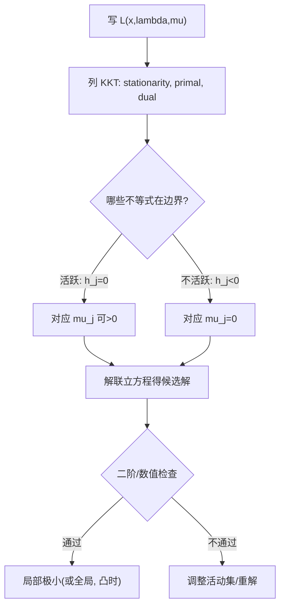

一句话版：**KKT 条件 = “有约束问题的驻点法则”**。它把“目标的梯度”“约束的梯度”和“活跃/不活跃约束”黏在一起，告诉我们：在最优点处，目标无法沿任何允许的方向再下降。

------

## 1. 从问题出发：等式 + 不等式

考虑一般形式

$\begin{aligned} \min_{x\in\mathbb{R}^n}\quad & f(x)\\ \text{s.t.}\quad & g_i(x)=0,\quad i=1,\dots,m,\\ & h_j(x)\le 0,\quad j=1,\dots,p. \end{aligned}$

定义**拉格朗日函数**：

$\mathcal{L}(x,\lambda,\mu) = f(x)+\sum_{i=1}^m\lambda_i g_i(x)+\sum_{j=1}^p \mu_j h_j(x),$

其中 $\lambda\in\mathbb{R}^m$（等式乘子），$\mu\in\mathbb{R}^p$（不等式乘子）。

**直觉类比**：

- 目标 $f$ 想往“下坡”走；
- 约束 $g,h$ 像“护栏/墙”，用乘子 $\lambda,\mu$ 给出“压力”；
- **平衡点**（KKT）= 下坡欲望被墙的法向“正好抵消”。

------

## 2. KKT 一阶条件（必要，很多情形也充分）

在常见的正则条件下（如等式约束梯度线性无关，或凸问题满足 Slater 条件），**最优解** $x^\*$ 与**乘子** $(\lambda^\*,\mu^\*)$ 满足：

1. **驻点（Stationarity）**

$\nabla f(x^\*) + \sum_{i=1}^m \lambda_i^\* \nabla g_i(x^\*) + \sum_{j=1}^p \mu_j^\* \nabla h_j(x^\*) = 0.$

1. **原始可行（Primal feasibility）**

$g_i(x^\*)=0,\;\; h_j(x^\*)\le 0.$

1. **对偶可行（Dual feasibility）**

$\mu_j^\* \ge 0.$

1. **互补松弛（Complementary slackness）**

$\mu_j^\*\, h_j(x^\*) = 0 \quad(\forall j).$

> 互补松弛 = “要么该不等式**活跃**（$h_j=0$），其乘子 $\mu_j^\* \ge 0$ 可能非零；要么**不活跃**（$h_j<0$），其乘子就**必须为 0**。”

**几何图像**：

- **活跃约束**的法向量张成的空间，恰好包含了 $\nabla f(x^\*)$ 的反方向；
- **不活跃**的约束对最优点“没贴住”，所以它们的乘子为 0（没有“压力”）。

------

## 3. 二阶（预告）：怎么区分极小/极大/鞍点？

一阶 KKT 只保证“驻点”。若进一步需要局部极小：

- 构造**拉格朗日 Hessian**：$\nabla_{xx}^2 \mathcal{L}(x^\*,\lambda^\*,\mu^\*)$；
- 在满足**等式约束切空间**与**活跃不等式的切锥**上，检查该二阶型是否**半正定/正定**。
   （具体判据会在优化篇详谈：信赖域/二阶充分条件/活动集等。）

------

## 4. 快速例子：一维不等式的 KKT 味道

### 例 1：约束不活跃

$\min_x\ (x-1)^2\quad \text{s.t. } x\ge 0 \;\;(\text{写作 } h(x)= -x \le 0).$

无约束极小在 $x=1\in \text{可行域内部}$，所以最优 $x^\*=1$、$h(x^\*)=-1<0$ 不活跃，互补松弛给出 $\mu^\*=0$。驻点条件变成 $\nabla f(1)=0$，成立。

### 例 2：落在边界

$\min_x\ (x+1)^2\quad \text{s.t. } x\ge 0.$

无约束极小在 $-1$，不可行；投到边界得 $x^\*=0$。
 KKT：$\nabla f(0)=2(0+1)=2$，且 $h(0)=-0=0$ 活跃，所以 $\mu^\*\ge 0$。驻点：

$\nabla f(0)+\mu^\* \nabla h(0)=0 \Rightarrow 2+\mu^\*(-1)=0 \Rightarrow \mu^\*=2.$

与直觉一致：“墙”给了大小为 2 的反向压力。

------

## 5. 二维示意：谁在“发力”？



**说明**：流程反映了“猜测/判断活动集 → 解 KKT → 二阶或数值检查 → 必要时调整活动集”的常见套路。

------

## 6. 机器学习里的 KKT 身影

1. **软间隔 SVM（凸）**
    原问题（以二范数正则为例）：

$\min_{w,b,\xi\ge 0}\ \tfrac12\|w\|^2 + C\sum_i \xi_i \quad \text{s.t.}\quad y_i(w^\top x_i + b)\ge 1-\xi_i.$

KKT 条件包含：

- 互补松弛 $\alpha_i\,[\,1-\xi_i - y_i(w^\top x_i+b)\,]=0$，$\beta_i\,\xi_i=0$，
- $\alpha_i\ge 0, \beta_i\ge 0$，
- 驻点：$w=\sum_i \alpha_i y_i x_i$，$C-\alpha_i-\beta_i=0$。
   **结论**：只有“支持向量” ($\alpha_i>0$) 决定 $w$；这就是核方法的基础。

1. **Lasso（$\ell_1$）与稀疏性**
    $\min_x \tfrac12\|Ax-b\|^2 + \lambda\|x\|_1$ 可写成带不等式约束的等价问题。KKT/次梯度条件导出**软阈值**（soft-thresholding）闭式解（在简单情形）和稀疏性判据。
2. **概率单纯形投影**
    $\min_x \tfrac12\|x-z\|^2$ s.t. $x\ge 0,\ \mathbf{1}^\top x=1$。
    KKT 推出著名的**排序-找阈值**算法（见下 7）。
3. **带公平/资源约束的训练**
    把统计约束（如 TPR 差异）或预算限制写进 $g,h$，KKT 给出**多目标折中**的结构；工程上常用**惩罚/增广拉格朗日/ADMM**实现。

------

## 7. KKT 推导的一个“实用小工具”：投影到概率单纯形

**问题**：把任意向量 $z\in\mathbb{R}^n$ 投影到

$\Delta=\{x: x_i\ge 0,\ \sum_i x_i=1\}.$

拉格朗日函数：

$\mathcal{L}(x,\tau,\mu)=\tfrac12\|x-z\|^2+\tau\Big(\sum_i x_i-1\Big)-\sum_i\mu_i x_i.$

KKT 给出

$x_i = \max(z_i-\tau,\,0),\quad \sum_i x_i=1.$

于是 $\tau$ 是把 $z$ 整体“下压”的阈值，使截断后的和为 1。

**快速算法**（排序找阈值）：

```python
def project_to_simplex(z):
    # z: 1D numpy array
    import numpy as np
    u = np.sort(z)[::-1]                    # 降序
    cssv = np.cumsum(u) - 1                 # 前缀和减 1
    rho = np.max(np.where(u > cssv / (np.arange(len(z)) + 1))[0])
    tau = cssv[rho] / (rho + 1.0)
    x = np.maximum(z - tau, 0.0)
    return x
```

**工程意义**：注意力/概率输出（去掉 softmax）常需要“投影到单纯形”，这就是 KKT 的“落地应用”。

------

## 8. 正则条件 & 对偶间隙（一点预告）

- **LICQ**（线性无关约束资格）：活跃约束的梯度向量线性无关。用于保证乘子存在/唯一与一阶条件的稳定性。
- **Slater 条件**（凸问题）：存在严格可行点 $(g=0,h<0)$，则 KKT 对凸问题往往**充分且必要**，**强对偶成立**（对偶间隙为 0）。
- **对偶间隙**：原始最优值与对偶最优值的差。凸问题在 Slater 条件下为 0，是停止准则与精度衡量的重要工具。

------

## 9. 练习（带思路）

1. **边界是否活跃？**
    $\min_x (x-2)^2$ s.t. $x\ge 1$。写 KKT 并判定 $\mu^\*$。

> 思路：无约束极小 $x=2$ 在内部 → $\mu^\*=0$。

1. **二维带不等式**
    $\min_{x,y} x^2+y^2$ s.t. $x+y\ge 1$。

> 思路：若无约束极小 $(0,0)$ 不可行，边界 $x+y=1$ 活跃，化作等式 + $\mu\ge 0$。

1. **单纯形投影**
    推导第 7 节算法的阈值公式，并用随机向量数值验证 $\sum_i x_i=1,\ x_i\ge 0$。

------

## 10. 小结

- **KKT 四件套**：驻点、原始可行、对偶可行、互补松弛。
- 它把“目标梯度”与“活跃约束的法向”粘在一起，是有约束最优化的“基石定律”。
- 在凸 + Slater 条件下，KKT **必要且充分**，还能带来强对偶与对偶间隙 0。
- **工程链接**：SVM、Lasso、单纯形投影、资源/公平约束训练、甚至分布式优化（ADMM）都离不开它。
