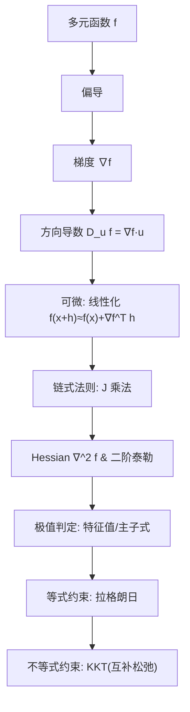

这一章把“多维世界里的斜率”讲清楚了：从**偏导**到**梯度**，再到**方向导数、链式法则、Hessian、拉格朗日乘子**与**KKT 条件**。下面先给你一份“速记版”，再给练习（含答案/提示），最后给工程落地清单与常见坑排查。

------

## A. 一页速记（Cheat Sheet）

### 1) 基本对象

- **多元标量函数**：$f:\mathbb{R}^n\to\mathbb{R}$
   曲面“海拔图”。**等高线**/等值面是“同一高度的轨迹”。

- **偏导**：固定其他变量，只看一个变量的瞬时变化率：

  ∂f∂xi(x0)=lim⁡h→0f(x0+hei)−f(x0)h.\frac{\partial f}{\partial x_i}(x_0)=\lim_{h\to0}\frac{f(x_0+he_i)-f(x_0)}{h}.

- **梯度**：偏导按坐标堆成向量
   $\nabla f=[\partial f/\partial x_1,\dots,\partial f/\partial x_n]^\top$，
   指向**最陡上升**方向；长度是最大上升率。

- **方向导数**：沿单位向量 $u$ 的变化率
   $D_u f(x)=\lim_{t\to0}\frac{f(x+tu)-f(x)}{t}$。
   若 $f$ 在 $x$ 可微，**投影公式**：$D_u f(x)=\nabla f(x)\cdot u$。

### 2) 可微与线性化

- **可微**（Fréchet）：
   $f(x+h)=f(x)+\nabla f(x)^\top h+o(\|h\|)$。
   → 一阶近似（总微分）好用、稳。
- **高阶**：Hessian $\nabla^2 f$ 收集二阶偏导；方向二阶导
   $D_u^2 f(x)=u^\top \nabla^2 f(x)\,u$。

### 3) 链式法则（形状先行）

- **向量形式**：若 $u=g(x)$, $y=f(u)$，
   $J_{f\circ g}(x)=J_f(g(x))\,J_g(x)$。

- **标量损失常用形态**：

  ∇xL=Jg(x)⊤ ∇uf(u).\nabla_x L = J_g(x)^\top\,\nabla_u f(u).

  这是反向传播的 Vector–Jacobian Product（VJP）。

### 4) 极值与曲率（Hessian）

- 特征值全正 → 局部极小；全负 → 局部极大；有正有负 → 鞍点。
- 二阶泰勒：$f(x+h)\approx f(x)+\nabla f^\top h+\frac12 h^\top H h$。

### 5) 约束优化（等式 & 不等式）

- **拉格朗日乘子（等式）**：
   $\mathcal{L}(x,\lambda)=f(x)+\lambda^\top g(x)$。
   一阶：$\nabla f+J_g^\top\lambda=0,\ g(x)=0$。
   二阶：在切空间上检查 $\nabla^2_{xx} \mathcal{L}$ 正定性。
- **KKT（等式+不等式）**：
   驻点、原始可行、对偶可行（$\mu\ge0$）、互补松弛（$\mu_j h_j=0$）。
   凸+Slater 条件下，KKT 还**充分**。

------

## B. 概念关系图（ASCII 版本，避免渲染问题）



**说明**：从局部变化（偏导/梯度）→ 合成（链式）→ 曲率（Hessian）→ 极值 → 约束极值（拉格朗日/KKT）。

------

## C. 工程侧落地清单（给写代码的你）

- **数值梯度检查**：随机单位向量 $u$，用中心差分近似 $D_u f$ 对比 $\nabla f\cdot u$。
- **形状不对齐是 90% 的错**：先写清楚向量/矩阵尺寸，再写代码。
- **HVP（Hessian–Vector Product）**：避免显式 $n^2$ 内存；在 PyTorch 用二次 `autograd.grad`。
- **不可导点**：ReLU/L1 需用次梯度或平滑替代（Softplus、Huber）。
- **约束**：能“投影”就投影（如单纯形/球面），否则用惩罚/增广拉格朗日/ADMM。
- **病态曲率**：预条件/归一化/学习率调度；必要时用二阶近似（Gauss–Newton、L-BFGS）。

------

## D. 习题

### D1. 基础练习（计算与判定）

1.（偏导） $f(x,y)=x^2y+e^{xy}+\sin x$。求 $\partial f/\partial x,\ \partial f/\partial y$，并在 $(0,0)$ 取值。
 2.（梯度） $f(x,y,z)=x y^2 + z e^{x}$。求 $\nabla f$。
 3.（方向导数） $f(x,y)=\sqrt{x^2+4y^2}$ 在 $(3,4)$ 沿单位方向 $u=\frac{1}{5}(4,-3)$ 的方向导数。
 4.（可微性） 证明：若 $f$ 在 $x_0$ 的邻域偏导连续，则 $f$ 在 $x_0$ 可微。
 5.（链式法则） $u=g(x,y)=[x^2+y,\ \sin x]^\top$，$L=f(u)=u_1^2+3u_2$。求 $\nabla_{x,y} L$。
 6.（Hessian） $f(x,y)=x^2+3xy+5y^2$。求 $\nabla^2 f$ 并判定正定性。
 7.（二阶泰勒） 给 $f(x)=x^\top A x + b^\top x$（$A=A^\top$）。在 $x_0$ 展开二阶近似。
 8.（拉格朗日） $\min x^2+y^2$ s.t. $x+2y=3$。求解并说明几何含义。
 9.（KKT 一维） $\min (x-1)^2$ s.t. $x\ge 0$。写出 KKT 并求最优解与乘子。
 10.（KKT 二维） $\min x^2+y^2$ s.t. $x+y\ge 1$。判断边界活跃与最优解。

### D2. 应用与工程（更贴近 ML）

11.（Softmax+CE） 给 $z=Wx+b$，$p=\text{softmax}(z)$，$L=-\log p_y$。推得
 $\partial L/\partial z = p-\text{onehot}(y)$，并据此写出 $\partial L/\partial W,\ \partial L/\partial x$。
 12.（HVP） 设 $f(x)=\tfrac12\|Ax-b\|^2+\lambda \|x\|^4$。推导 $H(x)v$ 的解析形式（不必显式 $H$）。
 13.（单纯形投影） 证明投影问题 $\min_x \tfrac12\|x-z\|^2$ s.t. $x\ge0,\ \mathbf{1}^\top x=1$ 的阈值解
 $x_i=\max(z_i-\tau,0)$ 且 $\sum_i x_i=1$。
 14.（牛顿步） 对 $f(x,y)=x^2+3xy+5y^2$，在 $(1,-1)$ 计算牛顿方向并更新一次。
 15.（约束最小二乘） $\min_x \tfrac12\|Ax-b\|^2$ s.t. $\mathbf{1}^\top x=1$。写 KKT 线性系统并给出消元解法思路。

### D3. 思考题（开放一点）

16.（可微 ≠ 处处“好”） 构造一个函数在原点偏导都存在，但不可微。解释原因（线性近似不成立）。
 17.（曲率与泛化） 简述为何“更平坦”的极小点可能泛化更好；给出可操作的谱指标（如最大特征值）。
 18.（KKT 与活动集） 为什么工程上常用“活动集”法？描述一次迭代的大致流程。

------

## E. 参考答案/提示（部分）

> 下列给出 1/3/5/6/8/9/10/11/12/14/15 的答案或关键步骤；其余留作自测。

**1.**
 $\frac{\partial f}{\partial x}=2xy+y e^{xy}+\cos x,\quad \frac{\partial f}{\partial y}=x^2+x e^{xy}$。
 在 $(0,0)$：$(1,0)$。

**3.**
 $\nabla f=(x/\sqrt{x^2+4y^2},\ 4y/\sqrt{x^2+4y^2})$。在 $(3,4)$：$\nabla f=(3/11,\ 16/11)$。
 方向导数 $=\nabla f\cdot u=(3/11,16/11)\cdot(4/5,-3/5)=\frac{12-48}{55}=-\frac{36}{55}$。

**5.**
 $\nabla_u f=[2u_1,\ 3]^\top$，$J_g=\begin{bmatrix}2x&1\\ \cos x&0\end{bmatrix}$。
 $\nabla_{x,y} L = J_g^\top \nabla_u f = \begin{bmatrix}4x(x^2+y)+3\cos x\\ 2(x^2+y)\end{bmatrix}$。

**6.**
 $H=\begin{bmatrix}2&3\\3&10\end{bmatrix}$。主子式 $2>0,\ 2\cdot10-9=11>0$ → 正定。

**8.**
 $(x^*,y^*)=(1,1)$。几何：到直线 $x+2y=3$ 的最短点（垂足）。

**9.**
 最优 $x^*=1$（内部点），不等式不活跃 → $\mu^*=0$。

**10.**
 无约束极小 $(0,0)$ 不可行；边界活跃：$x+y=1$。
 解等式约束下的最小化：最优在 $(\tfrac12,\tfrac12)$。

**11.**
 $\partial L/\partial z = p-\text{onehot}(y)$，
 $\partial L/\partial W = (p-\text{onehot}(y))\,x^\top,\ \partial L/\partial x = W^\top(p-\text{onehot}(y))$。

**12.**
 $\nabla f = A^\top(Ax-b) + 4\lambda (x^\top x)\,x$。
 $H v = A^\top A v + 4\lambda\big[(x^\top x)v + 2(x^\top v)x\big]$。

**14.**
 $g=\nabla f(1,-1)=[-1,7]^\top$，
 $H=\begin{bmatrix}2&3\\3&10\end{bmatrix}$，解 $Hp=-g$ 得 $p=[1/11,\ -4/11]^\top$。
 一步更新：$(1,-1)+p=(12/11,\ -15/11)$。

**15.**
 KKT：

$\begin{bmatrix} A^\top A & \mathbf{1}\\ \mathbf{1}^\top & 0 \end{bmatrix} \begin{bmatrix} x\\ \tau \end{bmatrix} = \begin{bmatrix} A^\top b\\ 1 \end{bmatrix}.$

消元：先解 $(I-P)A^\top A (I-P)x=(I-P)A^\top b$（其中 $P=\frac{1}{n}\mathbf{1}\mathbf{1}^\top$）或用 Schur 补求 $\tau$。

------

## F. 代码小卡片（数值方向导数 vs. Autograd）

```python
# 需要: numpy, torch
import numpy as np, torch

def f_torch(x):
    # 一个光滑示例：x ∈ R^2
    return x[0]**2 * x[1] + torch.exp(x[0]*x[1]) + torch.sin(x[0])

x0 = torch.tensor([0.7, -0.3], dtype=torch.float64, requires_grad=True)
y = f_torch(x0)
y.backward()
grad = x0.grad.detach().numpy()

# 随机单位方向
u = np.random.default_rng(0).normal(size=2); u /= np.linalg.norm(u)

# 中心差分方向导数
def dir_diff_num(x0_np, u, h=1e-6):
    x0p = torch.tensor(x0_np + h*u, dtype=torch.float64)
    x0m = torch.tensor(x0_np - h*u, dtype=torch.float64)
    return (f_torch(x0p) - f_torch(x0m)).item() / (2*h)

du_num = dir_diff_num(x0.detach().numpy(), u)
du_dot = grad.dot(u)
print("数值方向导数≈", du_num, "  ∇f·u=", du_dot)
```

> 两者应接近（差异源自步长与数值误差）。这是调试链式/梯度实现的“万能对照”。

------

## G. 常见坑 & 排错

- **把“有偏导/方向导数”当“可微”**：必须能用统一线性映射近似。
- **链式法则形状错位**：把 $J_f$ 写左、$J_g$ 写右，维度先对齐再写代码。
- **Hessian 非正定**：牛顿步可能“上坡”；用阻尼/信赖域/修正牛顿。
- **广播导致“能跑但不对”**：先纸上推导维度。
- **约束不正则（LICQ 失效）**：乘子不稳定，优先做约束消元或检查秩。
- **惩罚系数过大**：数值病态；优先用增广拉格朗日/ADMM。
