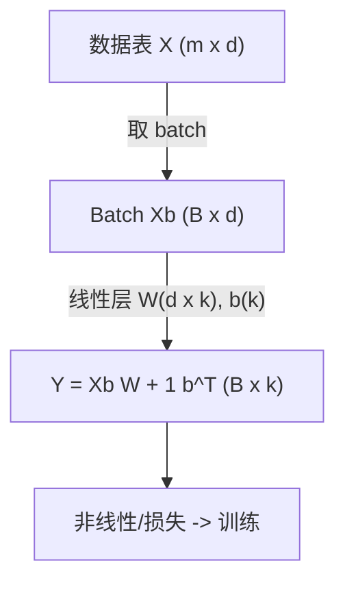
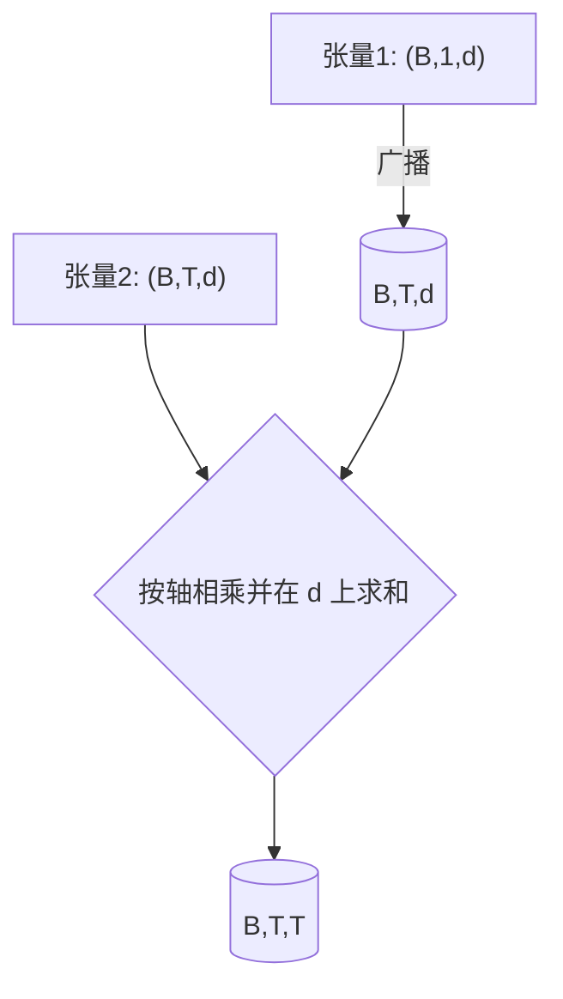

一句话版：**向量是有方向和长度的一列数，矩阵是“把向量变来变去”的机器，张量是把这种机器和数据扩展到更多轴。**
 在机器学习里：样本是向量，数据表是矩阵，图片/序列/批量数据是张量；模型的层和算子大多就是“张量 → 张量”的线性或非线性映射。

------

## 1. 为什么先讲这三个？

- **工程感受**：写 Numpy/PyTorch 时，几乎每一行代码都在处理 `shape`（形状）、`axis`（轴）、`dtype`（数据类型）。
- **数学直觉**：多维世界里，长度、角度、投影、旋转、缩放，都靠线性代数描述。
- **AI 场景**：
  - tabular：$X\in\mathbb{R}^{m\times d}$（$m$ 行样本、$d$ 列特征）；
  - 图片：$X\in\mathbb{R}^{H\times W\times C}$（高、宽、通道）；
  - 文本：嵌入序列 $E\in\mathbb{R}^{T\times d}$；
  - 批量：再加一维 $B$ 就成 $B\times\cdots$。

**生活类比**：

- 向量像“购物清单（苹果、香蕉、牛奶的数量）”。
- 矩阵像“收银机的定价与优惠规则”，输入“清单”，输出“总价分解”。
- 张量像“同时记录多家商店、多个时段、多个品类”的立体账本。

------

## 2. 基本定义与记号

- **标量（scalar）**：单个数，记作 $a\in\mathbb{R}$。
- **向量（vector）**：有序数列，记作列向量 $\mathbf{x}\in\mathbb{R}^n$。
- **矩阵（matrix）**：按行列排布的数，$A\in\mathbb{R}^{m\times n}$。
- **张量（tensor）**：更高阶（$k\ge 3$）的多维数组，如 $\mathcal{T}\in\mathbb{R}^{n_1\times n_2\times\cdots\times n_k}$。
- **Shape（形状）**：各轴长度的元组，如 `(B, T, d)`。
- **秩（order）**：张量的维阶（向量秩 1、矩阵秩 2、三维张量秩 3；注意与“矩阵的秩 rank”不同概念）。

索引习惯：

- 向量 $x_i$；矩阵 $A_{ij}$；张量 $\mathcal{T}_{i j k}$。

------

## 3. 向量：长度、角度与内积

- **内积（dot product）**：

$$
⟨x,y⟩=∑i=1nxiyi=x⊤y.\langle \mathbf{x},\mathbf{y}\rangle = \sum_{i=1}^n x_i y_i = \mathbf{x}^\top \mathbf{y}.
$$

- **范数（norm）**：

$$
∥x∥2=∑ixi2,∥x∥1=∑i∣xi∣,∥x∥∞=max⁡i∣xi∣.\|\mathbf{x}\|_2=\sqrt{\sum_i x_i^2},\quad \|\mathbf{x}\|_1=\sum_i |x_i|,\quad \|\mathbf{x}\|_\infty=\max_i |x_i|.
$$

- **夹角**：

$$
cos⁡θ=x⊤y∥x∥2∥y∥2.\cos\theta=\frac{\mathbf{x}^\top\mathbf{y}}{\|\mathbf{x}\|_2\|\mathbf{y}\|_2}.
$$

  余弦相似度常用于**文本/推荐**中的相似度度量。

**投影到一条直线**（方向 $\mathbf{u}$ 单位向量）：

$$
\mathrm{proj}_{\mathbf{u}}(\mathbf{x}) = (\mathbf{x}^\top \mathbf{u})\ \mathbf{u}.
$$

**ML 直觉**：

- $\ell_2$ 范数 ~ “长度”；$\ell_1$ 范数 ~ “稀疏促使器”；
- 余弦相似度 ~ “方向对齐”而不是“尺度对齐”。

------

## 4. 矩阵：线性变换与组合

把矩阵 $A$ 看成**线性变换**：

$A:\mathbb{R}^n\to\mathbb{R}^m,\quad \mathbf{y}=A\mathbf{x}.$

- **线性** = 保持加法和数乘：$A(\alpha \mathbf{x}+\beta \mathbf{y})=\alpha A\mathbf{x}+\beta A\mathbf{y}$。
- **组合**：先做 $B$ 再做 $A$ 相当于矩阵乘 $AB$。
- **单位矩阵** $I$：不起变化。
- **转置** $A^\top$：交换行列；几何上把行空间/列空间对调。
- **对称/正定**：$A=A^\top$，且 $\mathbf{x}^\top A \mathbf{x}>0$（$\forall \mathbf{x}\ne 0$）→ 椭球形拉伸。
- **对角矩阵**：独立缩放各坐标轴。
- **块矩阵**：把大矩阵分块，有助于推导和高效实现。

**ML 直觉**：

- 线性层：$y=W x + b$；批量：$Y = X W^\top + \mathbf{1} b^\top$。
- 协方差矩阵 $S=\frac1m X^\top X$：描述特征方向的“方差/相关性”；PCA 的核心。

------

## 5. 张量：更多轴，更多结构

- **图片**：$(H,W,C)$ 或 $(C,H,W)$。
- **批量图片**：$(B,H,W,C)$ 或 $(B,C,H,W)$。
- **序列嵌入**：$(B,T,d)$。
- **多头注意力**：$(B,h,T,d_h)$。

常见操作：`reshape`/`view`（改形不拷贝），`permute`/`transpose`（换轴），`concat/stack`（拼接），`broadcast`（自动扩展到兼容形状），`einsum`（爱因斯坦求和，统一表达张量收缩/乘法）。

------

## 6. 四种常见乘法（不要混！）

| 运算            | 记号                        | 形状示例                               | 含义                    |
| --------------- | --------------------------- | -------------------------------------- | ----------------------- |
| **点积**        | $\mathbf{x}^\top\mathbf{y}$ | $(n)\cdot(n)\to()$                     | 一个数，度量对齐程度    |
| **矩阵乘**      | $AB$                        | $(m\times n)(n\times p)\to(m\times p)$ | 线性变换的组合          |
| **Hadamard 乘** | $A\circ B$                  | 同形状 → 同形状                        | 逐元素乘                |
| **外积**        | $\mathbf{x}\mathbf{y}^\top$ | $(m)(n)\to(m\times n)$                 | 由两向量生成的秩 1 矩阵 |

**张量收缩**（泛化的“按某些轴求和相乘”）：可用 `einsum` 表达，例如

$\mathrm{einsum}('btd,bsd\to bts', Q,K) = Q K^\top$

（对最后一维 $d$ 收缩）。

------

## 7. Mermaid 图：从“数据表”到“批量线性层”



**说明**：图示“数据表 → 取批量 → 做线性层”的形状流：`(B,d) @ (d,k) -> (B,k)`，再加偏置。

------

## 8. 示例：Numpy/PyTorch 中的 shape 与广播

```python
# 需要: numpy, torch
import numpy as np, torch

# 1) 点积/外积/矩阵乘
x = np.array([1.0, 2.0, 3.0])             # shape (3,)
y = np.array([4.0, 5.0, 6.0])             # shape (3,)
dot = x @ y                               # 标量
outer = np.outer(x, y)                    # (3,3)
A = np.arange(6.).reshape(2,3)            # (2,3)
B = np.arange(9.).reshape(3,3)            # (3,3)
matmul = A @ B                            # (2,3)

# 2) 广播: (B,1) + (1,d) -> (B,d)
Bsz, d = 4, 3
u = np.arange(Bsz).reshape(Bsz,1)         # (4,1)
v = np.arange(d).reshape(1,d)             # (1,3)
M = u + v                                 # (4,3)

# 3) einsum: 批量内对每对向量做内积
Q = np.random.randn(2, 5, 8)              # (B=2, T=5, d=8)
K = np.random.randn(2, 5, 8)
scores = np.einsum('btd,bsd->bts', Q, K)  # (B, T, T)

# 4) PyTorch: HVP 风格的批量矩阵乘
W = torch.randn(16, 32)                   # (out=16, in=32)
X = torch.randn(4, 32)                    # (B=4, in=32)
Y = X @ W.T                               # (4,16)
```

**形状心法**：先在纸上写出每步的形状，再写代码；广播的一个维度可以是 `1`，框架会自动扩展。

------

## 9. 几何：投影、距离与正交

- **欧氏距离**：$\|\mathbf{x}-\mathbf{y}\|_2$。

- **投影到子空间 $U$**（列满秩 $U\in\mathbb{R}^{n\times r}$）：

  PU=U(U⊤U)−1U⊤,x^=PUx.P_U = U(U^\top U)^{-1}U^\top,\quad \hat{\mathbf{x}}=P_U \mathbf{x}.

  这是最小二乘/主成分分析的基石。

- **正交矩阵**（$Q^\top Q=I$）：保持长度和角度，几何上是旋转/反射。

**ML 连接**：

- PCA = 把数据投影到“方差最大”的 r 维子空间；
- 归一化/白化 ~ 对角化协方差，方便优化。

------

## 10. 张量在注意力里的“落地用法”

设 $Q,K,V\in\mathbb{R}^{B\times T\times d}$，单头注意力：

$\mathrm{scores}=\frac{QK^\top}{\sqrt{d}}\in\mathbb{R}^{B\times T\times T},\quad \mathrm{attn}=\mathrm{softmax}(\mathrm{scores}),\quad \mathrm{out}=\mathrm{attn}\,V\in\mathbb{R}^{B\times T\times d}.$

`einsum` 版本：

```python
scores = torch.einsum('btd,bsd->bts', Q, K) / (Q.size(-1)**0.5)
attn = torch.softmax(scores, dim=-1)
out = torch.einsum('bts,bsd->btd', attn, V)
```

**要点**：

- 对最后一维 $d$ 做收缩得到 `(B,T,T)` 的注意力分数；
- 对 `dim=-1` 做 softmax；
- 再把 `(B,T,T)` 乘 `(B,T,d)` 收缩得到输出 `(B,T,d)`。

------

## 11. Mermaid 图：广播与收缩的概念流程



**说明**：把 `(B,1,d)` 广播到 `(B,T,d)`，与 `(B,T,d)` 逐元素相乘并沿 `d` 轴求和，得到 `(B,T,T)`。

------

## 12. 数值与性能小贴士

- **向量化 > for 循环**：用矩阵/张量运算一次性处理批量。
- **`reshape` vs `view`**：尽量不复制内存；`permute` 只是换轴视图。
- **`contiguous`**：PyTorch 在某些操作后需要 `.contiguous()` 保证内存布局连续。
- **混合精度**：训练时用 FP16/BF16，注意缩放防溢出。
- **大矩阵乘**：优先调用 BLAS/CUDA（库里已经高度优化）。
- **检查形状**：调试时打印 `tensor.shape` 与 `tensor.stride()`，可以快速排错。

------

## 13. 常见坑（踩坑少一半）

1. **把 Hadamard 乘当矩阵乘**：`A * B`（逐元素）和 `A @ B`（线性组合）意义完全不同。
2. **广播导致“能跑但不对”**：维度自动扩展可能掩盖逻辑错误。
3. **转置与批量维**：二维和三维以上的转置不一样（`x.T` vs `x.transpose(…)`）。
4. **通道顺序**：`(N,C,H,W)` vs `(N,H,W,C)`，与库的算子契合度不同。
5. **张量秩 vs 矩阵的 rank**：一个是维阶（order），一个是线性无关性维数（行/列空间维度）。

------

## 14. 练习（附提示）

1. **向量几何**：给 $\mathbf{x}=(3,4)$、$\mathbf{y}=(4,-3)$。
   - 求 $\|\mathbf{x}\|_2$、$\mathbf{x}^\top\mathbf{y}$、夹角 $\theta$。
   - 把 $\mathbf{x}$ 投影到 $\mathbf{y}$ 的方向（先单位化 $\mathbf{y}$）。
2. **矩阵线性层**：$X\in\mathbb{R}^{B\times d}$、$W\in\mathbb{R}^{k\times d}$、$b\in\mathbb{R}^{k}$。
   - 写出 $Y=XW^\top+\mathbf{1}b^\top$ 的形状推导。
   - 用 Numpy 验证形状。
3. **外积与秩**：证明 $\mathbf{a}\mathbf{b}^\top$ 的矩阵秩为 1（若 $\mathbf{a},\mathbf{b}\ne 0$）。
4. **einsum**：推导 `einsum('btd,bsd->bts', Q, K)` 的轴含义，并用随机张量验证与 `matmul` 等价。
5. **PCA 的投影**：证明 $P=U(U^\top U)^{-1}U^\top$ 是“投影到 $\mathrm{span}(U)$”的投影算子（幂等且对称）。
6. **注意力形状**：若多头 $h$，$Q,K,V \in \mathbb{R}^{B\times h\times T\times d_h}$，用 `einsum` 写出分数与输出的式子。
7. **广播陷阱**：构造一个会“广播成功但逻辑错误”的例子，并给出修正方式。

------

## 15. 小结

- **向量**提供长度、角度与投影；**矩阵**是线性变换的载体；**张量**把这些扩展到多轴多批量。
- 牢记四类乘法的区别、张量收缩与广播的规则。
- 任何复杂模型都离不开形状推导：**先纸上写 shape，再编码**。
- 下一节我们将系统展开**向量与矩阵运算（内积、外积、Hadamard 积）**，并继续把这些“形状与算子”落到可复用的工程范式上。
