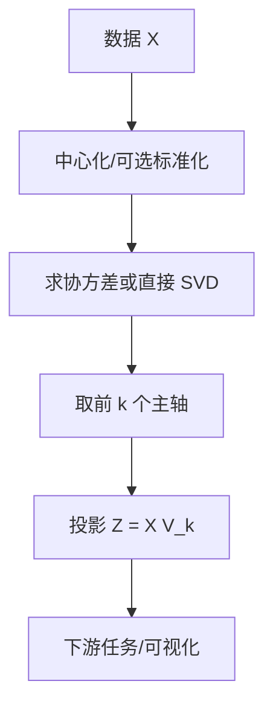

一句话版：**PCA = 找到数据方差最大的坐标轴，把数据投影到这些“最能表达变化”的轴上。**
 它是把“高维点云”换个坐标系：新坐标轴两两正交，按方差从大到小排列。前 $k$ 个主轴往往已经捕捉到**最重要的信息**，其余则多为**噪声或冗余**。

------

## 1. 为什么需要降维？

- **可视化**：把 768 维的文本嵌入降到 2D/3D 看聚团。
- **去噪**：丢掉方差很小的方向，提升下游模型鲁棒性。
- **压缩**：权重矩阵近似为低秩（和 SVD/LoRA 思路一致）。
- **加速**：减少特征数、下降复杂度，缓解维度灾难。

**类比**：用手机拍全景时，算法会找**主要延展方向**拼接；PCA 就是**找主要延展方向**的数学版本。

------

## 2. 两种等价定义（抓住核心）

设零均值数据矩阵 $X\in\mathbb{R}^{m\times d}$（$m$ 条样本，$d$ 维特征）。

### 2.1 最大方差主轴

**第一主成分向量** $v_1$（单位长度）解：

$v_1=\arg\max_{\|v\|=1} \mathrm{Var}(Xv) = \arg\max_{\|v\|=1} v^\top \Big(\tfrac{1}{m}X^\top X\Big) v.$

得到的最大值就是协方差矩阵 $S=\tfrac{1}{m}X^\top X$ 的最大特征值 $\lambda_1$，
 $v_1$ 则是其对应特征向量。后续主成分 $v_2,\dots$ 在前面主成分的正交补上重复该过程。

### 2.2 最小重构误差

找一个 $k$ 维子空间（由列正交矩阵 $V_k\in\mathbb{R}^{d\times k}$ 张成），使投影近似最佳：

$\min_{V_k^\top V_k=I}\ \|X - X V_k V_k^\top\|_F^2.$

解是 $V_k$ 取 $S$ 的前 $k$ 个特征向量；最小误差等于丢弃的特征值之和。
 **这两种定义是等价的**：最大方差 ↔ 最小均方重构误差。

------

## 3. 三条计算路线（各有适用场景）

### 3.1 协方差特征分解（$m\ge d$ 或 $d$ 不大）

1. 中心化 $X$（逐列减均值）。
2. 计算 $S=\tfrac{1}{m}X^\top X$。
3. 求特征分解 $S = V \Lambda V^\top$。
4. 取前 $k$ 列 $V_k$，投影 $Z=X V_k$。

### 3.2 直接做 SVD（推荐，通吃）

对中心化 $X$ 做薄 SVD：

$X=U\Sigma V^\top.$

- 主轴 = $V$ 的列；
- 方差 = $\Sigma^2/m$；
- 投影 $Z = U\Sigma$（或 $X V$）。
   **优势**：当 $m\ll d$ 或 $d\ll m$ 都稳；协方差秩亏时（样本少维度高）也能算。

### 3.3 随机化/增量式（大规模）

- **Randomized SVD**：用随机投影近似前 $k$ 个奇异对；
- **增量式 PCA（IPCA）**：数据流式/分块更新主成分。

------

## 4. 解释能力：如何选 $k$？

- **累计解释方差比（EVR）**：

  $$
EVR(k)=∑i=1kλi∑i=1dλi.\text{EVR}(k)=\frac{\sum_{i=1}^k \lambda_i}{\sum_{i=1}^d \lambda_i}.
  $$

  经验上取能覆盖 90%~99% 的 $k$。

- **拐点（Scree）**：画 $\lambda_i$ 曲线，找到“肘部”。

- **下游验证**：在下游任务上比较性能/速度/内存三者的平衡点。

------

## 5. 几何直觉与可视化

- 数据云被旋转到**主轴坐标系**：第一轴方向伸得最长（最大方差），第二轴其次，…
- 舍弃尾部轴相当于把点云**压扁到前 $k$ 维子空间**。
- 等值曲线从“任意倾斜的椭圆”变成“坐标轴对齐的椭圆”。

------

## 6. PCA 标准流程（数据 → 低维表示）



**说明**：中间可选用 **SVD** 代替协方差特征分解；标准化（每列减均值除以标准差）适用于量纲不同的特征。

------

## 7. 代码速写（NumPy / PyTorch）

### 7.1 NumPy：SVD 版（推荐）

```python
import numpy as np

def pca_svd(X, k):
    # X: (m, d), 行为样本；先中心化
    Xc = X - X.mean(axis=0, keepdims=True)
    U, S, Vt = np.linalg.svd(Xc, full_matrices=False)  # Xc = U Σ V^T
    Vk = Vt[:k].T             # (d, k)
    Z  = Xc @ Vk              # (m, k) 低维表示
    evr = (S**2) / (X.shape[0] * (S**2).sum())  # 每个成分解释方差比
    return Z, Vk, evr

# demo
X = np.random.randn(500, 64)
Z, Vk, evr = pca_svd(X, k=10)
print("Z shape:", Z.shape, "EVR first 3:", evr[:3].round(3))
```

### 7.2 PyTorch：可与 GPU/Autograd 搭配

```python
import torch

def pca_torch(X, k):
    # X: (m, d) float tensor
    Xc = X - X.mean(dim=0, keepdim=True)
    U, S, Vh = torch.linalg.svd(Xc, full_matrices=False)
    Vk = Vh[:k].T                    # (d, k)
    Z  = Xc @ Vk                     # (m, k)
    evr = (S**2) / (X.shape[0] * (S**2).sum())
    return Z, Vk, evr
```

**工程提醒**：样本远小于维度时不要先显式构造协方差（可能秩亏/数值差），直接用 SVD。

------

## 8. 连接大模型与 ML 的常见用法

1. **嵌入压缩/加速**
    把词/句嵌入矩阵 $E\in\mathbb{R}^{V\times d}$ 做截断 SVD（或 PCA），用较小秩 $r$ 近似，减少存储与乘法开销。
2. **特征去相关/白化**
    PCA 后若乘以 $\Lambda^{-1/2}$（在特征子空间），可得到白化特征：各维方差 1、互不相关。
    用于**高斯假设**的模型（如 GMM/FA）常更稳。
3. **初始化与可视化**
    在 t-SNE/UMAP 前先 PCA 到 50 维能降噪、提速；
    做原型聚类/原型检索时，先 PCA 再余弦最近邻能更鲁棒。
4. **低秩微调的直觉**
    PCA 说“有效自由度不高”，LoRA/SVD 微调用低秩近似也在利用这个事实（梯度/权重变化集中在少数主方向）。

------

## 9. 变体与扩展

### 9.1 标准化（Z-score）/相关矩阵 PCA

当各特征量纲差异大、尺度不一时，先做

$\tilde X_{ij}=\frac{X_{ij}-\mu_j}{\sigma_j}$

再 PCA 等价于对**相关矩阵**做特征分解，避免“单位不同引起的主成分偏置”。

### 9.2 Kernel PCA（非线性）

用核函数 $k(x,y)=\langle\phi(x),\phi(y)\rangle$ 隐式映射到高维后再做 PCA。
 实操：构造 Gram 矩阵 $K$，中心化并特征分解。可抓住**非线性流形**结构。

### 9.3 Probabilistic PCA（PPCA）

把 PCA 看作线性高斯生成模型，缺失值可自然处理，且便于与 EM/贝叶斯方法整合。

### 9.4 Incremental/Online PCA

适合数据流/超大数据，按块更新主成分（例如 scikit-learn 的 `IncrementalPCA`）。

------

## 10. 误区与踩坑

1. **未中心化**：不减均值会把主成分“吸”向均值方向。
2. **量纲不一致**：不做标准化，方差大的特征一票否决其他维。
3. **数据泄露**：训练集上拟合 PCA，再用到验证/测试；**绝对不能**用全数据拟合后再评估。
4. **解释误读**：主成分方向的符号可翻（$\pm v$ 等价），别把正负号做语义解读。
5. **协方差秩亏**：$m\ll d$ 时 $\mathrm{rank}(S)\le m-1$，直接特征分解不稳；改 SVD。
6. **把 PCA 当“分类器”**：它只是线性无监督降维；分类要看下游模型。
7. **过度降维**：丢掉的方差可能正是任务相关信息；用下游验证来定 $k$。

------

## 11. 与 SVD 的深度关系（一眼看懂）

- PCA 的主轴 $V$ = SVD 的右奇异向量；
- 解释方差 $\lambda_i = \sigma_i^2/m$；
- 秩-$k$ 的 PCA 重构 $\hat X = U_k \Sigma_k V_k^\top$ 是最优的低秩近似（Eckart–Young）。

------

## 12. 练习（含提示）

1. **手推第一主成分**：
    证明 $\max_{\|v\|=1} v^\top S v$ 的解是 $S$ 的最大特征向量。
    *提示*：用拉格朗日乘子或 Rayleigh 商极值性质。
2. **SVD-PCA 等价**：
    设 $X=U\Sigma V^\top$。证明 $S=\tfrac{1}{m}X^\top X=V(\Sigma^2/m)V^\top$。
    *提示*：代入展开。
3. **解释方差选择 $k$**：
    随机生成一个奇异值快速衰减的矩阵 $X$，实践计算 EVR 曲线；找出覆盖 95% 方差的最小 $k$。
4. **标准化的影响**：
    构造两个量纲差别大的特征，比较“直接 PCA”和“Z-score 后 PCA”的前两主成分是否变化。
5. **Kernel PCA**（加分）：
    用 RBF 核在“同心圆”数据上做 kernel PCA，可视化前两成分，比较线性 PCA 的效果。

------

## 13. 小结

- **PCA = 选主轴（最大方差） + 投影（最小重构误差）**，本质上是协方差的谱分解 / 数据矩阵的 SVD。
- **计算上**：优先 SVD；大规模用随机化/增量式。
- **选维数**：看解释方差/拐点 + 下游验证。
- **工程上**：别忘中心化与标准化、避免数据泄露；用在可视化、去噪、压缩、白化与低秩微调。

