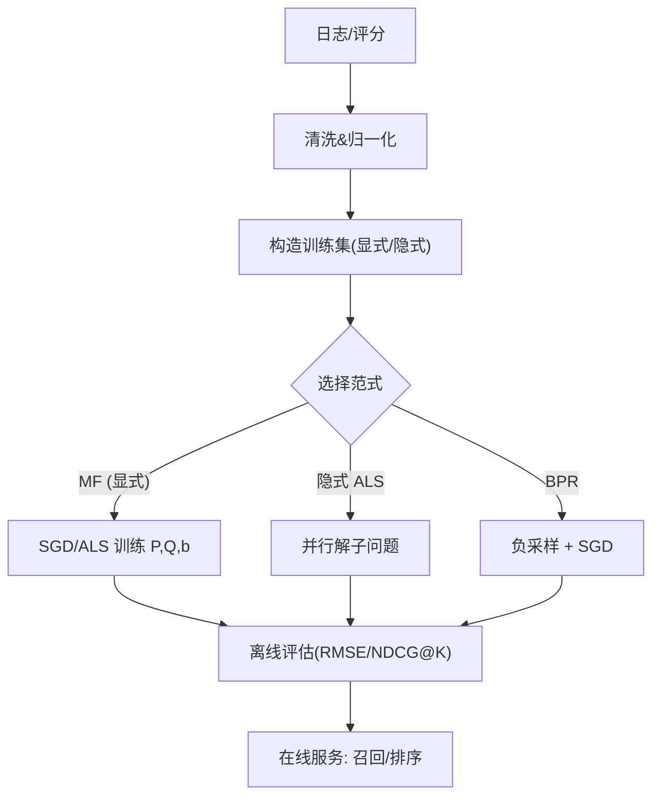

一句话版：把用户–物品评分表看成一张**巨大的稀疏矩阵**，SVD/矩阵分解就是把它拆成**两个低维空间**（用户向量 × 物品向量），在这个空间里做**点积**就能预测“TA 会不会喜欢它”。这既能**补全缺失评分**，也能做**Top-K 推荐**与**召回检索**。

------

## 1. 从评分矩阵到“潜在语义空间”

设用户集合 $\mathcal{U}$、物品集合 $\mathcal{I}$，评分矩阵 $R\in\mathbb{R}^{|\mathcal{U}|\times|\mathcal{I}|}$（大多数位置缺失）。
 **低秩假设**：偏好由少数“隐藏因子”决定：题材、风格、价位、热度等。

- **模型**：

  $$
  R≈UΣV⊤⟹r^ui=⟨pu,qi⟩,R \approx U \Sigma V^\top \quad\Longrightarrow\quad \hat r_{ui}=\langle p_u, q_i\rangle,
  $$

  其中 $p_u\in\mathbb{R}^k$ 是用户向量，$q_i\in\mathbb{R}^k$ 是物品向量（$k\ll \min(|\mathcal{U}|,|\mathcal{I}|)$）。

- **直觉类比**：把“看电影”这件事分解成**少数维度**——“喜剧/文艺”“节奏/时长”“年代/语言”… 用户和电影都在这些轴上有坐标；**坐标越对齐，越可能喜欢**。

------

## 2. 三类常见分解范式（别混）

### 2.1 显式评分的 MF（Funk-SVD）

只对观测到的评分 $(u,i)\in \Omega$ 最小化平方误差：

$\min_{p,q,b_u,b_i}\ \sum_{(u,i)\in\Omega}\big(r_{ui}-\mu-b_u-b_i-p_u^\top q_i\big)^2 +\lambda\!\left(\sum_u(\|p_u\|^2+b_u^2)+\sum_i(\|q_i\|^2+b_i^2)\right),$

其中 $\mu$ 为全局均值，$b_u,b_i$ 为偏置（用户/物品的打分习惯）。
 **优化**：SGD、Adam，或交替最小二乘（ALS）。

**预测**：$\hat r_{ui}=\mu+b_u+b_i+p_u^\top q_i$。

### 2.2 隐式反馈的 ALS（Hu–Koren–Volinsky）

只有“看过/点过/买过”的信号，没有分值。构造偏好与置信度：

$p_{ui}=\mathbf{1}[r_{ui}>0],\quad c_{ui}=1+\alpha r_{ui}.$

目标：

$\min_{P,Q}\ \sum_{u,i} c_{ui}\,\big(p_{ui}-p_u^\top q_i\big)^2 + \lambda\left(\sum_u\|p_u\|^2+\sum_i\|q_i\|^2\right).$

**优化**：ALS。对 $P$ 或 $Q$ 固定时，每个用户/物品是一个小的带正则的线性方程组，**并行友好**（Spark MLlib 就是它）。

### 2.3 排序优化（BPR）

目标不是拟合分数，而是**正确排序**：对每个用户 $u$，让“看过的 $i$”排在“没看过的 $j$”前：

$\max \sum_{(u,i,j)} \log \sigma\big(\hat y_{ui}-\hat y_{uj}\big) - \lambda\|\Theta\|^2,\quad \hat y_{ui}=p_u^\top q_i.$

适合**Top-K 推荐**，常比回归式 MF 在召回指标上更好。

------

## 3. 训练细节：从“可用”到“好用”

### 3.1 归一化与偏置

- **中心化**：减去全局均值 $\mu$；
- **偏置项**：$b_u,b_i$ 学习个体习惯（“某用户常给高分”“某物品整体口碑低”）。

### 3.2 正则化与维度

- $\lambda$ 控制过拟合；常与维度 $k$ 一起做网格/贝叶斯优化。
- **隐式反馈**中 $\alpha$ 调“置信度”斜率，经验区间 $10\sim 100$。

### 3.3 负采样（BPR/隐式）

- 每个正样本配若干负样本（未交互物品）。
- 动态采样更稳：优先抽热门但未交互的物品。

### 3.4 高效实现

- 稀疏存储观测集合 $\Omega$；
- **批并行**：ALS 用户/物品子问题可分布式；
- **混合精度**、**向量化**（PyTorch/NumPy einsum）。

------

## 4. 端到端推荐流程（概览）



**说明**：训练完成后把 $Q$（物品向量）下发到向量检索服务，在线用 $p_u$ 做快速近邻检索（Top-K 候选），再接业务排序模型。

------

## 5. 从“评分预测”到“向量召回”

### 5.1 Top-K 召回 = 近邻搜索

给用户向量 $p_u$，寻找内积最大的物品向量 $q_i$。

- 近似最近邻（ANN）库（Faiss、ScaNN 等）支持 **内积** 或 **余弦** 搜索。
- **内积 → 余弦**小技巧：给所有向量补一维，使内积等价于余弦（MIPS 变换），便于用余弦索引。

### 5.2 多目标融合

把偏置/业务特征（曝光、冷启动得分、质量分）拼到检索或重排阶段；
 两塔/DeepFM 等可**预训练于 MF 向量**，作为良好初始化。

------

## 6. 代码速写（显式 MF 的简化版）

```python
# 需要: numpy
import numpy as np

def mf_sgd(observed, n_users, n_items, k=64, lr=0.01, reg=1e-3, n_epochs=10, use_bias=True):
    # observed: [(u,i,r_ui), ...]
    rng = np.random.default_rng(0)
    P = 0.1 * rng.standard_normal((n_users, k))
    Q = 0.1 * rng.standard_normal((n_items, k))
    bu = np.zeros(n_users); bi = np.zeros(n_items); mu = np.mean([r for _,_,r in observed])

    for _ in range(n_epochs):
        rng.shuffle(observed)
        for u,i,r in observed:
            pred = P[u] @ Q[i]
            if use_bias:
                pred += mu + bu[u] + bi[i]
            e = r - pred
            # 更新
            Pu = P[u].copy()
            P[u] += lr * ( e * Q[i] - reg * P[u] )
            Q[i] += lr * ( e * Pu    - reg * Q[i] )
            if use_bias:
                bu[u] += lr * ( e - reg * bu[u] )
                bi[i] += lr * ( e - reg * bi[i] )
    return P, Q, bu, bi, mu

# 示例数据（小玩具）
obs = [(0,0,5.),(0,1,3.),(1,0,4.),(1,2,2.),(2,1,4.),(2,2,5.)]
P,Q,bu,bi,mu = mf_sgd(obs, n_users=3, n_items=3, k=8, n_epochs=50)
```

**隐式 ALS**与 **BPR** 类似易写，但更适合用现成实现（Spark ALS/implicit/BPR-MF 等）以获得并行与高效负采样。

------

## 7. 评估与监控：离线 ≠ 在线

- **评分任务**：RMSE/MAE。
- **Top-K 推荐**：Recall@K、Precision@K、MAP@K、NDCG@K（更关注排序位置）。
- **覆盖度/多样性**：热门偏置会让推荐“千篇一律”。
- **在线**：点击率/转化率/停留时长；A/B 测试是最终裁判。
- **训练外泄**：严格时间切分，避免未来数据泄漏。

------

## 8. 冷启动、偏置与可解释性

- **物品冷启动**：用内容特征（文本/图像/元数据）训练**双塔**，同时保持 MF 的协同信号。
- **新用户**：问卷/冷启探索策略（多臂老虎机），或先用**热门+多样性**再快速学习。
- **热门偏置 & 头尾分布**：加**曝光校正**、重采样、或在排序阶段加入**去偏**项。
- **解释性**：用与向量最相似的“原型物品”解释推荐；或把 $q_i$ 与主题/词向量对齐。

------

## 9. 工程小抄（踩坑少一半）

1. **矩阵很稀疏**：显式 MF 只遍历观测边；隐式 ALS 不要把全零都当负样本（用置信度矩阵的稀疏实现）。
2. **正则与维度共振**：$k$ 大时必须加大 $\lambda$，否则过拟合飞起。
3. **学习率退火**：SGD 收敛更稳；BPR 负采样随训练动态调整。
4. **批量服务**：把物品向量 $Q$ 放到 ANN 引擎；用户侧向量可**实时拼接**（登录态）或**离线缓存**。
5. **向量对齐**：不同模型/版本向量空间不一致，**上线时需整体替换**或做**兼容映射**（小模型蒸馏到大库）。
6. **探测分布漂移**：定期监控向量范数、奇异值谱、召回指标，漂移时重训或自适应。

------

## 10. 与深度推荐的“合体”

- **MF → 双塔**：$p_u=f_\theta(\text{user features})$，$q_i=g_\phi(\text{item features})$，目标仍是点积。MF 是**双塔的线性特例**。
- **MF 预训练**：先用 MF 得到 $p_u,q_i$ 初始化深度两塔，收敛快、冷启动更稳。
- **知识蒸馏/低秩**：把深度模型输出的高维向量做 PCA/SVD 压缩到较小维度以提速。

------

## 11. 练习（含提示）

1. **带偏置的 MF**：把上面的 SGD 代码补全验证集 RMSE，并网格搜索 $k,\lambda$。
2. **隐式 ALS**：推导用户向量的闭式解（固定 $Q$ 时），实现一个小规模 ALS 并与显式 MF 的 Top-K 召回对比。
3. **BPR 负采样**：实现均匀采样与按人气分布采样，对比 NDCG@K。
4. **ANN 检索**：用任意 ANN 库把 $Q$ 建索引，对随机用户做 Top-K 召回，并测 QPS。
5. **偏置校正**：在排序阶段加入去热门项（比如对 $\log$ 流量做惩罚），观察多样性变化。
6. **可解释性**：对一个用户向量 $p_u$，找与其最相似的 3 个历史物品向量，写出“因为你喜欢 X、Y、Z，所以推荐 A”。

------

## 12. 小结

- **SVD/矩阵分解**把推荐问题降到“用户向量 × 物品向量”的**低秩几何**里：
  显式 MF 拟合评分，隐式 ALS 利用行为强度，BPR 直接优化排序。
- **工程落地**＝ 训练（MF/ALS/BPR） + 检索（ANN） + 排序（多目标融合） + 监控（召回/多样性/在线指标）。
- 与深度方法不是对立：**MF 是两塔的起点**，也常作为**预训练与压缩**的基石。
- 牢记：**稀疏性、正则、采样、ANN、冷启动**是五个高频“坑点”；解决它们，SVD 就从“课本数学”变成“可跑系统”。
