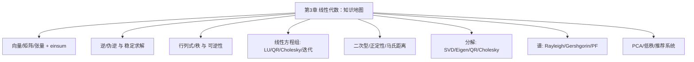

这一章把“线性代数”从**向量运算**一路铺到**分解与谱**，再落地到**PCA/推荐系统**。请把它当作你在 ML/大模型里“看形状、挑工具、稳数值”的随身兵器谱。

------

## 1. 核心脉络（一口气串起来）

### 1) 向量—矩阵—张量与三种“乘”

- **内积**：对齐程度（相似度/投影）；线性模型、注意力分数 = 一堆内积。
- **外积**：秩1“积木”，矩阵乘 = 外积之和；梯度常是“误差 × 特征”的外积。
- **Hadamard**：逐元素门控/加权；Schur 定理：PSD ∘ PSD 仍 PSD。
- **Einstein 求和（einsum）**：给轴“起名”，重复就“求和掉” → 一行表达点积/批量乘/注意力。

### 2) 可逆与伪逆

- **别无脑 inv**：解 $Ax=b$ 用 `solve`；PSD 用 **Cholesky**；最小二乘用 **QR/SVD**。
- **伪逆** $A^+$：非方阵/秩亏时的“最合理反演”，最小二乘 & 最小范数解；SVD 是王道。

### 3) 行列式与秩

- $|\det A|$：体积缩放；$\operatorname{sign}(\det A)$：取向；$\det=0$ ⇒ 压扁（不可逆）。
- **秩 = 非零奇异值个数**；**rank-nullity**：被用上的维数 + 被压扁的维数 = 输入维数。

### 4) 线性方程组与数值解

- **LU（带主元）**：通用方阵；**Cholesky**：SPD；**QR/SVD**：最小二乘；
- **迭代法（CG/GMRES）+ 预条件**：大规模/稀疏/只要 Mv。

### 5) 二次型与正定性

- $x^\top A x$ 的曲率由谱给出；$A\succ 0$ ⇔ 全正特征值 ⇔ 可 Cholesky。
- 马氏距离、强凸性、信赖域、核/协方差/预条件都系于此。

### 6) 分解家族与适用场景

- **SVD**：通吃、低秩近似、伪逆、PCA；
- **特征分解（对称）**：二次型/图谱；
- **QR**：最小二乘首选；**Cholesky**：SPD 黄金解法。

### 7) 谱理论

- Rayleigh 商极值；Gershgorin 圆盘快速界；Perron–Frobenius 描述非负矩阵/马尔可夫链；
- 谱半径/条件数决定 GD 步长与收敛；谱范数正则 ≈ 控 Lipschitz。

### 8) PCA 与低秩推荐

- **PCA**：最大方差 = 最小重构误差；计算优先 **SVD**；
- **SVD in RS**：用户/物品向量点积，显式 MF、隐式 ALS、BPR 排序；在线用 ANN 近邻检索。

------

## 2. 一页“工具选择”速查（Mermaid）



**说明**：这是本章的“导航图”，从基础运算到分解与应用，保持“形状—数值—场景”的三件套思维。

------

## 3. 工程清单（Do & Don’t）

- ✅ **能 `solve` 不 `inv`**；SPD → **Cholesky**；最小二乘 → **QR/SVD**。
- ✅ 看**形状与尺度**：中心化/标准化，必要时加 $\epsilon I$。
- ✅ 大规模/稀疏：**矩阵—向量乘接口 + 预条件**。
- ✅ 用 **`slogdet`/Cholesky** 计算 log |det|；判 PD 先试 Cholesky。
- ❌ 别直接解正规方程 $(X^\top X)w=X^\top y$（条件数平方）。
- ❌ 别显式构造巨大外积/逆/投影器（内存炸）。
- ❌ 别把 PCA 当监督器；别在全数据上拟合 PCA 后再评估（数据泄露）。

------

## 4. 公式&代码小抄（精简版）

- **矩阵乘 = 外积和**：$AB=\sum_r a_{:r}b_{r:}$。
- **Frobenius 内积**：$\langle A,B\rangle_F=\mathrm{tr}(A^\top B)=\sum_{ij}A_{ij}B_{ij}$。
- **伪逆（SVD）**：$A=U\Sigma V^\top\Rightarrow A^+=V\Sigma^+U^\top$。
- **log det（Cholesky）**：$A=LL^\top\Rightarrow \log|A|=2\sum\log L_{ii}$。
- **Rayleigh 商**：$\lambda_{\max}=\max_{\|x\|=1}\frac{x^\top A x}{x^\top x}$（对称）。
- **PCA（SVD）**：$X=U\Sigma V^\top$（零均值），主轴 = $V$，方差 = $\Sigma^2/m$，投影 $Z=XV_k$。

```python
# NumPy 速用
U,S,Vt = np.linalg.svd(Xc, full_matrices=False)   # PCA/SVD
x = np.linalg.solve(A, b)                          # 解 Ax=b
L = np.linalg.cholesky(SPD); logdet = 2*np.log(np.diag(L)).sum()
w, Q = np.linalg.eigh(S)                           # 对称特征分解（协方差）
```

------

## 5. 习题（含提示）

> 说明：分四档——基础计算、推导证明、工程实践、开放探索。建议先做 1–3，再选做 4。

### A. 基础计算（Warm-up）

1. **三种“乘”**：给 $x=(1,2,3)$, $y=(4,5,6)$。
    (a) $x\cdot y$；(b) $x y^\top$；(c) $A=\begin{bmatrix}1&2\\3&4\end{bmatrix},B=\begin{bmatrix}2&0\\-1&3\end{bmatrix}$ 计算 $A\circ B$。
    *提示*：内积=逐元素乘后求和；外积=列×行；Hadamard 同形逐元素乘。
2. **rank 与 det**：
    $M=\begin{bmatrix}1&2&3\\2&4&6\\1&1&1\end{bmatrix}$。
    (a) 求 $\mathrm{rank}(M)$；(b) 解释为何 $\det(M^\top M)=0$。
    *提示*：第二行=第一行×2 ⇒ 秩≤2；$M^\top M$ 奇异。
3. **Cholesky 可行性**：
    $S=\begin{bmatrix}4&2\\2&5\end{bmatrix}$ 做 Cholesky。
    *提示*：先算 $L_{11}=\sqrt{4}$，再递推。
4. **Rayleigh 商**：
    对 $A=\begin{bmatrix}2&1\\1&3\end{bmatrix}$，取 $x=(\cos\theta,\sin\theta)$，写出 $R_A(x)$ 并找最大值对应的 $\theta$。
    *提示*：也可用 `eigh` 验证。
5. **PCA 解释方差**：
    构造对角奇异值 $(10, 5, 1, 0.5)$ 的 $X$（可随机正交矩阵拼装），计算前 2 个主成分的累计解释方差。
    *提示*：$\text{EVR}(2)=(10^2+5^2)/(10^2+5^2+1^2+0.5^2)$。

------

### B. 推导与证明（Keep it rigorous）

1. **Eckart–Young 定理**（证明要点）：
    证明 $A_k=\sum_{i=1}^k \sigma_i u_i v_i^\top$ 是 Frobenius 范最优的秩 $k$ 近似。
    *提示*：用 $ \|A\|_F^2=\sum \sigma_i^2$ 与 Pythagoras 分解。
2. **Sylvester 判据**：
    证明对称 $A\succ 0 \iff$ 左上角主子式全正。
    *提示*：归纳 + Schur 补。
3. **GD 步长稳定**：
    对 $f(x)=\tfrac12 x^\top A x$（$A\succ0$），证明 GD 稳定条件 $0<\eta<2/\lambda_{\max}(A)$。
    *提示*：误差递推 $e_{t+1}=(I-\eta A)e_t$，看谱半径。
4. **Gershgorin**：
    给 $A=\begin{bmatrix} 3&-1&0\\ -1&2&-1\\ 0&-1&2 \end{bmatrix}$，画三枚圆盘并给出特征值落区。
    *提示*：圆心为对角元，半径为行外元素绝对值和。
5. **Schur 补与 PSD**：
    证明 $ \begin{bmatrix}A&B\\ B^\top & C\end{bmatrix}\succeq 0 \iff A\succeq 0,\ C-B^\top A^+ B \succeq 0$（广义逆情形）。
    *提示*：从零空间与投影角度讨论。

------

### C. 工程实践（NumPy/PyTorch）

1. **`solve` vs `inv@b`**：
    构造条件数可控矩阵（用 SVD 设置奇异值），比较两种解法的残差与时间。
    *提示*：`slogdet` 看数值规模，`timeit` 计时。
2. **最小二乘（三法比拼）**：
    随机 $A\in\mathbb{R}^{200\times 20}, b$。比较 `lstsq`、`qr+solve`、正规方程的误差与稳定性。
    *提示*：加一列几乎与另一列线性相关来放大差异。
3. **PCA（SVD）可视化**：
    生成三簇 2D → 加噪扩到 50D → PCA 降回 2D 画散点，观察聚团。
    *提示*：先标准化；画 EVR 曲线。
4. **谱范数正则**：
    线性分类器加入 $\lambda\|W\|_2$（用幂迭代近似最大奇异值），观察对泛化的影响。
    *提示*：每若干步更新一次谱范数近似。
5. **图谱聚类**：
    两团 2D 高斯点，构 $k$-NN 图（高斯权重），取 $L_{\text{sym}}$ 的前 2 个特征向量做 k-means，和直接 k-means 对比。
    *提示*：注意对称化与行归一化。
6. **隐式 ALS 迷你实现**：
    用稀疏 $p_{ui}$ 与 $c_{ui}=1+\alpha r_{ui}$，交替解用户/物品子问题（带正则的线性方程组），评估 Recall@K。
    *提示*：每个用户子问题可写成 $(Q^\top C_u Q+\lambda I)p_u = Q^\top C_u y_u$。

------

### D. 开放探索（Mini Project）

1. **低秩推荐 → ANN 检索**：
    在任意公开小数据上训练 MF/BPR 得到 $P,Q$，用 ANN 引擎（Faiss/ScaNN）对 $Q$ 建内积索引，做在线 Top-K 召回模拟。
    *提示*：把内积 MIPS 变换为余弦，或直接用支持内积的索引类型。
2. **PCA→LoRA 直觉验证**：
    对一个中等规模线性层权重 $W$，取梯度在训练早期的时间序列，做 PCA 看能量集中程度；用秩 $r$ 的 LoRA 替换原更新，比较精度/速度。
    *提示*：记录梯度矩阵堆叠后做 SVD。
3. **数值稳定性报告**：
    选一条你常用的 ML 管线（如 GPR/核岭/最小二乘），写“稳定性小报告”：在哪些环节可能爆、如何用本章方法兜底（分解、正则、缩放、预条件）。
    *提示*：给出具体参数与 `logdet`/条件数监控曲线。

------

## 6. 参考答案要点（部分）

- **A1**：$x\cdot y=32$；$xy^\top=\begin{bmatrix}4&5&6\\8&10&12\\12&15&18\end{bmatrix}$；$A\circ B=\begin{bmatrix}2&0\\-3&12\end{bmatrix}$。
- **A2**：$\mathrm{rank}(M)=2$；$M^\top M$ 秩 2 ⇒ $\det=0$。
- **A3**：$L=\begin{bmatrix}2&0\\1&2\end{bmatrix}$。
- **A4**：最大 $R_A(x)=\lambda_{\max}(A)\approx 3.618$；对应特征向量方向。
- **A5**：$\text{EVR}(2)=\frac{125}{125+1+0.25}\approx 0.992$。
- **B6**：利用 $A-U_k\Sigma_k V_k^\top$ 与剩余 $\sum_{i>k}\sigma_i^2$ 正交分解。
- **B7**：对称分块，递归使用 Schur 补正定判据。
- **B8**：$\rho(I-\eta A)<1 \iff |1-\eta\lambda_i|<1$ 对全体 i 成立 ⇒ $\eta\in(0,2/\lambda_{\max})$。
- **B9**：圆盘近似落在 $[0,4]$ 附近；`eigh` 得到 $\approx\{0.198, 1.555, 5.247\}$。
- **C11**：`solve` 精度与速度均优于 `inv@b`，病态时差距显著。
- **C15**：谱聚类在“非球形”簇上优于原空间 k-means。

------

## 7. 结尾小结

- 这章的关键词是**形状（einsum/分解）**、**稳定（分解优先/正则/预条件）**、**谱（方向与强度）**。
- 当你在大模型/推荐/核方法里卡住时，回到这三件套：**看形状 → 选分解 → 查谱/条件数 → 加正则/预条件**。
- 下一章我们将进入**概率与统计**，把“代数的骨架”塞进“随机的血肉”，让损失、似然与信息论连成一体。
