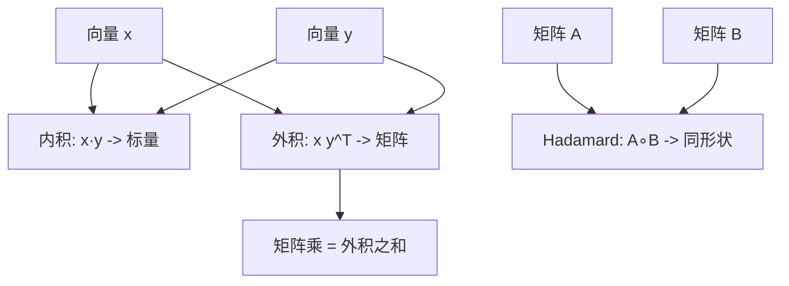

这一节搞清楚三件“看起来像乘法、其实完全不同”的操作：**内积（dot）**、**外积（outer）**、**Hadamard 积（逐元素乘）**。
记住口诀：**内积给数、外积给面（秩 1 矩阵）、Hadamard 给同形张量**。

------

## 1. 三种“乘法”的定义与形状

- **内积（dot / scalar product）**

$$
x⋅y=∑i=1nxiyi=x⊤y(x,y∈Rn)\mathbf{x}\cdot \mathbf{y} =\sum_{i=1}^n x_i y_i =\mathbf{x}^\top \mathbf{y} \quad (\mathbf{x},\mathbf{y}\in\mathbb{R}^n)
$$

  **结果是标量** `()`，几何上是“长度×长度×夹角余弦”。

- **外积（outer / dyadic product）**
$$
x y⊤∈Rm×n(x∈Rm, y∈Rn)\mathbf{x}\,\mathbf{y}^\top \in\mathbb{R}^{m\times n}\quad(\mathbf{x}\in\mathbb{R}^m,\ \mathbf{y}\in\mathbb{R}^n)
$$

  第 $i,j$ 个元素是 $x_i y_j$。**秩 1**（只要 $\mathbf{x},\mathbf{y}\neq 0$）。

- **Hadamard 积（逐元素乘 / elementwise）**
$$
(A∘B)ij=AijBij,A,B 形状相同(A\circ B)_{ij}=A_{ij}B_{ij},\quad A,B\text{ 形状相同}
$$

  **结果与操作数同形**。

> 快速连结：
>  `x·y == sum(x∘y)`；
>  `tr(A^T B) == sum(A∘B)`（Frobenius 内积）。

------

## 2. 内积：长度、角度与投影

**几何意义**

$\mathbf{x}\cdot\mathbf{y}=\|\mathbf{x}\|\,\|\mathbf{y}\|\cos\theta$

- $\theta$ 是两向量夹角；
- 夹角越小（更对齐），内积越大。

**Cauchy–Schwarz（常用不等式）**

$|\mathbf{x}\cdot\mathbf{y}|\le \|\mathbf{x}\|_2\,\|\mathbf{y}\|_2$

**投影**（把 $\mathbf{x}$ 投到单位方向 $\mathbf{u}$）：

$\text{proj}_{\mathbf{u}}(\mathbf{x})=(\mathbf{x}\cdot \mathbf{u})\,\mathbf{u}$

**ML 场景**

- **余弦相似度**：$\cos\theta=\frac{\mathbf{x}\cdot\mathbf{y}}{\|\mathbf{x}\|\,\|\mathbf{y}\|}$。做推荐/检索时更稳（对尺度不敏感）。
- **线性模型**：预测 $\hat y = \mathbf{w}^\top\mathbf{x}$ 就是内积。
- **注意力分数**：`scores = Q K^T / sqrt(d)`，每个分数是一个内积。

------

## 3. 外积：秩 1 结构与“搭积木”

**定义与性质**

$\mathbf{x}\mathbf{y}^\top =\begin{bmatrix} x_1 y_1 & \cdots & x_1 y_n\\ \vdots & \ddots & \vdots\\ x_m y_1 & \cdots & x_m y_n \end{bmatrix},\qquad \text{rank}=1$

- 行都是 $\mathbf{y}^\top$ 的倍数，列都是 $\mathbf{x}$ 的倍数。

- **矩阵乘可写成外积之和**：
  若 $A\in\mathbb{R}^{m\times k}, B\in\mathbb{R}^{k\times n}$，列出 $A$ 的列向量 $a_{:r}$、$B$ 的行向量 $b_{r:}$：

  $$
  AB=\sum_{r=1}^{k} a_{:r}\, b_{r:}.
  $$

  这揭示“矩阵乘 = 秩 1 片段的叠加”。

**ML 场景**

- **梯度外积**：线性层 $y=w^\top x$，对权重的梯度是 $\nabla_w L = \delta\, x^\top$（外积），$\delta$ 是上游梯度。
- **低秩近似 / 矩阵分解**：用少量外积近似大矩阵（推荐系统、嵌入压缩、LoRA）。
- **协方差**：$\Sigma=\frac{1}{m}\sum_i (x_i-\mu)(x_i-\mu)^\top$，是外积的平均。

------

## 4. Hadamard 积：逐元素的“开关与加权”

**定义**
 同形状张量逐元素相乘，常用于**门控/掩码/加权**。

**常用等式**

- Frobenius 内积：$\langle A,B\rangle_F=\mathrm{tr}(A^\top B)=\sum_{ij}A_{ij}B_{ij}=\mathbf{1}^\top (A\circ B)\mathbf{1}$。
- **Schur 乘积定理（直观版）**：若 $A,B$ 都是对称正定（PSD），则 $A\circ B$ 也是 PSD。
   → 在核方法里，用 Hadamard 积“合成核”仍保正定。

**ML 场景**

- **掩码注意力**：`scores += (mask * -1e9)` 或 `attn = softmax(scores) ; out = attn @ V` 前对 `scores` 逐元素处理。
- **门控单元（GLU/门控残差）**：`y = (W1 x) ∘ sigma(W2 x)`。
- **特征交互**：`x_inter = x ∘ x'`（简单但常见的二阶交互特征）。

------

## 5. 三者之间的关系（一图梳理）



**说明**：内积给“数”、外积给“秩 1 矩阵”，Hadamard 给“同形张量”。矩阵乘法可以看作**一堆外积相加**。

------

## 6. 代码上手（NumPy / PyTorch）

```python
# 需要: numpy, torch
import numpy as np, torch

# 向量
x = np.array([1., 2., 3.])       # (3,)
y = np.array([4., 5., 6.])       # (3,)

# 1) 内积
dot_np = x @ y                   # 或 np.dot(x, y)
assert np.isclose(dot_np, (x*y).sum())     # x·y == sum(x∘y)

# 2) 外积
outer_np = np.outer(x, y)        # (3,3)

# 3) Hadamard 积
A = np.arange(6.).reshape(2,3)   # (2,3)
B = np.ones((2,3))*2
had_np = A * B                   # 逐元素乘 (2,3)

# 4) "矩阵乘 = 外积之和"
M = np.random.randn(2,4)         # (2,4)
N = np.random.randn(4,3)         # (4,3)
left = M @ N
right = sum(np.outer(M[:,r], N[r,:]) for r in range(M.shape[1]))
print(np.allclose(left, right))  # True

# PyTorch 版本（形状一致）
xt = torch.tensor(x); yt = torch.tensor(y)
dot_t = torch.dot(xt, yt)
outer_t = torch.outer(xt, yt)
had_t = torch.tensor(A) * torch.tensor(B)
```

------

## 7. 工程小抄：形状、复杂度与内存

- **内积**：`(n)`·`(n)`→`()`, 复杂度 `O(n)`；
- **外积**：`(m)`⊗`(n)`→`(m,n)`, 复杂度/内存 `O(mn)`（**大维度慎用**）；
- **Hadamard**：同形状→同形状，复杂度 `O(mn)`；
- **矩阵乘**：`(m,k)`@`(k,n)`→`(m,n)`，复杂度 `O(mkn)`；优先调用 BLAS/CUDA。
- **广播**：`(B,1,d) * (1,T,d) -> (B,T,d)`，易写错语义；先在纸上推形状。

------

## 8. 例子：注意力里的三种“乘”

以单头注意力为例（忽略缩放）：

- **内积**：每个 `score[i,j] = q_i · k_j`。
- **Hadamard**：`scores = scores + mask` 或 `scores = scores ∘ valid_flag` 做屏蔽/权重。
- **矩阵乘**：`attn = softmax(scores)` 后，`out = attn @ V`。
- **外积**：反向传播时，梯度对 `W_q`/`W_k`/`W_v` 的更新有大量“误差向量 × 输入向量^T”的**外积**结构。

`einsum` 写法（PyTorch）：

```python
# Q,K,V: (B,T,d)
scores = torch.einsum('btd,bsd->bts', Q, K)  # 内积的批量化
attn = torch.softmax(scores, dim=-1)
out = torch.einsum('bts,bsd->btd', attn, V)  # 矩阵乘等价写法
```

------

## 9. 常见坑与排错

1. **把 Hadamard 当矩阵乘**：`A*B` vs `A@B` 完全不同。
2. **外积维度爆炸**：为生成 `(n,n)` 大矩阵而外积，内存会炸；能用 `einsum`/分块就别显式存。
3. **余弦相似度没先归一化**：没除范数就不是“角度相似”。
4. **广播“跑得动但不对”**：检查每一维含义（批量维/序列维/特征维）。
5. **核/协方差 PSD 性**：若要保正定性，注意 Schur 定理、对称化与数值稳定（加小 $\epsilon I$）。

------

## 10. 练习（含提示）

1. **内积与投影**：$\mathbf{x}=(3,4),\ \mathbf{y}=(4,-3)$。
   - 求 $\mathbf{x}\cdot\mathbf{y}$、$\|\mathbf{x}\|_2$、夹角 $\theta$。
   - 把 $\mathbf{x}$ 投影到 $\mathbf{y}$ 的方向。
      *提示*：先单位化 $\mathbf{y}$。
2. **外积秩**：证明 $\mathrm{rank}(\mathbf{a}\mathbf{b}^\top)=1$（$\mathbf{a},\mathbf{b}\neq 0$）。
    *提示*：任一列都是 $\mathbf{a}$ 的倍数。
3. **矩阵乘的外积展开**：推导 `AB = sum_r a_:r b_r:`。
    *提示*：写 $AB$ 第 $i,j$ 元素，再把求和顺序重排。
4. **Frobenius 内积**：证明 $\langle A,B\rangle_F = \mathrm{tr}(A^\top B) = \sum_{ij}A_{ij}B_{ij}$。
    *提示*：用迹的循环不变性。
5. **Schur 积定理（直观）**：给出数值示例验证：若 $A,B$ 对称正定，则 $A∘B$ 的特征值非负。
    *提示*：随机生成 $M$，取 $A=MM^\top$、$B=NN^\top$。
6. **注意力形状**：`Q,K,V ∈ (B,h,T,d_h)` 时用 `einsum` 写出分数与输出。
    *提示*：`'bhqd,bhkd->bhqk'` 与 `'bhqk,bhkd->bhqd'`。

------

## 11. 小结

- **内积**衡量对齐与投影，是线性模型与相似度的核心。
- **外积**生成秩 1 结构，是“矩阵乘的积木”，在梯度与低秩近似里无处不在。
- **Hadamard 积**是逐元素的门控与加权，和 Frobenius 内积、PSD 合成（Schur）紧密相关。
- 任何复杂网络里，这三者反复出现：**先想清形状与语义，再写代码**。下一节我们继续把张量运算“系统化”，为矩阵分解、核方法打下基。
