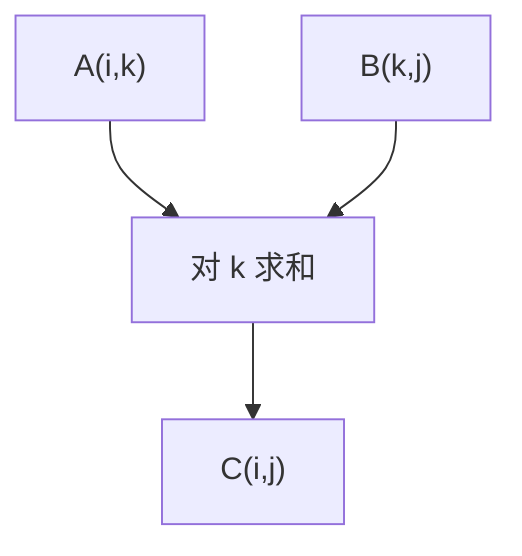
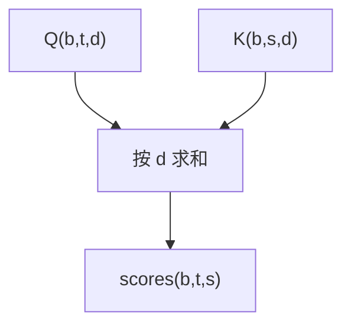
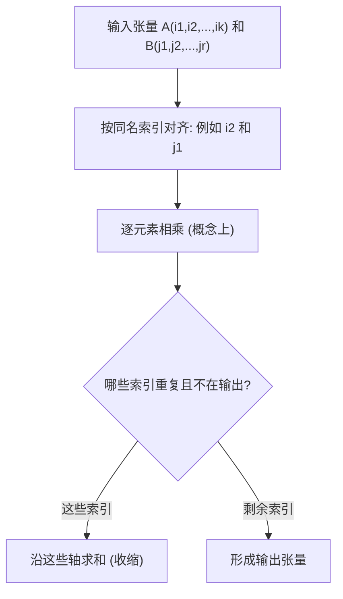

一句话版：**给每个轴起“名字”，重复的名字就代表要把那条轴“求和掉”**。这就是 Einstein（爱因斯坦）求和约定（Einstein Summation Convention, 简写 **EinSum**）。

在 Numpy / PyTorch 里，对应的就是 `numpy.einsum` / `torch.einsum`。它把“各种乘法+按轴求和”的操作统一起来，一行字符串就能表达**点积、矩阵乘、批量矩阵乘、外积、Gram 矩阵、注意力**等。

------

## 1. 为什么用 EinSum？

- **读写更直观**：别再对着 `(B, T, d)` 发呆，直接写 `'btd,bsd->bts'`，谁跟谁乘、沿哪个轴求和，一眼就懂。
- **避免临时转置/reshape**：省去一堆 `permute`、`view`。
- **统一范式**：从标量到高阶张量，都是“标签 + 求和”。

**生活类比**：你给账本的每个维度（店铺、日期、品类）贴了标签。两个账本按“同名标签”对齐相乘，并把标成“求和”的标签统计掉，得到一个新的账本。

------

## 2. 规则：两条半

1. **相同的索引字母 = 需要对该轴求和（收缩）**。
2. **输出里的索引字母 = 保留下来的轴（自由索引）**。
    2.5 **不同字母 = 直积对齐**（不求和，形成新轴）。

> 例：`'ik,kj->ij'` 表示 $C_{ij}=\sum_k A_{ik}B_{kj}$。
>  例：`'i,i->'` 表示 $\sum_i x_i y_i$（点积，输出是标量）。

------

## 3. 把常见运算换成 EinSum

| 运算                | 爱因斯坦表达                                | einsum 字符串    |
| ------------------- | ------------------------------------------- | ---------------- |
| 点积 $x^\top y$     | $x_i y_i$                                   | `'i,i->'`        |
| 外积 $xy^\top$      | $X_{ij}=x_i y_j$                            | `'i,j->ij'`      |
| 矩阵乘 $AB$         | $C_{ij}=A_{ik}B_{kj}$                       | `'ik,kj->ij'`    |
| Hadamard $A\circ B$ | $C_{ij}=A_{ij}B_{ij}$（无求和）             | `'ij,ij->ij'`    |
| 双线性 $x^\top A y$ | $x_i A_{ij} y_j$                            | `'i,ij,j->'`     |
| Gram 矩阵 $XX^\top$ | $G_{ij}=X_{ik}X_{jk}$                       | `'ik,jk->ij'`    |
| 批量矩阵乘          | $Y_{bij}=A_{bik}B_{bkj}$                    | `'bik,bkj->bij'` |
| 注意力分数          | $\text{scores}_{bts}=Q_{btd}K_{bsd}$        | `'btd,bsd->bts'` |
| 注意力加权和        | $\text{out}_{btd}=\text{attn}_{bts}V_{bsd}$ | `'bts,bsd->btd'` |

> 注意：**Einstein 约定里重复索引默认“要求和”**。Hadamard 积想“只对齐不求和”，必须把输出也写上同样的索引：`'ij,ij->ij'`。

------

## 4. 例子：一步步看懂字符串

- `'btd,bsd->bts'`
  - 左 1：`b t d`，左 2：`b s d`。
  - 重复字母：`b`、`d` → 对齐但不求和；`d` **只在输入重复**，不在输出出现 → **对 d 求和**。
  - 自由字母：`b t s` → 保留在输出。
  - 结论：对最后一维 `d` 做内积，得到 `(B,T,S)` 的分数矩阵。
- `'i,ij,j->'`
  - `i` 在 1、2 两处，`j` 在 2、3 两处，输出为空 → 对 `i,j` 都求和 → 标量。

------

## 5. 图示：索引如何“流动”



**说明**：矩阵乘 $C_{ij}=\sum_k A_{ik}B_{kj}$，`k` 被“收缩”掉，`i,j` 保留下来。



**说明**：注意力分数 `btd,bsd->bts`。同一个 batch `b` 对齐，`d` 被求和，得到 `(b,t,s)`。

------

## 6. 代码：Numpy / PyTorch 一把梭

```python
# 需要: numpy, torch
import numpy as np, torch

# 1) 点积 / 外积 / 矩阵乘
x = np.array([1., 2., 3.])                 # (3,)
y = np.array([4., 5., 6.])                 # (3,)
dot1 = np.einsum('i,i->', x, y)            # 点积
outer1 = np.einsum('i,j->ij', x, y)        # 外积 (3,3)

A = np.arange(6.).reshape(2,3)             # (2,3)
B = np.arange(9.).reshape(3,3)             # (3,3)
mm1 = np.einsum('ik,kj->ij', A, B)         # 矩阵乘
assert np.allclose(mm1, A @ B)

# 2) Hadamard 积
had = np.einsum('ij,ij->ij', A, B[:2])     # (2,3) 逐元素乘
assert np.allclose(had, A * B[:2])

# 3) Gram 矩阵
X = np.random.randn(5, 4)                   # (n=5, d=4)
G = np.einsum('ik,jk->ij', X, X)           # (5,5) = X X^T

# 4) 注意力（PyTorch）
Q = torch.randn(2, 7, 8)                    # (B=2, T=7, d=8)
K = torch.randn(2, 5, 8)                    # (B=2, S=5, d=8)
V = torch.randn(2, 5, 8)

scores = torch.einsum('btd,bsd->bts', Q, K) / (Q.size(-1) ** 0.5)
attn = torch.softmax(scores, dim=-1)
out = torch.einsum('bts,bsd->btd', attn, V)
print(out.shape)  # torch.Size([2, 7, 8])
```

------

## 7. 广播 vs EinSum：别混为一谈

- **广播**：让维度为 `1` 的轴自动扩展；**不改变求和轴**。
- **EinSum**：明确指定**哪些轴要求和**、哪些轴保留。
- 二者互补：很多算子内部其实就是“先广播对齐，再按某些轴求和”。

------

## 8. 典型 ML 算子：用 EinSum 讲人话

1. **线性层（批量）**
    `'bd, kd -> bk'`（如果 `W` 存成 `(k,d)`）：$Y_{bk}=X_{bd}W_{kd}$。
2. **二次型 & 梯度**

- 标量 $x^\top A x$：`'i,ij,j->'`。
- 梯度 $\nabla_x(x^\top A x)=(A+A^\top)x$：实现时常用两次 matmul，而 HVP 可写 `'ij,j->i'`。

1. **协方差 / 相关矩阵**

- 中心化数据 $\tilde X\in\mathbb{R}^{n\times d}$：`'nd,md->nm'` 得 Gram；
- 协方差 `Cov = (1/n) * einsum('nd,ne->de', Xc, Xc)`。

1. **多头注意力（简化）**
    `Q,K,V ∈ (B,h,T,dh)`：

- 分数：`'bhtd,bhsd->bhts'`；
- 输出：`'bhts,bhsd->bhtd'`，再拼回 `d = h*dh`。

1. **批量外积（特征二阶交互）**
    `'bd,be->bde'`：每个样本的二阶交互张量（大！注意内存）。

------

## 9. 性能与数值：写快又写对

- **优先用专用算子**：标准矩阵乘 `@`/`matmul` 往往更快；EinSum 优势在**表达复杂收缩**。
- **`opt_einsum`**：Numpy 世界可安装此库自动找更优收缩路径。
- **避免巨大中间张量**：把 `'...->...'` 写成一步，避免先外积再求和。
- **内存布局**：PyTorch 中连锁的 `permute` 后可能需要 `.contiguous()`。
- **数值稳定**：如注意力 softmax 前减去 `max`，或用框架内置 `scaled_dot_product_attention`。

------

## 10. 常见坑（血泪史）

1. **索引字母拼错**：`'btd,bsd->bst'` vs `'btd,bsd->bts'`，位置顺序决定输出布局。
2. **误求和**：忘写输出索引导致被“收缩”掉；如想 Hadamard 必须 `'ij,ij->ij'`。
3. **重复超过两次**：标准约定里一个索引在同一侧出现两次表示求和；多于两次可读性差且易错。
4. **维度不一致**：同名索引的长度必须一致（除了广播符场景下用显式 `einsum` 时不支持自动广播）。
5. **滥用 EinSum**：能用 `matmul/bmm` 的地方就用，省内存、省调度。

------

## 11. 从“对齐→相乘→收缩”的流程



**说明**：这是对任何 `einsum` 的通用思考步骤：对齐同名轴 → 概念上相乘 → 对重复索引求和 → 输出保留剩下的索引。

------

## 12. 练习（含提示/答案要点）

1. **把下列运算写成 EinSum**

   - (a) 批量点积：给 `X,Y ∈ (B,d)`，输出 `(B,)`。
      *答*：`'bd,bd->b'`。
   - (b) 三重张量收缩：`T ∈ (i,j,k)`, `A ∈ (j,j)`, `B ∈ (k)`, 输出 `(i)`。
      *答*：`'ijk,jj,k->i'`（注：`jj` 表示对 j 两次出现求和）。
   - (c) 批量双线性：`x ∈ (B,d)`, `A ∈ (B,d,d)`, `y ∈ (B,d)`，标量每批一个。
      *答*：`'bd,bdd,bd->b'`。

2. **证明**：矩阵乘等价于外积之和

   (AB)ij=∑kAikBkj=∑k(A:kBk:)ij.(AB)_{ij} = \sum_k A_{ik} B_{kj} = \sum_k (A_{:k} B_{k:})_{ij}.

   *提示*：写出第 $i,j$ 元素展开。

3. **协方差 EinSum**：中心化数据 `X ∈ (n,d)`，证明

   $$
Cov=1n−1 einsum(′nd,ne−>de′,X,X).\mathrm{Cov} = \frac{1}{n-1}\ \texttt{einsum}('nd,ne->de', X,X).
   $$

4. **注意力的稳定 softmax**：用 EinSum 写出分数后，给出“先减最大值再 softmax”的代码。

5. **错误定位**：下面的字符串为什么错？怎么修？

   - (a) `'bij,bjk->bk'` 预期 `(B,i,k)`。
      *答*：输出少了 `i`，应 `'bij,bjk->bik'`。
   - (b) `'ij,ij->'` 预期 Hadamard，但输出标量。
      *答*：这会对 `i,j` 求和，应 `'ij,ij->ij'`。

------

## 13. 小结

- **Einstein 约定**把“乘 + 按轴求和”的模式抽象成“给轴起名 + 重名就求和”，用起来像写公式。
- **常见运算一网打尽**：点积、外积、矩阵乘、批量乘、Gram、协方差、双线性、注意力。
- **工程建议**：复杂收缩用 `einsum`，标准乘法用 `matmul/bmm`；避免巨大中间张量；用 `opt_einsum` 优化路径。
