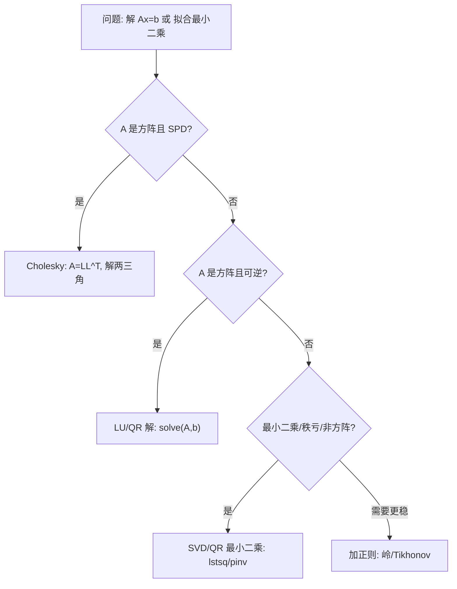

一句话版：**逆矩阵**是在“方阵且可逆”时，把线性变换完全“撤销”的按钮；**伪逆（Moore–Penrose 伪逆）**是在“不可逆/非方阵”时，给最合理的“近似撤销”的按钮。工程上：**别无脑 `inv`**，优先用 **`solve` / `lstsq` / `pinv`** 与 **SVD/QR**。

------

## 1. 先把“逆”的直觉捋顺

- **向量类比**：你把衣服翻进去（矩阵 $A$），逆矩阵 $A^{-1}$ 就是把它翻出来。
- **生活类比**：地铁从 A 站坐到 B 站（$A$），逆就是从 B 站按原路线回 A 站（$A^{-1}$）。

**定义（方阵）**
 对 $A\in\mathbb{R}^{n\times n}$，若存在 $A^{-1}$ 使 $A^{-1}A=AA^{-1}=I$，则 $A$ **可逆**（非奇异）。

**等价刻画（记住这串“同义词”）**
 以下条件互相等价：

- $\det A\ne 0$；
- $\mathrm{rank}(A)=n$；
- 线性方程 $A x=b$ **对任何 $b$** 都有唯一解；
- 0 **不是** $A$ 的特征值；
- 最小奇异值 $\sigma_{\min}(A)>0$。

**2×2 逆的公式（只作直觉，不作工程）**

$A=\begin{bmatrix}a&b\\c&d\end{bmatrix},\quad A^{-1}=\frac{1}{ad-bc}\begin{bmatrix}d&-b\\-c&a\end{bmatrix}.$

但请注意：数值计算不要用这个手写式，**用分解法**更稳。

------

## 2. 为啥工程上少用 `inv`？

**解线性方程 $Ax=b$**

- 错法：`x = inv(A) @ b`（慢 + 不稳 + 浪费内存）
- 正法：`x = solve(A, b)`（**LU/Cholesky/QR** 背后做分解，省时省误差）

**条件数（病态性）**

$\kappa_2(A)=\frac{\sigma_{\max}(A)}{\sigma_{\min}(A)}\ (\ge 1).$

$\kappa$ 大 → 小误差被放大。**直接求逆**会把误差放得更大，尤其当 $\sigma_{\min}$ 很小。

**建议**

- SPD（对称正定）矩阵：用 **Cholesky**。
- 一般非奇异方阵：用 **LU/QR**。
- 病态/秩亏：用 **SVD/最小二乘**，必要时加 **正则化**。

------

## 3. 伪逆：不可逆时的“最合理反演”

当 $A$ 不是方阵或不可逆时，用 **Moore–Penrose 伪逆** $A^+$ 替代。它满足四个公理（对称投影等，这里不赘述），带来两条金律：

- **最小二乘解**：$\displaystyle x^\*=\arg\min_x \|Ax-b\|_2 \Rightarrow x^\* = A^+ b.$
- **最小范数**：若解不唯一（欠定），$A^+ b$ 给出所有解中 **$\|x\|_2$ 最小** 的那个。

**SVD 公式（最实用）**
 若 $A=U\Sigma V^\top$，$\Sigma=\mathrm{diag}(\sigma_1\ge\cdots\ge\sigma_r>0)$，
 则

$A^+=V\,\Sigma^+\,U^\top,\quad \Sigma^+=\mathrm{diag}\big(\tfrac{1}{\sigma_1},\dots,\tfrac{1}{\sigma_r}\big).$

- **秩亏**时对 $\sigma_i=0$ 的位置保持 0。
- 数值里常对小奇异值用阈值截断，形成**截断伪逆**（更稳）。

**特殊情形（满秩）**

- 高且瘦（$m\!\ge\! n$ 且满列秩）：$A^+=(A^\top A)^{-1}A^\top$。
- 矮且胖（$m\!\le\! n$ 且满行秩）：$A^+=A^\top(AA^\top)^{-1}$。

**投影器**

- $P_{\mathcal{R}(A)} = A A^+$ 是到列空间的正交投影；
- $P_{\mathcal{R}(A^\top)} = A^+ A$ 是到行空间的正交投影。

------

## 4. 与机器学习的高频连接

### 4.1 线性回归闭式解（最小二乘）

样本矩阵 $X\in\mathbb{R}^{m\times d}$，目标 $y\in\mathbb{R}^{m}$。

$w^\*=\arg\min_w \|Xw-y\|_2^2 = X^+\, y = \begin{cases} (X^\top X)^{-1}X^\top y, & \text{满列秩};\\ \text{SVD/`pinv`}, & \text{秩亏/病态}. \end{cases}$

### 4.2 岭回归（Tikhonov 正则）

$w_\lambda=(X^\top X+\lambda I)^{-1}X^\top y.$

- 在 SVD 基底中，这是把每个 $1/\sigma_i$ 换成 $\sigma_i/(\sigma_i^2+\lambda)$，**抑制小奇异值**带来的放大（更稳，也更好泛化）。

### 4.3 LoRA / 低秩近似

大模型微调中，把权重更新近似为低秩 $U V^\top$。求解/拟合常落到**最小二乘 + 低秩结构**，背后仍然是 **SVD/伪逆/投影** 的数学。

### 4.4 核方法与 Schur 乘积

核矩阵 $K$ 要 PSD，训练中求解 $(K+\lambda I)\alpha=y$。这类系统适合 **Cholesky**；若要“近似逆”，用 **Nyström / 低秩 SVD** 更高效。

------

## 5. Woodbury 身法（增量更新神器）

当你要反转 $A+U C V$（低秩更新）时，不必重算大逆：

$(A+U C V)^{-1} = A^{-1} - A^{-1} U(C^{-1}+V A^{-1} U)^{-1}V A^{-1}.$

- 典型用法：**特征维高、增量低秩**的在线更新；
- 岭回归的“核化”版本与卡尔曼滤波也频繁用到它。

------

## 6. 如何选择“解线性系统”的姿势



**说明**：优先分解，谨慎求逆；病态就去 SVD/正则化。

------

## 7. 代码小抄（NumPy / PyTorch）

```python
# 需要: numpy, torch
import numpy as np, torch

# (1) 线性方程：solve >> inv@b
A = np.random.randn(300, 300)
A = A @ A.T + 1e-1*np.eye(300)  # SPD
b = np.random.randn(300)

x1 = np.linalg.solve(A, b)        # 推荐
x2 = np.linalg.inv(A) @ b         # 不推荐

# (2) 最小二乘：lstsq / pinv
m, d = 200, 300     # 欠定 or 过定都可
X = np.random.randn(m, d)
y = np.random.randn(m)

w_lstsq, *_ = np.linalg.lstsq(X, y, rcond=None)  # 最稳的通用方法
w_pinv = np.linalg.pinv(X) @ y                    # 基于SVD的伪逆

# (3) 岭回归闭式
lam = 1e-1
w_ridge = np.linalg.solve(X.T @ X + lam*np.eye(d), X.T @ y)

# (4) PyTorch 版本
Xt = torch.tensor(X, dtype=torch.float64)
yt = torch.tensor(y, dtype=torch.float64)
wt = torch.linalg.lstsq(Xt, yt).solution          # 最小二乘
wp = torch.linalg.pinv(Xt) @ yt                   # 伪逆
wr = torch.linalg.solve(Xt.T@Xt + lam*torch.eye(d), Xt.T@yt)
```

> 经验：
>
> - **`lstsq`** 是“万金油”（内部用 QR/SVD）；
> - **`pinv`** 用于需要显式伪逆或投影器；
> - SPD 用 **Cholesky**；
> - 大问题优先用迭代法（CG）+ **矩阵–向量乘**接口。

------

## 8. 数值稳定与容错

- **阈值与截断**：在 `pinv` 中对小于 `tol` 的奇异值置零，避免放大噪声。
- **中心化与缩放**：回归前标准化特征能显著降低条件数。
- **加对角线**：$X^\top X+\lambda I$（岭）提升稳定性。
- **别拿行列式判断可逆**：`det` 在数值上不稳定，**用分解/条件数**更靠谱。
- **检查残差**：解出来后看 $\|Ax-b\|$ 与 $\|x\|$，防止被病态坑。

------

## 9. 常见坑（踩过都懂）

1. **把逆当“求解器”**：`inv` 只是数学对象，**工程不用它**。
2. **明明 SPD 却没用 Cholesky**：速度和稳定性都亏。
3. **无脑 normal equation**：直接解 $(X^\top X)w=X^\top y$ 会把条件数**平方**，不如 **QR/SVD**。
4. **忘了正则**：高相关/高维/少样本的回归不加 $\lambda$ 极易炸。
5. **伪逆阈值**：`pinv` 的容差太小/太大都会出问题；根据数据尺度设定或用默认。
6. **内存炸裂**：显式构造巨型逆/投影器（如 $AA^+$）不必要；用**线性算子**与**乘法接口**。

------

## 10. 练习（含提示/部分答案）

1. **可逆等价性**：证明“可逆 ⇔ $\sigma_{\min}(A)>0$”
    *提示*：SVD 写 $A=U\Sigma V^\top$。
2. **最小二乘与伪逆**：证明 $\arg\min_x \|Ax-b\|_2^2 = A^+ b$。
    *提示*：用 SVD 把问题化为 $\min_z \|\Sigma z - U^\top b\|$。
3. **最小范数解**：当 $A$ 欠定（$m< n$）且可行解不唯一，证明 $A^+ b$ 是 $\|x\|_2$ 最小的可行解。
    *提示*：仍在 SVD 坐标下讨论自由变量。
4. **岭回归的 SVD 视角**：若 $X=U\Sigma V^\top$，证明
    $w_\lambda = V\,\mathrm{diag}(\tfrac{\sigma_i}{\sigma_i^2+\lambda})\,U^\top y$。
    *答案要点*：把 $(X^\top X+\lambda I)^{-1}X^\top$ 放到 SVD 里化简。
5. **Woodbury 推导**：在矩阵逆引理的假设下，推导公式（可参考分块矩阵逆公式）。
    *提示*：从 $\begin{bmatrix}A & U\\ V & -C^{-1}\end{bmatrix}$ 的 Schur 补入手。
6. **数值实验（自做）**：构造条件数 $\kappa$ 很大的 $A$，比较 `inv(A)@b` 与 `solve(A,b)` 的误差与时间。
    *提示*：用 SVD 控制 $\sigma_{\min}$ 生成病态矩阵。

------

## 11. 小结

- **逆**只在“方阵且可逆”时存在；工程上**用分解求解**而非显式求逆。
- **伪逆**用 SVD 处理非方阵/秩亏问题，给出**最小二乘**与**最小范数**解；
   $A A^+$ / $A^+ A$ 是正交投影器。
- **稳定性**胜过一切：优先 **Cholesky/QR/SVD**，必要时**正则化**；大问题用**迭代法 + HVP**。
- 记住口诀：**“能 solve 不 inv；能 QR/SVD 不 normal；病态就正则。”**
