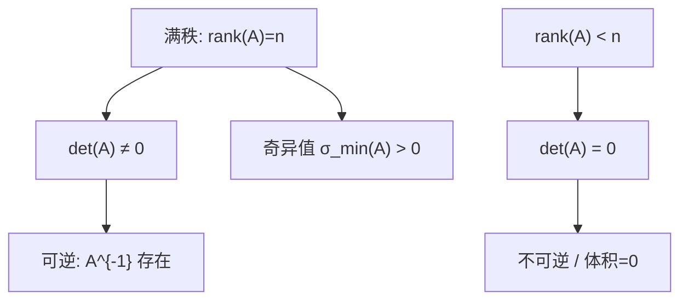

一句话版：**行列式（det）\**告诉你一个线性变换把体积\**放大/缩小了多少以及是否翻转方向**；**秩（rank）\**告诉你这个变换\**真正活动了多少维自由度**。
 在机器学习中：det 出现在 **对数似然的 log |Σ|**、**归一化流（normalizing flows）\**的\**雅可比行列式**，rank 则刻画 **特征相关/多重共线性**、**PCA 的有效维度**、**低秩分解/LoRA** 等。

------

## 1. 直观开场：两张图的故事

- 把二维平面当橡皮膜。矩阵 $A$ 把单位正方形变成一条平行四边形。
   这个平行四边形的面积 = $|\det(A)|$。
   $\det(A)<0$ 表示**翻转了方向**（像镜像），$\det(A)=0$ 表示把膜**压扁**到一条线（体积归零）。
- 秩 $\mathrm{rank}(A)$ 就是“**橡皮膜最终活跃的维数**”：
   $\mathrm{rank}=2$（二维平行四边形），$\mathrm{rank}=1$（一条线），$\mathrm{rank}=0$（一个点）。

------

## 2. 行列式：定义与性质（记住这几条就足够工程）

### 2.1 运算规则（用来**手算/推性质**）

对任意方阵 $A\in\mathbb{R}^{n\times n}$：

1. **三条行初等变换的影响**

   - 交换两行：$\det$ **变号**；
   - 一行乘常数 $c$：$\det$ **乘以 $c$**；
   - 一行加上另一行的倍数：$\det$ **不变**。
      ⇒ 利用高斯消元把 $A$ 化成上三角矩阵 $U$ 后，$\det(A) = (\pm)\prod_i U_{ii}$。

2. **乘法法则**

   $$
det⁡(AB)=det⁡(A) det⁡(B).\det(AB)=\det(A)\,\det(B).
   $$

   特别地，$\det(A^{-1})=1/\det(A)$。

3. **转置不变**

   $$
det⁡(A⊤)=det⁡(A).\det(A^\top)=\det(A).
   $$

4. **三角/对角矩阵**

   $$
A 上/下三角⇒det⁡(A)=∏iAii.A \text{ 上/下三角}\Rightarrow \det(A)=\prod_i A_{ii}.
   $$

5. **与特征值的关系**

   $$
det⁡(A)=∏i=1nλi(λi 是 A 的特征值).\det(A)=\prod_{i=1}^n \lambda_i \quad(\lambda_i\ \text{是 }A\text{ 的特征值}).
   $$

6. **与奇异值的关系（任意实矩阵）**
    若 $A$ 可 SVD 为 $U\Sigma V^\top$，$|\det(A)|=\prod_i \sigma_i$（非负的奇异值乘积）。
    $\det(A)=0 \iff$ 有奇异值为 0（体积被压扁）。

### 2.2 几何意义（工程最常用）

- $|\det(A)|$：**体积缩放因子**；
- $\operatorname{sign}(\det(A))$：**是否翻转取向**（右手系 ↔ 左手系）；
- $\det(A)=0$：列（或行）线性相关 ⇒ **不可逆**、**体积为 0**。

### 2.3 计算建议（数值）

- **不要**用展开式（Laplace 展开）在数值里求 det，复杂且不稳。

- 用 **LU/QR/Cholesky** 分解：

  $$
A=PLU⇒log⁡∣det⁡(A)∣=∑ilog⁡∣Uii∣, det⁡(P)=±1.A=PLU\Rightarrow \log|\det(A)|=\sum_i \log|U_{ii}|,\ \ \det(P)=\pm1.
  $$

  SPD（对称正定）时用 Cholesky：$\log|\det(A)|=2\sum_i \log L_{ii}$（更稳）。

- 大问题里常用 `slogdet`（返回符号与 log |det|）避免下溢/上溢。

------

## 3. 秩：自由度与可逆性的量化

### 3.1 定义与等价表述

- **列秩 = 行秩** = $\mathrm{rank}(A)$。
- 等价于：
  - 列空间（或行空间）的维数；
  - 高斯消元后**非零主元**的个数；
  - **非零奇异值**的个数；
  - $\mathrm{rank}(A)=n \iff \det(A)\neq 0$（方阵满秩 ⇔ 可逆）。

### 3.2 秩-零空间定理（Rank–Nullity）

若 $A\in\mathbb{R}^{m\times n}$：

$\mathrm{rank}(A) + \mathrm{nullity}(A) = n,\qquad \mathrm{nullity}(A)=\dim\{x:Ax=0\}.$

**读法**：输入维度 $n$ = “被用上的维数” + “被压扁的维数”。

### 3.3 常用不等式（有助于推断）

- $\mathrm{rank}(AB)\le \min\{\mathrm{rank}(A),\mathrm{rank}(B)\}$。
- $\mathrm{rank}(A+B)\le \mathrm{rank}(A)+\mathrm{rank}(B)$。
- 若 $A$ 秩 1，则 $A=uv^\top$。

------

## 4. 小例子：把直觉落地

1. **剪切矩阵**

$S=\begin{bmatrix}1 & k\\ 0 & 1\end{bmatrix},\quad \det(S)=1.$

体积不变（面积不变），只是“推歪”。这类变换常见于卷积/仿射数据增强。

1. **投影矩阵**（投到 $x$-轴）

$P=\begin{bmatrix}1&0\\0&0\end{bmatrix},\quad \det(P)=0,\ \mathrm{rank}(P)=1.$

把二维压到一维 ⇒ 信息丢失 ⇒ 不可逆。

1. **对角缩放**

$D=\mathrm{diag}(\alpha,\beta,\gamma),\quad \det(D)=\alpha\beta\gamma.$

体积按坐标缩放因子相乘。若某个因子为 0，秩降。

------

## 5. 行列式/秩/可逆性的“关系图”



**说明**：这图就是“同义链”。在工程里，**检查可逆**与其算 det，不如看**秩/最小奇异值/条件数**。

------

## 6. 机器学习里的高频场景

### 6.1 高斯模型/图模型/GP 的 **log |Σ|**

多元高斯的对数似然含 $-\tfrac12\log|\Sigma|$。

- 计算用 **Cholesky**：$\log|\Sigma| = 2\sum_i \log L_{ii}$。
- $\Sigma$ 近秩亏（特征高度相关）时，可加 $\epsilon I$（**对角扰动**）提升数值稳定与泛化。

### 6.2 归一化流（Normalizing Flows）

变量变换密度：

$\log p_X(x)=\log p_Z(f(x))+\log\left|\det \frac{\partial f}{\partial x}\right|.$

设计可逆层（如仿射耦合、可三角化雅可比）就是为了让 **det/Jacobian** 高效可解（常用三角结构使 det = 对角线乘积）。

### 6.3 PCA 与有效维度

样本矩阵 $X\in\mathbb{R}^{m\times d}$，中心化后协方差 $S=\tfrac1m X^\top X$。

- $\mathrm{rank}(S)\le \min\{m-1,d\}$：样本少时，协方差**秩亏**（最多 $m-1$ 个非零特征值）。
- 主成分数 = 非零特征值个数（或显著的大特征值个数）。

### 6.4 多重共线性与回归

特征强相关 ⇒ $X^\top X$ 近奇异 ⇒ det 很小、条件数大 ⇒ 问题病态。
 做法：**标准化/特征选择/岭回归/降维**。

### 6.5 低秩思想（推荐/LoRA/矩阵完成）

用秩 $r$ 的分解 $A\approx U_rV_r^\top$（或核范数/截断 SVD）压缩参数、提升泛化。

------

## 7. 代码手账（NumPy/PyTorch）

```python
# 需要: numpy, torch
import numpy as np, torch

# 1) 行列式: 不直接 det，优先 slogdet 或 Cholesky (SPD)
A = np.array([[2.,1.],[1.,3.]])
sign, logabsdet = np.linalg.slogdet(A)  # sign=+1, logabsdet=log|det|
detA = sign * np.exp(logabsdet)

# 2) SPD 的 log|det|
S = A @ A.T + 1e-6*np.eye(2)     # SPD
L = np.linalg.cholesky(S)
logdetS = 2*np.sum(np.log(np.diag(L)))

# 3) 秩与奇异值
M = np.array([[1.,2.,3.],[2.,4.,6.],[1.,1.,1.]])  # 第二行=2*第一行
rankM = np.linalg.matrix_rank(M)  # =2
sv = np.linalg.svd(M, compute_uv=False)

# 4) PyTorch 版本
At = torch.tensor(A)
sign_t, logabsdet_t = torch.linalg.slogdet(At)
rank_t = torch.linalg.matrix_rank(torch.tensor(M))
```

> 小贴士：`matrix_rank` 用 SVD + 容差判定非零奇异值个数；对 SPD 用 Cholesky 取 log det 更稳。

------

## 8. 误区与避坑

1. **用 det 判断可逆**：数值上不可靠。**看条件数/最小奇异值/矩阵秩**更靠谱。
2. **行列式大小 ≠ 好坏**：det 大小和尺度强相关；不要用 det 比大小评估模型。
3. **Laplace 展开**：仅适合讲概念，不适合计算；数值里用分解。
4. **协方差秩亏**：样本数 < 维度 ⇒ 秩 ≤ $m-1$。别惊讶，改用 **PCA/岭**。
5. **log det 溢出/下溢**：使用 `slogdet` 或 Cholesky 求和 **log 对角线**。
6. **近似可逆层**：Flows/Invertible Nets 里，确保雅可比结构可求 det（如三角块/对角可解）。

------

## 9. 练习（含提示/部分答案）

1. **体积缩放**
    令 $A=\begin{bmatrix}2&0\\1&3\end{bmatrix}$。

- (a) $\det(A)$ 与面积缩放因子？
- (b) $A$ 是否翻转取向？
   **答**：(a) $\det=6$，面积*6；(b) 正数，不翻转。

1. **det 与特征值/奇异值**
    构造 $A=QDQ^{-1}$（2×2），验证 $\det(A)=\prod \lambda_i$。
    **提示**：取 $D=\mathrm{diag}(2,0.5)$。
2. **rank–nullity**
    $A\in\mathbb{R}^{3\times 5}$ 且 $\mathrm{rank}(A)=2$。求零空间维数。
    **答**：$5-2=3$。
3. **协方差秩**
    有 $m=10$ 个 $d=100$ 维样本，中心化后协方差 $S$ 的最大秩？
    **答**：$\le m-1=9$。
4. **最小奇异值与病态**
    随机生成条件数 $\kappa$ 很大的矩阵（控制 $\sigma_{\min}$），比较 `inv(A)@b` 与 `solve(A,b)` 残差。
    **提示**：用 SVD 设置奇异值光谱。
5. **flows 的雅可比**
    仿射耦合层 $y_1=x_1,\ y_2=s(x_1)\odot x_2 + t(x_1)$。雅可比是下三角：

$J=\begin{bmatrix}I & 0\\ \ast & \mathrm{diag}(s(x_1))\end{bmatrix}.$

求 $\log|\det J|$。
 **答**：$\sum \log|s(x_1)|$。

1. **Hadamard 界（了解）**
    证明 $|\det(A)|\le \prod_i \|a_i\|_2$（列向量 $a_i$）。
    **提示**：几何上体积 ≤ 包围盒体积；或用 Gram 矩阵与 PSD 性。

------

## 10. 小结

- **行列式**：体积缩放与取向，$\det=0$ ⇔ 压扁到低维（不可逆）。
- **秩**：真正参与作用的自由度，等于非零奇异值个数。
- **工程准则**：
  - 计算 det 用 **分解**（`slogdet`/Cholesky）；
  - 判断可逆/相关性，用 **rank/σ_min/条件数**；
  - 遇到秩亏/病态 ⇒ **正则化/降维/低秩近似**。
