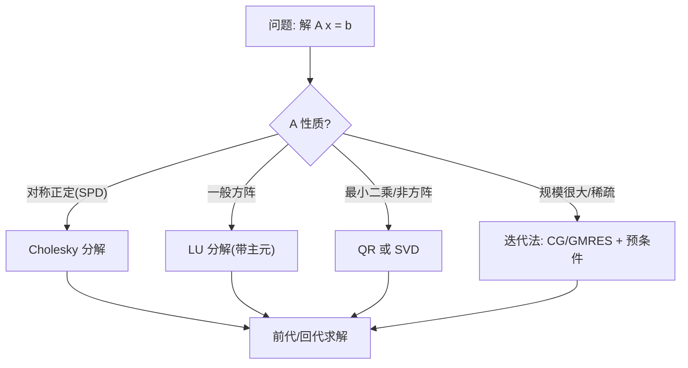
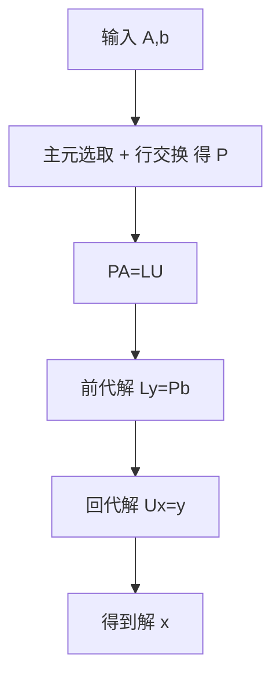

一句话版：**解线性方程组 = 把“求逆”换成“分解 + 回代”**。方阵首选 **LU/Cholesky/QR** 等直接法；大规模/稀疏/近似解首选 **迭代法（CG/GMRES）**；工程铁律是：**能 `solve` 不 `inv`**。

------

## 1. 为何机器学习必须会解 $Ax=b$？

- 线性回归的正规方程：$(X^\top X)w=X^\top y$；
- 二次规划的 KKT 系统（牛顿/拟牛顿子问题）；
- 高斯过程、图模型：$(K+\lambda I)\alpha=y$；
- 正则与预条件：$(A+\lambda I)x=b$。
   **核心操作**都是“解线性系统”。如果把“逆矩阵”当按钮猛按，数值与性能都会吃亏；真正的按钮是 **分解（factorization）**。

------

## 2. 解法全景图（先选路，再上车）



**经验口令**

- SPD → **Cholesky**（最快最稳）；
- 一般方阵 → **LU（带主元）**；
- 最小二乘/过定/欠定 → **QR/SVD**；
- 稀疏/巨型 → **迭代法 + 预条件**。

------

## 3. LU 分解：把 “A” 拆成 “下三角 × 上三角”

### 3.1 定义与形式

对许多（但并非所有）方阵 $A\in\mathbb{R}^{n\times n}$，存在置换矩阵 $P$ 使

$PA = LU,$

其中 $L$ 是**单位下三角**（对角全 1），$U$ 是**上三角**。这个叫**带主元的 LU 分解**（Partial Pivoting）。

**为何要置换 $P$**：为了把每一步的主元（分母）尽量放大，**减少舍入误差**，避免“被 0 卡住”。

### 3.2 复杂度与存储

- 分解一次 $O(n^3)$，**一次分解，多次回代**（适合多个右端 $b_1,\dots,b_k$）。
- 回代（前代 + 回代）各 $O(n^2)$。

### 3.3 用 LU 解 $Ax=b$

1. $PA=LU\Rightarrow LUx=Pb$。
2. **前代**：解 $Ly=Pb$。
3. **回代**：解 $Ux=y$。
    就完事了。

> 生活类比：先把复杂机关 $A$ 拆成“多级开关” $L,U$，每个开关只和“前面的东西”相关（下/上三角），拧起来省力。

------

## 4. 手算一个 3×3 例子（带主元）

令

$A=\begin{bmatrix}2&1&1\\ 4&-6&0\\ -2&7&2\end{bmatrix},\quad b=\begin{bmatrix}5\\ -2\\ 9\end{bmatrix}.$

- 第 1 列最大绝对值在第 2 行 ⇒ 交换行（置换 $P$）。
- 做消元得到 $PA=LU$。最后（略过细节计算）会得到某个 $L,U$，然后按上节 **$Ly=Pb$ → $Ux=y$** 回代即可。
- **要点**：每一步挑最大主元（行交换），写下乘子进 $L$，把消成 0 后的上三角记进 $U$。

> 真做工程不手算：库函数帮你搞定主元选取与数值细节。

------

## 5. 数值解法的“避坑与体检”

### 5.1 不要 `inv`

错法：`x = inv(A) @ b`（慢 + 不稳）
 正法：`x = solve(A, b)` 或先 `LU_factor` 再 `LU_solve`。

### 5.2 残差与条件数

- **残差** $r=b-Ax$ 应很小；
- 条件数 $\kappa_2(A)=\sigma_{\max}/\sigma_{\min}$ 大 → 误差被放大。
- 数据预处理（标准化/行列缩放）和**正则化**能改善条件数。

### 5.3 特殊结构要利用

- **SPD**：Cholesky $A=LL^\top$ 最稳。
- **稀疏**：用稀疏 LU/Cholesky（避免“填充”），配合**重排序**（如 AMD）减少填充量。
- **块结构/带状**：用专门的带状/块分解，复杂度显著降低。

------

## 6. QR / SVD：最小二乘的王炸

- 过定问题（样本多于特征）$\min_x \|Ax-b\|_2$
  - **QR**：$A=QR\Rightarrow Rx=Q^\top b$；数值稳，不放大条件数。
  - **SVD**：$A=U\Sigma V^\top\Rightarrow x=V\Sigma^+U^\top b$；**最稳**，还能处理秩亏；更贵。

> 口诀：**最小二乘用 QR/SVD，不直接解正规方程 $(A^\top A)x=A^\top b$**（因为条件数会平方）。

------

## 7. 迭代法：当 $n$ 大且/或稀疏

### 7.1 核心思想

不分解 $A$，而是只做**矩阵–向量乘** $v\mapsto Av$，逐步逼近解。

- **CG（共轭梯度）**：适合 SPD；
- **GMRES/BiCGSTAB**：适合非对称。

### 7.2 预条件（preconditioning）

找一个 $M\approx A$（易解 $Mz=r$），改解

$M^{-1}Ax = M^{-1}b,$

让谱性质变好，收敛快很多。常见：**Jacobi（对角）**、ILU、IC（不完全 Cholesky）、块对角等。

> 生活类比：爬山（迭代）前先踩上“台阶”（预条件），台阶把陡坡变缓。

------

## 8. LU 分解求解流程



**说明**：一次分解，多次使用（多个 b）。

------

## 9. 代码小抄（NumPy / SciPy / PyTorch）

> 记住：**优先用 solve / lstsq / cholesky_solve**，除非你真的需要显式分解对象。

### 9.1 NumPy / SciPy：LU、Cholesky、QR、SVD

```python
import numpy as np
from scipy.linalg import lu_factor, lu_solve
from numpy.linalg import solve, lstsq, slogdet

# 构造 SPD
np.random.seed(0)
n = 5
A = np.random.randn(n, n)
SPD = A.T @ A + 1e-3*np.eye(n)
b = np.random.randn(n)

# 1) 方阵一般情况：solve (内部选分解)
x = solve(A, b)

# 2) LU(带主元) + 回代（适合多 RHS）
lu, piv = lu_factor(A)          # SciPy
x1 = lu_solve((lu, piv), b)

# 3) SPD: Cholesky（最稳）
L = np.linalg.cholesky(SPD)
# 前代回代手写 or 用 solve_triangular，这里快写:
y = np.linalg.solve(L, b)
x2 = np.linalg.solve(L.T, y)

# 4) 最小二乘：QR/SVD (np.linalg.lstsq 内部选)
m, d = 30, 10
X = np.random.randn(m, d)
y = np.random.randn(m)
w, *_ = lstsq(X, y, rcond=None)

# 5) log|det|（避免溢出）
sign, logabsdet = slogdet(SPD)
```

### 9.2 PyTorch：批量解、Cholesky、CG

```python
import torch
torch.manual_seed(0)

n, B = 64, 8
A = torch.randn(n, n)
SPD = A.T @ A + 1e-3*torch.eye(n)
b = torch.randn(n)

# 1) 一般解线性方程
x = torch.linalg.solve(A, b)

# 2) SPD: Cholesky
L = torch.linalg.cholesky(SPD)
y = torch.cholesky_solve(b.unsqueeze(1), L)   # 解 SPD x=b
x2 = y.squeeze(1)

# 3) 批量解 (B组 RHS)
Ab = SPD.unsqueeze(0).repeat(B,1,1)           # (B,n,n)
bb = torch.randn(B, n, 1)
xb = torch.linalg.solve(Ab, bb)               # (B,n,1)

# 4) 迭代法: 共轭梯度 (简单实现)
def cg(A_mv, b, x0=None, tol=1e-8, iters=1000):
    x = torch.zeros_like(b) if x0 is None else x0.clone()
    r = b - A_mv(x)
    p = r.clone()
    rs_old = torch.dot(r, r)
    for _ in range(iters):
        Ap = A_mv(p)
        alpha = rs_old / torch.dot(p, Ap)
        x = x + alpha*p
        r = r - alpha*Ap
        rs_new = torch.dot(r, r)
        if torch.sqrt(rs_new) < tol:
            break
        p = r + (rs_new/rs_old)*p
        rs_old = rs_new
    return x

# SPD 的矩阵-向量乘
A_mv = lambda v: SPD @ v
xcg = cg(A_mv, b, iters=200)
```

------

## 10. 工程清单（做事顺序）

1. **识别结构**：SPD？稀疏？块？带状？
2. **选分解**：Cholesky / LU（带主元）/ QR / SVD；
3. **多 RHS**：**一次分解，多次回代**；
4. **大规模稀疏**：迭代法 + 预条件（ILU/IC/对角/块对角）；
5. **数值体检**：残差、相对误差、`cond(A)` 或 `σ_min`；
6. **预处理**：缩放、中心化、正则化（+λI）；
7. **别求逆**：任何时候都优先 `solve/lstsq/pinv`。

------

## 11. 常见坑（从重到轻）

- **把 `inv` 当求解器**：改 `solve`。
- **正规方程**直接解：条件数平方 → 换 **QR/SVD**。
- **忽略主元选取**：LU 不带主元可能崩。用 **部分主元**（默认库里开着）。
- **没利用 SPD/稀疏结构**：白白损失 5–50× 性能。
- **不看残差**：训练里 silently error，后果超灵异。
- **预条件缺失**：CG/GMRES 变养老漫步；加个对角预条件起飞。
- **数据尺度差异大**：特征标准化能立刻降条件数。

------

## 12. 练习（含提示）

1. **手推 LU**：对
    $\displaystyle A=\begin{bmatrix}4&3\\6&3\end{bmatrix}$，带主元 LU，解 $Ax=b$、$b=(10,12)^\top$。
    *提示*：先交换行得到 $P$，再消元。
2. **Cholesky**：令 $S=\begin{bmatrix}4&2\\2&5\end{bmatrix}$，求 $L$ 使 $S=LL^\top$，并解 $Sx=b$、$b=(1,0)^\top$。
3. **最小二乘**：随机 $X\in\mathbb{R}^{50\times 3}$、$y$，比较 `lstsq` 和 直接解 $(X^\top X)w=X^\top y$ 的数值误差与稳定性（添加一列几乎与另一列相同的特征）。
4. **CG vs 预条件**：用对角占优的 SPD 矩阵测试 CG，加入 **Jacobi 预条件**（即把 `A_mv` 替换为 `D^{-1}A` 与 `b` 换成 `D^{-1}b`），比较迭代次数。
5. **稀疏 fill-in**（思考题）：为什么重排序（如 AMD）可以减少稀疏 LU/Cholesky 的填充？尝试构造三对角矩阵并观察分解的稀疏模式。

------

## 13. 小结

- **LU（带主元）**是通用方阵的工作马：一次分解 + 前回代。
- **Cholesky**专治 SPD，**QR/SVD**处理最小二乘与秩亏。
- 大规模/稀疏采用**迭代法 + 预条件**；**别求逆**是底线。
- 在 ML/大模型训练的每一个“线性内核”处，选对解法与实现细节，能直接带来**稳定性与速度**的数量级提升。

