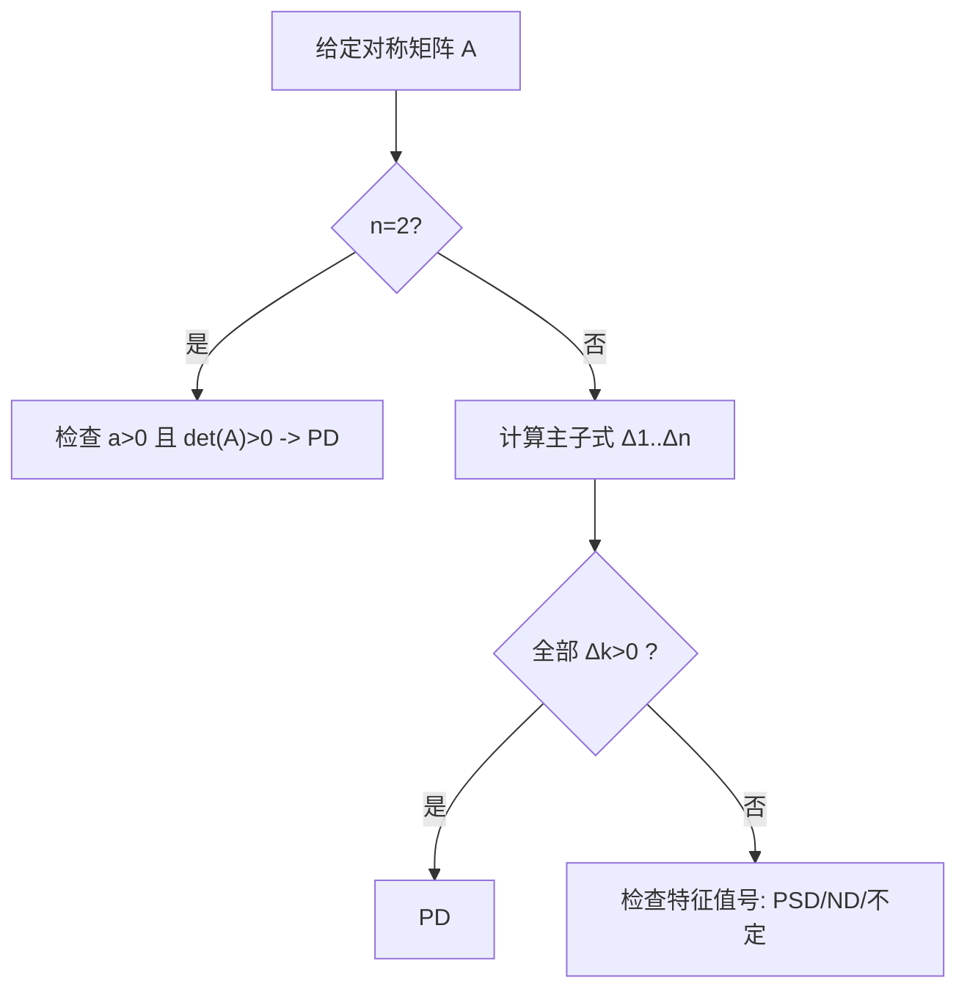

一句话版：**二次型**是形如 $x^\top A x$ 的函数；**正定性**描述它是否像“碗”一样朝上（凸）。二次型是机器学习里最常见的“能量/代价”模型：从 $\ell_2$ 正则、岭回归到高斯分布的马氏距离、牛顿法的局部模型、核方法的 Gram 矩阵，都离不开它。

------

## 1. 二次型是什么？为什么处处都在

**定义**（二次型）
 给对称矩阵 $A\in\mathbb{R}^{n\times n}$，函数

$Q(x)=x^\top A x,\quad x\in\mathbb{R}^n.$

若 $A$ 非对称，也可取其对称部分 $\tfrac12(A+A^\top)$，因为

$x^\top A x = x^\top\Big(\tfrac{A+A^\top}{2}\Big) x.$

所以研究二次型只需研究**对称矩阵**。

**生活类比**

- 把地面想成弹性薄膜，$Q(x)$ 是你站在点 $x$ 时弹簧膜储存的“能量”。
- 不同的 $A$ 让膜在不同方向拉得紧或松（曲率不同）。

**ML 里的身影**

- **岭回归**：$\lambda\|w\|_2^2=\lambda\, w^\top I w$（二次型，$A=\lambda I$）。

- **高斯分布对数密度**：$(x-\mu)^\top\Sigma^{-1}(x-\mu)$。

- **牛顿/拟牛顿**：损失在 $x_0$ 附近的二阶泰勒

  $$
  f(x)≈f(x0)+∇f(x0)⊤h+12h⊤Hh, h=x−x0,f(x)\approx f(x_0)+\nabla f(x_0)^\top h+\tfrac12 h^\top H h,\ h=x-x_0,
  $$

  其中二次项 $\tfrac12 h^\top H h$ 就是二次型（$H$ 是 Hessian）。

------

## 2. 几何直觉：椭圆与主轴

对称矩阵可特征分解：

$A=U\Lambda U^\top,\quad U=[u_1,\dots,u_n],\ \Lambda=\mathrm{diag}(\lambda_1,\dots,\lambda_n).$

令 $z=U^\top x$（旋转坐标），有

$Q(x)=x^\top A x = z^\top \Lambda z=\sum_{i=1}^n \lambda_i z_i^2.$

- **等值面** $Q(x)=c$ 是若干条**椭球面**（若有负特征值则是双曲面）。
- **特征向量**决定椭球主轴方向；**特征值**决定沿该轴的“曲率/拉伸”。

**分类**（看特征值号）

- 全 $\lambda_i>0$ → **正定 (PD)**：碗形，唯一极小值在 0；
- 全 $\lambda_i\ge 0$ 且有 0 → **半正定 (PSD)**：碗但有平坦方向；
- 全 $\lambda_i<0$ / $\le 0$ → **负定/半负定**；
- 有正有负 → **不定**（马鞍）。

------

## 3. 正定性的等价判据（工程三件套）

把这些当作“口袋判据”：

1. **谱判据**：对称 $A$ **正定** $\iff$ 所有特征值 $>0$。
2. **Sylvester 判据**（主子式）：对称 $A$ 正定 $\iff$ 所有**左上角主子式**行列式 $\Delta_k>0$（$k=1,\dots,n$）。
3. **Cholesky 等价**：对称 $A$ 正定 $\iff$ 存在唯一下三角 $L$ 使 $A=LL^\top$（且 $L$ 对角元 $>0$）。

> **半正定 (PSD)**：特征值 $\ge 0$；或存在 $B$ 使 $A=B^\top B$；或对任意 $x$，$x^\top A x\ge 0$。

------

## 4. 2×2 例子：一眼分辨“碗、盆、马鞍”

令

$A=\begin{bmatrix}a&b\\b&d\end{bmatrix},\quad Q(x,y)=a x^2+2bxy+d y^2.$

- **正定** $\iff a>0$ 且 $\det(A)=ad-b^2>0$。
- **不定** $\iff \det(A)<0$。
- **半正定** $\iff a\ge 0,\ d\ge 0,\ \det(A)=0$。

------

## 5. 正定性判定流程（二维直观版）



**说明**：工程上高维常先试 **Cholesky**（快速失败/成功），或估最大/最小特征值（幂迭代/Lanczos）。

------

## 6. 正定矩阵给我们的“工具箱”

### 6.1 内积与范数（广义）

若 $A \succ 0$，定义

$\langle x,y\rangle_A = x^\top A y,\quad \|x\|_A=\sqrt{x^\top A x}.$

它们满足内积与范数公理。**马氏距离**便是

$d_{\Sigma}(x,\mu)=\sqrt{(x-\mu)^\top \Sigma^{-1}(x-\mu)}.$

### 6.2 Loewner 偏序（矩阵不等式）

$A\succeq B\ \iff\ A-B\succeq 0.$

含义：对任意 $x$，$x^\top A x \ge x^\top B x$。
 常见：正则化/信赖域里用 $H+\lambda I \succeq \lambda I$。

### 6.3 Schur 补（判断分块矩阵的 PSD/PD）

对

$M=\begin{bmatrix}A&B\\B^\top & C\end{bmatrix},\ A\succ 0,$

有

$M\succeq 0\ \iff\ C- B^\top A^{-1}B \succeq 0.$

在高斯条件分布、图模型、增广拉格朗日中频繁出现。

------

## 7. 与机器学习的深度连接

1. **凸性与强凸性**
    若 $A\succeq 0$，则 $Q(x)$ **凸**；若 $A\succeq m I\ (m>0)$，则 **$m$-强凸**：

$Q(y)\ge Q(x)+\nabla Q(x)^\top(y-x)+\tfrac{m}{2}\|y-x\|_2^2.$

强凸保证 GD/牛顿的收敛率与唯一极小点。

1. **$\ell_2$ 正则/岭回归**
    损失加 $\lambda\|w\|_2^2$ 等于把 Hessian 加 $\lambda I$，把最小特征值整体上移，**缓解病态**。
2. **高斯模型与对数似然**

$\log p(x)= -\tfrac12 (x-\mu)^\top\Sigma^{-1}(x-\mu) - \tfrac12\log|\Sigma| + \text{const}.$

$\Sigma\succ 0$ 才有意义（可逆、密度有限）。

1. **核方法/Gram 矩阵**
    核矩阵 $K_{ij}=k(x_i,x_j)$ 应 PSD；Schur 乘积、和与非负系数组合保持 PSD（合成核）。
2. **牛顿/信赖域**
    当 Hessian $H\succeq 0$（或修正为 $H+\lambda I$）时，二次子问题凸可解；**二阶充分条件**要求在切空间上 $H\succ 0$。
3. **预条件**
    找 $M\succ 0$ 近似 $H$，求解 $M^{-1}H$ 更“圆”，迭代法更快（CG 的灵魂）。

------

## 8. 例子与小算

### 8.1 判断与对角化

$A=\begin{bmatrix}2&1\\1&3\end{bmatrix},\quad  \det(A)=5>0,\ a=2>0 \Rightarrow A\succ 0.$

特征值是正数（解特征方程或用 Cholesky）。等高线 $x^\top A x=c$ 是一族椭圆。

### 8.2 正则化“抬升”最小特征值

若 $A$ 最小特征值 $\lambda_{\min}$ 接近 0，
 则 $A_\lambda=A+\lambda I$ 的 $\lambda_{\min}(A_\lambda)=\lambda_{\min}(A)+\lambda$，
 强凸度被**抬升**；数值更稳。

### 8.3 马氏距离 vs 欧氏距离

给协方差 $\Sigma=\mathrm{diag}(1,9)$，沿第二维的尺度更大。

- 欧氏：$\|x-\mu\|_2$ 不区分尺度；
- 马氏：$\|x-\mu\|_{\Sigma^{-1}}$ 会**缩小**在噪声大的方向上的惩罚，更贴近统计等概率椭圆。

------

## 9. 代码卡片（NumPy/PyTorch）

```python
# 需要: numpy, torch
import numpy as np, torch

# 判 PD：Cholesky 成功即 PD；失败则非 PD
def is_pd_numpy(A):
    try:
        np.linalg.cholesky(A)
        return True
    except np.linalg.LinAlgError:
        return False

A = np.array([[2.,1.],[1.,3.]])
print("PD? ", is_pd_numpy(A))  # True

# 马氏距离
mu = np.array([0.,0.])
Sigma = np.array([[1.,0.],[0.,9.]])
x = np.array([1.,3.])
# d^2 = (x-mu)^T Sigma^{-1} (x-mu)
d2 = (x-mu).T @ np.linalg.inv(Sigma) @ (x-mu)
print("Mahalanobis^2 =", d2)

# PyTorch 版: 用 cholesky_inverse 更稳
At = torch.tensor(A)
L = torch.linalg.cholesky(At)
# 解 (A) y = x 而不显式 inv
b = torch.tensor([1., 0.])
y = torch.cholesky_solve(b.reshape(-1,1), L).squeeze()
print("Solve Ay=b -> y=", y)
```

> 提示：实际工程避免显式 `inv`；SPD 用 `cholesky_solve`，更稳更快。

------

## 10. 常见坑与排错

1. **把“半正定”当“正定”**：$\lambda_{\min}=0$ 会带来不可逆（如协方差奇异）；训练里要加 $\epsilon I$。
2. **行列式大≠“更好”**：尺度依赖；判凸性看**谱**或尝试 **Cholesky**。
3. **正规方程放大病态**：$(X^\top X)$ 的条件数平方；最小二乘用 **QR/SVD**。
4. **误用 Hadamard 乘积**：$A\circ B$ PSD 需要 $A,B$ PSD（Schur 定理），随手相乘不保凸。
5. **Hessian 非 PD 时用牛顿**：可能往“上坡”；加 $\lambda I$/信赖域/修正牛顿。

------

## 11. 练习（含提示）

1. **分类**
    $A=\begin{bmatrix}4&2\\2&1\end{bmatrix}$。用 2×2 判据判断正定/不定，并解释等高线形状。
    *提示*：看 $a>0$ 与 $\det>0$。
2. **对角化**
    随机对称 $A$（3×3），用数值求特征分解 $A=U\Lambda U^\top$，验证 $x^\top A x = \sum \lambda_i z_i^2$。
    *提示*：取若干随机 $x$，比较两边数值。
3. **强凸度**
    对 PSD 的 $H$，证明 $H+\lambda I\succeq \lambda I$（强凸度为 $\lambda$），并解释其对 GD 步长与收敛率的意义。
4. **Schur 补**
    证明若 $A\succ 0$ 且 $C- B^\top A^{-1}B \succ 0$，则块矩阵 $\begin{bmatrix}A&B\\B^\top&C\end{bmatrix}\succ 0$。
5. **马氏距离可视化（动手）**
    生成 2D 高斯样本，分别画欧氏等距圆与马氏等距椭圆，比较分类/聚类直觉差异。

------

## 12. 小结

- **二次型 $x^\top A x$** 用几何语言把曲率写在纸面上：特征向量给方向，特征值给弯曲。
- **正定性**是凸性的代名词：判据有**谱/主子式/Cholesky**；PSD 则给出**内积/马氏距离/核 Gram**的基石。
- 在 ML 里，正定矩阵让**优化更稳、统计更准、结构更清**：$\ell_2$ 正则、强凸、协方差/核、二阶方法与预条件，都以它为核心。
- 记下工程口令：**“先试 Cholesky；不行看谱；需要稳就加 $\epsilon I$”**。
