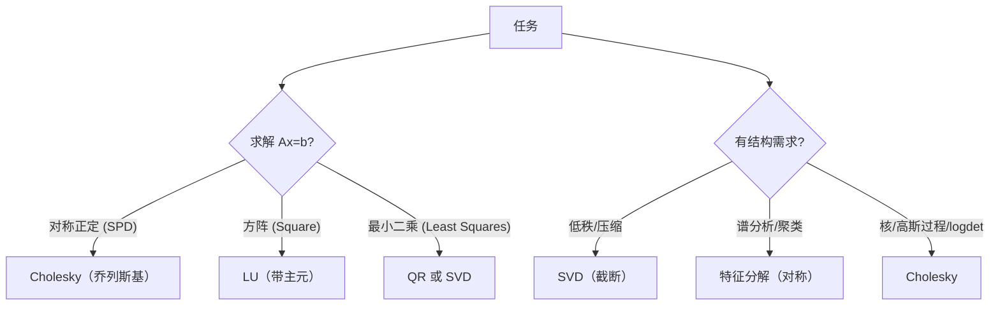

一句话版：**分解 = 揭示线性变换的结构**。SVD 把任意矩阵拆成“旋转 → 缩放 → 旋转”；特征分解把对称矩阵旋到主轴上；QR 以正交基组织列空间；Cholesky 专治对称正定。工程上靠它们**稳**地解方程、做最小二乘、PCA、核方法、GP、低秩近似与参数压缩。

------

## 1. 为什么一定要学分解？

- **数值稳**：和“直接求逆”相比，分解 + 回代更抗噪、精度更好。
- **看透结构**：奇异值、特征值刻画“强/弱方向”（曲率、方差、能量）。
- **工程通用语**：最小二乘 → QR/SVD；核/GP → Cholesky；压缩/推荐 → SVD 低秩。

**类比**：把复杂的咖啡机（矩阵）拆成“滤网（正交）+ 胶囊（对角缩放）+ 冲泡方向（正交）”，你就知道味道（变换）怎么来的，也知道哪一段坏了（病态方向）。

------

## 2. 预备：正交矩阵和“稳定性”

- **正交矩阵** $Q$：$Q^\top Q=I$（保持长度与角度）。
- **数值友好**：与 $Q$ 相乘不会放大舍入误差；分解多以正交因子为核心（Q/U/V）。
- **回代**：三角因子（R/U/L）可用前/回代 $O(n^2)$ 解决。

------

## 3. SVD：任意矩阵的“旋转—拉伸—旋转”

### 3.1 定义与形状

对 $A\in\mathbb{R}^{m\times n}$，存在

$A=U\Sigma V^\top,\quad U\in\mathbb{R}^{m\times m},\ V\in\mathbb{R}^{n\times n}\ \text{正交},\  \Sigma=\mathrm{diag}(\sigma_1\ge\cdots\ge\sigma_r>0).$

常用 **thin/economy SVD**：$U\in\mathbb{R}^{m\times r},\ \Sigma\in\mathbb{R}^{r\times r},\ V\in\mathbb{R}^{n\times r}$。

**关系**：$\sigma_i^2$ 是 $A^\top A$ 的特征值；$v_i$ 是右奇异向量（列空间的主方向），$u_i$ 是左奇异向量（像空间的主方向）。

### 3.2 低秩近似与伪逆

- **最佳低秩**（Eckart–Young）：

  Ak=∑i=1kσiuivi⊤A_k=\sum_{i=1}^k \sigma_i u_i v_i^\top

  是 Frobenius/2-范最优的秩 $k$ 近似。

- **伪逆**：$A^+=V\Sigma^+ U^\top$，$\Sigma^+$ 把非零奇异值取倒数。

- **秩与条件数**：$\mathrm{rank}(A)=r$；$\kappa_2(A)=\sigma_1/\sigma_r$。

### 3.3 ML 里的用法

- **PCA**：对中心化数据 $X$ 做 SVD：$X=U\Sigma V^\top$。主成分 = $V$ 的列，方差 = $\Sigma^2/m$。
- **推荐系统**：评分矩阵 $R\approx U_r \Sigma_r V_r^\top$。
- **压缩/蒸馏**：把大权重 $W$ 近似为 $P Q^\top$（低秩），减少参数与 FLOPs。
- **隐变量能量**：奇异值快速衰减意味着“有效自由度”低。

### 3.4 代码小卡（NumPy / PyTorch）

```python
import numpy as np, torch

X = np.random.randn(200, 50)  # m>d
U, S, Vt = np.linalg.svd(X, full_matrices=False)  # X ≈ U @ np.diag(S) @ Vt
k = 10
Xk = U[:, :k] @ np.diag(S[:k]) @ Vt[:k]  # 秩-k 近似

# PyTorch
Xt = torch.tensor(X, dtype=torch.float64)
U_t, S_t, Vh_t = torch.linalg.svd(Xt, full_matrices=False)
```

------

## 4. 特征分解：对称矩阵的“主轴对齐”

### 4.1 谱定理（对称情况）

若 $A=A^\top\in\mathbb{R}^{n\times n}$，则

$A=Q\Lambda Q^\top,\quad Q \text{ 正交},\ \Lambda=\mathrm{diag}(\lambda_1,\dots,\lambda_n)\in\mathbb{R}^{n\times n}.$

- $\lambda_i$ 为特征值；$\lambda_i>0\Rightarrow A\succ0$（正定）。
- **几何**：把坐标旋到特征向量方向，二次型 $x^\top A x$ 变成 $\sum \lambda_i z_i^2$。

### 4.2 什么时候用？

- **二次型/曲率**：Hessian、协方差、拉普拉斯矩阵。
- **图学习**：图拉普拉斯 $L=D-W$ 的前几小特征向量用于光谱聚类。
- **稳定性/谱半径**：线性系统动力学的收敛性 $\rho(A)<1$。

### 4.3 与 SVD 的关系

- 对称 $A$ 的 SVD 与特征分解“合一”：$|A|$ 的奇异值是 $|\lambda_i|$。
- 一般 $A$：对 $A^\top A$ 的特征分解得到右奇异向量 $V$。

### 4.4 取前几特征向量（大规模）

- 幂迭代（最大特征值/向量）；Lanczos/LOBPCG（对称稀疏，前 k 个）；随机化 SVD（近似前 k 个奇异值/向量）。

------

## 5. QR 分解：正交基上的“上三角坐标”

### 5.1 定义

$A=QR,\quad Q^\top Q=I,\ R\ \text{上三角}.$

- **列满秩**的 $A$ 用 **经济 QR**：$Q\in\mathbb{R}^{m\times n}$, $R\in\mathbb{R}^{n\times n}$。
- 计算常用 **Householder** 或 **Givens**，比经典 Gram–Schmidt 稳定。

### 5.2 最小二乘的首选

$\min_x \|Ax-b\|_2 \Rightarrow Rx=Q^\top b.$

**优点**：不显式形成 $A^\top A$，避免条件数平方 → **更稳**。

### 5.3 代码

```python
import numpy as np
m, n = 200, 30
A = np.random.randn(m, n); b = np.random.randn(m)
Q, R = np.linalg.qr(A, mode='reduced')
x_ls = np.linalg.solve(R, Q.T @ b)
# 验证与 lstsq 接近
x_ref, *_ = np.linalg.lstsq(A, b, rcond=None)
```

------

## 6. Cholesky 分解：对称正定的“下三角平方根”

### 6.1 定义

若 $A\succ 0$（对称正定），则存在唯一下三角 $L$：

$A = L L^\top,\quad L_{ii}>0.$

**优势**：一半存储、两倍速度（相对 LU），最稳定的 SPD 解法。

### 6.2 核/GP/图模型的主力

- **核岭回归/GP**：解 $(K+\lambda I)\alpha=y$，`cholesky_solve` 极稳；
- **log det**：$\log|A|=2\sum\log L_{ii}$；
- 协方差近奇异时加 **jitter**（$\epsilon I$）稳住。

### 6.3 代码

```python
import numpy as np
S = np.random.randn(300, 300); S = S.T @ S + 1e-3*np.eye(300)
L = np.linalg.cholesky(S)
# 解 Sx=b
b = np.random.randn(300)
y = np.linalg.solve(L, b)       # forward
x = np.linalg.solve(L.T, y)     # back
logdet = 2*np.sum(np.log(np.diag(L)))
```

------

## 7. 哪个该用？一张“选型图”



**说明**：

- 左侧分支是“解线性系统”的三种典型情形：SPD→Cholesky，方阵→LU（带主元），最小二乘→QR/SVD。
- 右侧分支按问题结构选分解：低秩压缩→截断 SVD；谱/聚类→特征分解；核/GP/log det→Cholesky。

------

## 8. 复杂度与数值——工程清单

- **复杂度**（粗略）：
   SVD $O(mn\min\{m,n\})$；特征（对称）$O(n^3)$；QR $O(mn^2)$；Cholesky $O(n^3/3)$。
- **稳定性**：
  - 最小二乘优先 **QR/SVD**；
  - SPD 一切交给 **Cholesky**；
  - 特征/奇异值用对称化与正交变换减少误差。
- **大规模**：随机化 SVD、Lanczos、迭代法（CG/GMRES）+ 预条件；稀疏格式（CSR/CSC）+ 稀疏分解。
- **别求逆**：`solve/lstsq/cholesky_solve` 是正道。

------

## 9. 与机器学习的紧密连接（案例速览）

1. **PCA（SVD 版）**：
   - 中心化 $X$，做 `svd(X, full_matrices=False)`；
   - 取前 $k$ 列 $V_k$ 得降维表示 $Z=X V_k$。
2. **线性回归（QR 版）**：
   - `Q,R = qr(X)`，解 `R w = Q^T y`。
3. **GP 回归**：
   - `L = cholesky(K + noise*I)`；
   - 解 $L L^\top \alpha = y$ 得 $\alpha$，预测用核向量与 $\alpha$。
4. **权重低秩分解（SVD/截断）**：
   - $W\approx U_r \Sigma_r V_r^\top$，把 `Linear(d_in,d_out)` 拆成两层 $d_{in}\to r\to d_{out}$。
5. **谱聚类**：
   - 构图 $W$、度矩阵 $D$、拉普拉斯 $L=D-W$，取 $L$ 的前 $k$ 个最小特征向量做 k-means。

------

## 10. 常见坑（踩过就会清醒）

1. **用正规方程替代 QR/SVD**：$(X^\top X)$ 条件数平方，数值炸。
2. **把协方差当可逆**：样本少维度大 ⇒ 秩亏；用 SVD/加 $\epsilon I$。
3. **SVD 全量太慢**：只要前 $k$ 个，改用截断/随机化 SVD。
4. **忽略主元**：LU 不带主元会崩；库里默认开**部分主元**。
5. **Cholesky 失败**：矩阵并非 SPD 或数值略负；先对称化 `(A+A.T)/2`，再加 jitter。
6. **显式逆**：`inv(A) @ b` 既慢又不稳——能 `solve` 就 `solve`。

------

## 11. 练习（含提示/要点）

1. **PCA by SVD**
    给中心化 $X\in\mathbb{R}^{m\times d}$，用 SVD 得前 2 主成分并画散点投影。
    *提示*：`U,S,Vt = svd(X)`，`Z = X @ Vt[:2].T`。
2. **Least Squares via QR**
    随机 $A\in\mathbb{R}^{200\times 20},\ b$，比较 `lstsq`、`qr+solve`、正规方程三者残差与时间。
    *要点*：正规方程精度最差。
3. **Cholesky logdet**
    构造 SPD $S$，用 Cholesky 计算 `logdet`，与 `slogdet(S)` 比较。
    *要点*：相等；`slogdet` 在非 SPD 也适用。
4. **Truncated SVD**
    构造秩 $k$ 的矩阵 $A=UV^\top$，用 SVD 取前 $k$ 项近似，验证误差接近 0。
    *提示*：`np.linalg.norm(A - Ak, 'fro')`。
5. **Graph Laplacian Eigen**
    生成两团簇点，构图得 $W$、$L$，取 $L$ 的前 2 个特征向量做 k-means，观察分簇。
    *要点*：二类时“Fiedler 向量”分割效果好。
6. **Jitter 效果**
    令 $K=X X^\top$（样本少维高），对 $K$ 与 $K+\epsilon I$ 做 Cholesky，比较是否成功及解的稳定性。

------

## 12. 小结

- **SVD**：通吃任意矩阵，低秩近似与伪逆的“瑞士军刀”。
- **特征分解**：对称阵的主轴分析，连接二次型与谱方法。
- **QR**：最小二乘的首选，稳定且高效。
- **Cholesky**：SPD 的黄金标准，解方程 + log det + GP 一把梭。

> 牢记工程口令：**“能 solve 不 inv；LS 用 QR/SVD；SPD 找 Cholesky；要压缩靠 SVD；要谱看 eigen。”** 下一节我们将把这些分解用于 **SVD/特征/QR/Cholesky 的综合应用与数值稳定细节**，继续搭建从数学到可跑代码的桥。
