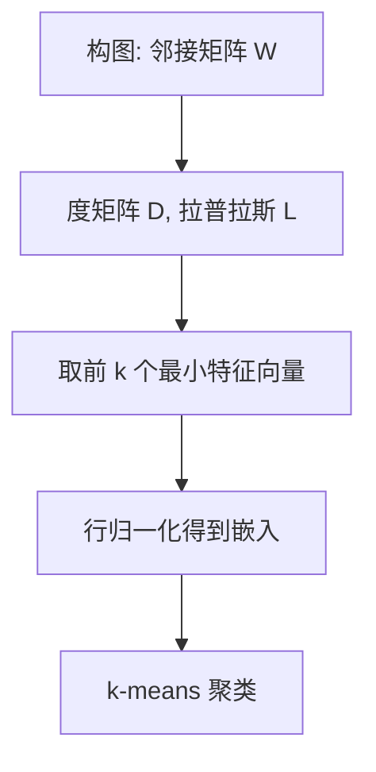

一句话版：**特征值/特征向量**刻画“线性变换在哪些方向只拉伸不旋转，以及拉伸多少”；**谱（spectrum）**是一套关于这些“拉伸因子”的理论工具。
 在机器学习中，它决定了 **PCA 的方差轴**、**梯度下降的步长稳定性**、**图拉普拉斯的聚类结构**、**马尔可夫链/PageRank 的稳态**、**正则与泛化（谱范数/Lipschitz）**。

------

## 1. 特征值/特征向量：定义与几何

**定义**
 给矩阵 $A\in\mathbb{R}^{n\times n}$。若存在非零向量 $v$ 和标量 $\lambda$，使

$A v=\lambda v,$

则 $\lambda$ 为特征值、$v$ 为对应特征向量。方程 $\det(A-\lambda I)=0$ 的根就是全部特征值（允许复数）。

**直觉**

- 大多数方向会“变形+旋转”；**特征方向**只**缩放**（可能换号），缩放因子就是 $\lambda$。
- $|\lambda|$ 大 → 该方向被强拉伸；$|\lambda|$ 小 → 弱拉伸/压缩。

**与 SVD 的关系**

- $A^\top A$ 的特征分解给出 $A$ 的奇异值：$\lambda_i(A^\top A)=\sigma_i(A)^2$。
- 对称矩阵更“好”：有正交基的特征分解（见下）。

------

## 2. 对称矩阵的谱：最理想的世界

**谱定理（实对称矩阵）**
 若 $A=A^\top$，则存在正交矩阵 $Q$ 与实对角矩阵 $\Lambda=\mathrm{diag}(\lambda_1,\dots,\lambda_n)$ 使

$A=Q\Lambda Q^\top,\quad Q^\top Q=I.$

- 特征值全为**实数**；不同特征值对应的特征向量**正交**。
- 二次型 $x^\top A x=\sum_i \lambda_i z_i^2$（其中 $z=Q^\top x$），几何上是沿特征轴的抛物面。

**正定性连结**

- $A\succ 0 \iff \lambda_{\min}(A)>0$；
- $A\succeq 0 \iff \lambda_i\ge 0$。
   用于判断凸性、设计预条件、做 Cholesky 等。

------

## 3. Rayleigh 商与变分刻画（PCA 的数学内核）

**Rayleigh 商**

$R_A(x)=\frac{x^\top A x}{x^\top x},\quad x\ne 0.$

对称 $A$ 的极值性质：

$\lambda_{\max}(A)=\max_{\|x\|=1} R_A(x),\quad  \lambda_{\min}(A)=\min_{\|x\|=1} R_A(x).$

**Courant–Fischer**（更一般的极值表征）给出第 $k$ 大特征值的约束极值形式。

**PCA 连接**
 协方差 $S=\frac{1}{m}X^\top X$（零均值）。
 第一主成分 $v_1 = \arg\max_{\|v\|=1} v^\top S v$，其最优值是 $\lambda_{\max}(S)$（最大方差）。
 后续主成分在前面约束正交的子空间内取最大 Rayleigh 商。

------

## 4. 谱半径与幂迭代（最大特征值/向量的简易算法）

**谱半径** $\rho(A)=\max_i|\lambda_i|$。
 **幂迭代（Power Iteration）**：在 $|\lambda_1|>|\lambda_2|$ 且随机初始向量与 $v_1$ 不正交时，

$x_{k+1}=\frac{A x_k}{\|A x_k\|}$

收敛到主特征向量 $v_1$，收敛速率 $\sim |\lambda_2/\lambda_1|^k$。

**工程要点**

- 求最小特征值可对 $(A-\mu I)^{-1}$ 做幂迭代（shift-invert）。
- 求前 $k$ 个：用 **Lanczos/Arnoldi**（稀疏大规模的主力），或**随机化 SVD**。

**示例（NumPy）**

```python
import numpy as np

def power_iteration(A, iters=1000, tol=1e-9):
    n = A.shape[0]
    x = np.random.randn(n); x /= np.linalg.norm(x)
    last = None
    for _ in range(iters):
        x_new = A @ x
        x_new_norm = np.linalg.norm(x_new)
        if x_new_norm == 0: break
        x = x_new / x_new_norm
        # Rayleigh quotient 作为特征值近似
        lam = x @ (A @ x)
        if last is not None and abs(lam - last) < tol: break
        last = lam
    return lam, x

A = np.array([[2.,1.],[1.,3.]])
lam1, v1 = power_iteration(A)
```

------

## 5. Gershgorin 圆盘定理：特征值的“地图”

对 $A=(a_{ij})$，令 $R_i=\sum_{j\ne i}|a_{ij}|$。
 **定理**：所有特征值都落在并集 $\bigcup_i \{z\in\mathbb{C}: |z-a_{ii}|\le R_i\}$。
 **用途**：快速得到谱的粗界（如判断是否可能非正定），调参或归一化的参考。

------

## 6. Perron–Frobenius：非负矩阵与马尔可夫链

若 $M\ge 0$（元素非负）且**不可约**，则：

- 存在唯一主特征值 $\lambda_{\max}>0$（称 Perron 根），对应特征向量可取全正。
- 对**随机矩阵**（行和或列和为 1），$\lambda_{\max}=1$。
- **稳态分布** $\pi^\top M=\pi^\top$（或 $M \pi=\pi$）就是 1 的特征向量（归一化为概率）。

**PageRank**
 $P$ 是网页转移矩阵（含阻尼 $\alpha$ 与随机跳转），求 $P^\top r=r$ 的特征向量即排名。

------

## 7. 图拉普拉斯谱：聚类与几何

给无向图，邻接 $W$，度矩阵 $D=\mathrm{diag}(d_i)$。
 **无归一化拉普拉斯**：$L=D-W$；**对称归一化**：$L_{\text{sym}}=I-D^{-1/2} W D^{-1/2}$。

性质（对称 PSD）：

- $\lambda_1=0$，特征向量为常数；零特征值的重数等于连通分量个数。
- 第二小特征值（Fiedler 值）与**图割**紧密相关。
- **谱聚类**流程：取 $L$（或 $L_{\text{sym}}$）的前 $k$ 个最小特征向量 → 行归一化 → k-means。



**说明**：图示的是谱聚类的标准管线。

------

## 8. 在 ML/优化里的高频用法

### 8.1 学习率与收敛（线性二次情形）

最小化 $f(x)=\tfrac12 x^\top A x - b^\top x$（$A\succ 0$），GD 更新 $x_{t+1}=x_t-\eta\nabla f(x_t)$ 稳定当且仅当

$0<\eta<\frac{2}{\lambda_{\max}(A)}.$

**结论**：**最大特征值**决定安全步长上界；**谱条件数** $\kappa=\lambda_{\max}/\lambda_{\min}$ 决定收敛速率。

### 8.2 谱范数与 Lipschitz

$\|A\|_2=\sigma_{\max}(A)=\sqrt{\lambda_{\max}(A^\top A)}$。

- 控制 $\|W\|_2$（**谱归一化**）可约束网络的 Lipschitz 常数，稳定 GAN/认证鲁棒性。
- 训练中可用幂迭代近似 $\sigma_{\max}$ 做正则。

### 8.3 PCA / 协方差

- 协方差的特征值 = 方向方差；特征向量 = 主轴。
- 只保留前 $k$ 个特征值方向完成降维与去噪。

### 8.4 Whitening/图扩散/矩阵函数

- **白化**：$S^{-1/2}$ 需要光谱分解 $S=Q\Lambda Q^\top$，再取 $\Lambda^{-1/2}$。
- **图扩散**：$\exp(-t L)$ 表示热扩散，利用谱定义矩阵函数。
- **位置编码**：图/连续域里的 Laplace–Beltrami 谱用于构造频率基。

------

## 9. 数值实践：怎么“又快又稳”

- 对称问题用 `eigh`（NumPy）/`torch.linalg.eigh`（更稳更快）而不是 `eig`。
- 大规模稀疏：不要全量 `eig`；用 `scipy.sparse.linalg.eigsh`（Lanczos），或**随机化 SVD**。
- 近似最大特征值/谱范数：幂迭代 10–20 步已很好用。
- 谱图方法对**度差异大**敏感，优先用**归一化拉普拉斯**。
- 协方差秩亏：加 $\epsilon I$（jitter）或转 SVD。

**小代码（NumPy/PyTorch）**

```python
import numpy as np, torch

# 对称阵特征分解
A = np.array([[2.,1.],[1.,3.]])
w, Q = np.linalg.eigh(A)  # w 升序
# 验证 A ≈ Q diag(w) Q^T
np.allclose(A, Q @ np.diag(w) @ Q.T)

# PCA: 用 SVD 更稳
X = np.random.randn(500, 64); X -= X.mean(0, keepdims=True)
U, S, Vt = np.linalg.svd(X, full_matrices=False)  # 主成分在 Vt
Z = X @ Vt[:10].T  # 前10维

# PyTorch: 最大奇异值(谱范数)幂迭代
Wt = torch.randn(128, 64)
u = torch.randn(128); u = u/ u.norm()
for _ in range(20):
    v = (Wt.t() @ u); v = v / v.norm()
    u = (Wt @ v);    u = u / u.norm()
sigma_max = (u @ (Wt @ v)).item()
```

------

## 10. 常见坑与排错

1. **把 `eig` 用在对称阵**：更慢更不稳；用 `eigh`。
2. **正规方程替代谱方法**：$(X^\top X)$ 条件数平方且秩亏容易炸；PCA 用 SVD。
3. **忽视归一化**：图谱/相似度谱在未归一化时易受度/尺度影响，导致聚类效果差。
4. **幂迭代不收敛**：$|\lambda_1|=|\lambda_2|$ 或初始向量与主特征向量正交；可加小噪声/换初始/用 Lanczos。
5. **把半正定当正定**：$\lambda_{\min}=0$ 造成不可逆；需要加 $\epsilon I$ 或做低秩处理。
6. **图构建过密/过稀**：直接决定谱与聚类质量；调 $k$-NN 半径或阈值、做对称化。

------

## 11. 练习（含提示/要点）

1. **Rayleigh 极值**
    证明对称 $A$ 有 $\lambda_{\max}=\max_{\|x\|=1} x^\top A x$。
    *提示*：用谱分解与 Cauchy–Schwarz。
2. **GD 步长稳定**
    对 $f(x)=\tfrac12 x^\top A x$（$A\succ0$），证明 GD 稳定条件 $\eta<2/\lambda_{\max}$。
    *提示*：分析误差递推 $e_{t+1}=(I-\eta A)e_t$ 的谱半径。
3. **Gershgorin 应用**
    给定 $A=\begin{bmatrix} 3&-1&0\\ -1&2&-1\\ 0&-1&2 \end{bmatrix}$，用圆盘定理给出特征值范围，并与数值 `eigh` 对比。
4. **谱聚类动手**
    生成两团 2D 高斯点，构 $k$-NN 图（高斯权重），按 7 节流程完成聚类，与 k-means（原空间）对比。
5. **谱范数正则**
    设计一个简单线性分类器，在训练中加入 $\lambda\|W\|_2$ 的惩罚（用幂迭代近似），观察对泛化的影响。
6. **Perron–Frobenius**
    构造一个 5×5 的随机转移矩阵 $P$，求稳态分布 $\pi$（$\pi^\top P=\pi^\top$），并验证收敛：从任意分布 $p_0$ 迭代 $p_{t+1}^\top=p_t^\top P$。

------

## 12. 小结

- **特征值/向量**将线性变换分解为“沿主轴的缩放”。
- **对称谱**最干净：实特征值、正交基、变分刻画，支撑 PCA、凸性与二阶方法。
- **谱半径与条件数**决定了优化的**稳定与速度**；**谱范数**连接 Lipschitz 与正则。
- **图谱**揭示结构（连通与社群）；**非负谱**刻画马尔可夫链稳态与 PageRank。
- 工程上：`eigh`/Lanczos/SVD + 归一化 + 正则 + 近似算法，**既快又稳**地把谱工具用到模型里。
