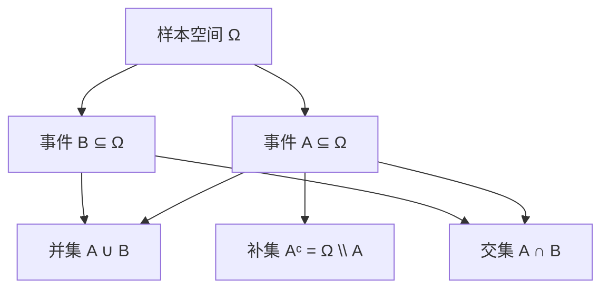
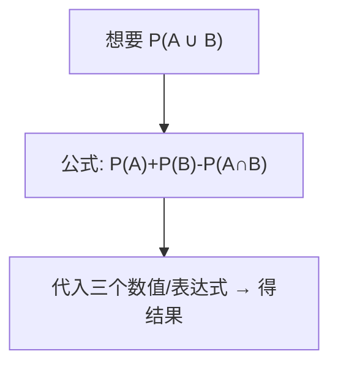

一句话版：**概率 = 在一堆可能结果（样本空间）上，对“事件（子集）”分配 0~1 的“可信度”，满足三条公理**。这些最基础的砖头，后面要砌成条件概率、贝叶斯、极大似然、交叉熵、注意力采样等摩天大楼。

------

## 1. 样本空间：所有“可能发生”的集合

- **定义**：一次随机试验所有可能结果组成的集合，记作 $\Omega$（读“欧米伽”）。
- **例子**
  - 抛硬币一次：$\Omega=\{\text{正},\text{反}\}$。
  - 掷骰子一次：$\Omega=\{1,2,3,4,5,6\}$。
  - 训练集里随机抽取一张图片：$\Omega=$“数据集中所有图片的索引”。
  - LLM 生成下一个 token：$\Omega=$ 词表（比如 50k 个 token）。
  - 连续情形（如误差/噪声）：$\Omega=\mathbb{R}$ 或 $\mathbb{R}^d$。

> 类比：**样本空间像水果市场的全部摊位**，后面的“事件”是在这些摊位上“选几个区域”。

### Ω 的颗粒度与建模

- 同一个现象可以选不同的 $\Omega$。掷骰子可选“点数”，也可选“奇偶”。建模时选一个**既能表达问题，又不至于过细**的 Ω。

------

## 2. 事件：在 Ω 里“划一个区域”

- **定义**：事件 $A$ 是 $\Omega$ 的一个子集。发生“事件 $A$”意味着**结果恰落在** $A$ 里。
- **常用运算（全是集合运算）**
  - 并：$A\cup B$（A 或 B 发生）
  - 交：$A\cap B$（A 且 B 发生）
  - 补：$A^{\mathrm c}=\Omega\setminus A$（A 不发生）
  - 互斥：$A\cap B=\varnothing$

> 在连续空间里，要让“概率”讲得通，需要规定哪些子集是“可测”的——这就是**σ-代数（sigma-algebra）**：一个对子集封闭的集合族，包含 $\Omega$，对补集、可数并封闭。直觉上：**我们只在“可测事件”上讨论概率**。

### （可选）结构图：从 Ω 到事件运算

**说明**：事件就是 Ω 的子集；并/交/补是最基本的事件构造法。

------

## 3. 概率公理：Kolmogorov 三板斧

在一个给定的 $(\Omega,\mathcal{F})$（样本空间与可测事件族）上，**概率**是一个函数 $P:\mathcal{F}\to[0,1]$，满足：

1. **非负性**：对任意事件 $A$，$P(A)\ge 0$。
2. **规范化**：$P(\Omega)=1$。
3. **可数可加性**：若 $A_1,A_2,\dots$ 两两互斥，则

$P\Big(\bigcup_{i=1}^\infty A_i\Big)=\sum_{i=1}^\infty P(A_i).$

从三板斧能**推**出一堆常用公式（务必熟）：

- $P(\varnothing)=0$；

- **补集公式**：$P(A^{\mathrm c})=1-P(A)$；

- **单调性**：若 $A\subseteq B$，则 $P(A)\le P(B)$；

- **并的容斥（两集合版）**：

  $$
P(A∪B)=P(A)+P(B)−P(A∩B).P(A\cup B)=P(A)+P(B)-P(A\cap B).
  $$

- **Boole 不等式（Union Bound）**：

  $$
  P(⋃i=1nAi)≤∑i=1nP(Ai).P\Big(\bigcup_{i=1}^n A_i\Big)\le\sum_{i=1}^n P(A_i).
  $$

  ——机器学习里常用来给“**至少出错一次**”的概率上界。

**说明**：并集概率不等于简单相加，**要减去交集**避免双计。

------

## 4. 小算例：掷骰子与 LLM 采样

### 4.1 掷两次骰子

- Ω：$\{1,\dots,6\}\times\{1,\dots,6\}$，共 36 点。

- 事件 A：“点数和为 7”。

  $$
A={(1,6),(2,5),(3,4),(4,3),(5,2),(6,1)},P(A)=6/36=1/6.A=\{(1,6),(2,5),(3,4),(4,3),(5,2),(6,1)\},\quad P(A)=6/36=1/6.
  $$

- 事件 B：“至少有一个 6”。

  $$
P(B)=1−P(都不是 6)=1−(5/6)2=11/36.P(B)=1-P(\text{都不是 6})=1-(5/6)^2=11/36.
  $$

- $P(A\cup B)=P(A)+P(B)-P(A\cap B)$。
   交集是 $(1,6),(6,1)$ 两个，故

  $$
  P(A∪B)=636+1136−236=1536.P(A\cup B)=\frac{6}{36}+\frac{11}{36}-\frac{2}{36}=\frac{15}{36}.
  $$

### 4.2 LLM 下一个 token

- Ω = 词表 $\mathcal{V}$；模型给出分布 $P_\theta(t\,|\,\text{上下文})$。

- 事件 A：“下一个 token 在 top-k 集合里”。

  P(A)=∑t∈Top-kPθ(t ∣ ⋅).P(A)=\sum_{t\in \text{Top-}k} P_\theta(t\,|\,\cdot).

- 提高温度 $T>1$：分布更平坦；**并非增加概率总和**（总和仍 1），而是改变**质量的分布方式**，$P'(t)\propto P(t)^{1/T}$。

------

## 5. 与机器学习的关系网（为什么你需要这三板斧）

- **交叉熵/极大似然**：在离散 Ω 上，似然就是**事件“观察到这条样本”**的概率；最大化它等价于最小化交叉熵。

- **期望与误差率**（下一节会系统讲）：分类错误率

  $$
Err=P(Y^≠Y)=E[1{Y^≠Y}],\mathrm{Err}=P(\hat Y\neq Y)=\mathbb{E}[\mathbf{1}\{\hat Y\neq Y\}],
  $$

  本质上就是**事件的概率**。

- **泛化界的 Union Bound**：把“很多坏事件中的任意一件发生”的概率用 $\le$ 各自概率之和上界。

- **校准（Calibration）**：若模型对事件 A 的打分 $\hat p$ 常常满足“频率 ≈ $\hat p$”——就叫**概率校准好**。

- **数据集偏移**：训练分布 $P_{\text{train}}$ 与测试分布 $P_{\text{test}}$ 不同 ⇒ 同一事件 $A$ 的概率改变，性能掉线。

------

## 6. 易混知识点（一分钟避坑）

- **互斥 ≠ 独立**：
  - 互斥：$A\cap B=\varnothing$（不能同发）。
  - 独立：$P(A\cap B)=P(A)P(B)$（相关性为 0）。
     两者不是一回事；互斥且都非零 ⇒ 不可能独立（想想概率相乘为何对不上）。
- **“概率 0”不等于“不可能”**：连续空间里，$\{X=0\}$ 常有 $P=0$，但不是不可能；只是不“占体积”。
- **频率 ≈ 概率**需要**足够大样本**且独立同分布（LLN 的内容，后续会讲）。

------

## 7. 迷你练习

1. 掷硬币三次，A=“至少出现一次正面”，求 $P(A)$。
2. 掷骰子一次，A=“偶数”，B=“≥4”。算 $P(A),P(B),P(A\cup B),P(A\cap B)$。
3. 给定事件 $A\subseteq B$，证明 $P(B\setminus A)=P(B)-P(A)$。
4. LLM 的 top-k=50，若前 50 个 token 的概率和为 0.92，问事件“抽到词表外前 50 的 token”的概率是多少？
5. 用 Union Bound 给“在 1000 次独立试验中，至少一次失败（每次失败概率 0.1%）”的概率上界。

> 参考：1) $1-(1/2)^3=7/8$；2) 自算；4) 0.08；5) $\le 1000\times 0.001=1$（上界很松，精确值是 $1-(1-0.001)^{1000}$）。

------

## 8. 小结

- **样本空间 Ω**：所有可能结果；**事件**：Ω 的子集；**概率**：给事件分数，满足**非负、规范化、可数可加**。
- 用三板斧就能推导**补集、容斥与并界**——这些在 ML/LLM 里处处用得到（错误率、采样概率、泛化上界）。
- 下一节我们把“概率”联到**随机变量与分布**，引入**期望、方差**，让损失与评估指标都能写成“期望”的统一语言。
