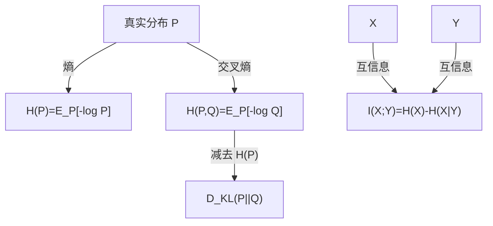
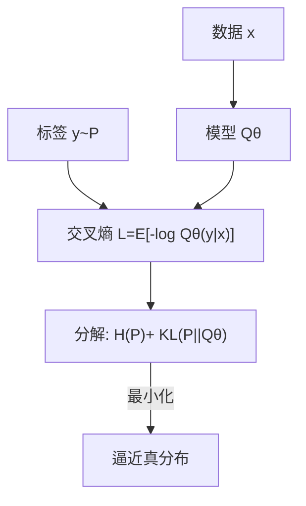

一句话版：
**熵**衡量“平均不确定性/压缩极限”；**交叉熵**衡量“用模型 Q 去编码真实 P 的平均码长”；
**KL 散度**是“多花的码长”= 交叉熵 − 熵；**互信息**衡量“X 与 Y 之间共享的信息量”。

---

## 1. 为什么 ML/LLM 需要信息论？

* **分类训练**常用的“交叉熵损失”其实就是信息论里的交叉熵；
* **语言建模**的 **perplexity（困惑度）** = $2^{\text{每 token 的熵}}$（以 2 为底），直接反映压缩能力；
* **蒸馏/对齐**常用 KL；**VAE** 的目标是重构项 − KL；**对比学习**用互信息下界（InfoNCE）；
* **RL** 里加“策略熵”= 鼓励多样化；**信息瓶颈**控制表征里“保留多少关于标签的信息”。

---

## 2. 熵（Entropy）：平均不确定性与码长

### 2.1 定义与单位

离散分布 $P$ 的熵（以对数底 $b$）：

$$
H_b(P)=\mathbb{E}_{x\sim P}[-\log_b P(x)].
$$

* 底 $b=2$ → 单位 **bit**；$b=e$ → **nat**。本文默认 **nat**（自然对数），需要 bit 时除以 $\ln 2$。

**直觉**：最优压缩下，每次观测的**平均码长**恰好是 $H(P)$。

### 2.2 例子与性质

* **公平硬币**：$H= \log 2=1 \text{ bit}$。
* **偏硬币** $P(1)=0.9$：$H=-0.9\log 0.9-0.1\log 0.1$（低于 1，因更可预测）。
* **均匀骰子**：$H=\log 6\approx 2.585$ bit。
* 若 $X,Y$ 独立：$H(X,Y)=H(X)+H(Y)$。
* 条件熵：$H(X|Y)=\mathbb{E}_{y} H(X|Y=y)$，满足 $H(X,Y)=H(X|Y)+H(Y)$。

> **连续变量**用**微分熵** $h(X)=-\int f(x)\log f(x)dx$，可为负，**不**等于可压缩码长（要配合量化/速率失真理论）。

---

## 3. 交叉熵（Cross-Entropy）：用 Q 编码 P 的成本

定义：

$$
H(P,Q)=\mathbb{E}_{x\sim P}[-\log Q(x)].
$$

* 看真实分布 $P$ 的样本，却按“你以为的分布” $Q$ 去编码。
* **分类训练**：将 $Q_\theta(y|x)$ 拟合到真实 $P(y|x)$（独热标签），最小化的就是 $\mathbb{E}[-\log Q_\theta(y|x)]$ ——**NLL = 交叉熵**。

**分解**（超级重要）：

$$
H(P,Q) = H(P) + D_{\mathrm{KL}}(P\Vert Q).
$$

→ 交叉熵 = “数据本身难度” + “模型与真相的偏差”。
**结论**：固定数据，最小化交叉熵 ⇔ 最小化 KL。

**例**（三分类一条样本）：真标签 $P=(1,0,0)$，模型 $Q=(0.7,0.2,0.1)$，
交叉熵 $=-\log 0.7$（nat）。Top-1 概率越高，交叉熵越小。

---

## 4. KL 散度（Kullback–Leibler）：“多付的码长”

定义：

$$
D_{\mathrm{KL}}(P\Vert Q)=\mathbb{E}_{x\sim P}\big[\log \tfrac{P(x)}{Q(x)}\big] \ge 0,
$$

等号当且仅当 $P=Q$（几乎处处）。

* **非对称**：$D_{\mathrm{KL}}(P\Vert Q)\neq D_{\mathrm{KL}}(Q\Vert P)$；
* **支撑要求**：若存在 $P(x)>0$ 而 $Q(x)=0$，则 KL = $+\infty$（模型把可能事件判为不可能）。
* **信息几何**：KL 像“定向距离”，支撑变分推断、MDL（最短描述长度）等。

**两点分布例**（伯努利）：
$P=\text{Bern}(p), Q=\text{Bern}(q)$：

$$
D_{\mathrm{KL}}=\ p\log\frac{p}{q}+(1-p)\log\frac{1-p}{1-q}.
$$

**工程影子**

* **蒸馏**：$\mathrm{KL}(P_{\text{teacher}}\Vert Q_{\text{student}})$；
* **VAE**：$\mathbb{E}_{q(z|x)}[\log p(x|z)] - D_{\mathrm{KL}}(q(z|x)\Vert p(z))$；
* **GAN（f-GAN）**：可解释为不同 f-散度（KL、JS 等）的最小化。
* **温度/标签平滑**：增大熵（更平滑），常提升泛化与校准。

---

## 5. 互信息（Mutual Information）：共享的那部分

三种等价定义（任选其一记住）：

$$
\begin{aligned}
I(X;Y) &= \mathbb{E}_{x,y}\!\left[\log \frac{p(x,y)}{p(x)p(y)}\right] \\
&= H(X)-H(X|Y) \\
&= H(Y)-H(Y|X).
\end{aligned}
$$

* **非负**，对称；
* **数据处理不等式**：若 $X \to Z \to Y$ 构成马尔可夫链，则 $I(X;Y) \le I(X;Z)$（处理不会增加信息）。

**经典二元对称信道**：
$X\sim \mathrm{Bern}(1/2)$，$Y$ 是以概率 $\varepsilon$ 翻转的 $X$，
则 $I(X;Y)=1 - H_2(\varepsilon)$（比特熵函数），噪声越大互信息越小。

**ML 连接**

* **对比学习/InfoNCE**：最大化下界 $\log N - \text{NCE-loss}\le I$（批大小 $N$）；
* **信息瓶颈**：在表征 $Z$ 上最大化 $I(Z;Y)$ 同时约束 $I(Z;X)$，避免“记忆输入噪声”。
* **特征选择**：选取与标签互信息大的特征。

---

## 6. 概念关系图



**说明**：交叉熵 − 熵 = KL；互信息是“知道 Y 后 X 不确定性减少的量”。

---

## 7. 在深度学习与大模型中的“指定座位”

1. **分类/语言模型**：Softmax + 交叉熵 = MLE。

   * **困惑度** $=\exp(\text{平均交叉熵})$（以 nat）或 $2^{\text{平均交叉熵}_2}$（以 bit）。
2. **知识蒸馏**：最小化 $T^2\,\mathrm{KL}(P_T(\cdot|x)\Vert Q_S(\cdot|x))$（$T$ 为温度）。
3. **VAE**：$\underbrace{\mathbb{E}_{q(z|x)}[\log p(x|z)]}_{\text{重构}}-\underbrace{D_{\mathrm{KL}}(q(z|x)\Vert p(z))}_{\text{正则}}$。
4. **对比学习（SimCLR/InfoNCE）**：用分类式 NCE 损失近似最大化 $I(Z;Z^+)$。
5. **RL**：策略熵正则（最大熵 RL），或 KL 约束的策略更新（TRPO/PPO）。
6. **校准与标签平滑**：提高输出分布熵，降低过度自信；温度缩放等价线性拉伸 logit。
7. **RAG/检索融合**：可用 KL/交叉熵评估候选文档分布与真实证据分布的偏差。

---

## 8. 计算小抄（NumPy 伪码）

```python
import numpy as np

def entropy(p, eps=1e-12):
    p = np.clip(p, eps, 1.0)
    return -np.sum(p*np.log(p), axis=-1)

def cross_entropy(p, q, eps=1e-12):
    p = np.clip(p, eps, 1.0)
    q = np.clip(q, eps, 1.0)
    return -np.sum(p*np.log(q), axis=-1)

def kl_div(p, q, eps=1e-12):
    p = np.clip(p, eps, 1.0)
    q = np.clip(q, eps, 1.0)
    return np.sum(p*np.log(p/q), axis=-1)

# 互信息（经验估计）：I(X;Y)=H(X)+H(Y)-H(X,Y)
def mutual_information(joint):
    # joint: shape (nx, ny), 已归一
    px = joint.sum(1, keepdims=True)
    py = joint.sum(0, keepdims=True)
    Hx = entropy(px.squeeze())
    Hy = entropy(py.squeeze())
    Hxy = entropy(joint.reshape(-1))
    return Hx + Hy - Hxy
```

---

## 9. 例子：手算几步就通

1. **伯努利熵与 KL**
   $P=\text{Bern}(0.8)$ 的熵：$-0.8\log 0.8-0.2\log 0.2$。
   与 $Q=\text{Bern}(0.6)$ 的 KL：$0.8\log\frac{0.8}{0.6}+0.2\log\frac{0.2}{0.4}$。

2. **每 token 交叉熵与困惑度**
   验证集平均交叉熵（nat）为 2.3，则 **perplexity $=\exp(2.3)\approx 9.97$**。

3. **二元对称信道互信息**
   翻转率 $\varepsilon=0.1$ → $I=1-H_2(0.1)\approx 1-0.469=0.531$ bit。

---

## 10. 常见误区（避坑清单）

1. **把 KL 当距离**：KL 不对称且不满足三角不等式；需要对称可用 **JS 散度**。
2. **零概率导致发散**：若 $P(x)>0$ 而 $Q(x)=0$，交叉熵/ KL 无限大；实操要**加 ε/标签平滑**。
3. **混淆熵与损失单位**：log 底不同单位不同；论文/库里注意 bit vs nat。
4. **微分熵可为负**：别把它直接当“码长”。
5. **估计互信息太乐观**：在高维上偏差大；InfoNCE 是**下界**，受 batch/负样本质量影响。
6. **只看 Top-1 准确率**：忽视分布形状（校准）；交叉熵/ Brier 分数可补充评价。
7. **温度缩放误解**：调温度不改变排序，但会改变熵与校准。

---

## 11. 训练目标的“信息视角”



**说明**：最小化交叉熵，就是在固定数据熵的前提下最小化 KL，让模型分布靠近真实分布。

---

## 12. 练习（含提示）

1. **交叉熵分解**：从 $H(P,Q)=\mathbb{E}_P[-\log Q]$ 出发，推导 $=H(P)+D_{\mathrm{KL}}(P\Vert Q)$。
2. **伯努利 KL**：完成 $\text{Bern}(p)$ 与 $\text{Bern}(q)$ 的 KL 推导，并画出 $p\in(0,1)$ 时的曲线。
3. **互信息计算**：给一个 $2\times 2$ 的联合表，手算 $I(X;Y)$，并验证 $I\ge 0$。
4. **VAE 目标**：写出 $\log p(x)$ 的 ELBO，下界为何等于“重构 − KL”。
5. **JS 散度**：证明 $JS(P,Q)=\tfrac12 KL(P\Vert M)+\tfrac12 KL(Q\Vert M)$（$M=\tfrac12(P+Q)$），且 $JS\in[0,\log 2]$。
6. **信息瓶颈**：形式化 $\min I(Z;X)-\beta I(Z;Y)$，讨论 $\beta$ 改变时的表征取舍。
7. **校准评估**：将预测按置信度分箱，估计每箱的交叉熵与 Brier 分数，观察温度缩放前后变化。

---

## 13. 小结

* **熵**给出不确定性的自然标尺，也是最优压缩的极限；
* **交叉熵** = “真实难度 + 模型偏差”，训练里的 NLL 就是它；
* **KL** 是编码多出的平均码长，支撑 VI、蒸馏、VAE 等；
* **互信息**衡量相关性与可预测性，是对比学习与信息瓶颈的核心。

> 记忆口诀：**“熵量难，交叉差，KL 多花，互信息看重叠。”**
