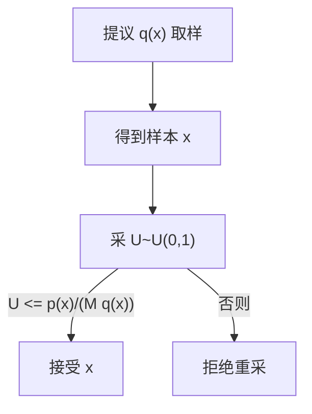
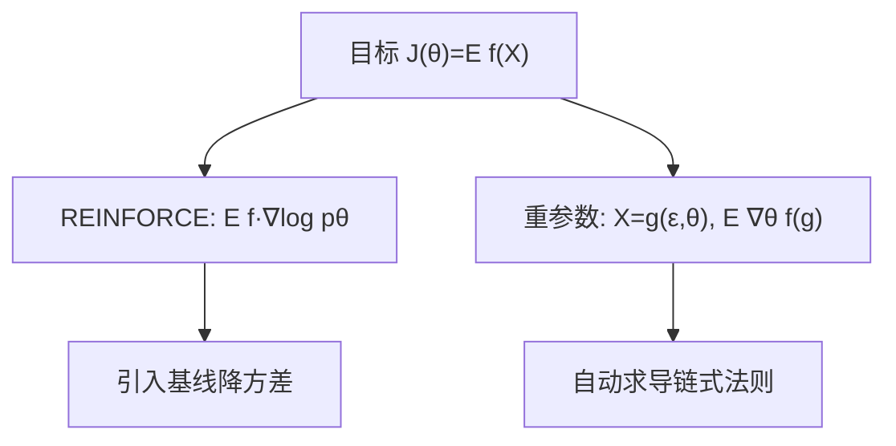
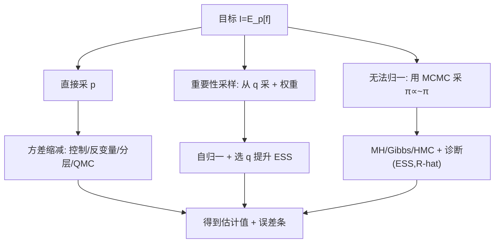

一句话版：当积分太高维、公式推不动时，用**随机样本**近似期望；误差随 $O(1/\sqrt{N})$ 衰减。想让相同样本更“值钱”，就用**方差缩减**（重要性采样、控制变量、分层、反变量、低差异序列）。需要从**复杂分布**取样，就靠 **MCMC**（MH/Gibbs/HMC）或**拒绝采样**/**逆变换**。深度学习里，**重参数化**和 **REINFORCE** 是“可导的蒙特卡洛”。

---

## 1. 为什么是蒙特卡洛？（从“掷飞镖估圆面积”说起）

设我们要计算高维期望/积分

$$
I=\mathbb{E}_{X\sim p}[f(X)]=\int f(x)p(x)\,dx,
$$

解析解通常没有。**蒙特卡洛估计**：

$$
\hat I_N=\frac{1}{N}\sum_{i=1}^N f(X_i),\quad X_i\overset{\text{i.i.d.}}{\sim}p.
$$

* **无偏**：$\mathbb{E}[\hat I_N]=I$。
* **方差**：$\mathrm{Var}(\hat I_N)=\frac{\mathrm{Var}(f(X))}{N}$。
* **误差条**（CLT）：$\sqrt{N}(\hat I_N-I)\Rightarrow \mathcal{N}(0,\sigma_f^2)$。

> 类比：向靶子随机掷飞镖（采样），看落点的平均得分（函数值均值），掷得越多越准，但**收益随 $\sqrt{N}$** 放缓。

---

## 2. 最小工作示例（估 $\pi$）

```python
import numpy as np
rng = np.random.default_rng(0)
N = 1_00000
xy = rng.uniform(-1, 1, size=(N, 2))
inside = (xy**2).sum(axis=1) <= 1
pi_hat = inside.mean() * 4
se = np.sqrt(inside.var() / N) * 4
print(pi_hat, "±", 1.96*se)  # 约 95% 置信区间
```

---

## 3. **方差缩减**工具箱（让每个样本更值钱）

### 3.1 反变量（Antithetic Variates）

成对使用负相关样本降低方差。例如估 $\mathbb{E}[f(U)]$，同时用 $U\sim U(0,1)$ 与 $1-U$，估计 $\frac{f(U)+f(1-U)}{2}$。

### 3.2 控制变量（Control Variates）

找一个与 $f(X)$ 强相关、期望已知 $c(X)$（如线性/二次近似），用

$$
\hat I = \overline{f(X)} - \beta \big(\overline{c(X)} - \mathbb{E}[c]\big),\quad
\beta^\star=\frac{\mathrm{Cov}(f,c)}{\mathrm{Var}(c)}.
$$

### 3.3 分层/分片（Stratified / Latin Hypercube）

把样本空间均匀切片，每片内抽样后再加权平均，降低采样偶然性导致的不均匀覆盖。

### 3.4 重要性采样（Importance Sampling, IS）

当 $p$ 难抽而 $q$ 容易抽，或 $f$ 在某些区域贡献很大时：

$$
I=\int f(x)p(x)\,dx=\int f(x)\frac{p(x)}{q(x)}\,q(x)\,dx
\approx \frac{1}{N}\sum_{i=1}^N f(X_i)\,w(X_i),\quad X_i\sim q,
$$

权重 $w=\frac{p}{q}$。若 $p$ 只知**未归一化** $\tilde p=\text{const}\cdot p$，用**自归一**版本（SNIS）：

$$
\hat I=\frac{\sum f(X_i)\,\tilde w_i}{\sum \tilde w_i},\quad \tilde w_i=\frac{\tilde p(X_i)}{q(X_i)}.
$$

* 选 $q$ 让 $f\cdot p$ 与 $q$ 形状相近（**胖尾包住胖尾**）。
* **有效样本量**（ESS）：$\displaystyle \mathrm{ESS}=\frac{(\sum w)^2}{\sum w^2}$，越接近 $N$ 越好。
* 数值稳定：在**对数域**做 $\log w$ 并用 **log-sum-exp** 归一。

### 3.5 共同随机数（CRN）

比较两个系统/模型的差值时，用**相同随机数**驱动，抵消共有噪声（方差下降）。

### 3.6 低差异序列（Quasi-MC）

Sobol/Halton 等**低差异序列**减少“空洞”，收敛经验上优于纯随机（尤其中低维）。

> 口号：随机样本“多了就准”，低差异“同样多更均匀”。

---

## 4. 采样基本技法（如何从指定分布取样）

### 4.1 逆变换采样（Inverse CDF）

若 CDF $F$ 可反：

$$
U\sim U(0,1),\quad X=F^{-1}(U).
$$

例：指数分布 $F^{-1}(u)=-\frac{1}{\lambda}\log(1-u)$。

### 4.2 拒绝采样（Accept–Reject）

有易采提议 $q$ 和常数 $M$ 使 $p(x)\le M q(x)$。算法：

1. 采 $X\sim q$，再采 $U\sim U(0,1)$；
2. 若 $U \le \frac{p(X)}{M q(X)}$ 接受 $X$，否则拒绝重来。
   接受率 $\approx 1/M$。



**说明**：把难分布“包”在易分布曲线下，掷硬币决定保留与否。

### 4.3 离散别名法（Alias）

对固定离散分布，多次抽样时用别名表 $O(1)$ 采样（一次预处理 $O(K)$）。

### 4.4 高斯采样

实际直接用库；了解 **Box–Muller**（两均匀 → 两标准正态），或 Ziggurat（高效）。

---

## 5. 可导的蒙特卡洛：REINFORCE vs 重参数化

**目标**：对 $\theta$ 可导的期望

$$
J(\theta)=\mathbb{E}_{X\sim p_\theta}[f(X)].
$$

### 5.1 分数函数估计（Score Function / REINFORCE）

$$
\nabla_\theta J=\mathbb{E}[f(X)\,\nabla_\theta \log p_\theta(X)].
$$

* 任意分布可用（离散也行），**无偏但方差大**。
* 引入**基线** $b$（不依赖 $X$）：$\mathbb{E}[(f-b)\nabla\log p]$ 仍无偏，方差更小。
* 强化学习中的策略梯度就是它。

### 5.2 重参数化技巧（Reparameterization Trick）

若 $X=g(\varepsilon,\theta)$，$\varepsilon\sim p(\varepsilon)$ 与 $\theta$ 无关：

$$
\nabla_\theta J=\mathbb{E}_{\varepsilon}[\nabla_\theta f(g(\varepsilon,\theta))].
$$

* **低方差**，VAE、扩散模型都在用。
* 离散变量可用 **Gumbel–Softmax（Concrete）** 近似重参数化。



**说明**：两条路线各有适用场景：离散/黑箱用 REINFORCE；可重参数化就用重参数化。

---

## 6. 马尔可夫链蒙特卡洛（MCMC）：从**未归一化**密度取样

当只知 $\pi(x)\propto \tilde\pi(x)$（比如贝叶斯后验）时，用 MCMC 构造以 $\pi$ 为稳态分布的马尔可夫链。

### 6.1 Metropolis–Hastings（MH）

* 提议 $y\sim q(\cdot|x)$，以概率

$$
\alpha(x,y)=\min\left(1, \frac{\tilde\pi(y)\,q(x|y)}{\tilde\pi(x)\,q(y|x)}\right)
$$

接受，否者停在 $x$。

* 对称提议（随机游走）简化为 $\min(1,\tilde\pi(y)/\tilde\pi(x))$。

**1D 示例（双峰后验）**

```python
import numpy as np
rng = np.random.default_rng(0)

def log_unnorm_pi(x):  # 两高斯混合的对数密度(未归一)
    return np.log(0.5*np.exp(-(x-2)**2/2) + 0.5*np.exp(-(x+2)**2/0.5))

def mh(n=20000, x0=0.0, step=1.0):
    xs = np.empty(n); xs[0]=x0
    for t in range(1, n):
        prop = xs[t-1] + step*rng.normal()
        loga = min(0.0, log_unnorm_pi(prop)-log_unnorm_pi(xs[t-1]))
        xs[t] = prop if np.log(rng.random()) < loga else xs[t-1]
    return xs

chain = mh()
burn = 2000
samples = chain[burn:]
```

* 经验：随机游走 MH 的**接受率**在中高维以 0.2–0.4 较合适（常被引用的“0.234”只是特定假设下的启发）。

### 6.2 Gibbs 采样

当条件分布易采样时，轮流从 $p(x_j\mid x_{-j})$ 取样。
例：多元高斯的协方差已知时的逐坐标采样有闭式。

### 6.3 Hamiltonian MC（HMC）

借助梯度，用“弹跳”在高维快速移动（leapfrog）。

* 关键超参：步长 $\varepsilon$、步数 $L$；
* NUTS 自动选 $L$，是贝叶斯工具箱常用默认。

### 6.4 诊断与误差

* **自相关 & 有效样本量（ESS）**：链相关高 ⇒ ESS 低。
* **收敛诊断**：多链 $\hat R$（Gelman–Rubin）接近 1；看**轨迹图/直方图**。
* **烧入/抽稀**：前几步丢弃（burn-in）；抽稀有时反而浪费，重点是提高 ESS。

---

## 7. 顺序蒙特卡洛（SMC / 粒子滤波）（一眼入门）

* 动态系统：$x_t \sim p(x_t\mid x_{t-1})$，观测 $y_t\sim p(y_t\mid x_t)$。
* 用粒子 $\{x_t^{(i)}, w_t^{(i)}\}$ 近似后验；随时间递推并**重采样**避免权重退化。
* 应用：跟踪、在线贝叶斯、非线性/非高斯状态空间模型。

---

## 8. 在 ML/LLM 中的“指定座位”

1. **VI/VAE**：ELBO 中的期望用**重参数化**估计梯度；KL 项常有闭式。
2. **RL（策略梯度/离线评估）**：REINFORCE + **基线**、**广义优势估计（GAE）**；离线评估用（加权）重要性采样，注意**方差爆炸**，常做**截断/加权修正**。
3. **不确定性**：MC Dropout 把 dropout 当近似贝叶斯，前向多次求均值与方差。
4. **扩散/生成**：采样过程本质是按**马尔可夫链**逐步抽样（虽不直接用 MC 积分）。
5. **A/B 测试**：后验均值/概率比较可用蒙特卡洛近似 $P(p_A>p_B)$。

---

## 9. 方法选型备忘（**何时用谁？**）

| 任务/场景                            | 首选方法                | 备注         |
| -------------------------------- | ------------------- | ---------- |
| 直接期望 $\mathbb{E}_p[f]$ 可从 $p$ 采样 | 朴素 MC + 控制变量/反变量/分层 | 先做简单方差缩减   |
| $p$ 难采 / 只知未归一化                  | SNIS / MCMC         | 看维度和梯度可用性  |
| 高维、可求 $\nabla \log \pi$          | HMC/NUTS            | 轨迹长跳、ESS 高 |
| 很多样本、低中维                         | 低差异序列 (Sobol)       | QMC 往往更稳   |
| 离散策略梯度/黑箱                        | REINFORCE(+基线/控制变元) | 可能配合 IS    |
| 连续可重参数化                          | Reparam（VAE, GFlow） | 低方差梯度      |

---

## 10. 常见坑（避坑清单）

1. **权重退化**：IS 的少数样本权重独大，ESS 极小 → 换更贴合的 $q$，或分层/自适应 IS。
2. **数值溢出**：直接算 $\exp(\log w)$ 溢出 → 用 log-sum-exp；在 PyTorch/TF 用稳定 API。
3. **MCMC 不收敛**：步长过大/小、提议不合适；只看后验均值而不做诊断。
4. **抽稀迷信**：Thinning 并不提高 ESS/时间效率；与其抽稀不如调提议或增加样本。
5. **重参数化错误**：$\varepsilon$ 必须与 $\theta$ **独立**；否则偏导错。
6. **用 MC 估计极小概率**：方差巨大 → 用**重要性采样**或**稀有事件**技巧（如指数变换）。
7. **把 QMC 当银弹**：高维/不规则积分 QMC 可能失效；混用随机扰动（RQMC）更稳。
8. **离线评估的高方差**：IS 权重长尾 → 截断/加权 IS、Doubly Robust、FQE 等。

---

## 11. 练习（含提示）

1. **控制变量**：对 $f(x)=\sin x$ 且 $x\sim U[0,\pi]$，取 $c(x)=x-\pi/2$（$\mathbb{E}[c]=0$），推导 $\beta^\star$。
2. **IS 的 $q$ 选择**：目标 $p=\mathcal{N}(0,1)$，估 $\mathbb{E}[e^{3X} 1_{X>2}]$。比较 $q=\mathcal{N}(0,1)$、$\mathcal{N}(3,1)$ 的 ESS 与方差。
3. **SNIS 数值稳定**：实现对数域 SNIS，并计算 ESS 与 95% 置信区间。
4. **MH 调参**：在 1D 高斯目标下，扫描 step，画出接受率与 ESS 的关系。
5. **Gibbs**：对二元高斯 $\mathcal{N}(\mu,\Sigma)$ 写出条件高斯闭式并实现 Gibbs。
6. **REINFORCE 基线**：证明加常数基线不改变无偏性，并推导最优常数基线（最小方差）。
7. **重参数化**：对 $X\sim \mathcal{N}(\mu,\sigma^2)$ 推出 $\nabla_\mu,\nabla_\sigma$ 的重参数化梯度表达式；对比 REINFORCE 方差。
8. **QMC**：用 Sobol 序列估 $\int_{[0,1]^5}\prod_i \frac{1}{1+x_i}\,dx$，对比伪随机的误差曲线。

---

## 12. 代码速写（可直接粘贴改造）

### 12.1 自归一重要性采样（对数域 + ESS）

```python
import numpy as np
rng = np.random.default_rng(0)

def logw_x_from_q(x):   # 例：目标是标准正态密度(未归一)=exp(-x^2/2)，提议 q=N(2,1)
    logp_unn = -0.5*x**2
    logq = -0.5*(x-2)**2  # 常数项可省，SNIS会抵消
    return logp_unn - logq

N = 20000
x = rng.normal(loc=2.0, scale=1.0, size=N)
lw = logw_x_from_q(x)
# 归一化权重
m = lw.max()
w = np.exp(lw - m)
w /= w.sum()
# 估计 E[X>0]
I_hat = (w * (x > 0)).sum()
ESS = (w.sum()**2) / (w**2).sum()
print(I_hat, ESS)
```

### 12.2 反变量 + 分层（U\[0,1] 积分示意）

```python
def integrate_unit(f, N=10000, stratified=True, antithetic=True):
    rng = np.random.default_rng(0)
    if stratified:
        k = int(np.sqrt(N)); N = k*k
        u1 = (np.arange(k)+rng.random(k))/k
        u2 = (np.arange(k)+rng.random(k))/k
        U = np.stack(np.meshgrid(u1,u2), -1).reshape(-1,2)  # 2D 示意
        vals = f(U[:,0])
    else:
        U = rng.random(N)
        vals = f(U)
    if antithetic:
        vals = 0.5*(vals + f(1-U[:,0]))
    return vals.mean(), vals.std(ddof=1)/np.sqrt(len(vals))
```

---

## 13. 方法路线图



**说明**：这是“从目标到估计值”的三大路线，以及各自常用增强手段。

---

## 14. 小结

* **蒙特卡洛**把期望变样本平均，靠 LLN/CLT 保底；误差 $\sim O(1/\sqrt{N})$。
* **方差缩减**是工程的灵魂：IS、控制变量、分层、反变量、QMC。
* **采样**是根基：逆变换、拒绝采样、别名法；**MCMC**解决“只知未归一”的后验。
* **深度学习**重在“**可导**”：REINFORCE（加基线）与**重参数化**（优先）。
* 实战口诀：**“先易后难：能直接采就直接采；能降方差先降方差；MCMC 要诊断；IS 看 ESS；数值一律上对数域。”**
