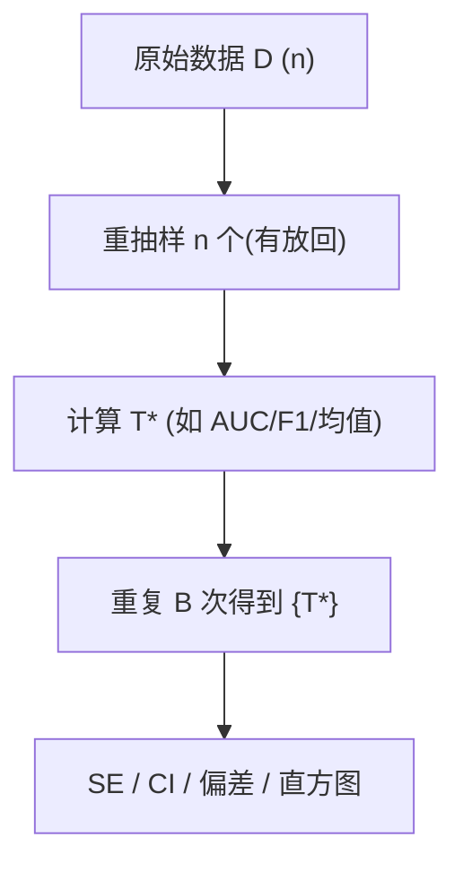

*Bootstrap 方法（重抽样：把一份数据“用出 1000 份”的威力）*

一句话版：当解析公式难、样本不大或分布未知时，**Bootstrap** 用“**对原样本有放回重抽**”来近似统计量的抽样分布，从而给出**标准误（SE）**、**置信区间（CI）**和**偏差估计**。
在 ML 里，它能：给 **AUC/F1/准确率** 做 CI，评估**模型稳定性**，估计**特征重要性方差**，以及连接到 **Bagging/随机森林** 的 **Out-of-Bag** 思想。

---

## 1. 为什么要 Bootstrap？

* **理论难**：中位数、分位数、AUC、F1 等统计量的方差/CI 没有简单闭式。
* **样本不大**：一味依赖“大样本近似（CLT）”不稳。
* **分布未知**：你不想强加“高斯/伯努利”等假设。
* **工程诉求**：我们更关心**这一次数据集**上模型的**不确定性**——Bootstrap 正合适。

---

## 2. 基本想法：用数据“生成数据”，近似抽样分布

设原始数据集 $D=\{z_i\}_{i=1}^n$，统计量 $T=t(D)$（如均值、AUC、模型系数等）。
**非参数 Bootstrap**（最常用）步骤：

1. **有放回**地从 $D$ 抽取 $n$ 个样本，得一份“自助样本” $D^{\*b}$。
2. 计算统计量 $T^{\*b}=t(D^{\*b})$。
3. 重复 **$B$ 次**得到 $\{T^{\*1},\dots,T^{\*B}\}$。
4. 用 $\{T^{\*b}\}$ 的经验分布估计 **SE/CI/偏差**。



**说明**：图示的是 Bootstrap 的“抽—算—汇总—结论”流程。

---

## 3. 从分布到数：SE、偏差与 CI

* **标准误**：$\widehat{\mathrm{SE}}(T) = \mathrm{sd}(T^{\*1},\ldots,T^{\*B})$。
* **偏差估计**：$\widehat{\mathrm{bias}}=\bar T^{\*}-T$，其中 $\bar T^{\*}=\frac1B\sum_b T^{\*b}$。
* **置信区间**（常用 4 种）：

  1. **百分位数（Percentile）**：取 $\alpha/2$ 与 $1-\alpha/2$ 分位点
     $[\,T^{\*}_{(\alpha/2)},\ T^{\*}_{(1-\alpha/2)}\,]$。
     易实现、对分位数类统计量表现好。

  2. **基本型（Basic）**：$[\,2T-T^{\*}_{(1-\alpha/2)},\ 2T-T^{\*}_{(\alpha/2)}\,]$。
     以 $T$ 为中心“反射”，具备一定对称校正。

  3. **正态近似（Normal）**：$[\,T \pm z_{1-\alpha/2}\,\widehat{\mathrm{SE}}\,]$。
     快，但要求近似正态；偏斜时不稳。

  4. **BCa（Bias-Corrected & Accelerated）**：
     用**偏差校正** $z_0$ 与**加速因子** $a$（由 **Jackknife** 估计）修正分位点，鲁棒性最好。
     实战：当 B≥1000 且你在意精度，**优先用 BCa**。

> 小抄：**“能 BCa 就 BCa；否则 Percentile；均值/线性统计可用 Normal。”**

---

## 4. 代码速写：五分钟入手

### 4.1 通用骨架（NumPy/Scikit-Learn 友好）

```python
import numpy as np
rng = np.random.default_rng(0)

def bootstrap_stat(z, stat_fn, B=2000):
    # z: (n, ...) 数据，stat_fn接收索引或数据切片
    n = len(z)
    stats = np.empty(B)
    for b in range(B):
        idx = rng.integers(0, n, size=n)       # 有放回
        stats[b] = stat_fn(z[idx])
    return stats

# 例1：中位数CI
x = rng.normal(loc=0, scale=1, size=80)
T = np.median(x)
T_star = bootstrap_stat(x, np.median, B=3000)
se = T_star.std(ddof=1)
ci_pct = (np.quantile(T_star, 0.025), np.quantile(T_star, 0.975))
print("median=", T, "SE≈", se, "Percentile 95% CI:", ci_pct)
```

### 4.2 模型指标的 CI（AUC/准确率）

```python
from sklearn.datasets import make_classification
from sklearn.linear_model import LogisticRegression
from sklearn.metrics import roc_auc_score
from sklearn.utils import resample

X, y = make_classification(n_samples=800, n_features=10, random_state=0)
model = LogisticRegression(max_iter=200)
model.fit(X, y)
p = model.predict_proba(X)[:,1]
auc = roc_auc_score(y, p)

B=2000; auc_star = np.empty(B)
n = len(y)
for b in range(B):
    idx = rng.integers(0, n, size=n)
    Xb, yb = X[idx], y[idx]
    mb = LogisticRegression(max_iter=200)
    mb.fit(Xb, yb)
    pb = mb.predict_proba(Xb)[:,1]  # 內部评估（同分布）
    auc_star[b] = roc_auc_score(yb, pb)

ci_auc = (np.quantile(auc_star, 0.025), np.quantile(auc_star, 0.975))
print("AUC=", auc, "95% CI≈", ci_auc)
```

> 工程提示：**并行化**循环极其有效；再大就考虑**分层 Bootstrap**（保持类别比例）。

---

## 5. Bootstrap 的“亲戚”：Bagging、OOB 与 .632

* 一次 Bootstrap 抽样大约有 **63.2%** 的样本会出现至少一次（$1- (1-1/n)^n\approx 1-e^{-1}$）。
* **Out-of-Bag（OOB）**：每次抽样没被选中的 \~36.8% 可用作“**内置验证集**”。随机森林利用 OOB 估计泛化误差。
* **.632 / .632+ Bootstrap 估计**：将“自助内评估”（过乐观）与 OOB（偏保守）按 0.632 权重融合，得到更稳的泛化误差估计。
  在样本很小、不方便留独立验证集时是个实用替代方案。

---

## 6. 何时该“换口味”：不同数据结构的变体

* **参数自助（Parametric Bootstrap）**：先拟合参数模型 $p_{\hat\theta}$，再从它**模拟数据**，适合你**相信模型形式**的场景（如 MLE 方差）。
  例：计数数据 $\text{Pois}(\hat\lambda)$ 重采后估 $\lambda$ 的 SE/CI。

* **时间序列（相关数据）**：

  * **块自助（Moving/Stationary/Circular Block Bootstrap）**：以固定或几何分布长度的**连续块**为单位抽样，保留局部相关性。
  * **块长度** ≈ 相关长度；可交叉验证或用经验规则。

* **分层/分群自助（Stratified/Cluster Bootstrap）**：

  * 类别不均衡时按**层**内抽样，保持比例。
  * 分群数据（如用户级别聚合）按**群**重抽，避免把相关样本拆散。

* **Wild Bootstrap**：异方差线性回归常用：残差乘随机因子再生成新响应，保持异方差结构。

---

## 7. BCa 的直觉与做法（简版）

BCa 通过两个参数修正百分位点：

* **偏差校正** $z_0 = \Phi^{-1}\big(\frac{\#\{T^{\*b}<T\}}{B}\big)$：若 $T^{\*}$ 大多低于 $T$，说明 $T$ 偏高。
* **加速因子** $a$（由 Jackknife 得到）：反映统计量对个体样本的**非线性敏感度**。
* 置信区间端点是 $\alpha_1=\Phi\!\big(z_0+\frac{z_0+z_{\alpha}}{1-a(z_0+z_{\alpha})}\big)$ 与 $\alpha_2$ 的对应分位数。

> 记忆：**z0 管偏斜，a 管弯曲**；样本量不大、统计量偏斜时，BCa 明显优于 Normal/Basic。

---

## 8. 在机器学习/大模型里的“指定座位”

1. **评估不确定性**：对 **准确率/AUC/F1/损失**做 CI，了解模型波动，避免“差 0.3% 就宣称 SOTA”。
2. **特征稳定性**：对特征重要性或回归系数做 Bootstrap，观察排序是否稳定。
3. **小数据调参**：结合 **.632+** 或 **Bootstrap + OOB** 做早期比较；正式报告仍建议留**独立测试集**。
4. **集成学习的根**：Bagging 就是“**Bootstrap + 平均**”，方差下降；随机森林 = Bagging + 随机子特征。
5. **数据漂移监控**：滑窗 + Bootstrap 估计指标 CI，检测显著降级。
6. **Few-shot 评测**：对每个任务子集做 Bootstrap CI，报告**宏平均 ± CI**而不是孤立单点。

---

## 9. 实战建议（Checklist）

* **B 的选择**：

  * 估 SE：**B≥500**；做 95% CI：**B≥1000**（越大越稳，时间换精度）。
  * Monte Carlo 误差：CI 的端点本身也有随机误差，B 太小会抖动。
* **分层/分群**：分类不均衡或存在群相关时必须分层/分群抽样。
* **不要对测试集做训练式重抽**：评估模型泛化用训练集 Bootstrap + OOB 或在训练集内部做；**测试集只评一次**。
* **数值稳健**：小样本/分离时模型可能在某些自助样本上失败（奇异矩阵、完美分离），可用**正则化**或**截断/重试**。
* **可重复性**：固定随机种子，或者**保存索引**。
* **并行**：每个 b 独立，天生并行；注意**随机流独立**。
* **不要与交叉验证混淆**：CV 用于**挑超参**、估计泛化；Bootstrap 侧重**统计不确定性**。可以**先 CV 选好模型，再 Bootstrap 评估其波动**。

---

## 10. 练习（含提示）

1. **中位数的 CI**：对 $n=50$ 的偏斜分布样本（如对数正态），比较 Normal、Percentile、BCa 的覆盖率。
2. **AUC 的 CI**：在三种正负样本不均衡比例下，做分层与非分层 Bootstrap，比较 CI 长度与偏差。
3. **时间序列**：用 moving block bootstrap 估计 AR(1) 模型参数的标准误；对比“天真 i.i.d. 自助”的偏差。
4. **.632+**：实现 .632 与 .632+ 的分类误差估计，和留出法/5-fold CV 对比。
5. **特征稳定性**：对逻辑回归系数做 1000 次 Bootstrap，画出系数分布与 95% CI，讨论哪个特征“真重要”。
6. **Wild Bootstrap**：在线性回归中模拟异方差，比较普通 Bootstrap 与 Wild 的 CI 覆盖率差异。

---

## 11. 小结

* Bootstrap 用“**重抽样**”近似统计量的抽样分布，给出 **SE/CI/偏差**，是小样本与复杂统计量的“瑞士军刀”。
* **Percentile/BCa** 是 CI 的主力；有相关/分层/群组就用对应变体。
* 它与 **Bagging/OOB/.632+** 一脉相承，在 ML 评估与集成里非常实用。
* 记住工程口诀：**“能分层就分层；能 BCa 就 BCa；索引可复现；并行省时间；别动测试集。”**
