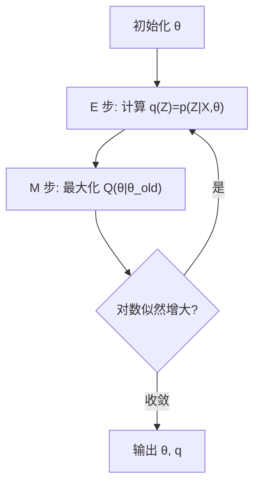
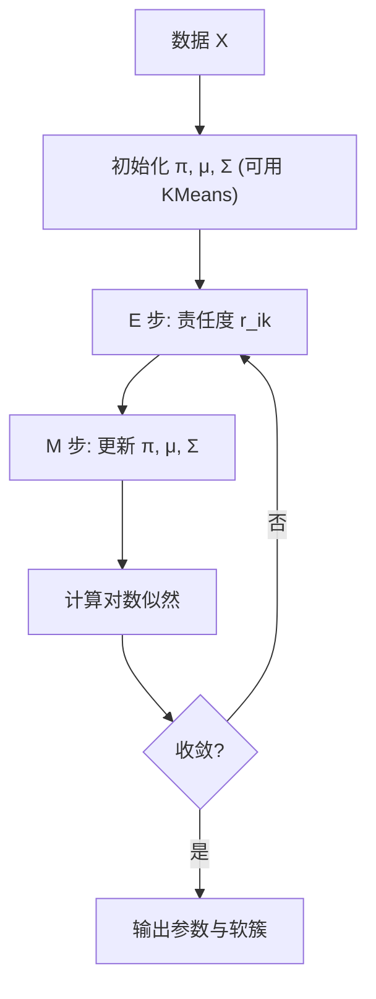

一句话版：当模型里有**看不见的变量**（聚类标签、缺失值、隐状态……）时，直接最大化似然很难。**EM** 用“**先求期望（E 步）** + **再极大化（M 步）**”交替优化一个下界，让**对数似然单调不降**。在工程上，**高斯混合 GMM、隐马尔可夫 HMM、带缺失的数据拟合**都是它的主场。

---

## 1. 看不见的“Z”从哪来？

* **聚类**：每个样本 $x_i$ 来自哪个簇？——隐变量 $z_i\in\{1,\dots,K\}$。
* **缺失数据**：特征缺失，把缺失部分当隐变量。
* **结构化序列**：HMM 中每个时刻的隐状态 $z_t$。
* **混合专家/回归**：每个样本由哪个“专家”回归器生成？

> 类比：你在自助餐挑食（观测 $x$），却没看见厨师（隐变量 $z$）。EM 让你在“猜厨师是谁”和“依照厨师的习惯做菜”之间来回迭代，直到稳定。

---

## 2. EM 的一般配方（Jensen 不等式视角）

观测数据 $X=\{x_i\}_{i=1}^n$，隐变量 $Z$，参数 $\theta$。目标是最大化

$$
\log p_\theta(X)=\log \sum_Z p_\theta(X,Z).
$$

对任意分布 $q(Z)$ 有**变分下界（ELBO）**：

$$
\log p_\theta(X) \;\ge\; 
\underbrace{\mathbb{E}_{q(Z)}[\log p_\theta(X,Z)] + H(q)}_{\mathcal{F}(q,\theta)}.
$$

* **E 步**：固定 $\theta^{\text{old}}$，最优 $q^\star(Z)=p_{\theta^{\text{old}}}(Z\mid X)$（把后验塞进来，ELBO 最紧）。
* **M 步**：固定 $q$，最大化 $\mathcal{F}(q,\theta)$；因 $H(q)$ 与 $\theta$ 无关，等价于最大化

  $$
  Q(\theta\mid \theta^{\text{old}})=\mathbb{E}_{Z\sim p_{\theta^{\text{old}}}(Z\mid X)}[\log p_\theta(X,Z)].
  $$
* **收敛性**：每次 E、M 交替都会让 $\log p_\theta(X)$ **不下降**（单调收敛到局部极值/鞍点）。



**说明**：EM 在“推断隐变量后验”和“最大化完全数据似然的期望”之间循环。

---

## 3. 高斯混合模型（GMM）：EM 的教科书级应用

### 3.1 模型

$$
p(x)=\sum_{k=1}^K \pi_k \,\mathcal{N}(x\mid \mu_k,\Sigma_k),\quad \sum_k \pi_k=1,\ \pi_k\ge 0.
$$

引入隐变量 $z_{ik}\in\{0,1\}$ 表示“样本 $i$ 属于第 $k$ 簇”。

### 3.2 E 步（责任度 / 软分配）

$$
r_{ik} \;=\; p(z_{ik}=1\mid x_i,\theta^{\text{old}})
= \frac{\pi_k\,\mathcal{N}(x_i\mid \mu_k,\Sigma_k)}
{\sum_{j=1}^K \pi_j\,\mathcal{N}(x_i\mid \mu_j,\Sigma_j)}.
$$

### 3.3 M 步（加权极大似然）

令 $N_k=\sum_{i=1}^n r_{ik}$，则

$$
\pi_k^{\text{new}}=\frac{N_k}{n},\qquad
\mu_k^{\text{new}}=\frac{1}{N_k}\sum_{i=1}^n r_{ik}x_i,
$$

$$
\Sigma_k^{\text{new}}=\frac{1}{N_k}\sum_{i=1}^n r_{ik}(x_i-\mu_k^{\text{new}})(x_i-\mu_k^{\text{new}})^\top.
$$

（对**对角/球形**协方差，取对角或标量即可。）

### 3.4 算法小抄（数值稳健）

* 概率密度用**对数域**计算，`log-sum-exp` 归一。
* 协方差矩阵加 $\varepsilon I$ 防奇异。
* 多次随机/ KMeans 初始化，取最高对数似然的解。
* 选择 $K$：**BIC/AIC** 或留出验证集，BIC $=-2\log L + d\log n$。



**说明**：GMM-EM 的循环：软分配 ↔ 加权更新。

### 3.5 与 KMeans 的关系

* 若 $\Sigma_k=\sigma^2 I$ 且 $\sigma\to 0$，E 步会趋向**硬分配**（$r_{ik}$ 变成 0/1），M 步把 $\mu_k$ 更新为簇均值 → **KMeans**。
* 所以 KMeans ≈ GMM 在特定极限下的**硬 EM**。

### 3.6 工程注意

* **退化问题**：某簇 $\Sigma_k\to 0$ 围住单点，似然无界增大。解决：对 $\Sigma_k$ 加下界、或用**MAP-EM**（给 NIW 先验）。
* **复杂度**：E 步 $\mathcal{O}(nKd^2)$（全协方差）或 $\mathcal{O}(nKd)$（对角）。
* **可解释性**：$\pi_k$ 是簇权重；$\mu_k,\Sigma_k$ 给出簇的“中心与形状”。

---

## 4. 其他混合模型：把 “高斯” 换成你要的“厨师”

### 4.1 伯努利混合（文本词袋/0-1 特征）

每个簇 $k$ 有参数 $\phi_{kj}=P(x_j=1\mid z=k)$。

* **E**：同 GMM，换成伯努利概率。
* **M**：$\phi_{kj}=\dfrac{\sum_i r_{ik} x_{ij}}{N_k}$。

### 4.2 混合回归（Mixture of Regressions）

第 $k$ 个分量：$y\mid x,z=k \sim \mathcal{N}(w_k^\top x,\sigma_k^2)$。

* **E**：按当前 $(w_k,\sigma_k)$ 计算 $r_{ik}$。
* **M**：每个 $k$ 上做**加权最小二乘**更新 $w_k$，并更新 $\sigma_k^2$。

### 4.3 混合因子分析 / 混合专家（MoE）

* **MFA**：每簇用低秩结构建模协方差，高维数据更高效。
* **MoE**：把 $\pi_k$ 做成 $x$ 的函数（门控网络），EM 可在广义设定下求解或用梯度法。

---

## 5. HMM = EM 的序列版（Baum–Welch）

* **E 步**：用**前向–后向**算法得
  $\gamma_t(k)=P(z_t=k\mid X)$ 与 $\xi_t(k,\ell)=P(z_t=k,z_{t+1}=\ell\mid X)$。
* **M 步**：更新初始分布、转移矩阵 $A_{k\ell}\propto \sum_t \xi_t(k,\ell)$，以及发射参数（高斯/离散）。
* 一样的单调性与局部最优，常用多次初始化。

---

## 6. 半监督与缺失数据：EM 的“自然技能”

* **半监督**：有标签样本把 $r_{ik}$ 固定为 0/1，无标签样本照常 E 步；可用于“少量标注 + 大量未标注”的聚类/分类。
* **缺失值**：把缺失部分当隐变量，在 E 步里用条件期望填补（或把完全数据似然取期望），M 步照常更新。
  这就是“**期望最大化插补（EM Imputation）**”思想。

---

## 7. 变体家族：GEM / ECM / Variational EM

* **GEM（广义 EM）**：M 步不必精确最大化 $Q$，只要让它**增加**，数值更稳、可用一步梯度。
* **ECM/ECME**：把 M 步拆成多块条件极大化（有时更好求）。
* **变分 EM**：当 $p(Z\mid X,\theta)$ 不可求，限制 $q(Z)$ 的形式（如因子分解），在 $q$ 与 $\theta$ 上交替坐标上升（LDA 就是典型）。

---

## 8. 模型选择与评估

* **挑 K**：BIC/AIC、留出集似然、或以任务指标（如 NLL、聚类纯度）为准。
* **稳定性**：多次随机初始化，比较对数似然与聚类一致性（如 ARI/NMI）。
* **可视化**：2D/3D 画出均值与协方差椭圆（GMM），直观查看分量重叠与外点。

---

## 9. 小型代码骨架（GMM–EM，简化版）

```python
import numpy as np
from numpy.linalg import slogdet, inv

def log_gauss(x, mu, Sigma):
    d = x.shape[1]
    xc = x - mu
    sign, logdet = slogdet(Sigma)
    Q = np.sum(xc @ inv(Sigma) * xc, axis=1)  # (x-μ)^T Σ^{-1} (x-μ)
    return -0.5*(d*np.log(2*np.pi) + logdet + Q)

def gmm_em(X, K=3, iters=100, eps=1e-6):
    n, d = X.shape
    # 初始化：KMeans 更好，这里用随机
    rng = np.random.default_rng(0)
    mu = X[rng.choice(n, K, replace=False)]
    Sigma = np.array([np.cov(X.T)+1e-6*np.eye(d) for _ in range(K)])
    pi = np.ones(K)/K

    last_ll = -np.inf
    for _ in range(iters):
        # E-step: log 责任度
        log_r = np.stack([np.log(pi[k]) + log_gauss(X, mu[k], Sigma[k]) for k in range(K)], axis=1)  # (n,K)
        m = log_r.max(axis=1, keepdims=True)
        r = np.exp(log_r - m); r /= r.sum(axis=1, keepdims=True)

        # M-step
        Nk = r.sum(axis=0) + 1e-12
        pi = Nk / n
        mu = (r.T @ X) / Nk[:,None]
        for k in range(K):
            xc = X - mu[k]
            Sigma[k] = (xc * r[:,[k]]).T @ xc / Nk[k] + 1e-6*np.eye(d)

        # 对数似然
        ll = np.sum(m + np.log(r.sum(axis=1)))
        if ll - last_ll < eps: break
        last_ll = ll
    return pi, mu, Sigma, r
```

> 工程版要并行批量、用 Cholesky 而非 `inv`，并做多次重启挑最好解。

---

## 10. 常见误区（避坑清单）

1. **把 EM 当“全局最优”**：EM 只保证单调上升，容易陷局部极值；务必多初始化。
2. **协方差退化**：似然无界，必须加正则/先验或设最小特征值下限。
3. **错误比较模型**：不同 $K$ 的训练对数似然不可直接比较（参数多必然更大）；用 BIC/AIC 或验证集。
4. **把软分配当硬标签**：责任度有不确定性含义，直接硬化可能误导后续分析。
5. **忽视数值稳定**：不在对数域做 E 步、协方差近奇异、`inv` 代替 Cholesky。
6. **把 KMeans 当密度模型**：KMeans 只最小化平方误差，不输出概率；需要概率请用 GMM。

---

## 11. 练习（含提示）

1. **从 ELBO 推导 EM**：写出 $\mathcal{F}(q,\theta)$ 的 KL 分解，说明为什么 E 步取 $q=p(Z|X,\theta^{old})$。
2. **GMM–E 步推导**：从 Bayes 公式推出责任度 $r_{ik}$ 的闭式。
3. **GMM–M 步推导**：固定 $r_{ik}$，对 $\pi_k,\mu_k,\Sigma_k$ 最大化 $Q$，推得加权均值/协方差更新式。
4. **KMeans 极限**：证明 $\sigma\to 0$ 下 GMM–EM 的目标退化为 KMeans 的 SSE。
5. **混合回归**：写出每个分量的加权最小二乘更新（矩阵形式）。
6. **HMM–Baum–Welch**：给出 $\gamma_t,\xi_t$ 的定义与更新公式，并说明为什么需要前向–后向。
7. **选择 K**：实现 BIC，比较 $K=1\ldots 6$ 在某二维数据集的选择结果。
8. **MAP–EM**：为 GMM 加 NIW 先验，写出 M 步的 MAP 更新式（贴合先验的均值和协方差）。
9. **缺失数据 EM**：在高斯回归中随机遮盖 20% 特征，写出 E 步下缺失部分的条件期望与协方差。

---

## 12. 小结

* **EM = E 步求后验期望 + M 步极大化完全数据似然的期望**，保证对数似然单调不降。
* **GMM** 是最经典的例子，软分配 + 加权更新即可；在 $\sigma\to 0$ 极限退化为 **KMeans**。
* 在序列、缺失数据、混合回归、混合因子分析等场景，EM 都是可靠的“通用扳手”。
* 工程要点：**多初始化、对数域、正则化协方差、用 BIC/AIC 选 K**，必要时上 **MAP-EM / 变分 EM / HMC**。

> 记忆口诀：**“看不见就先‘想象’（E），想象后去‘最大化’（M），循环到像真。”**
