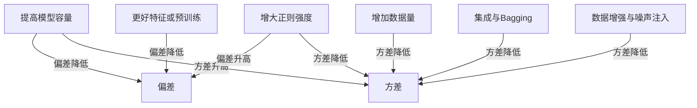
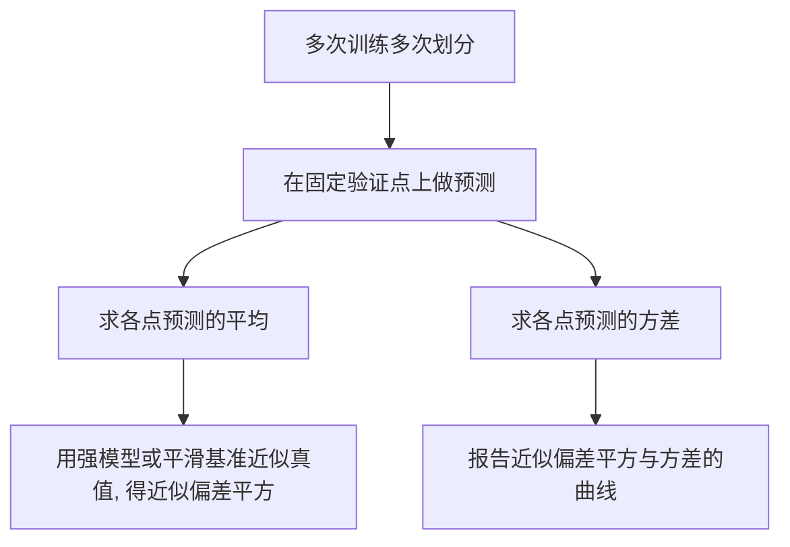

记住这句口诀：**泛化误差 = 偏差² + 方差 + 噪声**。

 * **偏差**：模型平均预测离真实规律有多远（想歪了）。
 * **方差**：换一份训练集，预测抖动有多大（不稳定）。
 * **噪声**：数据里天生的随机性（任何模型都无能为力）。

---

## 1. 飞镖靶的直觉

把学习算法想成“投飞镖”：

* **偏差小**：很多次投掷的平均落点接近靶心。
* **方差小**：每次投掷都很集中。
* **最好**：既准又稳。机器学习里，“靶心”是未知真函数 $f^*(x)$。

---

## 2. 一行公式看全局（点态到整体）

数据来自

$$
y=f^*(x)+\varepsilon,\quad \mathbb{E}[\varepsilon\mid x]=0,\ \mathrm{Var}(\varepsilon\mid x)=\sigma^2(x).
$$

学习算法 $\mathcal{A}$ 在训练集 $S$ 上得到预测器 $\hat f_S$。固定某个 $x$，期望测试 MSE：

$$
\underbrace{\mathbb{E}_{S,\varepsilon}[(\hat f_S(x)-y)^2]}_{\text{期望测试误差}}
=\underbrace{\big(\mathbb{E}_S[\hat f_S(x)]-f^*(x)\big)^2}_{\text{偏差}^2}
+\underbrace{\mathbb{E}_S\!\big[(\hat f_S(x)-\mathbb{E}_S[\hat f_S(x)])^2\big]}_{\text{方差}}
+\underbrace{\sigma^2(x)}_{\text{噪声}}.
$$

对 $x$ 再取期望，就得到整体泛化误差的同样分解。
**证明思路**：两次加减“平均预测”，再用 $\mathbb{E}[\varepsilon|x]=0$。

---

## 3. 为什么会“想歪”或“抖动”？

* **高偏差**：模型太简单/正则太重/特征表达力弱（线性去拟合强非线性）。
* **高方差**：模型太灵活、数据太少、训练不稳定（深模型在小数据上易飘）。
* **噪声**：标注不一致、测量误差、不可观测因素；只能**避免过拟合噪声**，本身不可消除。

---

## 4. 例子：kNN 与多项式回归

* **kNN 回归**：

  * $k$ 小 → 曲线跟着数据弯来弯去：**偏差低、方差高**；
  * $k$ 大 → 曲线更平滑：**偏差高、方差低**。
* **多项式回归**：

  * 阶数上去：**偏差降**、**方差升**；
  * 加 **Ridge/Lasso**：**偏差升**、**方差降**（可能让总误差更小）。

---

## 5. 二分类怎么想？

* 用**平方损失/Brier 分数**，仍能写出类似分解（把真概率 $p(y=1|x)$ 当“真函数”）。
* **交叉熵/0–1 损失**没有完全等价的分解，但直觉一样：

  * 训练和验证都差：**高偏差**；
  * 训练好验证差：**高方差**，可用正则、数据增强、集成缓解。

---

## 6. 调参“方向盘”：常见旋钮影响啥？



**操作清单**

* **降偏差**：更强的模型（更深/更宽/更好归纳偏置）、更好的特征/预训练、Boosting、调优损失设计。
* **降方差**：L2/L1、Dropout、数据增强、Bagging/随机森林、早停、BatchNorm、蒸馏、K 折集成。

---

## 7. 估计偏差与方差（实操可行）

在真实任务里 $f^*$ 不可得，但我们能做**近似**估计用于比较超参/模型。



**两种常用方式**

* **重复随机划分/训练**：在固定验证集上统计每个 $x$ 的预测均值与方差。
* **Bootstrap**：对训练集做有放回重采样，多次训练得到预测分布（天然并行）。

> 目的不是“精确分解”，而是**看趋势**：哪个超参让方差陡升？哪个设置偏差过大？

---

## 8. 正则化、集成与偏差–方差的因果

* **Ridge（L2）**：参数被收缩，**方差降**、**偏差升**。
* **Lasso（L1）**：在降方差同时引入**稀疏偏置**。
* **Bagging**：对**高方差低偏差**的基学习器（树）特别有效；基学习器越**多样化**，方差降得越多。
* **Boosting**：逐步吃掉系统误差，主要**降偏差**，若正则不当会**方差上升**。
* **Dropout/数据增强**：相当于训练时注入噪声，减少协同适配，**方差下降**。

---

## 9. 过参数化与“双降”

当参数远多于样本，测试误差随“容量”可能先降后升再降（**双降**）。
理解要点：**偏差通常随容量降，方差先升，后因隐式正则/平均化再降**（优化器、初始化、归一化、早停等都在“平均化”）。

---

## 10. 迷你代码：多次训练观察“抖动”

```python
import numpy as np
from sklearn.model_selection import train_test_split
from sklearn.preprocessing import PolynomialFeatures
from sklearn.linear_model import Ridge
from sklearn.pipeline import make_pipeline
from sklearn.metrics import mean_squared_error

rng = np.random.default_rng(0)

def fstar(x): return np.sin(2*np.pi*x)
def sample(n, noise=0.2):
    X = rng.uniform(0, 1, size=(n,1))
    y = fstar(X[:,0]) + rng.normal(0, noise, size=n)
    return X, y

Xtr, ytr = sample(120)
Xval = np.linspace(0,1,200).reshape(-1,1)
ytrue = fstar(Xval[:,0])

def probe(deg=10, alpha=1e-2, B=50):
    preds=[]
    for _ in range(B):
        idx = rng.choice(len(Xtr), len(Xtr), replace=True)
        model = make_pipeline(PolynomialFeatures(deg), Ridge(alpha=alpha))
        model.fit(Xtr[idx], ytr[idx])
        preds.append(model.predict(Xval))
    P = np.stack(preds,0)         # (B, n_val)
    mean_pred = P.mean(0)         # 近似 E[ŷ|x]
    var_pred  = P.var(0)          # 近似 Var[ŷ|x]
    mse_mean  = mean_squared_error(ytrue, mean_pred) # 含偏差²与部分噪声
    return mean_pred, var_pred, mse_mean
```

**观察**：高阶 + 小正则 → 预测曲线在不同训练集之间大幅抖动（高方差）；增大 `alpha` → 曲线更稳（方差降），但与真函数差距变大（偏差升）。

---

## 11. 常见误区

1. **验证差 ≠ 一定过拟合**：训练差也高时是**高偏差**，不是高方差。
2. **只看单点准确率**：不看校准和不确定性，可能掩盖高方差问题。
3. **过分依赖容量**：先判断“偏差主导还是方差主导”，再决定“加容量”还是“加正则/加数据/做集成”。
4. **基学习器太相似**：集成不降方差；要引入**多样性**（不同子样本、子特征、不同初始化）。
5. **忽略噪声地板**：有些误差再怎么调也下不去，不要把噪声当成可优化的部分。

---

## 12. 练习

1. 从定义推导偏差–方差分解，标出用到 $\mathbb{E}[\varepsilon|x]=0$ 的位置。
2. 扫描 kNN 的 $k$，画训练/验证 MSE，找“高偏差区”和“高方差区”。
3. 用上面的代码扫描多项式阶数与 Ridge 系数，画出“平均预测的误差”和“预测方差”的对比曲线。
4. 用决策树与 Bagging 比较：固定验证集，重复训练 50 次，统计每个验证点的预测方差。
5. 在二分类上用 **Brier 分数** 看不同强度的标签平滑如何改变“偏差–方差”的平衡。

---

## 13. 小结

* **偏差² + 方差 + 噪声** 是理解泛化误差的基础拆解。
* **降偏差**靠表达能力与更好特征；**降方差**靠正则、数据、集成、训练技巧。
* 过参数化时代仍适用这套框架，只是要把**隐式正则与训练动态**一起考虑。

> 记忆句：**“先分型（偏差 or 方差），再对症（增容 or 正则/数据/集成）。”**
