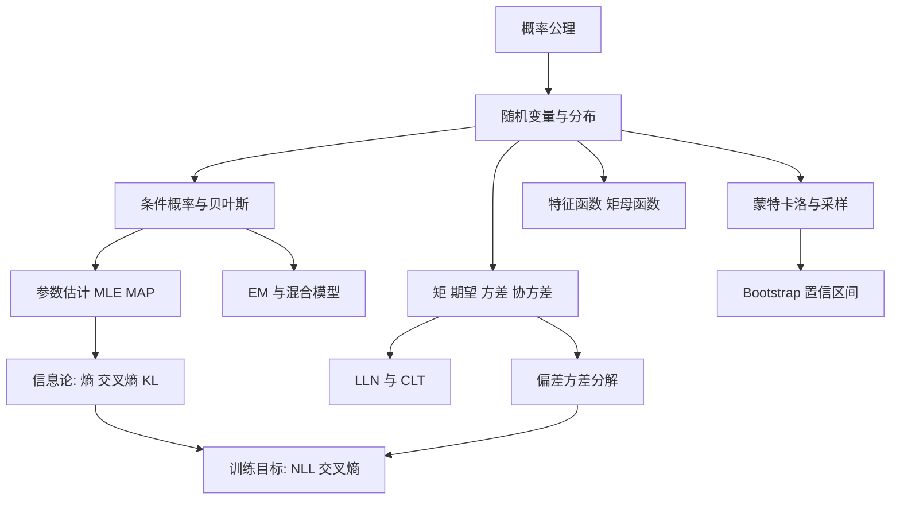

一句话版：**概率建模 = 不确定性的语言，统计学习 = 用数据反推分布与参数**。
 你已经走完：公理化概率 → 随机变量与分布 → 条件概率与贝叶斯 → 矩与协方差 → LLN/CLT → 特征函数/矩母函数 → MLE/MAP → 信息论（熵/交叉熵/KL/互信息） → MC 估计与采样 → Bootstrap → EM 与混合模型 → 偏差–方差分解。
 接下来所有 ML/LLM 的**损失函数、正则化、评估与不确定性**，都能用这一套“概率—统计—信息”三板斧解释。

------

## 1. 一图总览：从“分布”到“训练目标”



**说明**：概率的“语言”从公理到分布；统计的“工具”从估计到不确定性；信息论把训练目标与概率连起来。

------

## 2. 核心概念 & 公式速记墙（工程化记忆）

### 2.1 概率与条件

- 全概率：$P(B)=\sum_i P(B|A_i)P(A_i)$。
- 贝叶斯：$P(A|B)=\dfrac{P(B|A)P(A)}{P(B)}$。

### 2.2 期望与方差

- $\mathbb{E}[aX+b]=a\mathbb{E}[X]+b$；$\mathrm{Var}(X)=\mathbb{E}[X^2]-\mathbb{E}[X]^2$。
- 协方差：$\mathrm{Cov}(X,Y)=\mathbb{E}[XY]-\mathbb{E}[X]\mathbb{E}[Y]$。

### 2.3 常见分布（最小能记版）

- **伯努利/二项**：计数类；$\mathbb{E}=np,\ \mathrm{Var}=np(1-p)$。
- **正态**：中心极限定理“终点”；线性组合仍正态。
- **指数/Gamma/Beta**：指数族基本盘：到达时间、形状/速率、共轭先验。
- **多元正态**：$\mathcal{N}(\mu,\Sigma)$；条件/边缘仍正态。

### 2.4 信息论

- 熵：$H(P)=\mathbb{E}_P[-\log P]$。
- 交叉熵：$H(P,Q)=\mathbb{E}_P[-\log Q]=H(P)+D_{\mathrm{KL}}(P\Vert Q)$。
- 互信息：$I(X;Y)=H(X)-H(X|Y)$。

### 2.5 估计与学习

- **MLE**：$\hat\theta=\arg\max_\theta \sum_i \log p_\theta(x_i)$。
- **MAP**：$\hat\theta=\arg\max_\theta\sum_i \log p_\theta(x_i)+\log p(\theta)$
   ↔ **NLL + 正则**（高斯先验⇔L2，拉普拉斯先验⇔L1）。

### 2.6 极限定理

- **LLN**：$\bar X_n \to \mathbb{E}[X]$。
- **CLT**：$\sqrt{n}(\bar X_n-\mu)\Rightarrow \mathcal{N}(0,\sigma^2)$。

### 2.7 计算与推断

- **Monte Carlo**：$\hat I=\frac1N\sum f(X_i)$；方差 $\sim 1/N$。
- **Bootstrap**：有放回重抽样→SE/CI/偏差。
- **EM**：E 步求后验期望；M 步极大化 $Q(\theta)$；对数似然单调不降。
- **偏差–方差**：泛化误差 = 偏差² + 方差 + 噪声。

------

## 3. 工程视角的“直连线”

- **分类交叉熵** = 负对数似然 = 期望码长；**困惑度** $=\exp(\text{平均交叉熵})$。
- **权重衰减** = 高斯先验的 MAP；**L1 稀疏** = 拉普拉斯先验。
- **VAE**：ELBO = 重构项 − KL；**蒸馏**：最小化 KL(teacher||student)。
- **RL**：策略熵正则、PPO 的 KL 约束。
- **评估**：Bootstrap 为 AUC/F1/准确率给 CI；MC Dropout 近似贝叶斯不确定性。
- **聚类/密度**：GMM 的 EM；HMM 的 Baum–Welch。
- **泛化**：偏差–方差平衡；正则/集成/增强主要降方差，特征/模型容量主要降偏差。

------

## 4. 易混点与避坑清单

1. **把 KL 当距离**：它不对称；需要对称用 JS。
2. **零概率陷阱**：$Q(x)=0$ 而 $P(x)>0$ → KL 爆；实作要加 ε/标签平滑。
3. **微分熵可为负**：不可直接当压缩码长。
4. **小样本极化**：仅靠 MLE 易不稳；用 MAP/正则或 Bootstrap。
5. **EM 非全局最优**：多初始化，协方差加下界或用 MAP-EM。
6. **MC 权重退化**：选好提议分布，监控 ESS，在对数域计算。
7. **偏差–方差误判**：训练也差=高偏差；训练好验证差=高方差。

------

## 5. 速用小抄（什么时候用谁？）

| 任务               | 首选工具                 | 备选/提示                          |
| ------------------ | ------------------------ | ---------------------------------- |
| 多分类训练         | 交叉熵（NLL）            | 标签平滑/温度缩放提升校准          |
| 参数估计（可微）   | MLE/MAP                  | 先验=正则；用 Cholesky/QR 稳定求解 |
| 置信区间（无闭式） | Bootstrap-Percentile/BCa | 分层抽样以防类别失衡               |
| 复杂后验采样       | MCMC/HMC                 | 诊断 ESS、$\hat R$，用 log-sum-exp |
| 聚类/密度          | GMM-EM                   | 选 K 用 BIC/验证集                 |
| 泛化诊断           | 偏差–方差估计            | 重复训练/Bootstrap                 |

------

## 6. 练习题（含提示）

> 建议：先做 A 组打基础，再做 B/C 组加深，D 组是项目式巩固。部分题给**括号提示**。

### A. 基础理解（概念 & 计算）

1. **全概率与贝叶斯**：某疾病先验 $1\%$，检测灵敏度 $95\%$，特异性 $90\%$。检测阳性后患病概率？（先写全概率求 $P(+)$，再贝叶斯）。
2. **期望方差**：若 $X\sim \text{Bern}(p)$，求 $\mathbb{E}[X]$、$\mathrm{Var}(X)$。若 $S=\sum_{i=1}^n X_i$，求 $\mathbb{E}[S]$、$\mathrm{Var}(S)$。
3. **常见分布识别**：到达间隔时间常用什么分布？二项极限到泊松的条件是什么？
4. **信息量**：三分类真分布 $P=(0.7,0.2,0.1)$，模型 $Q=(0.6,0.3,0.1)$。算交叉熵与 KL。
5. **LLN/CLT**：掷骰子 $n$ 次，样本均值的均值与方差？写出 CLT 的近似分布。

### B. 推导与证明（写出关键步骤）

1. **交叉熵分解**：从 $H(P,Q)=\mathbb{E}_P[-\log Q]$ 推到 $H(P)+\mathrm{KL}(P\|Q)$。
2. **正态的 MLE**：独立样本 $x_i \sim \mathcal{N}(\mu,\sigma^2)$。推导 $\hat\mu,\hat\sigma^2$ 的 MLE。
3. **MAP=正则化**：高斯先验 $w\!\sim\!\mathcal{N}(0,\tau^2 I)$ 导出岭回归目标；拉普拉斯先验导出 L1。
4. **EM 的 Q 函数**：从 $\log p_\theta(X)=\log\sum_Z p_\theta(X,Z)$ 用 Jensen 得到 ELBO，并给出 E/M 步。
5. **偏差–方差**：完成公式分解，标出用到了 $\mathbb{E}[\varepsilon|x]=0$ 的地方。

### C. 计算机作业（可用 Python/Numpy/Sklearn）

1. **Monte Carlo**：估 $\pi$（单位圆法），画出估计误差随 $N$ 的 $\log\!-\!\log$ 曲线（验证 $O(1/\sqrt{N})$）。
2. **Bootstrap CI**：对某二分类器在验证集上的 **AUC** 做 1000 次 Bootstrap 百分位 CI；顺便做**分层**版本对比 CI 宽度。
3. **GMM-EM**：在 2D 数据上训练对角协方差 GMM（K=3），画出软分配与协方差椭圆；比较 KMeans 的聚类结果。
4. **偏差–方差实验**：用多项式回归（阶数 1,3,10）+ Ridge（不同 α），重复训练多次，画验证点上的预测方差曲线。
5. **VAE 术语连接**：实现一个最小 VAE（可用库），报告重构项与 KL 项的曲线，解释 β 调节对生成质量与过拟合的影响。

### D. 开放题（项目式）

1. **小数据评测的“可信区间”**：选择一个公开小数据集与三种分类器（LR、SVM、RF），使用 **.632+ Bootstrap** 估计泛化误差与 95% CI，写一页报告比较“谁真的更稳”。
2. **重要性采样**：目标分布难抽，选两个不同提议分布实现 **自归一重要性采样**（SNIS），比较有效样本量（ESS）与方差。
3. **半监督 EM**：把一部分标签遮住，用 GMM-EM 做半监督分类，对比全监督与无监督的差异（NMI/精确率）。

------

## 7. 小代码片段（随取随用）

**Bootstrap 百分位 CI（准确率）**

```python
import numpy as np
rng = np.random.default_rng(0)

def acc(y_true, y_pred): return (y_true==y_pred).mean()

def bootstrap_ci(y_true, y_pred, B=2000, alpha=0.05):
    n = len(y_true)
    stats = np.empty(B)
    for b in range(B):
        idx = rng.integers(0, n, size=n)
        stats[b] = acc(y_true[idx], y_pred[idx])
    lo, hi = np.quantile(stats, [alpha/2, 1-alpha/2])
    return lo, hi

# 用法：lo,hi = bootstrap_ci(y, y_hat)
```

**重要性采样（对数域 + ESS）**

```python
import numpy as np
rng = np.random.default_rng(0)

def log_target(x):  # 目标对数密度（未归一化）
    return -0.5*((x-2)**2) + np.log(0.6) + np.log1p(np.exp(x-4))  # 只是示意

def snis_expectation(f, N=20000, q_mean=2.0, q_std=2.0):
    x = rng.normal(q_mean, q_std, size=N)
    logq = -0.5*((x-q_mean)/q_std)**2 - np.log(q_std) - 0.5*np.log(2*np.pi)
    lw = log_target(x) - logq
    m = lw.max(); w = np.exp(lw-m); w /= w.sum()
    ess = (w.sum()**2)/(w**2).sum()
    return (w*f(x)).sum(), ess
```

------

## 8. 自测清单（过一遍就有底气）

-  我能用一句话解释：**交叉熵为什么是分类的损失**？
-  我能把 **L2/L1 正则**说成一个**先验**。
-  我知道 **CLT** 的“什么时候能用、用来干嘛”。
-  我会用 **Bootstrap** 给 AUC/准确率/中位数出 CI。
-  我能写出 **EM** 的 E/M 步并说明它为何单调上升。
-  我能区分：一个模型在验证集差，是**高偏差**还是**高方差**，并给出对应措施。
-  我知道在数值上**一律用对数域**求和/规范化（log-sum-exp），避免溢出。

------

## 9. 小结：把概率“拧”进模型，把统计“落”到评估

- **概率**让我们用分布来描述不确定；**统计**让我们在有限数据下做理性决策；**信息论**把训练目标与编码成本连起来。
- **工程口诀**：
   **先分布**（建模假设）→ **再估计**（MLE/MAP/VI/MCMC）→ **看不确定**（CI、后验）→ **盯目标**（交叉熵/KL）→ **保稳定**（Bootstrap/正则/集成）→ **查泛化**（偏差–方差）。
- 带着这把工具箱进入后续的**优化、线性代数与大模型专题**，你会发现：理论与实践的缝，已经被你一块块补上了。
