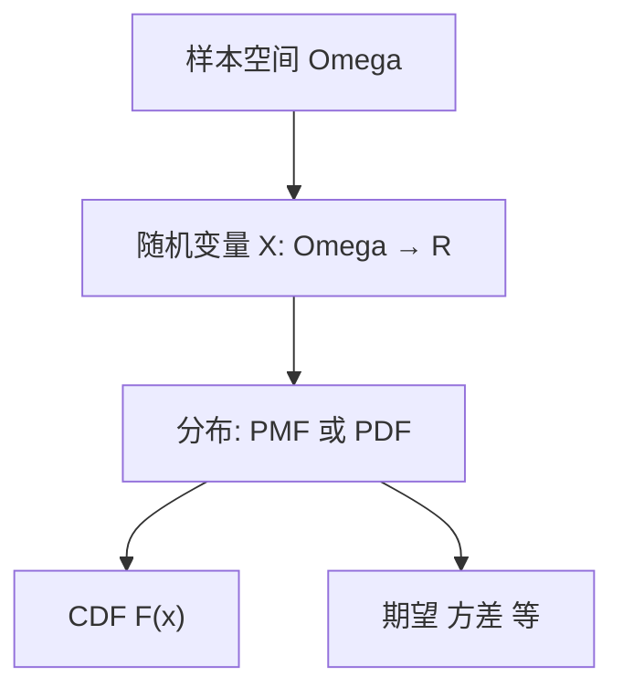
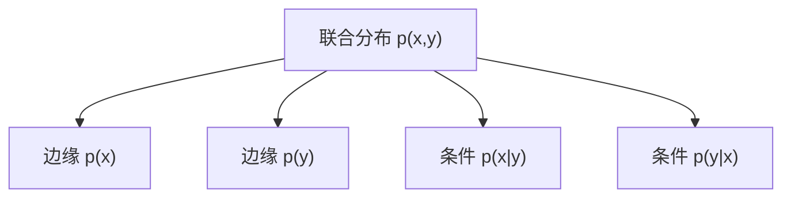

一句话版：**随机变量**是把“不可控的结果”（样本空间）映成**数字**的函数；**概率分布**告诉这些数字出现的“权重”。离散型用 **PMF**（概率质量函数），连续型用 **PDF**（概率密度函数），两者都由 **CDF**（累积分布）统一。掌握它们，ML 里的交叉熵、MSE、采样、似然、注意力温度等概念立刻串起来。

------

## 1. 随机变量到底是什么？

**定义**
 随机变量 $X$ 是从样本空间 $\Omega$ 到数轴（或 $\mathbb{R}^d$）的可测函数：$X:\Omega\to\mathbb{R}$。

- “抛硬币一次”这一事件本身抽象且杂乱；把它**映成数字**（正面=1、反面=0），我们就能计算“概率、期望、方差”。

**直觉类比**

- 把“水果市场所有摊位”（$\Omega$）映成“今天买到的苹果个数”（$X$）或“价格”（$Y$）。
- ML 里，“下一个 token 的索引”“一张图的像素噪声”“观测误差”都可看作随机变量。

------

## 2. 三位一体：PMF / PDF / CDF

### 2.1 离散型（discrete）

- **PMF（概率质量函数）**：$p_X(k)=P(X=k)$，对所有可能取值 $k$。
- **归一化**：$\sum_k p_X(k)=1$。

### 2.2 连续型（continuous）

- **PDF（概率密度函数）**：$f_X(x)$，满足

  $$
P(a≤X≤b)=∫abfX(x) dx,fX(x)≥0,∫−∞∞fX(x) dx=1.P(a\le X\le b)=\int_a^b f_X(x)\,dx,\quad f_X(x)\ge 0,\quad \int_{-\infty}^{\infty} f_X(x)\,dx=1.
  $$

- **注意**：PDF **不是**概率，某点的概率 $P(X=x)=0$（但密度可以大于 1，比如 $\text{Uniform}(0,0.1)$ 的密度是 10）。

### 2.3 CDF（统一视角）

- **CDF（累积分布）**：$F_X(x)=P(X\le x)$。
- 离散：$F_X$ 是**台阶**，PDF 不存在（可用“Dirac 脉冲”形式化）；
- 连续：$F_X$ 可导时，$f_X(x)=F'_X(x)$。



**说明**：先有随机变量，再有它诱导的分布；CDF 统一了离散与连续两类。

------

## 3. 期望、方差与常用恒等式

- **期望**：$\mathbb{E}[X]=\sum_k k\,p(k)$（离散）或 $\mathbb{E}[X]=\int x f(x)\,dx$（连续）。
- **方差**：$\mathrm{Var}(X)=\mathbb{E}[(X-\mathbb{E}X)^2]=\mathbb{E}[X^2]-(\mathbb{E}X)^2$。
- **无意识统计学家法则（LOTUS）**：$\mathbb{E}[g(X)] = \sum g(k)p(k)$ 或 $\int g(x)f(x)dx$。
- **线性**：$\mathbb{E}[aX+b]=a\,\mathbb{E}X+b$；$\mathrm{Var}(aX+b)=a^2 \mathrm{Var}(X)$。

> ML 里：
>
> - MSE $\approx$ 高斯噪声负对数似然；
> - 交叉熵 $\approx$ 分类的**离散分布**负对数似然；
> - 期望就是“总体平均损失”。

------

## 4. 离散与连续：常见家族与直觉

### 4.1 离散

- **伯努利 Bernoulli($p$)**：$X\in\{0,1\}$，$\mathbb{E}[X]=p$，$\mathrm{Var}(X)=p(1-p)$。
  - 逻辑回归输出 $p_\theta(y=1|x)$ 就是在拟合伯努利。
- **二项 Binomial($n,p$)**：$n$ 次独立伯努利之和，$\mathbb{E}=np$，$\mathrm{Var}=np(1-p)$。
  - “投放曝光中有多少点击”。
- **几何 Geometric($p$)**：第一次成功的试验次数，**无记忆性**。
- **泊松 Poisson($\lambda$)**：单位时间内事件数，$\mathbb{E}=\mathrm{Var}=\lambda$。
  - $\text{Binomial}(n,p)$ 在 $n\to\infty,p\to 0,\ np\to\lambda$ 时逼近泊松（稀疏点击）。
- **范畴 Categorical($\pi$)**：多类分类的离散分布，Softmax 输出 $\pi$。

### 4.2 连续

- **均匀 Uniform(a,b)**：区间等可能；$\mathbb{E}=(a+b)/2$。
- **指数 Exponential($\lambda$)**：到下一次事件的等待时间，**无记忆性**；$\mathbb{E}=1/\lambda$。
- **正态 Normal($\mu,\sigma^2$)**：$\mathbb{E}=\mu$，$\mathrm{Var}=\sigma^2$。中心极限定理支撑其普适性。
- **Gamma / Beta**：共轭先验常客（与泊松/伯努利搭配），可在贝叶斯更新里优雅闭合。

> 工程小贴士：如果你的回归残差看起来“钟形对称”，先假设高斯；若是非负计数，尝试泊松/负二项。

------

## 5. 联合、边缘与条件分布（独立性的判定）

随机变量 $X,Y$ 的**联合分布**可以是 PMF $p(x,y)$ 或 PDF $f(x,y)$。

- **边缘**：$p(x)=\sum_y p(x,y)$ 或 $f(x)=\int f(x,y)\,dy$。
- **条件**：$p(x|y)=\dfrac{p(x,y)}{p(y)}$（连续同理，用密度）。
- **独立**：$X\perp Y \iff p(x,y)=p(x)p(y)$（或 $f= f_X f_Y$）。

**协方差与相关**
 $\mathrm{Cov}(X,Y)=\mathbb{E}[(X-\mathbb{E}X)(Y-\mathbb{E}Y)]$，
 $\rho=\dfrac{\mathrm{Cov}(X,Y)}{\sigma_X\sigma_Y}\in[-1,1]$。



**说明**：从联合可以“求边缘、求条件”；反过来“边缘+条件”也能还原联合（链式法则）。

------

## 6. 变量变换与雅可比（change of variables）

- **仿射变换**：$Y=aX+b$。

  $$
E[Y]=a EX+b,Var(Y)=a2Var(X).\mathbb{E}[Y]=a\,\mathbb{E}X+b,\quad \mathrm{Var}(Y)=a^2 \mathrm{Var}(X).
  $$

  对密度：$f_Y(y)=\frac{1}{|a|} f_X\!\left(\frac{y-b}{a}\right)$。

- **一般一维可逆变换** $Y=g(X)$：

  $$
fY(y)=fX(g−1(y)) ∣ddyg−1(y)∣.f_Y(y)=f_X(g^{-1}(y))\ \bigg|\frac{d}{dy}g^{-1}(y)\bigg|.
  $$

- **多维**：若 $y=g(x)$ 可逆且可微，

  $$
fY(y)=fX(g−1(y)) ∣det⁡Jg−1(y)∣,f_Y(y)= f_X(g^{-1}(y))\ \big|\det J_{g^{-1}}(y)\big|,
  $$

  其中 $J$ 是雅可比矩阵。

  > 归一化流（Normalizing Flows）与可逆网络层正是反复利用这条公式来更新密度的。

- **重参数化技巧（reparameterization trick）**：
   $Z\sim\mathcal{N}(0,1)$，$X=\mu+\sigma Z\Rightarrow X\sim\mathcal{N}(\mu,\sigma^2)$。
   这样把采样写成**可微变换**，变分自编码器（VAE）就能对 $\mu,\sigma$ 求梯度。

------

## 7. 采样与数值期望：从理论到 Monte Carlo

- **逆变换采样**：若 $U\sim\text{Uniform}(0,1)$，设 $X=F^{-1}(U)$，则 $X\sim F$。
  - 例：指数分布 $F(x)=1-e^{-\lambda x}\Rightarrow X=-\ln(1-U)/\lambda$。
- **拒绝采样**：用易采样的建议分布“包住”目标分布，再按比例接受。
- **蒙特卡洛估计**：$\mathbb{E}[g(X)]\approx \frac1N\sum_{i=1}^N g(x_i)$（i.i.d. 样本），$N$ 大时误差 $\sim O(1/\sqrt{N})$。

> 用处：估计期望损失、近似难积分（如贝叶斯后验），或在强化学习/生成模型中做近似推断。

------

## 8. 从数据估分布：参数化 vs 非参数

- **参数化**：假设 $X\sim p_\theta$，用极大似然/贝叶斯学习 $\theta$（如高斯的 $\mu,\sigma$）。
- **非参数**：直方图、KDE（核密度估计），不假设具体形状，数据多时更灵活。
- **混合模型**：高斯混合 $ \sum_k \pi_k \mathcal{N}(\mu_k,\Sigma_k)$，能拟合多峰分布；EM 算法估参。

> ML 连接：分类头的 softmax 输出是**离散分布**；回归头常假定**高斯**；计数数据可用**泊松/负二项**；注意力是**离散分布的采样**（top-k/top-p）。

------

## 9. 代码速写（NumPy）

```python
import numpy as np

rng = np.random.default_rng(0)

# 1) 离散: 伯努利与二项
p = 0.3
ber = rng.binomial(1, p, size=10000)          # 伯努利
binom = rng.binomial(20, p, size=10000)       # 二项
print(ber.mean(), binom.mean())               # ≈ p, ≈ 20p

# 2) 连续: 指数与正态
lam = 2.0
exp_samples = rng.exponential(1/lam, size=10000)   # 参数是 scale=1/λ
norm_samples = rng.normal(loc=0., scale=1., size=10000)
print(exp_samples.mean(), norm_samples.var())      # ≈ 1/λ, ≈ 1

# 3) Monte Carlo: E[sin(X)] for X~N(0,1)
g = np.sin(norm_samples)
print(g.mean())                                    # ≈ 0 (奇函数对称)
```

------

## 10. 常见误区（踩坑清单）

1. **把密度当概率**：PDF 可以 >1；概率=**区间下面的面积**。
2. **“概率 0 就是不可能”**：连续型某点概率 0 但可发生（测度为 0 而已）。
3. **离散与连续混淆**：离散事件用求和，连续事件用积分；CDF 统一但计算方式不同。
4. **独立 ≠ 不相关**：高斯里“零相关” ⇒ 独立；一般分布不成立。
5. **标度敏感**：变量缩放会改变 PDF 的形状（雅可比），但不会改变“真实概率”。
6. **忘记中心化/标准化**：实操估分布前通常先做（尤其是高斯族建模与 KDE）。
7. **只看训练分布**：测试分布漂移（covariate shift）会使你的概率预测（校准）失真。

------

## 11. 练习（含提示）

1. **PMF→CDF**：$X\sim\text{Bernoulli}(p)$。写出 PMF 与 CDF。
    *提示*：CDF 在 0、1 两点跳跃。
2. **PDF→概率**：$X\sim\text{Uniform}(a,b)$。求 $P(|X-\frac{a+b}{2}|\le \frac{b-a}{4})$。
    *提示*：区间长度占总长度的 1/2。
3. **变换**：若 $X\sim\text{Exp}(\lambda)$，$Y=2X+3$。求 $f_Y(y)$ 与 $\mathbb{E}[Y]$。
    *提示*：用一维变换 + 线性性。
4. **独立性**：给 $p(x,y)=p(x)p(y)$。证明 $\mathrm{Cov}(X,Y)=0$。
    *提示*：$\mathbb{E}[XY]=\mathbb{E}X\,\mathbb{E}Y$。
5. **逆变换采样**：推导指数分布的 $F^{-1}$，用 `rng.random` 生成样本并验证均值约为 $1/\lambda$。
6. **LOTUS**：$X\sim\mathcal{N}(0,1)$，求 $\mathbb{E}[X^4]$。
    *提示*：标准正态矩（双阶乘）：$\mathbb{E}[X^4]=3$。
7. **混合分布**：若 $X\sim 0.7\,\mathcal{N}(-1,1)+0.3\,\mathcal{N}(2,1)$，写出其 PDF，并解释为何它可能呈双峰。

------

## 12. 小结

- **随机变量**把“随机世界”变成可计算的数；
- **分布**用 PMF/PDF（受 CDF 统一）描述“数”的规律；
- **期望与方差**是两大核心总结指标，LOTUS 让你对任意函数求期望；
- **联合—边缘—条件—独立**是多变量世界的语法；
- **变量变换与雅可比**是现代生成模型（如 Flows）的数学心脏；
- **采样与 Monte Carlo**把积分变平均，连接理论与工程。
