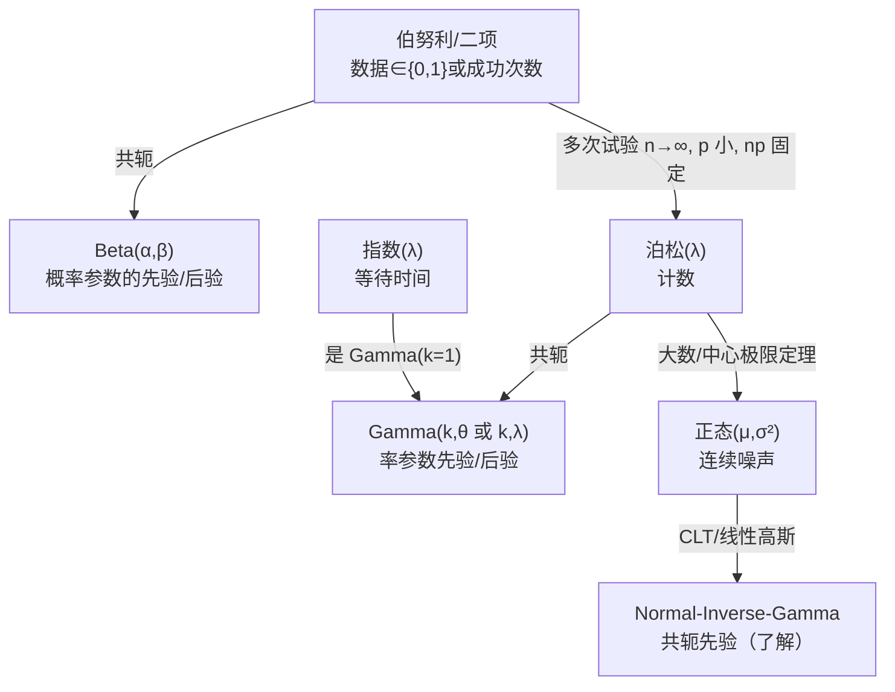

一句话版：这六个分布像“口袋妖怪”里的初始精灵——覆盖了**二元结果**、**计数/频率**、**连续噪声**、**等待时间**、**正参数**、**概率本身**六类情形；还能彼此“进化”（近似/共轭），撑起了从逻辑回归、CTR 估计到高斯回归、贝叶斯平滑等一整套工程实践。

------

## 0. 一张关系图（谁和谁“合得来”）



**说明**：Beta ↔ 伯努利/二项、Gamma ↔ 泊松/指数是最常用的共轭对；指数是 Gamma 的特例；二项在“稀疏极限”下近似泊松，泊松再在大样本下近似正态。

------

## 1) 伯努利分布 Bernoulli($p$)

- **场景**：二元结果（点击/未点，购买/未购，预测正确/错误）。

- **PMF**：$P(X=1)=p,\ P(X=0)=1-p$。

- **期望/方差**：$\mathbb{E}[X]=p,\ \mathrm{Var}(X)=p(1-p)$。

- **极大似然**：样本 $\{x_i\}$，$\hat p=\frac{1}{n}\sum x_i$（频率就是概率的 MLE）。

- **ML 连接**：逻辑回归建模 $p_\theta(y=1|x)=\sigma(w^\top x)$；交叉熵 = 伯努利负对数似然。

- **贝叶斯平滑**：先验 $\text{Beta}(\alpha,\beta)$ + 观测 $s$ 次成功、$f$ 次失败

  $$

  p∣data∼Beta(α+s, β+f),E[p∣data]=α+sα+β+s+f.p\mid \text{data} \sim \text{Beta}(\alpha+s,\ \beta+f),\quad \mathbb{E}[p\mid \text{data}] = \frac{\alpha+s}{\alpha+\beta+s+f}.

  $$

  常用于小样本 CTR 的“稳态化”。

------

## 2) 二项分布 Binomial($n,p$)

- **场景**：$n$ 次独立伯努利试验中成功次数（曝光 $n$、点击数 $k$）。
- **PMF**：$\displaystyle P(X=k)={n\choose k}p^k(1-p)^{n-k}$。
- **期望/方差**：$\mathbb{E}=np,\ \mathrm{Var}=np(1-p)$。
- **MLE**：观测成功总数 $k$，$\hat p=k/n$。
- **近似**：
  - $n$ 大、$p$ 不极端 → 近似正态 $\mathcal{N}(np, np(1-p))$。
  - $n$ 大、$p$ 小、$\lambda=np$ 固定 → 近似泊松 $\text{Pois}(\lambda)$。
- **过离散**：真实方差 > $np(1-p)$ 时可用 Beta-Binomial（把 $p$ 看作 Beta 随机变量）。

------

## 3) 正态分布 Normal($\mu,\sigma^2$)

- **场景**：连续对称噪声、测量误差、很多独立效应的叠加（CLT）。
- **PDF**：$\displaystyle f(x)=\frac{1}{\sqrt{2\pi}\sigma}\exp\!\Big(-\frac{(x-\mu)^2}{2\sigma^2}\Big)$。
- **性质**：线性变换仍正态；和的分布仍正态；完全由 $\mu,\sigma^2$ 决定。
- **MLE**：$\hat\mu=\bar x,\ \hat\sigma^2=\frac{1}{n}\sum (x_i-\bar x)^2$（注意：无偏估计用 $n-1$）。
- **ML 连接**：最小二乘 = 高斯噪声的 MLE；高斯判别分析；高斯过程回归。
- **注意**：厚尾数据可考虑 Laplace（L1）或 Student-t 替代正态（鲁棒）。

------

## 4) 指数分布 Exponential($\lambda$)

- **场景**：**等待时间**（下一次事件到来前的时间），或寿命分析的“无记忆”模型。
- **PDF/CDF**：$f(x)=\lambda e^{-\lambda x}\ (x\ge0),\ F(x)=1-e^{-\lambda x}$。
- **期望/方差**：$\mathbb{E}=1/\lambda,\ \mathrm{Var}=1/\lambda^2$。
- **无记忆性**：$P(X>s+t\mid X>s)=P(X>t)$。
- **MLE**：$\hat\lambda = 1/\bar x$。
- **关系**：Gamma 的特例（形状 $k=1$）。与泊松过程互为“次数↔间隔时间”的两面。

------

## 5) Gamma 分布 Gamma($k,\theta$) / 形状-尺度 或 $k,\lambda$（形状-率）

> **记号提醒**：两种参数化等价：尺度 $\theta>0$ 与 率 $\lambda=1/\theta$。文档/库常混用，要看清！

- **场景**：正参数（时间、方差的先验、速率的先验），累积等待时间（第 $k$ 次事件到达的时间）。
- **PDF（尺度参数化）**：$\displaystyle f(x)=\frac{1}{\Gamma(k)\theta^k}x^{k-1}e^{-x/\theta},\ x\ge 0$。
- **期望/方差**：$\mathbb{E}=k\theta,\ \mathrm{Var}=k\theta^2$。
- **加法性**：同尺度（或同率）下的 Gamma 之和仍 Gamma（形状相加）。
- **共轭**：
  - 泊松/指数的**率参数**的共轭先验。
  - 正态未知方差时的先验常用 **Inverse-Gamma**（Gamma 的倒数族）。
- **估计**：$\theta$ 有 MOM 闭式解；形状 $k$ 的 MLE 需解 $\log k - \psi(k) = \log \bar x - \overline{\log x}$（$\psi$ 为 digamma）。

------

## 6) Beta 分布 Beta($\alpha,\beta$)

- **场景**：**概率本身**的分布（CTR、转化率、成功率），位于区间 $(0,1)$。
- **PDF**：$\displaystyle f(p)=\frac{1}{B(\alpha,\beta)}p^{\alpha-1}(1-p)^{\beta-1},\ 0。
- **期望/方差**：$\mathbb{E}[p]=\frac{\alpha}{\alpha+\beta},\ \mathrm{Var}=\frac{\alpha\beta}{(\alpha+\beta)^2(\alpha+\beta+1)}$。
- **共轭**：伯努利/二项的共轭先验；后验还是 Beta（参数相加）。
- **直觉**：$\alpha-1$ 像“先验成功次数”，$\beta-1$ 像“先验失败次数”。
- **扩展**：Beta-Binomial 捕捉二项试验中的**过离散**（不同用户/样本的 $p$ 有波动）。

------

## 7) 这些分布在 ML 里的“指定位置”

- **GLM 视角（链接函数）**
  - Bernoulli/Binomial → **Logit/Probit**（逻辑回归）
  - Poisson → **Log**（泊松回归；计数）
  - Gamma（正连续，方差随均值增大） → **Inverse/Log** 链接（Gamma 回归）
  - Gaussian → **Identity**（线性回归）
- **建模备忘**
  - **二元/比例**：伯努利/二项；小样本做 Beta 平滑。
  - **等待时间/寿命**：指数（无记忆）或 Weibull；指数是最简单基线。
  - **正参数、右偏**：Gamma。
  - **对称噪声**：高斯；厚尾用 Student-t。
  - **计数**：泊松或负二项（过离散）。

------

## 8) 小例子与推导要点

### 8.1 CTR 的贝叶斯平滑

某广告曝光 $n=20$，点击 $s=3$。取 Beta(1,1) 先验（均匀），
 后验 $p \sim \text{Beta}(4,18)$，后验均值 $\frac{4}{22}\approx 0.182$，
 而 MLE $s/n=0.15$。小样本下**后验均值更稳**。

### 8.2 等待到第 $k$ 次点击的时间

若点击满足泊松过程、间隔时间 $\sim$ 指数($\lambda$)，
 到第 $k$ 次点击的总时长 $T_k\sim \text{Gamma}(k,\lambda)$，
 $\mathbb{E}[T_k]=k/\lambda$，$\mathrm{Var}=k/\lambda^2$。

### 8.3 最小二乘为什么等价高斯？

模型 $y=w^\top x+\epsilon,\ \epsilon\sim \mathcal{N}(0,\sigma^2)$。
 最大化似然 ⇔ 最小化 $\sum (y_i-w^\top x_i)^2$；
 “平方误差”背后站着**正态假设**。

------

## 9) 代码速写（NumPy）：采样与 MLE 小抄

```python
import numpy as np
rng = np.random.default_rng(0)

# Bernoulli/Binomial
p_true = 0.2
ber = rng.binomial(1, p_true, size=1000)
binom = rng.binomial(20, p_true, size=500)
p_mle = ber.mean()                        # Bernoulli 的 MLE
p_mle_binom = binom.mean()/20

# Normal
x = rng.normal(loc=3.0, scale=2.0, size=2000)
mu_mle = x.mean()
sigma2_mle = ((x - mu_mle)**2).mean()     # 注意：无偏用 / (n-1)

# Exponential
lam_true = 2.0
t = rng.exponential(1/lam_true, size=1000)  # 参数是 scale=1/λ
lam_mle = 1 / t.mean()

# Gamma (k, theta): 方法矩估计
k_true, theta_true = 3.0, 2.0
g = rng.gamma(shape=k_true, scale=theta_true, size=5000)
m, v = g.mean(), g.var()
k_mom = m**2 / v
theta_mom = v / m

# Beta: 估计 α,β (方法矩)
a_true, b_true = 2.0, 5.0
beta = rng.beta(a_true, b_true, size=3000)
m, v = beta.mean(), beta.var()
S = m*(1-m)/v - 1
alpha_mom = m*S
beta_mom = (1-m)*S
```

------

## 10) 常见坑与排错

1. **Gamma 参数化混淆**：是 $(k,\theta)$ 还是 $(k,\lambda)$？看清库文档（`scale` vs `rate`）。
2. **把 PDF 当概率**：密度可>1；概率=**积分（面积）**。
3. **正态“万金油”误用**：明显右偏/重尾还用高斯，估计会偏；换 Gamma/Log-Normal/Student-t。
4. **二项过离散**：实测方差 $\gg np(1-p)$，考虑 Beta-Binomial 或层级模型。
5. **指数无记忆性假设过强**：有老化/磨损效应时改 Weibull（形状 $k\neq 1$）。
6. **小样本 MLE 不稳**：做先验平滑（Beta/Gamma）或正则化。
7. **把比例当正态回归**：比例 $\in(0,1)$ 用 Beta 回归或 logit 变换再回归更合适。

------

## 11) 练习（含提示）

1. **伯努利 MLE**：推导 $\hat p=\bar x$（对数似然求导=0）。
2. **二项近似泊松**：设 $n=1000,p=0.002$，计算 $P(X=0)$ 的二项值与泊松 $\lambda=np$ 近似并比较。
3. **指数的无记忆性**：证明 $P(X>s+t|X>s)=P(X>t)$。
4. **Gamma 形状估计**：实现牛顿迭代求解 $\log k - \psi(k)=\log \bar x - \overline{\log x}$。
5. **Beta-Binomial 过离散**：模拟不同用户的 $p\sim \text{Beta}(2,8)$，每个用户抛 10 次，比较样本方差与二项理论方差。
6. **高斯 vs t 回归**：在含异常点的数据上对比 MSE（高斯）与 MAE/Huber 或 t 似然的鲁棒性。

------

## 12) 小结

- **伯努利/二项**：二元与次数；**Beta** 给它们“稳住阵脚”。
- **指数/Gamma**：等待时间与正参数；**Gamma** 是指数的族扩展，也是**泊松/指数的共轭**。
- **正态**：连续噪声的基石，连接最小二乘与 CLT。
- **选择口诀**：**数据类型先行**（0/1、计数、正量、比例、连续对称）→ 选族 → 看是否需要**共轭/先验平滑** → 验证残差与方差形态。

