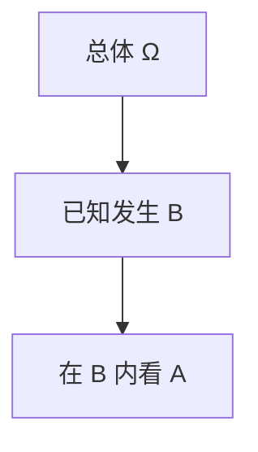
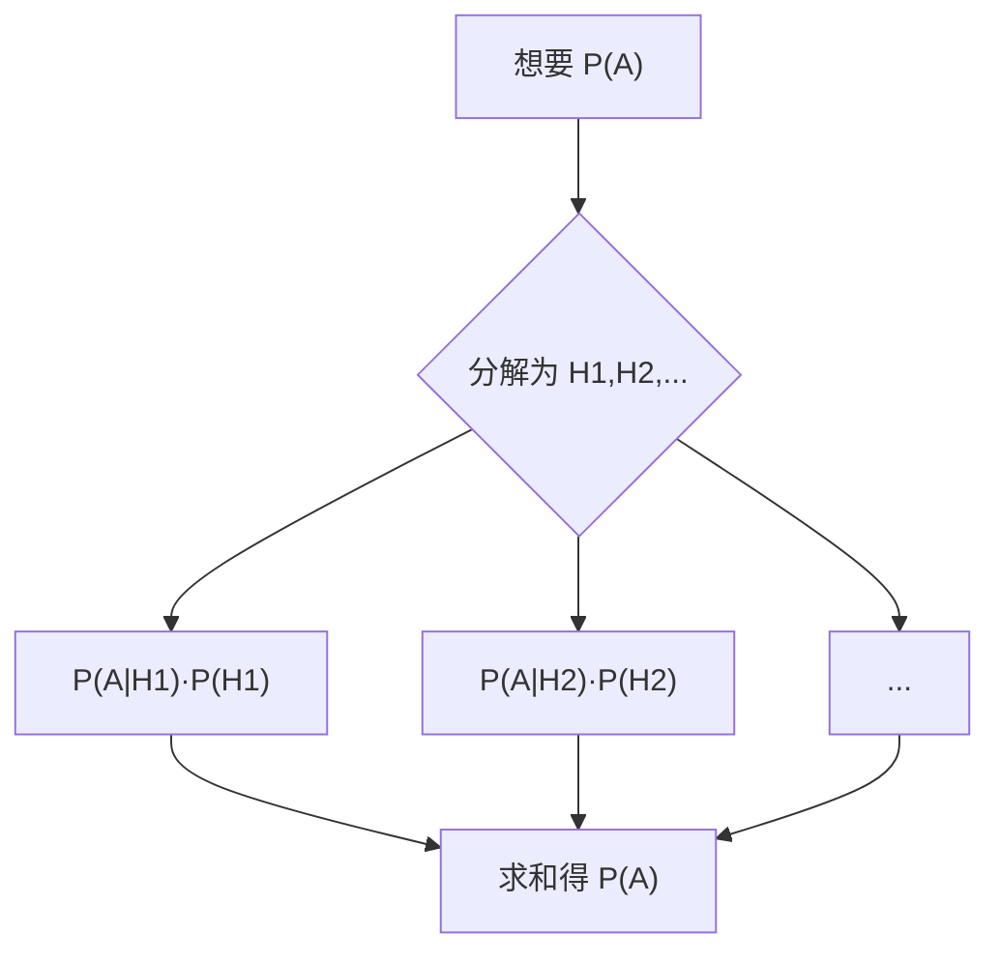
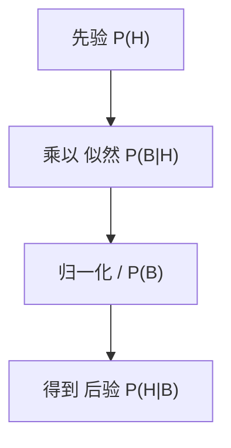
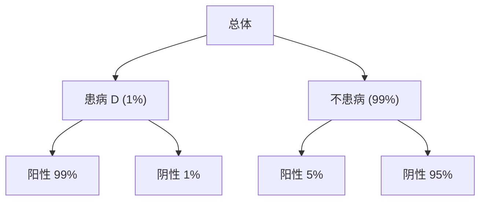
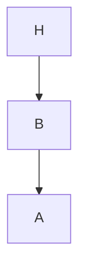

一句话版：**条件概率**是在“已知信息 B”后对“事件 A”的重新打分；**贝叶斯定理**告诉我们如何用“先验 × 证据的解释力（似然）÷ 证据总强度”得到“后验”。这套齿轮驱动了朴素贝叶斯、A/B 测试、正则化 = MAP、以及 LLM 的“下一个 token 概率”。

---

## 1. 条件概率：在“信息过滤”后的概率

**定义**
对 $P(B)>0$，

$$
P(A\mid B)=\frac{P(A\cap B)}{P(B)}.
$$

直觉：在只看“落在 $B$”的样本里，$A$ 的相对比例。
**乘法公式**：$P(A\cap B)=P(A\mid B)P(B)=P(B\mid A)P(A)$。



**说明**：条件概率就是把样本空间“缩小到 B”，再计算 A 的占比。

---

## 2. 全概率公式与概率链式法则

* **全概率**（把“证据”分拆到若干互斥情况）
  若 $\{H_i\}$ 两两互斥且并为 Ω：

  $$
  P(A)=\sum_i P(A\mid H_i)\,P(H_i).
  $$
* **链式法则**（联合概率展开成条件概率乘积）

  $$
  P(x_1,\dots,x_n)=\prod_{i=1}^n P(x_i\mid x_{<i}).
  $$

在语言模型里：
$$
\displaystyle P(w_1,\dots,w_T)=\prod_{t=1}^T P(w_t\mid w_{<t})
$$



**说明**：这是全概率公式的“配方表”。

---

## 3. 贝叶斯定理：从“B 给 A 的证据”到“给定 B 的 A 概率”

**两事件版**

$$
P(A\mid B)=\frac{P(B\mid A)P(A)}{P(B)}.
$$

* $P(A)$：**先验**（信息前对 A 的相信度）
* $P(B\mid A)$：**似然**（A 对证据 B 的解释力）
* $P(B)$：**证据强度**（归一化，常用全概率公式算）
* $P(A\mid B)$：**后验**（看到证据后的更新）

**多假设版**

$$
P(H_i\mid B)=\frac{P(B\mid H_i)P(H_i)}{\sum_j P(B\mid H_j)P(H_j)}.
$$



**说明**：这是最小的“贝叶斯更新”管线：先验 → 乘似然 → 归一化 → 后验。

---

## 4. 一个会“打脸直觉”的例子：医学检测的“阳性 ≠ 大概率患病”

* 先验（患病率）：$P(D)=1\%$
* 灵敏度（真阳性率）：$P(+\mid D)=99\%$
* 特异度：$P(-\mid \bar D)=95\%$ ⇒ 假阳性率 $P(+\mid \bar D)=5\%$

计算：

$$
P(+)=P(+\mid D)P(D)+P(+\mid \bar D)P(\bar D)=0.99\times 0.01+0.05\times0.99=0.0594.
$$

$$
P(D\mid +)=\frac{0.99\times 0.01}{0.0594}\approx 0.167.
$$

**结论**：阳性也只有 $16.7\%$ 的几率真的患病——因为**先验很低**，假阳性在总体里占大头。这就是“基率忽视”的经典陷阱。



**说明**：树上每条路径的概率相乘；所有“阳性”路径相加得到 $P(+)$。

---

## 5. 朴素贝叶斯：文本分类的“简单强者”

**假设**：在给定类别 $y$ 下，词袋特征 $x_1,\dots,x_d$ 条件独立：

$$
P(y\mid x)\propto P(y)\prod_{j=1}^d P(x_j\mid y).
$$

**实现重点**

* 用 **对数** 累加：$\log P(y)+\sum_j \log P(x_j\mid y)$。
* **拉普拉斯平滑**：$P(\text{词}=w\mid y)=\dfrac{c_{w,y}+\alpha}{\sum_{w'}(c_{w',y}+\alpha)}$。
* 快、稳、可解释；在短文本/冷启动下极具性价比。

---

## 6. 连续版更新：Beta–Bernoulli（CTR/A/B 测试）

* 先验：$p\sim \mathrm{Beta}(\alpha,\beta)$（成功率的先验）
* 观测：点击 $s$，未点 $f$（伯努利/二项似然）
* 后验：$p\mid \text{data}\sim \mathrm{Beta}(\alpha+s,\beta+f)$
* **后验均值**：$\mathbb{E}[p\mid \text{data}]=\dfrac{\alpha+s}{\alpha+\beta+s+f}$

> A/B 测试：把两个版本的 $p_A,p_B$ 都当成 Beta 后验，直接比 $P(p_A>p_B)$（可 Monte Carlo 估计）。

**一行代码小抄（NumPy）**

```python
import numpy as np
rng = np.random.default_rng(0)
alpha,beta = 1.,1.   # Beta(1,1) = 均匀先验
s,f = 30, 170
post_mean = (alpha+s) / (alpha+beta+s+f)
# 估计 P(pA > pB)
a = rng.beta(alpha+30, beta+170, 200000)
b = rng.beta(alpha+25, beta+175, 200000)
prob_better = (a > b).mean()
```

---

## 7. MLE、MAP 与正则化：同一枚硬币的两面

* **MLE**：最大化 $P(\text{data}\mid \theta)$。
* **MAP**：最大化 $P(\theta\mid \text{data})\propto P(\text{data}\mid \theta)P(\theta)$。
* **正则化是 MAP**

  * 高斯先验 $\theta\sim \mathcal{N}(0,\tau^2 I)$ ⇒ $-\log P(\theta) \propto \|\theta\|_2^2$（岭回归/L2）。
  * 拉普拉斯先验 ⇒ L1（Lasso，促稀疏）。
    **启发**：先验=你对参数的偏好；正则强弱=先验强弱。

---

## 8. 条件独立、马尔可夫与图模型（预告）

* **条件独立**：$X\perp Y \mid Z\ \iff\ P(X,Y\mid Z)=P(X\mid Z)P(Y\mid Z)$。
* **马尔可夫链**：$P(x_t\mid x_{<t})=P(x_t\mid x_{t-1})$。
* **贝叶斯网络**：用有向图表达条件独立结构，乘积按图“本地”因子展开。



**说明**：简单三节点链的依赖：H→B→A。链式法则在图上“局部化”。

---

## 9. 在 LLM/深度学习里的身影

* **下一个 token**：$P(w_t\mid w_{<t})$ 就是条件概率；温度/Top-p/Top-k 都是在**后验上做采样截断**。
* **校准**：把模型的 $P(\text{正确}\mid x)$ 和真实频率对齐（温度缩放、Platt 缩放），避免过度自信。
* **反事实/后验推断**：在检索增强问答（RAG）中，用“先验问题概率 × 文档解释力（似然）”加权多个来源。

---

## 10. 常见误区（踩坑清单）

1. **把 $P(A\mid B)$ 当 $P(B\mid A)$**（倒果为因）。
2. **忽视基率**：先验很小的时候，再强的证据也可能抵不过假阳性堆积。
3. **过度条件化**：条件放太多导致分母 $P(B)$ 极小，估计噪声放大。
4. **朴素独立性不成立**：词之间强依赖时，朴素贝叶斯会偏（可用 n-gram/特征分组/树增强）。
5. **先验太强/太弱**：强先验压制数据；弱先验回到 MLE。要**校准**。
6. **概率求和不为 1**：实现时忘了对所有类做归一化（log-sum-exp 是你的朋友）。

---

## 11. 练习（含提示）

1. **医学阳性题**：把上面的例子改成 $P(D)=5\%$、特异度 98%，重新算 $P(D\mid +)$。
2. **朴素贝叶斯手算**：二类 $\{正,负\}$，词表 $\{a,b\}$。给出计数并用 $\alpha=1$ 平滑，算 $\log P(y\mid x)$。
3. **Beta–Bernoulli**：先验 Beta(2,8)，新数据 8 次中 3 次成功，写出后验和后验均值。
4. **MAP = 正则**：证明线性回归加 L2 正则的目标函数等价于高斯先验的负对数后验。
5. **链式法则**：写出三变量 $X,Y,Z$ 的两种展开，并证明它们相等。

---

## 12. 小结

* **条件概率**：在“已知 B”的世界里重新量度 A。
* **贝叶斯定理**：后验 ∝ 先验 × 似然（再归一化）。
* **工程实现**：对数域、平滑、归一化；**A/B 测试与 CTR 平滑**可用 Beta–Bernoulli 一步到位。
* **思想火花**：正则=先验，采样=在后验上抽样，校准=让后验的频率解释成立。
