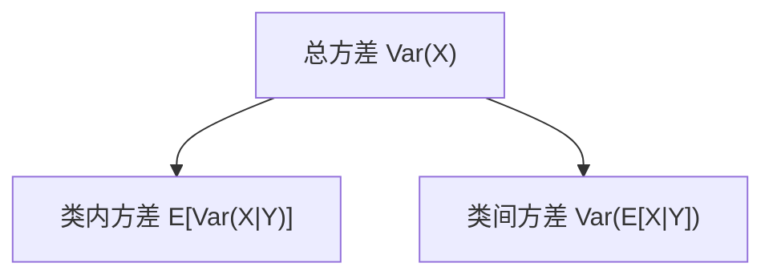

一句话版：
 **期望** = “长期平均”；**方差** = “波动大小”；**协方差** = “两者是否同涨同跌”；**相关系数** = “去掉量纲后的协方差”。
 在机器学习里，它们无处不在：**风险最小化**是把损失的**期望**降到最低；**小批量**训练是在用样本均值近似期望；**PCA**直接分解**协方差矩阵**；**集成/Bagging**用“平均”把**方差**减小。

------

## 1. 先立语义：为什么这四个量重要？

- 看一场足球赛的**平均进球**（期望），知道典型水平；
- 但有的队进球忽高忽低（方差大），有的队很稳（方差小）；
- “上半场多，下半场也多”说明上下半场**协方差为正**；
- 若不同队之间量纲不同（身高 cm、体重 kg），直接比协方差没意义，得看**相关系数**（-1…1）。

------

## 2. 定义：离散 vs 连续（统一记号）

设随机变量 $X, Y$。

### 2.1 期望（Expectation）

- 离散：$\displaystyle \mathbb{E}[X]=\sum_x x\,p(x)$
- 连续：$\displaystyle \mathbb{E}[X]=\int_{-\infty}^{\infty} x\,f(x)\,dx$

> LOTUS（无意识统计学家法则）：$\mathbb{E}[g(X)] = \sum g(x)p(x)$ 或 $\int g(x)f(x)\,dx$。

### 2.2 方差（Variance）与标准差（Std）

$\mathrm{Var}(X)=\mathbb{E}\!\left[(X-\mathbb{E}X)^2\right] =\mathbb{E}[X^2]-(\mathbb{E}X)^2,\quad \sigma_X=\sqrt{\mathrm{Var}(X)}.$

### 2.3 协方差（Covariance）

$\mathrm{Cov}(X,Y)=\mathbb{E}\!\left[(X-\mathbb{E}X)(Y-\mathbb{E}Y)\right] = \mathbb{E}[XY]-\mathbb{E}X\,\mathbb{E}Y.$

- 同涨同跌为正，反向为负，互不相关为 0（**注意：零协方差 ≠ 独立**，除非在高斯族）。

### 2.4 相关系数（Correlation）

$\rho_{XY}=\frac{\mathrm{Cov}(X,Y)}{\sigma_X\sigma_Y},\quad -1\le \rho\le 1.$

- 来自 Cauchy–Schwarz，不受单位影响，易于比较强弱。

------

## 3. 性质：写代码前该背的“口令”

- 线性：$\mathbb{E}[aX+b]=a\,\mathbb{E}X+b$。

- 缩放：$\mathrm{Var}(aX+b)=a^2\mathrm{Var}(X)$。

- 和的方差：$\mathrm{Var}(X+Y)=\mathrm{Var}(X)+\mathrm{Var}(Y)+2\,\mathrm{Cov}(X,Y)$。
   若独立 ⇒ 协方差 0 ⇒ 方差可加。

- 协方差双线性：$\mathrm{Cov}(aX+b,\,cY+d)=ac\,\mathrm{Cov}(X,Y)$。

- Jensen（凹函数版本）：$\varphi(\mathbb{E}[X])\ge \mathbb{E}[\varphi(X)]$（$\varphi$ 凸）。

- **总期望/总方差**：

  E[X]=EY ⁣[E[X∣Y]];Var(X)=EY ⁣[Var(X∣Y)]+VarY ⁣(E[X∣Y]).\mathbb{E}[X]=\mathbb{E}_Y\!\big[\mathbb{E}[X\mid Y]\big];\qquad \mathrm{Var}(X)=\mathbb{E}_Y\!\big[\mathrm{Var}(X\mid Y)\big]+\mathrm{Var}_Y\!\big(\mathbb{E}[X\mid Y]\big).

  （分母记不住？就想“**总方差 = 类内方差 + 类间方差**”。）



**说明**：图示的是“方差分解”公式的两部分来源。

------

## 4. 向量与矩阵视角（工程最常用）

### 4.1 均值向量与协方差矩阵

设 $Z\in\mathbb{R}^d$：

$\mu=\mathbb{E}[Z]\in\mathbb{R}^d,\quad \Sigma=\mathbb{E}\big[(Z-\mu)(Z-\mu)^\top\big]\in\mathbb{R}^{d\times d}.$

- $\Sigma$ 对称半正定（PSD），对角线是各维方差，非对角是成对协方差。
- **相关矩阵** $R=D^{-1/2}\Sigma D^{-1/2}$（$D=\mathrm{diag}(\Sigma)$）。

### 4.2 样本估计（无偏版本）

样本 $\{z_i\}_{i=1}^n$：

$\hat\mu=\frac{1}{n}\sum_i z_i,\qquad \hat\Sigma=\frac{1}{n-1}\sum_i (z_i-\hat\mu)(z_i-\hat\mu)^\top.$

- $n-1$ 是 **Bessel 校正**，保证在 i.i.d. 情形下 $\mathbb{E}[\hat\Sigma]=\Sigma$。

> **PCA** 就是对 $\hat\Sigma$ 做特征分解/对 $X$ 做 SVD；最大特征值方向 = 最大方差方向。

------

## 5. 例子：从 0/1 到骰子到“身高–体重”

### 5.1 伯努利

令 $X\in\{0,1\},\ P(X=1)=p$。
 $\mathbb{E}[X]=p,\ \mathrm{Var}(X)=p(1-p)$。
 （分类正确率/点击率的数学原型。）

### 5.2 两枚独立骰子之和

单个骰子：$\mathbb{E}=3.5,\ \mathrm{Var}=\frac{35}{12}$。
 和 $S=X_1+X_2$：$\mathbb{E}[S]=7,\ \mathrm{Var}(S)=2\cdot\frac{35}{12}$，
 因为独立 ⇒ 协方差为 0 ⇒ 方差可加。

### 5.3 协方差的符号

- **正相关**：身高高的人体重也往往更高 ⇒ $\mathrm{Cov}>0$。
- **负相关**：固定“时间预算”，学习时间长则娱乐时间短 ⇒ $\mathrm{Cov}<0$。
- **零相关但不独立**：令 $X\sim\mathrm{Uniform}(-1,1)$，$Y=X^2$。$\mathrm{Cov}(X,Y)=0$，但它们显然不独立。

------

## 6. 在机器学习中的“指定座位”

### 6.1 风险最小化 = 期望最小化

**期望风险**：$R(f)=\mathbb{E}_{(x,y)\sim P}[\ell(f(x),y)]$。
 训练用 **经验风险** $\hat R=\frac1n\sum_i \ell(f(x_i),y_i)$ 来近似 $R$（大数定律）。

### 6.2 小批量 SGD 的“无偏+有噪声”

小批量 $\mathcal{B}$ 的梯度 $\hat g=\frac{1}{|\mathcal{B}|}\sum_{i\in\mathcal{B}}\nabla\ell_i$：
 $\mathbb{E}[\hat g]=\nabla \hat R$，但 $\mathrm{Var}(\hat g)\propto \frac{1}{|\mathcal{B}|}$。

- **增大 batch** 降方差（到头有收益递减）；
- **动量/Adam** 做时间上的“平均”，也在**降方差**。

### 6.3 集成学习：平均可把方差除以 $K$

独立同分布的 $K$ 个基模型平均：
 $\mathrm{Var}(\bar f)=\mathrm{Var}\big(\frac1K\sum f_k\big)=\frac{1}{K}\mathrm{Var}(f)$。
 现实中相关性 $\rho>0$ 时变为 $\frac{1-\rho}{K}\mathrm{Var}+ \rho\,\mathrm{Var}$（相关越小越好）。
 这解释了 **Bagging/随机森林** 的“去相关 + 平均”策略。

### 6.4 标准化与相关

**Z-score**：$\tilde x = (x-\mu)/\sigma$ ⇒ 均值 0 方差 1。

- 让特征“同量纲”，**协方差=相关**，有利于优化（等高线更圆）。
- **BatchNorm/LayerNorm** 正在做“在线版本”的标准化，稳定训练。

### 6.5 PCA：最大化投影方差

方向 $v$ 上的方差 $v^\top \hat\Sigma v$；
 第一主成分 $v_1=\arg\max_{\|v\|=1} v^\top \hat\Sigma v$；
 与**协方差矩阵的最大特征向量**等价。

------

## 7. 代码速写（NumPy）：估计与验证

```python
import numpy as np
rng = np.random.default_rng(0)

# 1) 样本均值/方差（无偏与有偏对比）
x = rng.normal(loc=0., scale=2., size=1000)
mu = x.mean()
var_biased = ((x - mu)**2).mean()        # /n
var_unbiased = ((x - mu)**2).sum()/(len(x)-1)  # /(n-1)

# 2) 协方差与相关矩阵
X = rng.normal(size=(1000, 3))
X = X @ np.array([[1., 0.8, 0.0],
                  [0.0, 1.0, 0.5],
                  [0.0, 0.0, 1.0]])      # 引入相关
X = (X - X.mean(0)) / X.std(0, ddof=1)
Sigma = np.cov(X.T, bias=False)          # (n-1) 归一
Corr = np.corrcoef(X.T)

# 3) 总方差分解（条件在二类标签上）
y = rng.integers(0, 2, size=1000)
m0, m1 = X[y==0,0], X[y==1,0]
var_total = X[:,0].var(ddof=1)
var_within = (m0.var(ddof=1)*(len(m0)-1) + m1.var(ddof=1)*(len(m1)-1)) / (len(X)-2)
var_between = ((m0.mean()-X[:,0].mean())**2*len(m0) + (m1.mean()-X[:,0].mean())**2*len(m1)) / (len(X)-1)
```

------

## 8. 常见误区（避坑清单）

1. **零相关 ≠ 独立**（除非在高斯族）；
2. **协方差受单位影响**：身高 cm 改成 m，协方差会变；所以跨变量比较看**相关**；
3. **方差可能不存在**：Cauchy 分布等厚尾分布没有有限方差，均值/方差都不稳定；
4. **样本方差分母用 n 还是 n-1？** 推断总体时用 $n-1$（无偏）；
5. **不做中心化** 就求协方差/相关会严重偏差；
6. **数据泄露**：标准化必须只在训练集拟合 $\mu,\sigma$，再用于验证/测试；
7. **把非线性关系当线性相关**：$\rho$ 只看线性关系；对非线性可用 **Spearman** 等秩相关或直接看散点。

------

## 9. 练习（含提示）

1. **Bernoulli 方差**：证明 $\mathrm{Var}(X)=p(1-p)$。
    *提示*：用 $\mathbb{E}[X^2]=\mathbb{E}[X]$。
2. **和的方差**：推导 $\mathrm{Var}(\sum_i X_i)=\sum_i\mathrm{Var}(X_i)+2\sum_{i<j}\mathrm{Cov}(X_i,X_j)$。
3. **总方差分解**：证明 $\mathrm{Var}(X)=\mathbb{E}[\mathrm{Var}(X|Y)]+\mathrm{Var}(\mathbb{E}[X|Y])$。
    *提示*：把 $X$ 写成 $(X-\mathbb{E}[X|Y]) + \mathbb{E}[X|Y]$。
4. **相关上界**：用 Cauchy–Schwarz 证明 $|\rho_{XY}|\le 1$，且等号成立当且仅当 $X=aY+b$。
5. **PCA 一步到位**：给出中心化矩阵 $X$，证明在 $\|v\|=1$ 上最大化 $v^\top \hat\Sigma v$ 的解是 $\hat\Sigma$ 的主特征向量。
6. **方差缩减**：模拟 $K$ 个相关系数为 $\rho$ 的基学习器均值，验证 $\mathrm{Var}$ 的理论公式。
7. **小批量方差**：固定一个数据集，改变 batch size，估计梯度方差，画出与 $1/\text{batch}$ 的关系（近似线性）。

------

## 10. 小结

- **期望**把随机世界变成一个“平均数”；**方差/标准差**衡量“稳定性”；**协方差/相关**刻画“联动关系”。
- 向量化后得到**协方差矩阵**，它是 PCA 等方法的“舞台”。
- 工程口诀：**“均值先对齐，方差再衡量；相关看方向，PCA看主轴；训练用批均值，集成能减方差。”**

> 下一节将继续把这些量放进“大数定律与中心极限定理”的框架里，解释为什么“样本平均 ≈ 期望”、为什么很多东西最终“近似高斯”。
