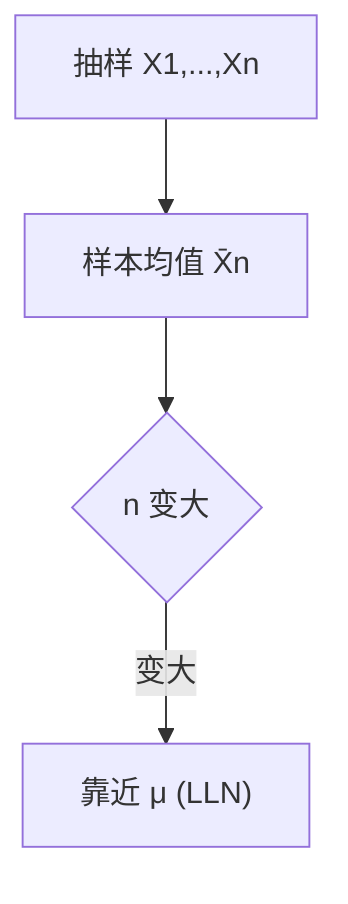
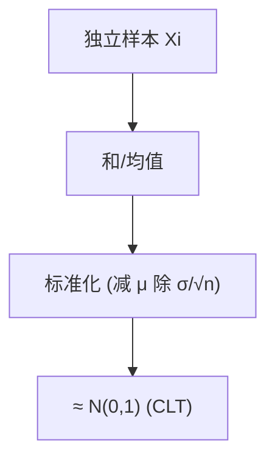

一句话版：\*\*大数定律（LLN）\*\*说“**平均**会稳定”；**中心极限定理（CLT）**说“**波动**的形状会趋近**高斯**”。
在机器学习里，它们支撑：小批量梯度 ≈ 真实梯度；评估集的准确率 ≈ 真实准确率；置信区间/误差条能用“± 标准误差”做近似。

---

## 1. 两个问题，一对答案

* **平均会不会准？**
  用 $n$ 个独立同分布（i.i.d.）样本 $X_1,\dots,X_n$ 的**样本均值**

  $$
  \bar X_n=\frac{1}{n}\sum_{i=1}^n X_i
  $$

  近不近真实均值 $\mu=\mathbb{E}[X]$？
  **LLN**：$\bar X_n \to \mu$（概率意义上、甚至几乎处处）。

* **误差长什么样？**
  $\bar X_n$ 围绕 $\mu$ 的波动像什么分布？
  **CLT**：标准化后的误差

  $$
  Z_n=\frac{\sqrt{n}(\bar X_n-\mu)}{\sigma}
  $$

  近似 $\mathcal{N}(0,1)$，其中 $\sigma^2=\mathrm{Var}(X)$。

类比：做奶茶的甜度试喝（均值）会越来越准（LLN）；但每次试喝的**偏差**大致呈“钟形”（CLT），方便画误差条。

---

## 2. 样本均值的基本“物理量”

* **无偏**：$\mathbb{E}[\bar X_n]=\mu$。
* **方差（标准误差）**：$\mathrm{Var}(\bar X_n)=\sigma^2/n$，
  $\mathrm{SE}(\bar X_n)=\sigma/\sqrt{n}$。
  这解释了“**精度 ∝ 1/\sqrt{n}**”：样本数 ×4，误差 ÷2。

---

## 3. 大数定律（LLN）：平均会稳定

### 3.1 陈述（最常用情形）

若 $X_1,\dots,X_n$ i.i.d.，且 $\mathbb{E}[|X|]<\infty$，则

* **弱大数定律（WLLN）**：$\bar X_n \xrightarrow{P} \mu$。
* **强大数定律（SLLN）**：$\bar X_n \xrightarrow{\text{a.s.}} \mu$（几乎必然收敛）。

**证明思路（WLLN）**：Chebyshev 不等式

$$
P(|\bar X_n-\mu|\ge \varepsilon)\le \frac{\sigma^2}{n\varepsilon^2}\to 0.
$$

### 3.2 何时会“翻车”

* **厚尾/无均值**：Cauchy 分布没有有限期望，$\bar X_n$ 不收敛（均值“漂来漂去”）。
* **强相关/非独立**：时间序列中的自相关会减慢“变准”。



**说明**：样本均值随样本数增长“贴近”真实均值。

---

## 4. 中心极限定理（CLT）：误差像高斯

### 4.1 经典版（Lindeberg–Levy）

若 $X_i$ i.i.d.，$\mathbb{E}X=\mu,\ \mathrm{Var}X=\sigma^2<\infty$，则

$$
\frac{\sqrt{n}(\bar X_n-\mu)}{\sigma}\ \xrightarrow{d}\ \mathcal{N}(0,1).
$$

直觉：很多**小而独立的影响相加** → 钟形。

### 4.2 更一般的版本

* **Lyapunov/ Lindeberg–Feller**：允许非同分布，但需“单个样本不太重”的条件。
* **Berry–Esseen 误差界**：若三阶绝对矩有限，则

  $$
  \sup_x\big|P(Z_n\le x)-\Phi(x)\big|\le \frac{C\cdot \rho}{\sqrt{n}},
  $$

  $\rho=\mathbb{E}|(X-\mu)/\sigma|^3$，常数 $C$ 约 0.5～0.8。
  **要点**：**收敛速度是 $O(1/\sqrt{n})$**。

### 4.3 小样本怎么办？

* $\sigma$ 未知，用样本标准差 $S$ 替代：

  $$
  T=\frac{\sqrt{n}(\bar X_n-\mu)}{S}\sim t_{n-1}\quad(\text{正态假设下})
  $$

  小样本均值的置信区间用 **t 分布** 更稳。



**说明**：对“和/均值”做线性标准化后，形状趋近标准正态。

---

## 5. 置信区间：用 CLT 给均值加误差条

未知 $\mu$，用样本均值估计。若 $n$ 足够大，

$$
\bar X_n \pm z_{\alpha/2}\ \frac{S}{\sqrt{n}}
$$

给出约 $1-\alpha$ 的**近似置信区间**（$z_{\alpha/2}$ 是标准正态分位数；小样本用 $t$ 分位数）。

**例**：在验证集上测准确率 $\hat p$（看作二项均值），标准误差 $\sqrt{\hat p(1-\hat p)/n}$。
95% 置信区间 $\hat p \pm 1.96\sqrt{\hat p(1-\hat p)/n}$。

---

## 6. 集中不等式 vs CLT：界 vs 形

* **Hoeffding**（有界随机变量）：

  $$
  P(|\bar X_n-\mu|\ge \varepsilon)\le 2\exp\!\left(\!-2n\varepsilon^2/(b-a)^2\right).
  $$
* **Chernoff/ Bernstein**：更细粒度（利用方差或 mgf）。

**区别**：

* 集中不等式给**任何 $n$** 的**上界**（“保守但有效”）；
* CLT 给**大样本时的形状近似**与**误差条**（“精确但渐近”）。
  **样本复杂度**（PAC 风格）：要在置信度 $1-\delta$ 内把误差压到 $\varepsilon$，需要

$$
n \gtrsim O\!\left(\frac{1}{\varepsilon^2}\log\frac{1}{\delta}\right).
$$

---

## 7. 在机器学习/大模型里的“指定座位”

1. **小批量梯度估计**
   批量大小 $B$ 时，$\hat g=\frac{1}{B}\sum_{i=1}^B g_i$，
   $\mathrm{Var}(\hat g)=\mathrm{Var}(g)/B$。
   **LLN** 保证批均值“越来越准”，**CLT** 让我们把梯度噪声近似成高斯（噪声注入、SDE 视角）。

2. **评估与 A/B 测试**

* 准确率/点击率是均值，**SE** $=\sqrt{\hat p(1-\hat p)/n}$。
* 两模型差值的 SE 可合成，给差值画置信区间或做 z/t 检验。

3. **集成/Bagging**
   平均多个基学习器输出，方差降到 $\approx 1/K$（理想独立）。LLN 给出“为什么平均会稳”。

4. **蒙特卡洛估计/采样**
   $\mathbb{E}[g(X)]\approx \frac{1}{N}\sum g(X_i)$，误差 $\sim O(1/\sqrt{N})$。
   在生成模型、贝叶斯推断里，CLT 让我们给蒙特卡洛均值加**误差条**。

5. **校准与不确定性**
   验证集上“分箱校准”的频率估计靠 LLN 稳定；CLT 给每个箱子误差条，避免把噪声当问题。

---

## 8. 代码微实验（NumPy）：看见 LLN/CLT

```python
import numpy as np
rng = np.random.default_rng(0)

# 1) LLN: 伯努利均值逐渐稳定到 p
p = 0.3
X = rng.binomial(1, p, size=50000)
running_mean = np.cumsum(X) / np.arange(1, len(X)+1)
print(running_mean[999], running_mean[9999], running_mean[-1])  # 越来越接近 0.3

# 2) CLT: 不同分布的标准化和 ≈ 正态
def clt_demo(sampler, n=1000, trials=10000):
    # 生成 many trials 的样本和，标准化后返回 Z
    S = np.array([sampler(n).sum() for _ in range(trials)], dtype=float)
    mu = sampler(1000000).mean()
    var = sampler(1000000).var()
    Z = (S - n*mu) / np.sqrt(n*var)
    return Z

Z1 = clt_demo(lambda m: rng.exponential(1.0, size=m))   # 指数
Z2 = clt_demo(lambda m: rng.integers(0, 6, size=m))     # 均匀整数
print(np.mean(Z1), np.var(Z1), np.mean(Z2), np.var(Z2)) # 均应接近 0,1
```

> 提示：把 `Z` 画直方图，会看到“钟形”。

---

## 9. 常见误区（避坑清单）

1. **样本太小就用 CLT**：$n$ 很小、分布偏斜时误差条会乐观；用 **t 分布**或自助法（bootstrap）。
2. **忽视依赖**：时序/自相关数据，方差有效自由度小于 $n$，误差估计要增大。
3. **厚尾分布**：$\sigma^2=\infty$ 时 CLT 失效（可能趋向稳定分布而非正态），LLN 也可能不成立。
4. **错误的“±2SE ≈ 95%”**：这是正态假设下的近似；强偏态时不可靠。
5. **数据泄露**：用同一验证集反复调参，置信区间不再可信（选择偏差）。
6. **把集中不等式当精确分布**：Hoeffding 给上界，不等于真实尾概率。

---

## 10. 练习（含提示）

1. **Chebyshev 证明 WLLN**：给出从 Chebyshev 到 $P(|\bar X_n-\mu|>\varepsilon)\to 0$ 的两步推导。
2. **Berry–Esseen 量化**：对伯努利 $\mathrm{Bern}(p)$，写出 $\rho=\mathbb{E}|(X-\mu)/\sigma|^3$ 并估算 $n$ 取多大时误差 < 0.05。
3. **t vs 正态**：模拟 $n=10,30,100$ 时均值的 95% 置信区间覆盖率，对比用 z 分位数与 t 分位数。
4. **有界变量的样本复杂度**：对 $X\in[0,1]$，用 Hoeffding 给出 $|\bar X_n-\mu|\le \varepsilon$ 以概率 ≥ $1-\delta$ 的最小 $n$。
5. **自相关的影响**：构造 AR(1) 序列 $X_t=\phi X_{t-1}+\epsilon_t$，比较“天真 SE”和“考虑有效样本量”的 SE。
6. **梯度噪声实验**：在一个简单回归任务上，记录不同 batch size 下的梯度方差，验证 $\propto 1/B$。

---

## 11. 小结

* **LLN**：样本均值随着样本量增大收敛到真实均值（“平均会稳定”）。
* **CLT**：标准化后的均值误差近似正态（“波动像高斯”），误差条 $\sim$ $1/\sqrt{n}$。
* **工程用法**：小批量梯度、评估误差条、置信区间、A/B 测试、Monte Carlo 都靠这对“定海神针”。
* **正确姿势**：看样本量、检查厚尾与依赖、必要时用 t 分布或集中不等式/自助法兜底。
