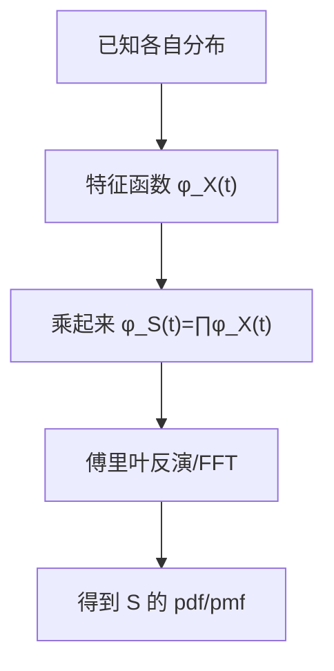
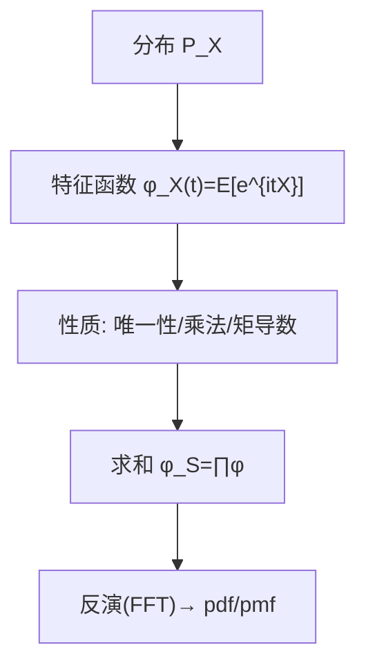

一句话版：
**矩母函数** $M_X(t)=\mathbb{E}[e^{tX}]$ 用“指数增长”打包了所有**矩（moments）**；
**特征函数** $\varphi_X(t)=\mathbb{E}[e^{i t X}]$ 是分布的**傅里叶变换**，**总存在**、能**唯一确定分布**、对**求和/卷积**特别好用。
在 ML 里，它们支撑：**CLT 的证明、PCA/谱方法的频域直觉、随机傅里叶特征（RFF）近似核、快速求和分布/误差条**等。

---

## 1. 为什么还要学“函数的函数”？

* 你想知道**所有矩**（$\mathbb{E}[X],\mathbb{E}[X^2],\dots$）？——看 $M_X(t)$ 的导数就行。
* 你要搞懂**和的分布** $S=X+Y$？——看 $\varphi_S=\varphi_X\cdot \varphi_Y$（独立时），**乘法替代卷积**。
* 你想**唯一确定一个分布**、甚至**反推 pdf**？——$\varphi$ 可以，还是**总存在**的（有界、连续）。

> 类比：把“分布”看作一首音乐；**特征函数**是它的**频谱**。频谱一给，旋律就定了。

---

## 2. 定义、存在性与两者关系

### 2.1 定义

* **矩母函数（MGF）**：$M_X(t)=\mathbb{E}[e^{tX}]$；有时只在 $t$ 的一个邻域内存在。
* **特征函数（CF）**：$\varphi_X(t)=\mathbb{E}[e^{i t X}]$；**对所有 $t\in\mathbb{R}$ 都存在**（$|e^{i t X}|=1$）。

### 2.2 关系

若 $M_X(t)$ 在某点邻域内存在，则 **解析延拓**有

$$
M_X(t)=\varphi_X(-i t),\qquad \varphi_X(t)=M_X(i t).
$$

但注意：厚尾分布（如 Cauchy）**没有 MGF**，却**有 CF**。

### 2.3 两个“母函数”的差别

* MGF 适合“**矩的封装与级数展开**”；
* CF 适合“**卷积变乘法、唯一确定、反演**”。

---

## 3. 基本性质（务必牢记）

* 归一化：$\varphi_X(0)=1$，$|\varphi_X(t)|\le 1$。
* 平移缩放：

  $$
  \varphi_{aX+b}(t)=e^{i b t}\,\varphi_X(a t),\quad M_{aX+b}(t)=e^{b t} M_X(a t).
  $$
* 独立求和（关键）：若 $X,Y$ 独立，

  $$
  \varphi_{X+Y}(t)=\varphi_X(t)\varphi_Y(t),\quad M_{X+Y}(t)=M_X(t)M_Y(t).
  $$
* **矩来自导数**（在 0 点的导数）：

  $$
  M_X^{(k)}(0)=\mathbb{E}[X^k],\qquad \varphi_X^{(k)}(0)=i^k\,\mathbb{E}[X^k].
  $$
* **唯一性与反演**（直观版）：不同分布不会有同一个 CF；在常见条件下可由 $\varphi$ **反演**回 pdf/pmf（傅里叶逆变换）。

---

## 4. 累积量与“加法友好”：$\log$ 的魔法

* **累积母函数（CGF）**：$K_X(t)=\log M_X(t)$；
  $K^{(1)}(0)=\mu$（均值），$K^{(2)}(0)=\sigma^2$（方差），更高导数给偏度、峰度的“累积量”。
* **加法**：独立时 $K_{X+Y}(t)=K_X(t)+K_Y(t)$。
  正态的 $K(t)=\mu t+\frac{\sigma^2}{2}t^2$，高阶全为 0 ⇒ “**二阶闭包**”。

> 这正是 **CLT** 的频域直觉：很多小独立效应叠加时，高阶累积量被平均稀释，只剩二阶（高斯）。

---

## 5. 常见分布的一行式（背起来）

| 分布                              | MGF $M_X(t)$（存在域）                         | CF $\varphi_X(t)$                       |        |                        |
| ------------------------------- | ----------------------------------------- | --------------------------------------- | ------ | ---------------------- |
| **Bernoulli**($p$)              | $ (1-p)+p\,e^{t}$                         | $ (1-p)+p\,e^{i t}$                     |        |                        |
| **Binomial**($n,p$)             | $\big((1-p)+p e^t\big)^n$                 | $\big((1-p)+p e^{i t}\big)^n$           |        |                        |
| **Poisson**($\lambda$)          | $ \exp\!\big(\lambda(e^t-1)\big)$         | $\exp\!\big(\lambda(e^{i t}-1)\big)$    |        |                        |
| **Normal**($\mu,\sigma^2$)      | $ \exp(\mu t+\tfrac12\sigma^2 t^2)$       | $\exp(i\mu t-\tfrac12\sigma^2 t^2)$     |        |                        |
| **Exponential**(rate $\lambda$) | $ \frac{\lambda}{\lambda-t}$（$t<\lambda$） | $ \frac{\lambda}{\lambda-i t}$          |        |                        |
| **Laplace**(0, b)               | $ \frac{1}{1-b^2 t^2}$（(                  | t                                       | <1/b)） | $ \frac{1}{1+b^2 t^2}$ |
| **Uniform**($a,b$)              | $\frac{e^{bt}-e^{at}}{t(b-a)}$（$t\neq 0$） | $\frac{e^{i b t}-e^{i a t}}{i t (b-a)}$ |        |                        |
| **Cauchy**(0, $\gamma$)         | **不存在**                                   | ( \exp(-\gamma                          | t      | ))                     |

---

## 6. 卷积变乘法：和的分布如何快算？

**目标**：求 $S=\sum_{k=1}^n X_k$ 的分布（独立）。

* 频域：先算 $\varphi_S(t)=\prod_k \varphi_{X_k}(t)$；
* 再做**傅里叶反演**回到时域（pmf/pdf）。
  这避免了多次卷积的“指数爆炸”，可以用 **FFT** 高效实现。



**说明**：这条“频域链路”是图像处理里“卷积→频域相乘”的同款思路。

**例**：若 $X_i\sim \text{Exp}(\lambda)$ 独立，则
$\varphi_{S_n}(t)=\big(\frac{\lambda}{\lambda-i t}\big)^n$ ⇒ $S_n\sim \text{Gamma}(n,\lambda)$。

---

## 7. CLT 的频域素描（为什么“近似高斯”）

对 i.i.d. $X_i$（均值 $\mu$、方差 $\sigma^2$）：

$$
\varphi_{\frac{\sqrt{n}(\bar X_n-\mu)}{\sigma}}(t)
=\Big[\varphi_X\!\big(\tfrac{t}{\sqrt{n}\sigma}\big)\,e^{-i\mu \frac{t}{\sqrt{n}\sigma}}\Big]^n
\approx \big[1-\tfrac{t^2}{2n}+o(n^{-1})\big]^n \to e^{-t^2/2}.
$$

右端是标准正态的 CF。于是得到 CLT：标准化的 $\bar X_n$ 分布趋近 $\mathcal{N}(0,1)$。

---

## 8. 在机器学习里的“指定位置”

1. **随机傅里叶特征（RFF）**（Bochner 定理）
   对平稳核 $k(x-y)$，存在谱密度 $p(\omega)$（正的有限测度）使

$$
k(\delta)=\int e^{i\omega^\top \delta} p(\omega)\,d\omega.
$$

用 $\omega\sim p(\omega)$ 采样，构造 $\phi(x)=[\cos(\omega^\top x),\sin(\omega^\top x)]$ 近似核。
这其实在用**分布的特征函数**思想把核“频谱化”。

2. **误差建模与求和**
   多个独立噪声源叠加，直接乘 CF 求总误差的分布或尾概率；用于**量化不确定性**、**误差条**。

3. **混合与复合分布**

* 混合：$X\sim \sum \pi_k P_k$ ⇒ $\varphi_X=\sum \pi_k \varphi_{P_k}$。
* 复合泊松：若 $N\sim\text{Pois}(\lambda)$，$S=\sum_{i=1}^N Y_i$，则
  $M_S(t)=\exp\{\lambda(M_Y(t)-1)\}$，用于**计数 × 单次损失**的风控/保险建模。

4. **谱方法与稳定分布**
   当数据**厚尾**时，MGF 不存在但 CF 可用；**稳定分布**（如 Cauchy）在特征函数下有简洁闭式。

---

## 9. 小型“手算局”（从 CF/ MGF 反推性质）

* **Poisson**：$M(t)=\exp(\lambda(e^t-1))$。
  $M'(0)=\lambda$（均值），$M''(0)=\lambda+\lambda^2$ ⇒ 方差 $\lambda$。
* **Normal**：$\varphi(t)=\exp(i\mu t-\tfrac12 \sigma^2 t^2)$ ⇒
  偏移与缩放在指数里**线性叠加**（高斯的“闭包性”）。
* **Cauchy**：$\varphi(t)=e^{-|t|}$（标准型）说明**没有矩**：导数在 0 不存在高阶有限值。

---

## 10. Python 迷你实验（NumPy）：经验特征函数 & 频域求和

```python
import numpy as np

rng = np.random.default_rng(0)

# 1) 经验特征函数 vs 理论 (正态)
x = rng.normal(0.0, 1.0, size=50_000)
def ecf(t):  # empirical CF
    return np.mean(np.exp(1j * t * x))
ts = np.linspace(-10, 10, 201)
phi_emp = np.array([ecf(t) for t in ts])
phi_the = np.exp(-0.5 * ts**2)  # N(0,1) 的 CF

# 2) 和的分布 (两指数之和 = Gamma(k=2))
lam = 2.0
# 理论 CF
def phi_exp(t): return lam / (lam - 1j*t)
phi_sum = phi_exp(ts)**2
# 简易数值反演（离散傅里叶，示意）
# 选好 x 轴网格与频率步长 Δt，注意 2π 因子与窗函数（工程需要更细化）
```

> 工程提醒：数值反演需**配对的网格/步长、窗函数、零填充**以减小振铃；真实系统建议用专用库或自写稳健的 FFT 反演器。

---

## 11. 从“分布”到“频谱”再回去



**说明**：左去右是“打包与频谱化”，右回左是“反演与解卷积”。

---

## 12. 常见误区（踩坑清单）

1. **把 MGF 当作总存在**：只有 CF 才总存在；MGF 可能发散（Cauchy、重尾）。
2. **忘了独立性前提**：$\varphi_{X+Y}=\varphi_X\varphi_Y$ 需 **独立**。
3. **在 0 点的导数就是矩**：没收敛就**不能**用（例如 Cauchy 没有二阶矩）。
4. **数值反演随意用 FFT**：网格、窗、带宽没配好会震荡（Gibbs/aliasing）。
5. **把“特征核（characteristic kernel）”与“特征函数”混为一谈**：前者是核方法里 MMD 的概念，和本文的 CF 不同。

---

## 13. 练习（含提示）

1. **Laplace 的 MGF/CF**：从 pdf 推导 $M(t)=\frac{1}{1-b^2 t^2}$（$|t|<1/b$）与 $\varphi(t)=\frac{1}{1+b^2 t^2}$。
2. **和的分布（离散）**：$X\sim\text{Bern}(p)$, $Y\sim\text{Bern}(q)$ 独立。用 CF 求 $S=X+Y$ 的 pmf。
   *提示*：$\varphi_S=(1-p+pe^{it})(1-q+qe^{it})$，展开后识别三点分布。
3. **复合泊松**：若 $N\sim\text{Pois}(\lambda)$, $Y_i$ i.i.d.，证 $M_S(t)=\exp\{\lambda(M_Y(t)-1)\}$。
4. **CLT 频域证明**：补齐“$\approx$”那步的泰勒展开与 $o(n^{-1})$ 论证。
5. **RFF 连接**：给定 RBF 核 $k(\delta)=\exp(-\|\delta\|^2/2\sigma^2)$，写出其谱密度 $p(\omega)$ 并说明为何 $\omega\sim\mathcal{N}(0,\sigma^{-2}I)$。
6. **数值反演实践**：实现一份稳健的 CF→pdf 反演（带窗函数），验证“两指数和=Gamma(2,λ)”的曲线重合。

---

## 14. 小结

* $M_X(t)$ 与 $\varphi_X(t)$ 是描述分布的两把“瑞士军刀”：前者擅长**矩的打包与解析**，后者擅长**卷积→乘法、唯一性与反演**。
* 频域视角不仅给出 **CLT 的本质**，还让我们在工程上**快速求和分布、做核近似与误差计算**。
* 牢记三件事：**CF 总存在**、**独立和变乘积**、**导数给矩/累积量加性**。把它们装进工具箱，很多“看起来难”的分布题会迎刃而解。
